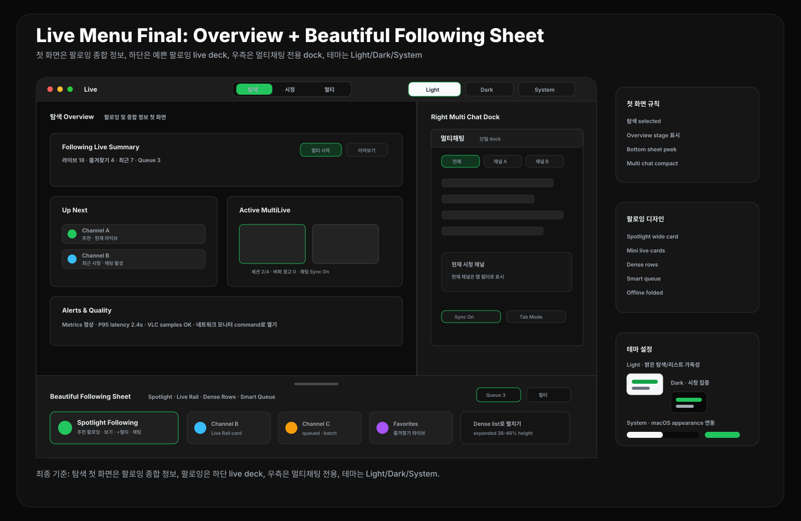

# CView 라이브 메뉴 최종 리디자인: Overview + Beautiful Following Sheet

작성일: 2026-04-27  
범위: `FollowingView`, `FollowingViewState`, `FollowingView+Header`, `FollowingView+MultiLive`, `FollowingView+MultiChat`, `LiveStreamView`, `HomeView_v2`, `CommandPaletteView`

## 0. 최종 기준

라이브 메뉴는 하나의 디자인으로 정리한다.

```text
Top Mode Bar
+ Overview Stage
+ Right Chat Dock
+ Beautiful Following Bottom Sheet
```

요청 반영:

- 상단에는 `탐색 / 시청 / 멀티` 버튼을 둔다.
- 첫 화면은 `탐색`이 선택된 **팔로잉 및 종합 정보 화면**이다.
- 우측에는 `싱글채팅`을 제거하고 `멀티채팅`만 배치한다.
- 하단에는 팔로잉 목록이 아래에서 위로 올라오는 mini bottom sheet로 나온다.
- 팔로잉 디자인은 단순 표나 카드 나열이 아니라, 보기 좋은 `Live Rail + Spotlight + Smart Queue` 조합으로 만든다.
- 테마는 `라이트 / 다크 / 시스템 설정` 3가지로 제공한다.



---

## 1. 첫 화면: 탐색 Overview

첫 진입 시 별도의 `개요` 버튼을 추가하지 않는다. 상단 버튼은 계속 `탐색 / 시청 / 멀티` 3개만 유지하고, `탐색` 모드의 기본 화면을 overview로 정의한다.

```text
탐색 mode initial state
├─ Overview Stage
│  ├─ 팔로잉 라이브 요약
│  ├─ 바로 볼 추천 채널
│  ├─ 최근 시청 / 즐겨찾기
│  ├─ 활성 멀티라이브 세션
│  └─ 품질/버퍼/네트워크 요약
├─ Right Chat Dock compact
└─ Bottom Following Sheet collapsed 또는 peek
```

### Overview Stage 구성

| 영역 | 역할 |
|---|---|
| Following Live Summary | 현재 라이브 중인 팔로잉 수, 카테고리 분포, 가장 볼만한 채널 |
| Up Next | 추천, 최근, 즐겨찾기 중 지금 볼 채널 3-5개 |
| Active MultiLive | 이미 열려 있는 멀티라이브 세션 요약 |
| Alerts | 버퍼 경고, 채팅 연결 실패, metrics 상태 |
| Quick Actions | 멀티 시작, 최근 이어보기, 팔로잉 sheet 열기 |

### 왜 별도 개요 버튼을 만들지 않나

- 상단 버튼이 4개가 되면 사용자가 `탐색`과 `개요` 차이를 다시 배워야 한다.
- 첫 화면은 `탐색`의 시작 상태로 충분하다.
- 사용자가 채널을 고르면 자연스럽게 `시청` 또는 `멀티`로 전환된다.

---

## 2. 팔로잉 Bottom Sheet 리디자인

팔로잉 영역은 단순 목록이 아니라 **아래에서 올라오는 아름다운 mini live deck**으로 만든다.

### 상태

| 상태 | 높이 | 화면 |
|---|---:|---|
| collapsed | 52-64pt | handle, 라이브 수, mini live chips |
| peek | 180-240pt | Spotlight card 1개 + live rail |
| expanded | 38-46% height | 검색, 필터, live deck, smart queue, offline folded |

### 디자인 구조

```text
Following Bottom Sheet
├─ Handle + Summary
│  └─ LIVE 18 · Queue 3 · 최근 5 · 즐겨찾기 4
├─ Filter Row
│  └─ 전체 / 라이브 / 즐겨찾기 / 최근 / 카테고리
├─ Spotlight Following
│  └─ 추천 팔로잉 1개를 크게
├─ Live Rail
│  └─ 가로 mini cards
├─ Dense Rows
│  └─ 팔로잉 전체 목록
└─ Smart Queue
   └─ 멀티로 열 후보
```

### 팔로잉 카드 디자인

#### Spotlight Card

- 160-220pt 높이의 wide card.
- 썸네일 또는 avatar background를 크게 보여준다.
- 좌측에 channel avatar, live dot, channel name.
- 우측에 `보기`, `+멀티`, `채팅` icon action. `채팅`은 별도 싱글채팅 패널이 아니라 우측 멀티채팅의 해당 채널 탭/필터로 연결한다.
- 방송 제목은 2줄까지, 카테고리/시청자/업타임은 작은 metadata.

#### Mini Live Card

- 148-176pt 폭의 작은 가로 카드.
- avatar + channel name + live title 1줄.
- 하단에는 `시청자`, `카테고리`, `+` 액션.
- hover 시 `재생`, `+멀티`, `채팅` icon만 뜬다. `채팅`은 우측 멀티채팅 dock을 열고 선택 채널로 필터링한다.

#### Dense Row

- 48-56pt 높이.
- 많은 팔로잉을 빠르게 훑기 위한 모드.
- avatar, channel, title, category, viewers, actions를 한 줄에 배치.

### 색과 형태

| 항목 | 권장 |
|---|---|
| 배경 | flat graphite, stage보다 한 단계 밝은 tone |
| 카드 | shadow 없음, 1px stroke, radius 8 |
| 선택 상태 | chzzk green left bar 또는 thin outline |
| live 상태 | 작은 red/green dot + `LIVE` label |
| hover | overlay보다 action icon opacity 변화 |
| typography | channel name > live title > metadata |

---

## 3. 테마 시스템

라이브 메뉴는 macOS 전용 앱 기준으로 `라이트 / 다크 / 시스템 설정`을 모두 지원한다. 기본값은 `시스템 설정`이며, 앱이 macOS appearance를 따라가되 사용자가 라이브 메뉴에서만 직접 고정할 수 있게 한다.

### 테마 옵션

| 옵션 | 동작 | 추천 사용감 |
|---|---|---|
| 시스템 설정 | macOS appearance를 따른다 | 기본값. 앱 전체와 가장 자연스럽게 연결 |
| 라이트 | 밝은 배경, 얇은 stroke, 낮은 그림자 | 낮 시간, 정보 탐색, 팔로잉 리스트 가독성 중심 |
| 다크 | graphite stage, 짙은 chat dock, 높은 media contrast | 야간 시청, 멀티라이브 집중, 장시간 시청 |

### Theme Token 기준

| 토큰 | Light | Dark | System |
|---|---|---|---|
| appBackground | `#F6F7F8` | `#090909` | OS appearance에 따라 전환 |
| stageBackground | `#FFFFFF` | `#0C0C0C` | stage만 가장 높은 대비 유지 |
| panelBackground | `#F1F3F5` | `#171717` | sidebar/chat/sheet 공통 |
| sheetBackground | `#FFFFFF` | `#181818` | bottom sheet는 stage보다 한 단계 분리 |
| stroke | `#D7DCE1` | `#303030` | 1px 기준 |
| primaryText | `#17202A` | `#F8FAFC` | contrast ratio 우선 |
| secondaryText | `#66717D` | `#A4ADB7` | metadata, 상태 설명 |
| accent | `#16A34A` | `#22C55E` | 선택, live, queue action |

### UI 배치

- 상단 toolbar 우측에 작은 `Theme` segmented control을 둔다.
- 버튼은 `시스템 / 라이트 / 다크` 순서가 아니라 `라이트 / 다크 / 시스템` 순서로 보여준다. 사용자가 명시 테마를 먼저 보고, 마지막에 OS 자동 연동을 선택하는 구조가 더 명확하다.
- `시스템 설정` 선택 시 segmented control에는 현재 적용 중인 결과를 `System · Dark` 또는 `System · Light`처럼 보조 텍스트로 표시한다.
- `탐색 / 시청 / 멀티` mode bar의 선택 색은 모든 테마에서 같은 green 계열을 유지한다.
- 팔로잉 bottom sheet와 우측 멀티채팅 dock은 같은 surface 토큰을 공유하되, chat dock은 stage보다 약간 더 어둡거나 더 회색으로 분리한다.

### 테마별 디자인 차이

```text
Light
- 카드와 sheet는 흰색/밝은 회색 중심
- 썸네일과 live badge가 색을 담당
- stage border는 낮은 대비로 얇게

Dark
- stage와 chat dock 대비를 크게
- green accent는 조금 밝게
- bottom sheet는 너무 검게 만들지 않고 graphite tone 사용

System
- 앱 시작 시 OS appearance를 읽어 light/dark token 자동 적용
- 사용자가 앱에서 직접 바꾸면 시스템 변경보다 사용자 선택을 우선
```

---

## 4. 우측 Chat Dock

우측은 `Inspector`가 아니라 `멀티채팅` 전용 dock으로 고정한다. 별도의 `싱글채팅` 패널은 두지 않는다.

```text
Right Chat Dock
├─ Multi Chat
│  ├─ 통합채팅
│  ├─ 채널별 탭
│  ├─ 현재 시청 채널 필터
│  └─ 세션별 sync 상태
```

모드별 상태:

| 모드 | 우측 멀티채팅 상태 |
|---|---|
| 탐색 | compact, 최근 활성 채널만 preview |
| 시청 | 현재 시청 채널 탭을 active filter로 표시 |
| 멀티 | 통합채팅 + 채널별 탭을 full height로 표시 |

추천:

- 첫 화면인 `탐색`에서는 우측 dock을 너무 강하게 보이지 않게 compact 상태로 둔다.
- `시청` 진입 시 별도 싱글채팅을 열지 않고, 멀티채팅 dock 안에서 현재 시청 채널 탭만 강조한다.
- `멀티` 진입 시 통합채팅과 채널별 탭을 full height로 확장한다.

---

## 5. 모드별 화면

### 5.1 탐색

```text
Top: 탐색 selected
Stage: Overview
Right: multi chat dock compact
Bottom: following sheet peek
```

주요 동작:

- 첫 진입 기본값.
- 팔로잉 sheet에서 채널을 고르면 stage preview가 바뀐다.
- `보기`는 `시청`, `+멀티`는 queue 또는 `멀티`로 이어진다.

### 5.2 시청

```text
Top: 시청 selected
Stage: single live player
Right: multi chat dock with current channel filter
Bottom: following sheet collapsed
```

추천:

- bottom sheet는 collapsed로 내려가 stage를 넓힌다.
- 하단에는 현재 팔로잉 라이브 몇 개가 있는지만 보인다.
- 다시 탐색을 누르면 sheet가 peek/expanded로 올라온다.

### 5.3 멀티

```text
Top: 멀티 selected
Stage: multi grid
Right: multi chat dock expanded
Bottom: session queue + following sheet collapsed/peek
```

추천:

- queue에 채널이 있으면 bottom sheet header에 `Queue n`을 강조한다.
- 빈 슬롯은 bottom sheet에서 끌어올 수 있게 한다.
- 멀티채팅은 자동 동기화 옵션을 둔다.

---

## 6. 기존 디자인 정리

| 기존 요소 | 최종 처리 |
|---|---|
| 좌측 channel shelf | 제거하고 bottom sheet로 이동 |
| 우측 inspector | chat dock으로 대체 |
| Quality/Tools | stage 우상단 popover 또는 command palette |
| Floating Palette | 기본 UI에서 제거, 실험/고급 명령으로만 유지 |
| Control Room | command palette와 보조 창 preset으로 유지 |
| Session Strip | bottom sheet summary 또는 stage mini status로 흡수 |
| Smart Queue | bottom sheet 핵심 기능으로 유지 |

---

## 7. 구현 상태 모델

권장 상태 모델:

```swift
enum LiveMenuMode {
    case explore
    case watch
    case multi
}

enum FollowingSheetState {
    case collapsed
    case peek
    case expanded
}

enum ChatDockState {
    case compact
    case currentChannel
    case expanded
}

enum FollowingDisplayMode {
    case spotlight
    case rail
    case dense
}

enum LiveMenuThemePreference {
    case light
    case dark
    case system
}
```

초기값:

```swift
mode = .explore
sheetState = .peek
chatDockState = .compact
followingDisplayMode = .spotlight
themePreference = .system
```

---

## 8. 구현 우선순위

| 우선순위 | 작업 |
|---|---|
| P0 | `탐색` 첫 화면을 overview stage로 정의 |
| P0 | bottom following sheet 상태와 drag gesture 설계 |
| P0 | 팔로잉 spotlight/mini card/dense row 디자인 확정 |
| P0 | 우측 chat dock을 멀티채팅 단일 패널로 확정 |
| P0 | `라이트 / 다크 / 시스템 설정` theme token 확정 |
| P1 | mode 전환 시 sheet/chat dock 상태 자동 전환 |
| P1 | smart queue를 bottom sheet header와 cards에 통합 |
| P1 | Quality/Tools를 stage popover로 이동 |
| P1 | theme segmented control과 macOS system appearance 연동 |
| P2 | Control Room/Floating Palette를 command-only로 정리 |

---

## 9. 최종 판단

최종 기준은 다음 한 줄이다.

```text
탐색 첫 화면은 팔로잉 종합 정보, 팔로잉 목록은 하단에서 올라오는 예쁜 live deck, 우측은 멀티채팅 전용, 테마는 라이트/다크/시스템 설정을 지원.
```

이렇게 정리하면 라이브 메뉴가 더 단순하고 예쁘게 보이면서도, 사용자가 원하는 `탐색 / 시청 / 멀티`, `멀티채팅 단일 dock`, `팔로잉 bottom sheet`, `라이트 / 다크 / 시스템 설정 테마` 구조를 모두 유지할 수 있다.
