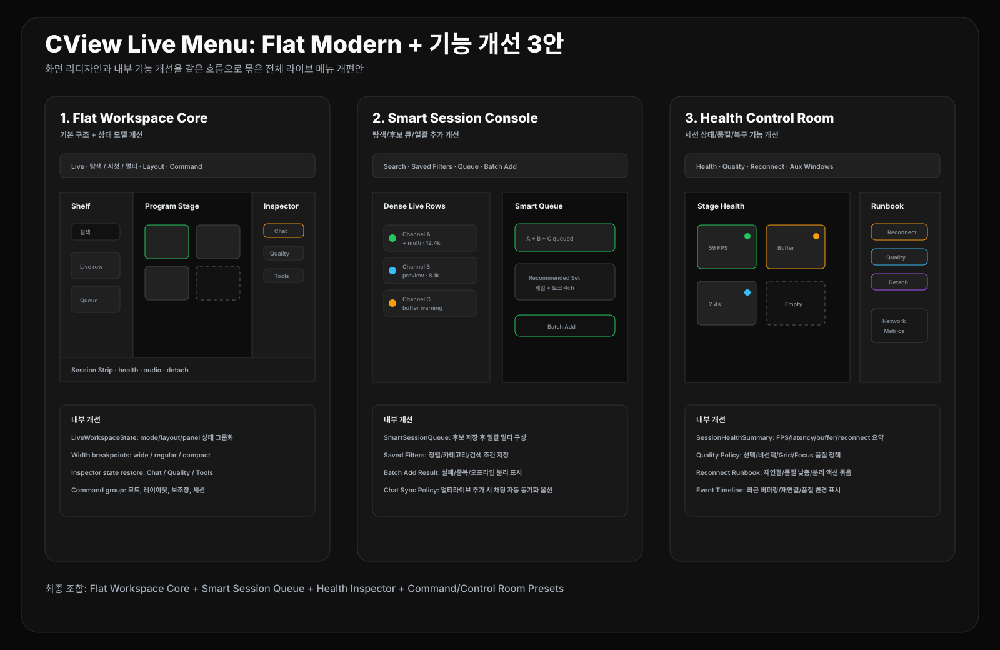

# CView 라이브 메뉴 리디자인: Flat Modern + 내부 기능 개선 3안

작성일: 2026-04-27  
범위: `FollowingView`, `FollowingViewState`, `FollowingView+Header`, `FollowingView+MultiLive`, `FollowingView+MultiChat`, `MultiLiveManager`, `MultiChatSessionManager`, `CommandPaletteView`, `CViewApp`

## 0. 방향

이 문서는 이전 `Flat Modern` 화면안을 **내부 기능 개선까지 포함한 리디자인 기준안**으로 확장한다. 목표는 UI만 평평하게 만드는 것이 아니라, 라이브 메뉴의 실제 사용 흐름을 다음처럼 바꾸는 것이다.

```text
탐색: 팔로잉 목록을 빠르게 좁히고 후보 큐를 만든다.
시청: 단일/선택 세션을 안정적으로 보고 상태를 읽는다.
멀티: 여러 세션을 구성하고 채팅/품질/네트워크를 한 곳에서 제어한다.
```



추천 우선순위:

| 순위 | 안 | 화면 변화 | 내부 기능 개선 |
|---|---|---|---|
| 1 | Flat Workspace Core | flat toolbar, 3-pane, inspector, session strip | `LiveWorkspaceState`, collapse rule, inspector state, command group |
| 2 | Smart Session Console | dense live list, queue, preview, batch add | smart queue, saved filters, 추천 조합, 세션 일괄 추가 |
| 3 | Health Control Room | stage health, quality inspector, aux windows | session health model, quality policy, reconnect runbook, metrics window flow |

최종 추천은 **1안 Flat Workspace Core를 기본 구조로 만들고, 2안의 smart queue와 3안의 health/control 기능을 단계적으로 붙이는 방식**이다.

---

## 1. Flat Workspace Core

### 화면 디자인

```text
Flat Toolbar
├─ Live
├─ 탐색 / 시청 / 멀티
├─ Search
├─ Layout
├─ Inspector
└─ Command

Workspace
├─ Channel Shelf
├─ Program Stage
└─ Inspector

Session Strip
```

### 내부 기능 개선

| 기능 | 개선 내용 | 현재 연결점 |
|---|---|---|
| Live workspace 상태 통합 | `hubMode`, `liveHubLayout`, `showFollowingList`, `showMultiChat`, `showMLSettings`, `showMLTools`를 화면 전환 단위로 묶는 상태 모델 정리 | `FollowingViewState`, `applyHubModePreset`, `applyHubLayoutPreset` |
| 창 폭별 collapse rule | 1280/1000/760pt 기준으로 shelf, inspector, session strip 자동 축소 | `mainContent`의 `GeometryReader`, `followingListRatio`, drawer width |
| Inspector 상태 복원 | 마지막 탭(`Chat`, `Quality`, `Tools`)과 폭을 저장 | `showMultiChat`, `showMLSettings`, `showMLTools`, `settingsStore.multiChat.panelWidthRatio` |
| Command group 정리 | live workspace 명령을 `레이아웃`, `모드`, `보조창`, `세션` 그룹으로 나눔 | `CommandPaletteView` |
| 저부하 전환 | 모드 전환은 opacity/position 1단계, 플레이어 영역에는 animation 전파 차단 유지 | `transaction`, `MenuTransitionGate`, `multiLiveInlinePanel` |

### UX 결과

- 사용자는 `탐색 / 시청 / 멀티`의 차이를 즉시 이해한다.
- 레이아웃 preset이 많아도 하나의 toolbar 안에서 읽힌다.
- 좁은 창에서도 panel이 겹치지 않고 stage가 우선권을 가진다.

### 구현 우선순위

| 우선순위 | 작업 |
|---|---|
| P0 | `LiveWorkspaceState` 개념 문서화 후 `FollowingViewState`의 표시 상태를 그룹화 |
| P0 | width breakpoint: wide / regular / compact 정의 |
| P0 | toolbar visual을 flat하게 정리하고 상태 pill 수를 줄임 |
| P1 | inspector selected tab enum 추가 |
| P1 | command palette live workspace group 재분류 |

---

## 2. Smart Session Console

### 화면 디자인

좌측 channel shelf를 단순 카드 목록이 아니라 **세션 후보 콘솔**로 만든다.

```text
Channel Shelf
├─ Search
├─ Saved Filters
├─ Live Now rows
├─ Smart Queue
├─ Recommended Sets
└─ Offline collapsed
```

### 내부 기능 개선

| 기능 | 개선 내용 | 현재 연결점 |
|---|---|---|
| Smart Queue | `+멀티`를 누른 채널을 즉시 재생하지 않고 queue에 쌓아 한 번에 멀티 구성 | `multiLiveManager.addSession`, `chatSessionManager.addSession` |
| Saved Filters | 카테고리, 라이브만, 정렬, 검색어 조합을 저장 | `sortOrder`, `filterLiveOnly`, `selectedCategory`, `searchText` |
| 추천 조합 | 최근 시청, 라이브 상태, 카테고리, 시청자 수 기준으로 2-4개 세션 묶음 추천 | `viewModel.followingChannels`, watch history |
| Batch Add | queue의 여러 채널을 세션 제한 내에서 일괄 추가하고 실패 채널만 표시 | `MultiLiveManager.effectiveMaxSessions`, `mlAddError` |
| Chat Sync Policy | 멀티라이브에 추가된 채널을 멀티채팅에도 자동 추가하되, 사용자 옵션으로 끔/켬 | `onChange(of: multiLiveManager.sessions.count)`, `addChatChannel` |

### UX 결과

- 팔로잉이 많은 사용자도 빠르게 채널 후보를 만들 수 있다.
- 멀티라이브 구성 작업이 반복 클릭이 아니라 queue 기반 작업으로 바뀐다.
- 실패/중복/오프라인 채널이 화면상 분명해진다.

### 구현 우선순위

| 우선순위 | 작업 |
|---|---|
| P0 | dense row variant 추가: 채널명, 제목, 카테고리, 시청자, row actions |
| P0 | `SmartSessionQueue` 상태 추가 |
| P1 | queue batch add 결과 모델 추가 |
| P1 | saved filter preset 저장 |
| P2 | 추천 조합 scoring 추가 |

---

## 3. Health Control Room

### 화면 디자인

중앙 stage와 우측 inspector에 **세션 상태와 복구 동작**을 붙인다.

```text
Program Stage
├─ active frame
├─ audio badge
├─ FPS / latency / buffer health dot
├─ reconnect / focus / detach action
└─ empty slot recommendation

Inspector
├─ Chat
├─ Quality
└─ Tools
```

### 내부 기능 개선

| 기능 | 개선 내용 | 현재 연결점 |
|---|---|---|
| Session Health Model | FPS, buffer, latency, reconnect count, engine, network warning을 하나의 요약 상태로 변환 | player metrics, `MLNetworkWindowView`, `MLMetricsWindowView` |
| Quality Policy | 선택 세션, 비선택 세션, grid/focus 모드별 품질 정책을 UI에서 읽고 조정 | `MultiLiveManager`, player settings, bandwidth coordinator |
| Reconnect Runbook | 문제가 있는 세션에 `재연결`, `품질 낮춤`, `프록시 재시도`, `세션 분리` 동작을 묶어서 제공 | `MCToolButton`, `MLToolButton`, player reconnect APIs |
| Control Room Preset | `채팅 집중`, `모니터링 집중` 프리셋을 UI와 command palette에서 같은 방식으로 실행 | `LiveHubControlRoomPreset`, `openControlRoomAuxWindows` |
| Event Timeline | 최근 버퍼링, 재연결, 품질 변경, 채팅 연결 실패를 stage 하단에 5개 정도만 표시 | 새 lightweight event buffer 필요 |

### UX 결과

- 사용자는 "왜 끊기는지"를 감으로 추측하지 않고 stage/inspector에서 바로 본다.
- 멀티라이브가 많아질수록 어느 세션이 문제인지 빠르게 확인한다.
- 보조 창은 숨은 기능이 아니라 Control Room preset의 일부가 된다.

### 구현 우선순위

| 우선순위 | 작업 |
|---|---|
| P0 | `SessionHealthSummary` 모델 추가 |
| P0 | stage cell health dot과 inspector quality summary 추가 |
| P1 | reconnect/quality recovery action 묶음 |
| P1 | Control Room preset 실행 결과 feedback 표시 |
| P2 | event timeline 추가 |

---

## 4. 통합 적용 순서

| 단계 | 목표 | 포함 작업 |
|---|---|---|
| Phase 1 | Flat visual baseline | toolbar flat화, 1px divider, dense row, inspector tab |
| Phase 2 | Workspace state | 상태 그룹화, collapse rule, inspector 복원, command group |
| Phase 3 | Smart session workflow | queue, batch add, saved filter, chat sync option |
| Phase 4 | Health control | session health, quality policy, reconnect runbook |
| Phase 5 | Control room polish | preset feedback, event timeline, 보조 창 workspace 저장 |

---

## 5. 최종 추천

전체 리디자인의 기준안은 다음 조합이 가장 좋다.

```text
Flat Workspace Core
+ Smart Session Queue
+ Health Inspector
+ Command / Control Room Presets
```

이 방식은 화면을 단순히 예쁘게 바꾸는 데서 끝나지 않는다. 사용자가 라이브 메뉴에서 실제로 하는 일인 `채널 고르기`, `멀티 세션 구성`, `채팅 확인`, `품질/네트워크 문제 파악`, `보조 창 활용`을 하나의 작업 흐름으로 묶는다.

