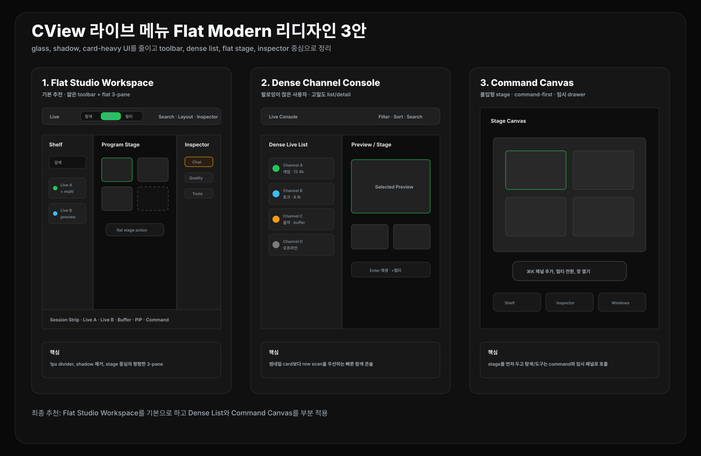

# CView 라이브 메뉴 전체 리디자인: Flat Modern 3안

작성일: 2026-04-27  
범위: `FollowingView`, `FollowingView+Header`, `FollowingView+MultiLive`, `FollowingView+MultiChat`, `FollowingViewState`, `MultiLiveTabBar`, `CommandPaletteView`

## 0. 방향

이번 리디자인 방향은 **플랫하고 현대적인 macOS 라이브 워크스페이스**다. 기존 glass, shadow, gradient, card-heavy 느낌을 줄이고, 1px divider, 얇은 toolbar, dense list, flat stage, 명확한 inspector로 정리한다.

참고 기준:

- Apple HIG의 toolbar 원칙: toolbar는 자주 쓰는 command, navigation, search를 논리적으로 묶고, 폭이 좁아지면 overflow로 보내야 한다.
- Apple HIG의 sidebar 원칙: sidebar는 앱 정보 구조와 모드 접근을 돕되, 좁은 창에서는 자동 collapse가 필요하다.
- 현재 CView 구조: `FollowingHubMode`, `LiveHubLayoutPreset`, 좌측 channel shelf, 중앙 stage, 우측 inspector, floating palette, control room preset이 이미 존재한다.



| 순위 | 추천안 | 핵심 | 판단 |
|---|---|---|---|
| 1 | Flat Studio Workspace | 얇은 toolbar + flat 3-pane + stage 중심 | 기본 추천 |
| 2 | Dense Channel Console | 좌측 dense list + 중앙 preview/stage + 우측 inspector | 팔로잉이 많은 사용자에게 좋음 |
| 3 | Command Canvas | stage 우선 + command palette + 임시 drawer | 가장 현대적, 실험 모드 추천 |

최종 추천은 **1안 Flat Studio Workspace**다. 2안의 dense list 규칙과 3안의 command-first 동작을 부분적으로 섞으면, 전체 라이브 메뉴를 과하지 않게 현대화할 수 있다.

---

## 1. 추천안 1: Flat Studio Workspace

### 핵심

라이브 메뉴를 **평평한 3-pane 작업 공간**으로 정리한다. 화면은 toolbar, channel shelf, program stage, inspector, session strip으로 나뉘지만 각 영역은 카드처럼 떠 있지 않고 1px divider와 배경 톤 차이만으로 구분한다.

```text
Toolbar: Live · [탐색 | 시청 | 멀티] · Search · Layout · Inspector · Command
──────────────────────────────────────────────────────────────
Channel Shelf | Program Stage | Inspector
──────────────────────────────────────────────────────────────
Session Strip
```

### 화면 규칙

- toolbar 높이: 44-50pt
- 좌측 channel shelf: 280-340pt, 좁은 창에서는 icon rail + drawer
- 우측 inspector: 300-380pt, 기본은 닫힘 또는 마지막 상태 복원
- stage: 남은 공간 전부 사용
- divider: 1px, shadow 없음
- radius: 6-8px 이하
- accent color: 선택 상태와 primary action에만 사용

### UI/UX 흐름

1. `탐색`: 좌측 shelf가 열리고 중앙은 선택 채널 preview 또는 빈 stage.
2. `시청`: 좌측 shelf 유지, 중앙은 single stage, inspector는 채팅 또는 품질.
3. `멀티`: 중앙은 multi grid, 하단 session strip, inspector는 통합채팅.

### 적용 포인트

| 현재 요소 | 리디자인 |
|---|---|
| `liveHubTopBar` | flat toolbar, 상태 pill 최소화 |
| `activeLeftPanelContent` | channel shelf로 재정의 |
| `modeStageContent` | program stage 명칭으로 통일 |
| `liveHubDrawerPanel` | inspector 패널로 명확화 |
| `MLTabBar` | session strip 또는 stage 상단 얇은 rail |

### 장점

- 가장 현대적이면서도 macOS 기본 구조와 맞다.
- 현재 구현을 크게 흔들지 않는다.
- CView의 멀티라이브 기능이 stage 중심으로 선명해진다.

---

## 2. 추천안 2: Dense Channel Console

### 핵심

팔로잉 채널이 많은 사용자를 위한 **고밀도 콘솔형 UI**다. 큰 카드 grid를 줄이고, 좌측에 live 상태 중심의 dense row list를 둔다. 중앙은 선택 채널 preview 또는 stage가 된다.

```text
Toolbar
──────────────────────────────────────────────────────────────
Dense Live List | Preview / Multi Stage | Inspector
```

### 화면 규칙

- 채널 row 높이: 44-56pt
- row 내용: avatar, channel name, title 1줄, category, viewers, live dot
- row action: hover 시 재생, +멀티, 채팅, 상세
- 카테고리 필터는 chip swarm이 아니라 compact dropdown + active filter bar
- 오프라인 채널은 기본 접힘

### UI/UX 흐름

1. 검색 또는 카테고리 필터로 후보를 좁힌다.
2. row 선택은 중앙 preview를 바꾼다.
3. double click 또는 Enter는 시청 전환.
4. `+멀티`는 session strip에 추가하고 multi mode로 전환할지 선택한다.

### 장점

- 팔로잉 수가 많을수록 좋다.
- 현대적인 생산성 앱의 list/detail 문법과 맞다.
- thumbnail grid보다 정보 스캔이 빠르다.

### 리스크

- 영상 썸네일의 감성은 줄어든다.
- CView가 너무 업무용 콘솔처럼 보일 수 있으므로 중앙 stage는 시각적으로 충분히 크게 유지해야 한다.

---

## 3. 추천안 3: Command Canvas

### 핵심

화면 중심은 거의 전체가 stage이고, 탐색과 도구는 command palette와 임시 drawer로 호출한다. Raycast류의 command-first 감각을 라이브 메뉴에 적용하는 방향이다.

```text
Stage Canvas
floating command/search
temporary shelf
temporary inspector
```

### 화면 규칙

- 기본 화면은 stage + 얇은 top status만 표시
- `⌘K` 또는 toolbar command로 채널 검색, 모드 전환, 보조 창 열기
- shelf와 inspector는 필요한 순간에만 slide-in
- palette는 자동 숨김, focus out 시 닫힘
- 상태는 하단 mini strip에 압축 표시

### UI/UX 흐름

1. 사용자가 `⌘K`를 누른다.
2. "채널 추가", "멀티 전환", "네트워크 모니터 열기" 같은 command를 실행한다.
3. stage는 계속 유지되고, 필요한 패널만 잠깐 열린다.

### 장점

- 가장 플랫하고 현대적이다.
- 작은 창이나 멀티모니터 환경에 좋다.
- command palette와 이미 잘 맞는다.

### 리스크

- 신규 사용자는 어디서 시작해야 할지 모를 수 있다.
- 기본 UI로 바로 적용하기보다는 `몰입 모드`나 `고급 모드`가 적합하다.

---

## 4. 최종 추천 조합

```text
기본 화면: Flat Studio Workspace
탐색 밀도: Dense Channel Console의 row list
고급 전환: Command Canvas의 command-first 흐름
```

이 조합의 화면 구조:

```text
Flat Toolbar
├─ leading: Live / sidebar toggle
├─ center: 탐색 / 시청 / 멀티
└─ trailing: search, layout, inspector, command

Main Workspace
├─ Channel Shelf: dense list + filters
├─ Program Stage: single or multi stage
└─ Inspector: chat / quality / tools

Session Strip
└─ active sessions, audio, health, detach shortcuts
```

## 5. 구현 우선순위

| 우선순위 | 작업 | 이유 |
|---|---|---|
| P0 | toolbar에서 gradient/material/shadow 축소 | 첫 인상을 즉시 flat하게 만듦 |
| P0 | 좌측 live card를 dense row variant로 추가 | 전체 UX가 더 현대적이고 빠르게 느껴짐 |
| P0 | stage 주변 chrome을 1px divider와 flat status로 정리 | 멀티라이브 화면의 무게를 줄임 |
| P1 | inspector를 `Chat / Quality / Tools` 탭 구조로 고정 | drawer 느낌 제거 |
| P1 | session strip을 stage 하단 또는 화면 하단에 정리 | 멀티라이브 상태 스캔 개선 |
| P2 | command palette에 live workspace command 그룹 강화 | Command Canvas 흐름 완성 |
| P2 | 창 폭별 collapse 규칙 문서화 | macOS window resizing 대응 |

## 6. 디자인 토큰 방향

| 항목 | 권장 |
|---|---|
| 배경 | neutral graphite / zinc 계열, blue tint 최소화 |
| divider | 1px, opacity 0.18-0.28 |
| shadow | 기본 제거, popover/overlay에만 아주 약하게 |
| radius | toolbar/pill 8-12, panel 0-6 |
| accent | chzzk green은 selected/primary에만 사용 |
| typography | title보다 row label과 status label 위계 강화 |
| motion | slide/scale보다 opacity + position 1단계 |

---

## 7. 결론

가장 좋은 방향은 **Flat Studio Workspace**다. 현재 CView의 macOS 구조를 유지하면서도, 화면이 더 가볍고 현대적으로 보인다. 여기에 `Dense Channel Console`의 고밀도 탐색과 `Command Canvas`의 command-first 흐름을 섞으면 전체 라이브 메뉴 리디자인의 기준안으로 충분하다.

