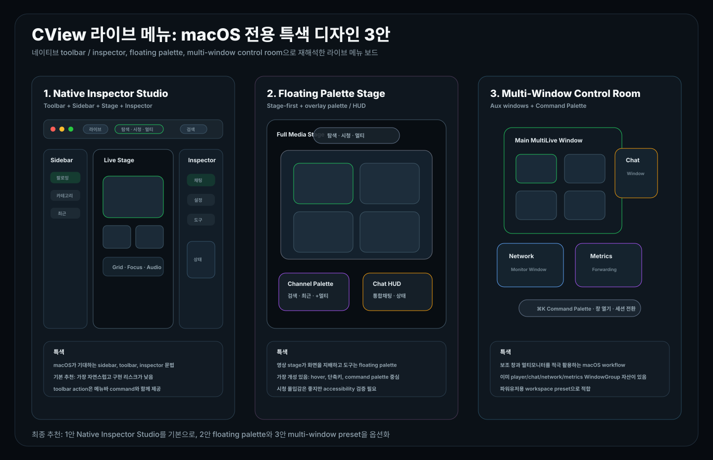

# CView 라이브 메뉴: macOS 전용 특색 디자인 3안

작성일: 2026-04-27  
범위: `MainContentView`, `FollowingView`, `FollowingView+Header`, `FollowingView+MultiLive`, `FollowingView+MultiChat`, `CViewApp`, `CommandPaletteView`

## 0. 결론

이번 기준은 "웹/모바일에서 흔한 라이브 화면"이 아니라 **macOS 전용 앱에서만 자연스럽게 보이는 특색**이다. 현재 CView는 이미 macOS다운 설계 자산을 갖고 있다.

- `MainContentView`는 `NavigationSplitView` 기반 shell을 사용한다.
- 라이브 메뉴는 `FollowingView` 안에서 `탐색 / 시청 / 멀티` 모드와 좌측 channel shelf, 중앙 stage, 우측 drawer를 구성한다.
- `CViewApp`에는 플레이어, 통계, 채팅, 멀티채팅, 네트워크 모니터, 메트릭 전송, 시스템 사용률 모니터 같은 보조 `WindowGroup`이 있다.
- `CommandPaletteView`와 메뉴바 command가 있어 키보드 중심 macOS 작업 흐름을 만들 수 있다.
- PiP, 새 창 열기, window frame autosave가 있어 "멀티라이브 전용 데스크톱 도구" 느낌을 만들 수 있다.

따라서 추천은 다음 3가지다.



| 순위 | 디자인 | macOS 특색 | 적용 판단 |
|---|---|---|---|
| 1 | Native Inspector Studio | toolbar + sidebar + trailing inspector | 기본 추천. 가장 macOS답고 구현 리스크 낮음 |
| 2 | Floating Palette Stage | media stage 위 floating palette / HUD | 가장 개성 있음. 시청 몰입감이 좋음 |
| 3 | Multi-Window Control Room | 보조 창, command palette, window autosave | CView 고급 기능을 가장 잘 드러냄 |

최종 추천은 **1안 Native Inspector Studio**다. 기본 화면은 네이티브 macOS 작업 앱처럼 정리하고, 2안의 floating palette는 시청/멀티 모드의 보조 UI로, 3안의 multi-window control room은 파워유저 옵션으로 제공하는 구성이 가장 안전하다.

참고한 macOS HIG: [Sidebars](https://developer.apple.com/design/human-interface-guidelines/sidebars), [Toolbars](https://developer.apple.com/design/human-interface-guidelines/toolbars), [Windows](https://developer.apple.com/design/human-interface-guidelines/windows)

---

## 1. Native Inspector Studio

### 핵심

라이브 메뉴를 Finder, Xcode, Photos 같은 **네이티브 macOS 작업 앱**처럼 만든다. 상단은 통합 toolbar, 좌측은 channel sidebar, 중앙은 live stage, 우측은 inspector다.

```text
Window Toolbar
Sidebar Toggle · 라이브 · [탐색 | 시청 | 멀티] · Search · Layout · Chat · Inspector

Channel Sidebar       Live Stage                         Inspector
팔로잉/카테고리       단일 또는 멀티라이브 stage          채팅, 설정, 품질, 네트워크
```

### CView 매핑

| 디자인 요소 | 현재 코드 매핑 |
|---|---|
| Window toolbar | `liveHubTopBar`, menu commands |
| Sidebar | `showFollowingList`, `activeLeftPanelContent` |
| Mode segmented control | `FollowingHubMode`, `liveHubTopBar` |
| Stage | `modeStageContent`, `multiLiveInlinePanel`, `LiveStreamView` |
| Inspector | `liveHubDrawerPanel`, `MLSettingsPanel`, `multiChatInlinePanel`, `liveHubToolsPanel` |

### 특색

- macOS에서 기대하는 좌측 sidebar, 상단 toolbar, 우측 inspector 문법을 그대로 따른다.
- 텍스트 버튼보다 SF Symbol icon button과 segmented control을 중심으로 구성한다.
- 창 폭이 좁아지면 toolbar 항목은 overflow로 보내고, sidebar/inspector는 자동 collapse한다.
- 모든 toolbar action은 메뉴바 command에도 대응시킨다.

### 추천 이유

- 현재 구조와 가장 잘 맞고 새 화면 전환을 거의 만들 필요가 없다.
- 라이브 메뉴가 "웹 페이지"가 아니라 "macOS pro app"처럼 보인다.
- 탐색, 시청, 멀티, 채팅, 설정이 서로 역할을 침범하지 않는다.

### 적용 우선순위

| 우선순위 | 작업 |
|---|---|
| P0 | `liveHubTopBar`를 window toolbar처럼 재정렬 |
| P0 | 우측 drawer를 `Inspector`로 명명하고 채팅/설정/도구 탭을 재배치 |
| P1 | sidebar collapse / inspector collapse width rule 정리 |
| P1 | toolbar action을 메뉴바 command와 1:1로 맞춤 |
| P2 | toolbar customize 또는 사용자별 toolbar preset |

---

## 2. Floating Palette Stage

### 핵심

중앙 stage를 거의 전체 화면으로 키우고, 탐색/채팅/도구는 영상 위나 가장자리의 **floating palette**로 띄운다. macOS의 창/패널 문화와 미디어 앱 감각을 섞은 방향이다.

```text
Full Media Stage
┌──────────────────────────────────────────────┐
│ floating mode switcher: 탐색 · 시청 · 멀티    │
│ floating channel shelf                       │
│ floating chat palette / metrics HUD          │
└──────────────────────────────────────────────┘
```

### CView 매핑

| 디자인 요소 | 현재 코드 매핑 |
|---|---|
| Full stage | `modeStageContent`, `MLSingleChannelStage`, `MLGridLayout` |
| Floating mode switcher | `FollowingHubMode` selector |
| Floating shelf | compact `followingListContent` overlay |
| Floating chat | `multiChatInlinePanel` as overlay/palette |
| HUD metrics | player metrics, `MLNetworkWindowView`, `MLMetricsWindowView` 요약 |

### 특색

- stage가 화면의 주인공이어서 시청 앱다운 느낌이 강하다.
- palette는 항상 보이지 않고 hover, 단축키, command palette로 호출한다.
- `탐색`은 좌측 고정 리스트가 아니라 floating shelf로 열리고, 선택 후 자동으로 닫힌다.
- `멀티` 모드에서는 2x2 grid 위에 작은 slot/action palette만 띄운다.

### 추천 이유

- 세 안 중 가장 독창적이다.
- 기존의 card/panel 느낌을 줄이고 영상 중심 경험을 만든다.
- PiP, 전체화면, 새 창 열기와 잘 어울린다.

### 리스크

- floating UI는 hit test, contrast, accessibility 검증이 필요하다.
- 탐색을 자주 하는 사용자는 1안보다 느리다고 느낄 수 있다.
- 영상 위 overlay가 많아지면 시청 몰입을 해칠 수 있다.

### 적용 우선순위

| 우선순위 | 작업 |
|---|---|
| P0 | stage-first 멀티 모드 visual prototype |
| P0 | floating mode switcher와 channel shelf 호출 규칙 정의 |
| P1 | chat palette의 최대 폭, 투명도, 닫힘 동작 정의 |
| P1 | Reduce Motion / Increase Contrast 대응 |
| P2 | command palette에서 palette 열기/닫기 연결 |

---

## 3. Multi-Window Control Room

### 핵심

macOS 전용 앱의 장점인 **여러 보조 창과 command palette**를 적극 활용한다. 메인 창은 멀티라이브 stage에 집중하고, 채팅/네트워크/메트릭/시스템 사용률은 별도 창으로 분리할 수 있게 한다.

```text
Main Window: MultiLive Studio
Aux Windows:
- Chat Window
- MultiChat Window
- Network Monitor
- Metrics Forwarding
- System Usage Monitor
- Player Window / PiP
```

### CView 매핑

| 디자인 요소 | 현재 코드 매핑 |
|---|---|
| Player auxiliary window | `WindowGroup("플레이어", id: "player-window")` |
| Chat windows | `chat-window`, `multi-chat-window` |
| Network / metrics windows | `ml-network-window`, `ml-metrics-window` |
| System monitor | `system-usage-window` |
| Command palette | `CommandPaletteView`, `appState.showCommandPalette` |
| Window persistence | `windowFrameAutosave(...)` |

### 특색

- 단일 창에 모든 것을 우겨 넣지 않는다.
- 사용자는 자기 작업 스타일에 맞게 채팅, 네트워크, 메트릭 창을 배치한다.
- 메뉴바와 command palette가 모든 창 호출의 중심이 된다.
- 멀티모니터 환경에서 CView만의 강점이 가장 잘 드러난다.

### 추천 이유

- 현재 코드가 이미 많은 `WindowGroup`을 갖고 있어 설계 비용 대비 효과가 크다.
- macOS 전용 앱다운 생산성 도구 느낌이 강하다.
- 고급 사용자에게 "방송 모니터링 워크스테이션"처럼 보인다.

### 리스크

- 기본 사용자가 보조 창을 너무 많이 열면 복잡해질 수 있다.
- 각 창의 현재 세션 동기화, foreground/key window 상태, 창 복원 정책을 정리해야 한다.
- 메인 창과 보조 창의 중복 action을 줄여야 한다.

### 적용 우선순위

| 우선순위 | 작업 |
|---|---|
| P0 | 라이브 메뉴의 `창 분리` 메뉴와 toolbar button 정리 |
| P0 | command palette에 네트워크/메트릭/멀티채팅 창 열기 action을 상위 노출 |
| P1 | 보조 창별 title, subtitle, active session 표시 통일 |
| P1 | 창 위치 autosave와 복원 UX 문서화 |
| P2 | workspace preset: 기본, 채팅 집중, 모니터링 집중 |

---

## 4. 최종 추천 조합

기본 화면은 **Native Inspector Studio**로 가는 것이 좋다.

```text
기본 UX:
Toolbar + Sidebar + Stage + Inspector

시청/멀티 몰입 옵션:
Floating Palette Stage

파워유저 옵션:
Multi-Window Control Room
```

이 조합이 좋은 이유:

- 기본 사용자는 macOS다운 익숙한 구조로 바로 이해한다.
- 반복 사용자는 floating palette로 stage를 넓게 쓴다.
- 고급 사용자는 보조 창과 command palette로 멀티모니터 워크스테이션처럼 쓴다.
- 현재 `FollowingView`와 `CViewApp` 구조를 유지하면서도 앱의 개성이 확실해진다.

---

## 5. 구현 반영 현황 (2026-04-27)

리디자인 작업은 "1안 기본 + 2/3안 옵션" 전략으로 1차 반영되었다.

### 반영된 항목

- `FollowingViewState`에 레이아웃/Control Room 프리셋 상태 추가
  - `LiveHubLayoutPreset`: `nativeInspector` / `floatingPalette` / `controlRoom`
  - `LiveHubControlRoomPreset`: `chatFocus` / `monitoringFocus`
  - `showFloatingPalette` 상태 추가
  - `autoHideFloatingPalette` 상태 추가
  - `floatingPaletteAutoHideDelay` 상태 추가 (`빠름`/`기본`/`느림`)
  - `autoOpenAuxWindowsInControlRoom` 정책 상태 추가
  - `UserDefaults` 기반 프리셋 상태 복원
- `liveHubTopBar`를 macOS Inspector 문법 기준으로 정리
  - 상단에서 레이아웃 프리셋 전환 가능
  - Floating Palette 모드일 때 팔레트 표시/숨김 토글 제공
  - 우측 패널 명칭을 `Inspector` 기준으로 정리
- 중앙 stage에 Floating Palette 오버레이 추가
  - 모드 전환(탐색/시청/멀티) 버튼
  - 채널 목록/채팅/보조창 액션 버튼
  - Floating 모드에서 좌측/우측 컬럼을 팔레트 표시 상태에 따라 동적으로 숨김
  - 팔레트 숨김 시 `팔레트 열기` 호출 핸들 제공
  - Increase Contrast 환경에서 배경/보더 대비 자동 강화
  - Reduce Motion 환경에서 팔레트 인터랙션 애니메이션 최소화
  - hover 이탈 시 자동 숨김(설정 가능)
- 메뉴바 command에 레이아웃/보조창 액션 추가
  - 새 `라이브 허브` 메뉴에서 3개 프리셋 전환
  - Floating Palette 표시/숨김 토글 (⌥⌘P)
  - Floating Palette 자동 숨김 정책 토글
  - Floating Palette 자동 숨김 지연 프리셋 선택 (`빠름`/`기본`/`느림`)
  - Inspector 토글 및 보조 창 열기(네트워크/메트릭/멀티채팅)
  - `Control Room` 세부 프리셋(채팅 집중/모니터링 집중) 즉시 실행
  - `Control Room` 마지막 프리셋 복원 + 보조 창 자동 열기 정책 토글
- `CommandPaletteView`에 옵션 액션 추가
  - 3개 레이아웃 프리셋 즉시 전환
  - 보조 창 열기 액션(채팅/멀티채팅/네트워크/메트릭)
  - `Control Room` 세부 프리셋 액션 추가
  - `Control Room` 마지막 프리셋 복원 액션 추가
  - `Floating Palette` 자동 숨김 토글 액션 추가
  - `Floating Palette` 자동 숨김 지연 액션 추가 (`빠름`/`기본`/`느림`)
- 로컬 파생경로 빌드 검증 완료
  - `xcodebuild -scheme CView_v2 -configuration Debug -derivedDataPath ./build build`
  - 결과: `BUILD SUCCEEDED`

### 동작 방식 요약

- 기본값은 `Native Inspector` 유지 (문서 권장안).
- `Floating Palette`는 stage-first 몰입형 옵션으로 제공.
- `Control Room`은 멀티윈도우 중심 워크플로우를 즉시 호출할 수 있게 제공하며, 세부 프리셋도 저장된다.

### 다음 단계(권장)

- toolbar customization(사용자별 툴바 프리셋) 확장
- Control Room workspace preset별 창 배치 복원 정책 고도화
