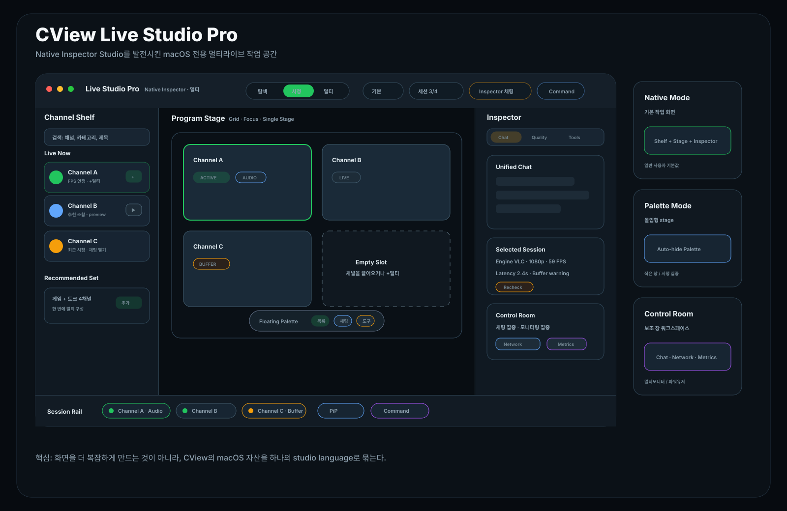

# CView 라이브 메뉴 발전형 디자인: Live Studio Pro

작성일: 2026-04-27  
범위: `FollowingView`, `FollowingView+Header`, `FollowingView+MultiLive`, `FollowingView+MultiChat`, `FollowingViewState`, `CommandPaletteView`, `CViewApp`

## 0. 요약

이전 추천안의 기본 선택지였던 **Native Inspector Studio**를 더 발전시켜, CView의 라이브 메뉴를 하나의 macOS 전용 **Live Studio Pro** 화면으로 정리한다.

핵심 변화:

| 이전안 | 발전형 |
|---|---|
| toolbar + sidebar + stage + inspector | studio toolbar + channel shelf + program stage + inspector + session rail |
| 3개 레이아웃 후보 | 하나의 기본 화면 안에 `Native`, `Palette`, `Control Room` 상태를 흡수 |
| 일반적인 macOS 작업 앱 | 멀티라이브, 채팅, 보조 창, command palette가 결합된 CView 고유 워크스페이스 |



최종 방향은 **기본 화면은 Native Inspector처럼 안정적이고, 필요할 때 Floating Palette와 Control Room으로 확장되는 구조**다. 기존 `FollowingHubMode`, `LiveHubLayoutPreset`, `LiveHubControlRoomPreset`, `CommandPaletteView`, 보조 `WindowGroup`을 모두 살릴 수 있다.

---

## 1. 최종 화면 구조

```text
┌──────────────────────────────────────────────────────────────────────┐
│ Studio Toolbar                                                       │
│ Live Studio Pro · [탐색 | 시청 | 멀티] · Layout · Command · Status    │
├───────────────┬──────────────────────────────────────┬───────────────┤
│ Channel Shelf │ Program Stage                         │ Inspector     │
│ 검색/필터      │ 멀티라이브 grid / 단일 stage           │ 채팅/설정/도구 │
│ live 후보      │ floating quick palette                 │ 세션 상태      │
├───────────────┴──────────────────────────────────────┴───────────────┤
│ Session Rail: 세션 chip, 오디오, 품질, 버퍼, 보조 창 shortcut          │
└──────────────────────────────────────────────────────────────────────┘
```

### 영역별 역할

| 영역 | 역할 | 현재 코드 연결 |
|---|---|---|
| Studio Toolbar | 모드, 레이아웃, 상태, command 진입 | `liveHubTopBar`, `hubModeSegment`, `hubLayoutMenu` |
| Channel Shelf | 라이브 후보 탐색, 필터, 빠른 추가 | `activeLeftPanelContent`, `followingListContent` |
| Program Stage | 시청/멀티라이브의 주 무대 | `modeStageContent`, `MLGridLayout`, `MLSingleChannelStage` |
| Floating Quick Palette | stage 위 빠른 동작 | `floatingPaletteOverlay`, `floatingPaletteRevealHandle` |
| Inspector | 채팅, 설정, 도구, 상태 | `liveHubDrawerPanel`, `multiChatInlinePanel`, `MLSettingsPanel`, `liveHubToolsPanel` |
| Session Rail | 세션 chip과 health 요약 | `MLTabBar`, `MultiLiveManager`, metrics/window actions |

---

## 2. 발전 포인트

### 2.1 Toolbar를 "상태를 읽는 곳"으로 만든다

기존 toolbar는 버튼이 많아질수록 단순 action strip처럼 보일 수 있다. 발전형에서는 toolbar를 **현재 작업 상태를 한 줄로 읽는 곳**으로 만든다.

권장 구성:

```text
Live Studio Pro
Native Inspector · 멀티
[탐색] [시청] [멀티]
Layout: 기본 / 몰입 / 멀티윈도우
Session 3/4
Inspector: 채팅+도구
Command
```

세부 규칙:

- 왼쪽은 화면 정체성: `Live Studio Pro`, 현재 layout, 현재 mode.
- 중앙은 모드 전환: `탐색 / 시청 / 멀티`.
- 오른쪽은 상태 요약: 선택 채널, 세션 수, Inspector 상태, 새로고침.
- 창 폭이 좁으면 텍스트는 줄이고 icon + tooltip 중심으로 바꾼다.

### 2.2 Channel Shelf는 "목록"보다 "후보 큐"처럼 보이게 한다

멀티라이브 스튜디오에서는 좌측 목록이 단순 팔로잉 목록이면 약하다. 발전형에서는 **지금 추가할 후보를 준비하는 큐**로 보이게 한다.

권장 구성:

```text
Search
Live Now
Recommended Set
Recent
Category
Offline collapsed
```

카드 액션:

| 액션 | 의미 |
|---|---|
| 재생 | `시청` mode로 전환 |
| +멀티 | `멀티` mode 세션에 추가 |
| 채팅 | Inspector chat 열기 |
| 상세 | 채널 상세 route |

### 2.3 Program Stage는 grid와 focus를 같은 언어로 묶는다

중앙 stage는 이 디자인의 주인공이다. `grid`, `focusLeft`, `single stage`가 서로 다른 화면처럼 보이지 않게 **Program Stage** 안의 상태로 통일한다.

권장 visual:

- 활성 세션: chzzk green frame
- 오디오 활성: 작은 speaker badge
- buffering/error: orange/red status chip
- 빈 슬롯: dashed slot + `채널 추가`
- hover: stage action palette만 표시

### 2.4 Inspector는 drawer가 아니라 "우측 정보 패널"로 격상한다

우측 영역은 단순 drawer가 아니라 macOS 앱의 inspector처럼 취급한다.

Inspector 탭:

| 탭 | 기본 표시 조건 | 내용 |
|---|---|---|
| Chat | 멀티 세션이 있거나 사용자가 채팅을 열었을 때 | 통합채팅, 개별 채팅, 재연결 |
| Quality | 선택 세션이 있을 때 | 해상도, 엔진, 레이턴시, 버퍼 |
| Tools | control room 또는 문제 발생 시 | 네트워크, 메트릭, 시스템 사용률 창 shortcut |

### 2.5 Session Rail로 멀티라이브 상태를 빠르게 읽게 한다

현재 `MLTabBar`는 상단 tab bar 역할을 한다. 발전형에서는 이를 **하단 session rail 또는 stage 하단 rail**처럼 보이게 하는 방향이 더 macOS studio답다.

권장 내용:

- 세션 chip: 채널명, live dot, 오디오, 연결 상태
- health dot: FPS, 버퍼, 레이턴시를 색으로 축약
- quick action: mute, focus, remove, detach
- 보조 창 shortcut: chat, network, metrics

---

## 3. 상태별 화면

### 3.1 Native Mode

기본 모드다. 대부분의 사용자는 이 화면에서 작업한다.

```text
Channel Shelf + Program Stage + Inspector
```

권장:

- 좌측 shelf와 우측 inspector를 모두 보여준다.
- stage는 남은 공간을 최대한 사용한다.
- inspector는 마지막 열린 탭을 복원한다.

### 3.2 Palette Mode

영상 중심 모드다. 반복 시청 또는 작은 창에서 적합하다.

```text
Program Stage full
Floating palette for shelf/chat/tools
```

권장:

- 좌측 shelf와 우측 inspector를 접고 stage를 넓힌다.
- floating palette는 `autoHideFloatingPalette`와 delay 설정을 따른다.
- command palette에서 palette 표시/숨김을 호출할 수 있게 한다.

### 3.3 Control Room Mode

멀티모니터/파워유저 모드다.

```text
Main stage + auxiliary windows
```

권장:

- `채팅 집중`: multi-chat, chat window를 연다.
- `모니터링 집중`: network, metrics, system usage window를 연다.
- 메인 창은 stage와 channel shelf 중심으로 정리한다.

---

## 4. 구현 우선순위

| 우선순위 | 작업 | 이유 |
|---|---|---|
| P0 | Toolbar를 `Live Studio Pro` 상태 바처럼 정리 | 첫 인상이 가장 크게 바뀜 |
| P0 | Channel Shelf를 후보 큐 UI로 정리 | 멀티라이브 추가 흐름이 명확해짐 |
| P0 | Program Stage 활성 frame, 빈 slot, health badge 정리 | 스튜디오형 시각 정체성 강화 |
| P1 | Inspector 탭을 `Chat / Quality / Tools`로 재정의 | drawer가 아니라 정보 패널로 보이게 함 |
| P1 | Floating Palette를 stage hover/command 중심으로 다듬기 | 몰입 모드 완성 |
| P2 | Session Rail을 하단 또는 stage 하단으로 이동 검토 | 고급 멀티라이브 상태 읽기 개선 |
| P2 | Control Room workspace preset 저장/복원 | macOS 파워유저 경험 강화 |

---

## 5. 최종 판단

발전형 디자인의 핵심은 **화면을 더 복잡하게 만드는 것**이 아니라, 이미 들어간 macOS 기능을 하나의 작업 언어로 묶는 것이다.

추천 최종명:

```text
CView Live Studio Pro
```

적용 방향:

- 기본값: `Native Inspector`
- 몰입 전환: `Floating Palette`
- 고급 작업: `Control Room`

이 방식이면 현재 CView의 macOS 자산을 유지하면서도, 라이브 메뉴가 단순 목록이나 웹형 대시보드가 아니라 **CView만의 멀티라이브 전용 macOS 스튜디오**처럼 보인다.

