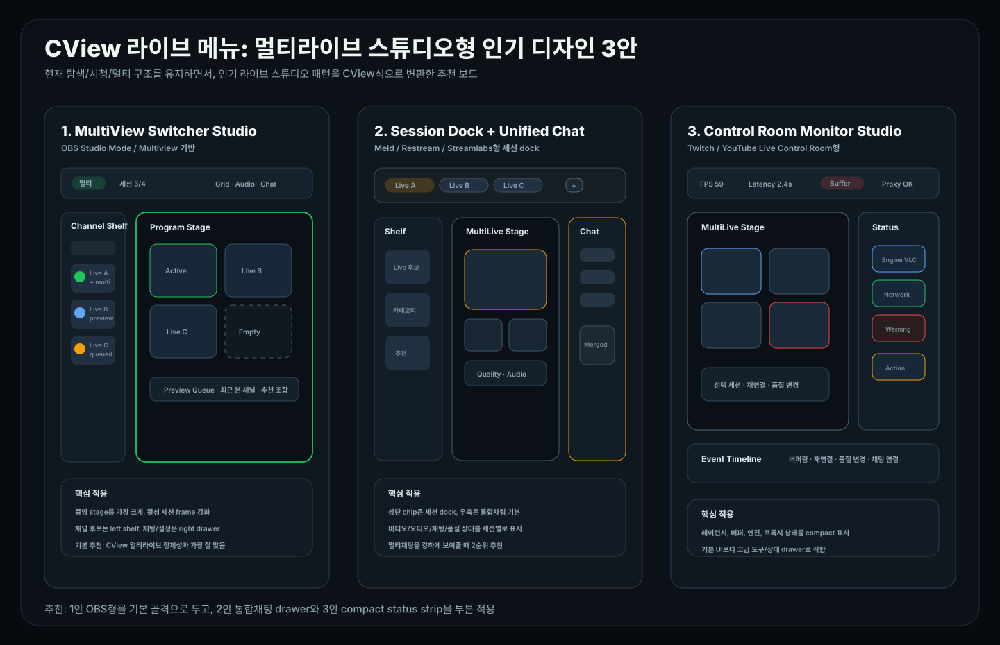

# CView 라이브 메뉴: 멀티라이브 스튜디오형 인기 디자인 3안

작성일: 2026-04-27  
범위: `MainContentView`, `FollowingView`, `FollowingViewState`, `FollowingView+MultiLive`, `FollowingView+MultiChat`, `MultiLiveTabBar`

## 0. 결론

현재 체크아웃의 라이브 메뉴는 이미 일반 목록 화면보다 **스튜디오형 작업 공간**에 가깝다.

- `MainContentView`의 라이브 메뉴는 `FollowingView(viewModel:)`로 진입한다.
- `FollowingViewState`에는 `탐색`, `시청`, `멀티`를 나타내는 `FollowingHubMode`가 있다.
- `FollowingView`는 상단 bar, 좌측 채널 컬럼, 중앙 stage, 우측 drawer 구조로 구성되어 있다.
- `FollowingView+MultiLive`는 `MLTabBar`, `MLGridLayout`, `MLSingleChannelStage`를 통해 stage 중심 멀티라이브를 렌더링한다.
- `FollowingView+MultiChat`은 `MCTabBar`, `MergedChatView`, `ChatPanelView`를 통해 우측 채팅/도구 drawer가 될 수 있다.

따라서 새 디자인은 앱 shell을 바꾸기보다, 현재 구조를 아래 3가지 인기 스튜디오 패턴 중 하나로 선명하게 정리하는 것이 맞다.



| 순위 | 추천 디자인 | 외부 인기 패턴 | CView 적용 판단 |
|---|---|---|---|
| 1 | OBS형 MultiView Switcher Studio | OBS Studio의 Studio Mode / Multiview | 기본 추천. 멀티라이브 stage와 가장 잘 맞음 |
| 2 | Session Dock + Unified Chat Studio | Meld, Restream, Streamlabs류의 stream/session dock + multi chat | 멀티채팅과 세션 운영을 강화할 때 좋음 |
| 3 | Control Room Monitor Studio | Twitch Stream Manager, YouTube Live Control Room | 안정성, 상태, 운영 지표를 강조할 때 좋음 |

최종 추천은 **1안 OBS형 MultiView Switcher Studio를 기본 골격으로 채택하고, 2안의 우측 unified chat dock과 3안의 compact status panel을 일부 섞는 방식**이다.

---

## 1. 추천안 1: OBS형 MultiView Switcher Studio

### 핵심

라이브 메뉴를 **Preview / Program / Multiview** 감각의 멀티라이브 작업대로 만든다. OBS Studio는 Studio Mode에서 preview와 live/program 장면을 나누고, Multiview로 여러 장면을 한 번에 모니터링하는 흐름이 강하다. CView에서는 이를 방송 송출이 아니라 **채널 후보, 현재 활성 stage, 멀티라이브 grid**로 변환한다.

참고: [OBS Studio overview](https://obsproject.com/kb/obs-studio-overview), [OBS Multiview](https://obsproject.com/kb/power-of-projectors)

### 화면 구조

```text
Top Studio Bar
[탐색] [시청] [멀티]    세션 3/4    Grid / Focus / Audio / Chat / Settings

Channel Shelf        Program Stage                         Chat / Tools Drawer
검색, 카테고리        2x2 멀티라이브 grid                   통합채팅, 설정, 도구
라이브 후보          선택 세션은 두꺼운 active frame        필요 시 열림

Preview Queue
다음에 추가할 후보, 최근 본 채널, 추천 조합
```

### CView 매핑

| 디자인 요소 | 현재 코드 매핑 |
|---|---|
| Top Studio Bar | `liveHubTopBar`, `FollowingHubMode` |
| Channel Shelf | `activeLeftPanelContent`, `followingListContent` |
| Program Stage | `multiLiveInlinePanel`, `mlVideoOnlyArea`, `MLGridLayout` |
| Active Program | `multiLiveManager.selectedSession`, `MLSingleChannelStage` |
| Grid / Focus 전환 | `MLTabBar.gridToolbar`, `gridTabToggle`, `layoutModeMenu` |
| Chat / Tools Drawer | `liveHubDrawerPanel`, `multiChatInlinePanel`, `MLSettingsPanel`, `liveHubToolsPanel` |

### 추천 이유

- 사용자가 말한 "멀티라이브 스튜디오" 느낌에 가장 직접적으로 맞다.
- 현재 구현의 중앙 stage 구조를 거의 그대로 살릴 수 있다.
- 멀티라이브의 핵심인 `2x2`, `focusLeft`, `custom ratio`가 시각적으로 잘 설명된다.
- 초보자는 왼쪽에서 채널을 고르고, 고급 사용자는 stage와 drawer를 조작하는 흐름이 분리된다.

### UI 규칙

1. 중앙 stage는 항상 가장 크고 어둡게 둔다.
2. 활성 세션은 chzzk green outline, preview 후보는 blue outline, 오류/버퍼링은 orange/red badge로 구분한다.
3. `MLTabBar`의 session chip은 상단에 유지하되, 3개 이상부터는 `Multiview` 상태가 먼저 읽히도록 한다.
4. 빈 슬롯은 큰 안내 카드가 아니라 얇은 dashed slot으로 둔다.
5. 채팅은 기본 상시 노출보다 우측 drawer로 두고, 멀티 모드에서만 쉽게 여는 것이 좋다.

### 리스크

- 너무 OBS처럼 만들면 CView가 "시청 앱"이 아니라 "송출 도구"처럼 보일 수 있다.
- 해결책은 `Start Streaming`, `Scene`, `Source` 같은 송출 용어를 쓰지 않고, `세션`, `채널`, `스테이지`, `슬롯`으로 번역하는 것이다.

---

## 2. 추천안 2: Session Dock + Unified Chat Studio

### 핵심

Meld, Restream, Streamlabs류의 라이브 도구는 **출력/세션 dock, 멀티채팅, 빠른 action**을 강하게 노출한다. CView에서는 송출 대상 대신 멀티라이브 세션을 dock으로 보고, 오른쪽을 통합 채팅과 session control 중심으로 만든다.

참고: [Meld Stream Manager](https://meldstudio.co/docs/outputs/stream-manager/), [Restream Studio](https://restream.io/studio)

### 화면 구조

```text
Session Dock
[채널 A] [채널 B] [채널 C] [+]    Video / Audio / Chat / Quality toggles

Channel Shelf        MultiLive Stage                  Unified Chat Dock
라이브 후보          grid 또는 focus stage             통합채팅, 개별채팅, 알림
```

### CView 매핑

| 디자인 요소 | 현재 코드 매핑 |
|---|---|
| Session Dock | `MLTabBar.tabScrollArea`, `MLTabChip` |
| Unified Chat | `MergedChatView`, `MCTabBar`, `showMergedChat` |
| Session actions | `MCToolButton`, `MLToolButton`, `onReconnectAll`, `onDisconnectAll` |
| Quality / audio toggles | `multiAudioToggle`, `layoutModeMenu`, `MLSettingsPanel` |

### 추천 이유

- CView의 멀티채팅 기능이 묻히지 않는다.
- "여러 라이브를 열고, 어느 채팅을 볼지 고르는" 실제 사용 흐름과 잘 맞는다.
- 세션이 늘어날수록 상단 chip/dock이 현재 상태를 설명해 준다.
- 오른쪽 drawer에 `채팅`, `설정`, `도구` 탭이 이미 있으므로 적용 난이도가 낮다.

### UI 규칙

1. 세션 chip에는 채널명, live dot, 오디오 활성 상태, 연결 상태만 둔다.
2. 자세한 제목/시청자/업타임은 hover 또는 stage overlay에서만 보여준다.
3. 우측 drawer는 `통합채팅`을 기본으로 하고, 세션 1개일 때만 개별 채팅을 기본으로 한다.
4. 채팅 재연결, 전체 해제, 채널 추가는 icon button으로 유지하되 tooltip을 명확히 둔다.
5. 세션별 quality, latency, engine 상태는 drawer의 `도구` 탭으로 이동시킨다.

### 리스크

- 채팅 중심으로 보이면 중앙 stage가 약해질 수 있다.
- 해결책은 drawer 너비를 280-420pt로 제한하고, stage를 항상 남은 공간의 주인공으로 두는 것이다.

---

## 3. 추천안 3: Control Room Monitor Studio

### 핵심

Twitch Stream Manager와 YouTube Live Control Room은 방송 상태, quick action, 채팅, 분석 지표를 한 화면에서 조작하는 control room 패턴을 갖는다. CView에서는 이를 **멀티라이브 안정성, 레이턴시, 버퍼링, 엔진 상태를 보는 모니터링형 라이브 메뉴**로 변환한다.

참고: [Twitch Stream Manager](https://help.twitch.tv/s/article/stream-manager), [YouTube Live Control Room](https://support.google.com/youtube/answer/2907883)

### 화면 구조

```text
Compact Control Bar
세션 3/4, 평균 FPS, 버퍼 경고, 레이턴시, 프록시 상태, 새로고침

MultiLive Stage                     Status / Action Panel
선택 세션 중심 grid                 재연결, 품질, 엔진, 네트워크, 로그

Event Timeline
버퍼링, 재연결, 품질 변경, 채팅 연결 상태
```

### CView 매핑

| 디자인 요소 | 현재 코드 매핑 |
|---|---|
| Status panel | `liveHubToolsPanel`, `MLSettingsPanel`, `MLNetworkWindowView`, `MLMetricsWindowView` |
| Player health | `MultiLiveManager`, `PlayerViewModel`, player metrics models |
| Quick actions | `MLToolButton`, `MCToolButton`, reconnect/remove/settings actions |
| Event timeline | 현재는 별도 구현 필요 |

### 추천 이유

- CView가 이미 레이턴시, 버퍼링, VLC/AVPlayer, 멀티라이브 안정성 개선 흐름을 갖고 있어 잘 맞는다.
- 단순히 예쁘기보다 "왜 끊기는지", "어느 세션이 문제인지"를 빠르게 알 수 있다.
- 파워유저가 멀티라이브를 오래 켜두는 사용 패턴에 적합하다.

### UI 규칙

1. 기본 화면에는 지표를 3-5개만 노출한다.
2. 세션별 세부 지표는 drawer 또는 popover에 둔다.
3. 경고는 색상만 쓰지 말고 icon + 짧은 label로 표시한다.
4. event timeline은 최근 5-10개만 보여주고, 전체 로그는 별도 창으로 보낸다.
5. 제어 버튼은 파괴적 action과 복구 action을 분리한다.

### 리스크

- 너무 dashboard처럼 보이면 라이브 메뉴의 시청성이 줄어든다.
- 해결책은 3안을 기본 디자인이 아니라 `도구/상태` drawer의 고급 모드로 두는 것이다.

---

## 4. 비교

| 항목 | 1안 OBS형 | 2안 Session Dock형 | 3안 Control Room형 |
|---|---:|---:|---:|
| 멀티라이브 스튜디오 느낌 | 매우 높음 | 높음 | 중간 |
| 현재 코드 적합성 | 매우 높음 | 높음 | 중간 |
| 멀티채팅 강조 | 중간 | 매우 높음 | 높음 |
| 안정성/지표 강조 | 중간 | 중간 | 매우 높음 |
| 첫 사용자 이해도 | 높음 | 중간 | 중간 |
| 구현 리스크 | 낮음-중간 | 중간 | 중간-높음 |
| 기본 적용 추천도 | 1순위 | 2순위 | 3순위 |

---

## 5. 최종 적용안

가장 좋은 최종 방향은 다음 조합이다.

```text
OBS형 MultiView Switcher Studio
+ Session Dock형 Unified Chat Drawer
+ Control Room형 Compact Status Strip
```

적용 우선순위:

| 우선순위 | 작업 |
|---|---|
| P0 | 중앙 stage를 `Program Stage`처럼 보이게 정리하고 활성 세션 frame을 강화 |
| P0 | 왼쪽 채널 컬럼을 `Channel Shelf`로 명명하고 compact list 밀도 정리 |
| P0 | 빈 멀티라이브 슬롯을 dashed slot + `채널 추가` CTA로 정리 |
| P1 | `MLTabBar`를 session dock처럼 읽히도록 chip 정보량을 줄이고 상태 dot을 명확히 표시 |
| P1 | 우측 drawer 기본값을 `통합채팅` 중심으로 정리 |
| P1 | 상단 bar에 `세션 n/max`, `grid/focus`, `chat`, `settings` 상태를 compact하게 노출 |
| P2 | `도구` drawer에 버퍼링, 레이턴시, 엔진, 네트워크 상태를 control room식으로 추가 |

이 방향은 "라이브 메뉴 = 채널 목록"이 아니라 **라이브 메뉴 = 멀티라이브 스튜디오**라는 인상을 가장 강하게 만든다. 동시에 현재 앱의 shell, routing, `FollowingView` 구조를 보존하므로 구현 리스크도 낮다.
