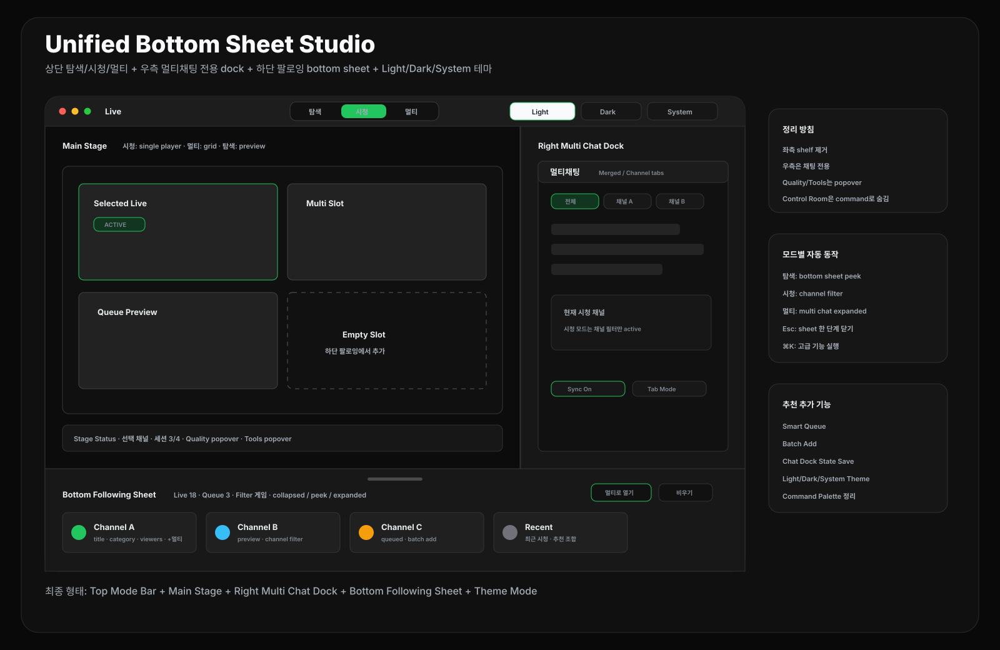

# CView 라이브 메뉴 통합 리디자인: Unified Bottom Sheet Studio

작성일: 2026-04-27  
범위: `FollowingView`, `FollowingViewState`, `FollowingView+Header`, `FollowingView+MultiLive`, `FollowingView+MultiChat`, `LiveStreamView`, `MultiLiveManager`, `MultiChatSessionManager`, `CommandPaletteView`

## 0. 결론

현재 라이브 메뉴에는 `Native Inspector`, `Floating Palette`, `Control Room`, 좌측 shelf, 우측 inspector, session strip 같은 디자인이 복합적으로 섞여 있다. 이제는 여러 프리셋을 보여주는 방향보다 **하나의 기본 디자인**으로 정리하는 편이 맞다.

새 기준 디자인은 다음이다.

```text
Unified Bottom Sheet Studio
```

핵심 구조:

```text
상단: 탐색 / 시청 / 멀티 버튼
중앙: 라이브 stage
우측: 멀티채팅 전용 dock
하단: 팔로잉 목록이 아래에서 위로 올라오는 mini bottom sheet
테마: 라이트 / 다크 / 시스템 설정
```



이 디자인은 기존 `좌측 채널 컬럼 + 중앙 stage + 우측 inspector` 구도를 버리고, **좌측을 비워 stage를 넓히며 팔로잉 탐색을 하단 sheet로 이동**시킨다. 결과적으로 화면이 더 단순해지고, 라이브 메뉴의 주인공이 `stage + chat`으로 명확해진다.

추가 최종안: 첫 화면을 `팔로잉 및 종합 정보 overview`로 두고, 팔로잉 bottom sheet를 `Spotlight + Live Rail + Smart Queue` 형태로 더 예쁘게 다듬은 최신 기준은 [`live-menu-final-overview-following-redesign-2026-04-27.md`](live-menu-final-overview-following-redesign-2026-04-27.md)를 따른다.

---

## 1. 최종 화면 구조

```text
┌──────────────────────────────────────────────────────────────────┐
│ Top Mode Bar                                                     │
│ [탐색] [시청] [멀티]        Search · Layout · Command · Status    │
├──────────────────────────────────────────────┬───────────────────┤
│ Main Stage                                    │ Right Chat Dock    │
│ - 탐색: 선택/추천 preview                     │ - 멀티채팅          │
│ - 시청: 단일 live player                      │ - 현재 채널 필터    │
│ - 멀티: multi grid                            │                   │
├──────────────────────────────────────────────┴───────────────────┤
│ Bottom Following Sheet                                            │
│ collapsed: handle + 라이브 n개 + quick chips                       │
│ expanded: 팔로잉 dense list / queue / filters                      │
└──────────────────────────────────────────────────────────────────┘
```

### 왜 이 구조가 더 낫나

- 좌측 패널, floating palette, control room 프리셋이 동시에 경쟁하지 않는다.
- 상단은 모드 전환만 담당하므로 사용자가 화면 구조를 빠르게 이해한다.
- 우측은 채팅만 담당한다. `Inspector`, `Quality`, `Tools`는 별도 popover 또는 command로 빼는 것이 좋다.
- 팔로잉 목록은 항상 떠 있는 큰 패널이 아니라, 필요할 때 아래에서 올라오는 mini sheet가 된다.
- macOS 창 폭이 좁아져도 stage와 chat의 관계가 덜 깨진다.

---

## 2. 영역별 설계

### 2.1 Top Mode Bar

상단에는 사용자가 요청한 `탐색 / 시청 / 멀티` 버튼을 중심에 둔다.

권장 구성:

```text
Live
[탐색] [시청] [멀티]
Search
Layout
Command
Status
```

규칙:

- `탐색`: bottom sheet를 `expanded` 또는 `peek`로 열고 stage는 preview 상태.
- `시청`: 선택 채널을 단일 stage로 표시하고, 우측 멀티채팅에서 현재 채널 탭/필터를 강조.
- `멀티`: multi grid를 표시하고 멀티채팅을 full height로 확장.
- 기존 `LiveHubLayoutPreset`의 `Native / Floating / Control Room` 메뉴는 기본 UI에서 숨긴다.
- `CommandPaletteView`에는 남기되, 고급 명령으로 낮춘다.

### 2.2 Main Stage

중앙은 mode에 따라 하나의 stage로 동작한다.

| 모드 | stage 내용 | 추천 |
|---|---|---|
| 탐색 | 선택한 팔로잉 채널 preview 또는 추천 조합 preview | bottom sheet와 연동 |
| 시청 | 단일 live player | 우측 멀티채팅의 현재 채널 필터 |
| 멀티 | multi grid / focus layout | 우측 멀티채팅 full height |

추천:

- stage 상단에는 session count와 selected channel만 작게 표시한다.
- 기존 inspector 기능인 `Quality`, `Tools`는 stage 우상단 popover로 이동한다.
- empty state는 큰 설명 카드 대신 `하단 팔로잉에서 채널을 선택하세요` 정도의 얇은 안내만 둔다.

### 2.3 Right Chat Dock

우측에는 `멀티채팅`만 배치한다. 별도 `싱글채팅` 패널은 제거하고, 단일 시청 상황은 멀티채팅 안의 현재 채널 탭/필터로 처리한다.

```text
Right Chat Dock
├─ Multi Chat
│  - 통합채팅 / 채널별 탭
│  - 현재 시청 채널 필터
│  - 세션별 sync 상태
└─ Chat Settings Popover
```

권장 상태:

| 상태 | 멀티채팅 동작 |
|---|---|
| 탐색 | compact preview |
| 시청 | 현재 채널 탭/필터 active |
| 멀티 | full height 통합채팅 + 채널별 탭 |

세부 추천:

- 우측 전체 폭은 320-420pt.
- 별도 divider 없이 채팅 리스트 전체 높이를 사용한다.
- 멀티채팅 세션이 없으면 compact empty state.
- 단일 시청 채널은 `selectedSession` 기반 channel filter로 보여준다.
- 채팅 설정은 우측 dock 내부가 아니라 상단 `...` popover로 둔다.

### 2.4 Bottom Following Sheet

하단에는 팔로잉 목록이 아래에서 위로 올라오는 mini design을 둔다.

상태:

| 상태 | 높이 | 용도 |
|---|---:|---|
| collapsed | 44-56pt | handle, 라이브 수, 최근/추천 chip |
| peek | 160-220pt | live row 2-3줄, quick add |
| expanded | 화면 높이의 36-45% | dense following list, filter, smart queue |

구성:

```text
Bottom Sheet Header
Live n개 · 검색 · 필터 · Queue n개

Dense Following Rows
avatar · channel · title · category · viewers · actions

Smart Queue
선택 채널 후보 · Batch Add · Clear
```

동작:

- `탐색` 버튼을 누르면 `peek` 또는 `expanded`.
- stage를 클릭하거나 `시청/멀티`로 전환하면 `collapsed`.
- `+멀티`를 누르면 queue에 쌓고, `멀티` 모드에서 batch add 가능.
- drag gesture로 sheet 높이를 조절한다.
- Esc는 sheet를 한 단계 내린다.

---

## 3. 기존 복합 디자인 정리 방침

현재 섞여 있는 디자인을 다음처럼 정리한다.

| 기존 요소 | 처리 |
|---|---|
| `Native Inspector` | 기본 레이아웃 개념은 폐기. toolbar/panel 일부만 흡수 |
| `Floating Palette` | 기본 UI에서 제거. stage 우상단 quick popover로 축소 |
| `Control Room` | 보조 창 command로 유지. 기본 화면 레이아웃에서는 제외 |
| 좌측 channel shelf | 하단 bottom sheet로 이동 |
| 우측 inspector | chat dock으로 변경. quality/tools는 popover |
| session strip | stage 상단 mini status 또는 bottom sheet header로 흡수 |
| smart queue | bottom sheet 내부 핵심 기능으로 유지 |
| command palette | 고급 실행/보조 창/빠른 검색 용도로 유지 |

이렇게 해야 `프리셋이 많은 앱`이 아니라 `한 가지 명확한 라이브 워크스페이스`로 보인다.

---

## 4. 상태 모델 추천

기존 상태는 많아졌으므로, 새 디자인에서는 다음 상태만 기본 UI에 남기는 것이 좋다.

```swift
enum LiveMenuMode {
    case explore
    case watch
    case multi
}

enum FollowingSheetState {
    case collapsed
    case peek
    case expanded
}

enum ChatDockState {
    case compact
    case currentChannel
    case expanded
}
```

권장 축소:

- `LiveHubLayoutPreset`은 기본 UI에서 숨김.
- `showFollowingList`는 `FollowingSheetState`로 대체.
- `showMultiChat`, `showMLSettings`, `showMLTools`는 멀티채팅 dock과 popover 상태로 재정의.
- `inspectorSelectedTab`은 `ChatDockState`와 `StageToolPopover`로 분리하되, `single` 상태는 만들지 않는다.

---

## 5. 나머지 추천 기능

### 5.1 Stage Tool Popover

`Quality`, `Network`, `Metrics`, `Layout`은 우측 채팅 dock에 넣지 말고 stage 우상단 popover로 둔다.

이유:

- 우측은 채팅 전용으로 유지해야 디자인이 단순해진다.
- 품질/네트워크는 현재 선택 stage의 부가 정보이므로 stage에 붙는 것이 더 자연스럽다.

### 5.2 Smart Queue는 bottom sheet에 통합

bottom sheet는 단순 목록이 아니라 `팔로잉 + 후보 큐` 역할을 같이 해야 한다.

추천:

- row action: `보기`, `+멀티`, `채팅`, `상세`
- queue action: `멀티로 열기`, `비우기`, `추천 조합 추가`
- 세션 제한 초과 시 초과 채널만 disabled 처리

### 5.3 Chat Dock 상태 전환

모드 전환에 따라 우측 멀티채팅 dock의 표시 밀도가 자동으로 바뀌면 좋다.

```text
탐색: compact preview
시청: current channel filter
멀티: expanded multi chat
```

사용자가 채널 탭이나 통합채팅 보기 방식을 조정하면 해당 모드의 표시 상태를 저장한다.

### 5.4 Command Palette는 정리 도구로 유지

기본 화면에서 모든 기능을 버튼으로 노출하지 않는다. 다음은 command palette로 보내는 것이 좋다.

- 네트워크 모니터 열기
- 메트릭 전송 창 열기
- Control Room 프리셋 실행
- Floating Palette 실험 모드
- 전체 세션 정리
- 품질 정책 변경

### 5.5 Theme Mode

라이브 메뉴는 `라이트 / 다크 / 시스템 설정` 3가지 테마를 제공한다.

```text
라이트: 밝은 surface와 얇은 stroke로 팔로잉 탐색 가독성 우선
다크: graphite stage와 짙은 chat dock으로 장시간 시청 집중
시스템 설정: macOS appearance에 따라 light/dark token 자동 전환
```

추천:

- 기본값은 `시스템 설정`.
- 사용자가 직접 `라이트` 또는 `다크`를 선택하면 macOS appearance보다 사용자 선택을 우선한다.
- 상단 toolbar 우측에 `Light / Dark / System` segmented control을 둔다.
- accent green은 모든 테마에서 동일 계열을 유지해 `LIVE`, `Queue`, 선택 상태를 일관되게 보여준다.

---

## 6. 구현 우선순위

| 우선순위 | 작업 |
|---|---|
| P0 | 상단 `탐색 / 시청 / 멀티` 중심 toolbar 확정 |
| P0 | 좌측 channel shelf 제거, bottom following sheet 설계 |
| P0 | 우측 chat dock을 `멀티채팅` 단일 패널로 재정의 |
| P0 | 모드별 sheet/chat dock/stage 상태 전환 규칙 확정 |
| P1 | `FollowingSheetState`, `ChatDockState` 상태 추가 |
| P1 | bottom sheet dense row + smart queue 구현 |
| P1 | stage tool popover로 Quality/Tools 이동 |
| P1 | Light/Dark/System theme token 및 설정 UI 추가 |
| P2 | Control Room / Floating Palette 기존 프리셋 정리 또는 숨김 |
| P2 | command palette live 명령 재분류 |

---

## 7. 최종 판단

이 디자인의 핵심은 **좌측 패널을 하단 sheet로 이동시키고, 우측은 채팅 전용으로 고정하는 것**이다.

최종 형태:

```text
Top Mode Bar
+ Main Stage
+ Right Chat Dock
+ Bottom Following Sheet
```

이 구조면 현재 라이브 메뉴에 섞인 여러 실험적 디자인을 하나의 명확한 방향으로 정리할 수 있다. 시각적으로도 더 플랫하고 현대적이며, 사용자가 요청한 `탐색 / 시청 / 멀티`, `멀티채팅 단일 dock`, `아래에서 올라오는 팔로잉 목록`, `라이트 / 다크 / 시스템 설정 테마` 조건을 모두 만족한다.
