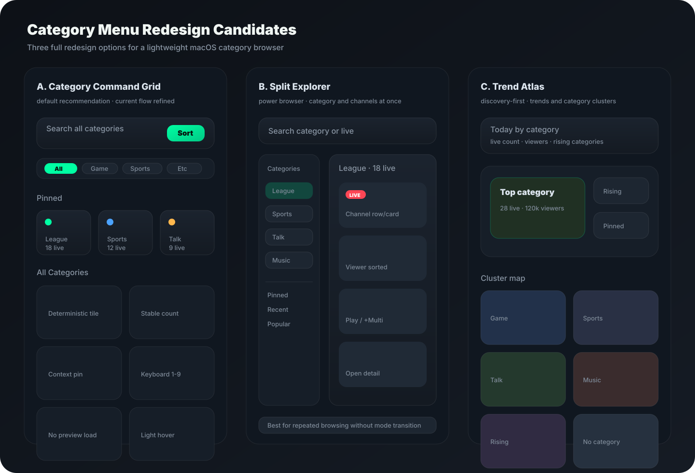

# CView 카테고리 메뉴 전면 리디자인 후보 3안

작성일: 2026-04-28  
범위: `CategoryBrowseView`, `HomeViewModel.categoryChannels`, `MainContentView`의 카테고리 메뉴  
목적: 현재 카테고리 메뉴를 전면 리디자인할 때 선택할 수 있는 후보 디자인 3개를 제안한다.

---

## 0. 결론

추천 순위는 다음이다.

| 순위 | 후보 | 핵심 성격 | 판단 |
|---|---|---|---|
| 1 | **Category Command Grid** | 현재 구조를 유지하면서 훨씬 정돈된 기본 탐색 화면 | 기본 추천 |
| 2 | **Split Explorer** | 카테고리와 채널을 한 화면에서 동시에 보는 고속 탐색형 | 파워유저/넓은 창에 적합 |
| 3 | **Trend Atlas** | 트렌드와 카테고리 클러스터를 먼저 보여주는 발견형 | 보조 모드로 적합 |



기본 적용은 **1안 Category Command Grid**가 가장 안전하다. 현재 `CategoryBrowseView`가 이미 글로벌 검색, 타입 필터, 정렬, 고정 카테고리, 채널 상세 화면을 갖고 있으므로 전면 재작성보다 화면 위계를 정리하는 편이 구현 리스크와 성능 리스크가 낮다.

---

## 1. 현재 구현 기준

현재 카테고리 메뉴는 단순 카드 그리드가 아니다. 2026-04-23 이후 다음 기능이 이미 들어가 있다.

- `ContentState`: 최초 로딩, partial, ready, empty, error 상태 분리
- 글로벌 검색: 카테고리 단계에서 채널명, 방송 제목, 카테고리명 검색
- 타입 필터: `GAME`, `SPORTS`, `ETC` 등 데이터 기반 동적 필터
- 정렬: 카테고리 정렬, 채널 정렬
- 고정 카테고리: `@AppStorage("category.pinnedCategories")`
- 키보드: ESC, `/`, 상위 카테고리 `⌘1~⌘9`
- 성능 보정: 100px 단위 width quantize, lineWidth 고정, 정적 thumbnail, `.equatable()`

따라서 새 디자인은 이미 해결된 문제를 다시 풀기보다, 다음을 해결해야 한다.

1. 첫 화면에서 “어떤 카테고리를 볼지” 더 빠르게 결정하게 한다.
2. 카테고리 카드와 채널 카드의 관계를 더 명확하게 만든다.
3. 많은 카테고리에서도 칩/카드가 난잡해 보이지 않게 한다.
4. 홈/라이브 메뉴의 최근 경량 디자인 방향과 같은 톤을 유지한다.

---

## 2. 공통 설계 원칙

세 후보 모두 아래 제약을 지킨다.

- `MainContentView`의 카테고리 route는 유지한다.
- 카테고리 메뉴 내부에 무거운 플레이어 preview를 넣지 않는다.
- category grid의 thumbnail 자동 갱신은 기본 비활성으로 둔다.
- 검색과 필터는 sticky 영역에 두되, sticky 높이를 과도하게 키우지 않는다.
- type chip이 8개 이상으로 늘어나면 1줄 chip swarm 대신 overflow menu 또는 rail로 보낸다.
- category 색상과 icon은 현재처럼 stable hash 또는 명시적 mapping을 사용한다.
- Superset/metrics 성격의 큰 차트는 카테고리 메뉴 기본 화면에 넣지 않는다.

---

## 3. 후보 A: Category Command Grid

### 컨셉

현재 `카테고리 그리드 -> 채널 그리드` 흐름을 유지하되, 상단을 command bar처럼 정리하고 `고정`, `인기`, `전체` 섹션을 분리한다. 사용자는 검색하거나, 고정 카테고리를 누르거나, 인기 카테고리를 스캔해서 바로 채널 목록으로 들어간다.

### 레이아웃

```text
┌──────────────────────────────────────────────────────────────┐
│ Category Command Bar                                          │
│ 검색 · 타입 필터 · 정렬 · 새로고침                             │
├──────────────────────────────────────────────────────────────┤
│ 상태 요약: 전체 카테고리 n개 · 라이브 n개 · 전체 수집 상태       │
├──────────────────────────────────────────────────────────────┤
│ 고정 카테고리                                                  │
│ [League] [Sports] [Talk]                                       │
├──────────────────────────────────────────────────────────────┤
│ 인기 카테고리                                                  │
│ 큰 카드 4~6개: live count + viewer hint + pin action           │
├──────────────────────────────────────────────────────────────┤
│ 전체 카테고리                                                  │
│ 작은 tile grid, stable icon/color                              │
└──────────────────────────────────────────────────────────────┘
```

### 세부 디자인

- sticky header는 `title + search + sort + refresh`까지만 둔다.
- 타입 필터는 헤더 바로 아래 1줄로 유지한다.
- `pinnedGroups`는 별도 section으로 분리해 항상 첫 번째 스크롤 영역에 둔다.
- 카테고리 카드는 기존 140pt 고정 높이보다 조금 낮춘 116~128pt가 적합하다.
- 카드 내부에는 “아이콘 + 카테고리명 + LIVE count”만 남긴다.
- preview channel thumbnail은 category card에 넣지 않는다. 카테고리 메뉴가 무거워진다.

### 현재 코드 매핑

| 디자인 요소 | 현재 코드 |
|---|---|
| sticky command | `stickyCategoryGridHeader` |
| global search | `globalSearchBar` |
| type filter | `categoryTypeFilter` |
| pinned section | `pinnedGroups`, `pinnedSectionHeader` |
| all section | `unpinnedGroups`, `allSectionHeader` |
| tile card | `CategoryGridCard` |
| stable accent | `accentColor(for:)`, `StableHash` |

### 장점

- 현재 코드와 가장 잘 맞는다.
- 구현 범위가 작다.
- 카테고리 메뉴가 가볍고 예측 가능하다.
- 기존 키보드 단축키와 고정 카테고리 기능을 그대로 살릴 수 있다.

### 단점

- 채널 목록으로 들어가려면 여전히 화면 전환이 필요하다.
- 매우 많은 카테고리를 빠르게 비교하는 파워유저에게는 2안보다 느리다.

### 추천 적용

기본 카테고리 메뉴는 이 안으로 가는 것이 좋다.

---

## 4. 후보 B: Split Explorer

### 컨셉

카테고리와 채널을 한 화면에서 동시에 본다. 왼쪽에는 category rail, 오른쪽에는 선택 카테고리의 live grid를 둔다. 현재처럼 `selectedCategory`로 전체 화면을 전환하지 않고, 선택 상태만 바꾼다.

### 레이아웃

```text
┌──────────────────────────────────────────────────────────────┐
│ Search / Filter / Sort                                        │
├───────────────┬──────────────────────────────────────────────┤
│ Category Rail │ Channel Results                               │
│ 고정           │ 선택 카테고리 제목 · live count · sort          │
│ 인기           │ [live card] [live card] [live card]             │
│ 전체           │ [live card] [live card] [live card]             │
└───────────────┴──────────────────────────────────────────────┘
```

### 세부 디자인

- 왼쪽 rail width는 220~260pt.
- category item은 card가 아니라 dense row로 만든다.
- 선택 category는 row background + accent bar로만 표시한다.
- 오른쪽은 기존 `CategoryChannelCard`를 유지하되 16:9 media grid로 배치한다.
- 좁은 창에서는 1안 구조로 자동 fallback한다.

### 현재 코드 매핑

| 디자인 요소 | 현재 코드 |
|---|---|
| category rail 데이터 | `categorizedChannels`, `pinnedGroups`, `unpinnedGroups` |
| 선택 상태 | `selectedCategory` |
| channel results | `channelsInCategory` |
| channel search | `channelSearchBar` |
| channel sort | `channelSortMenu` |

### 장점

- 카테고리를 바꿀 때 전체 화면 전환이 없어 빠르다.
- 넓은 macOS 창에서 정보 밀도가 가장 좋다.
- 검색/필터/정렬 상태를 유지한 채 여러 카테고리를 비교하기 좋다.

### 단점

- 현재 코드보다 구조 변경이 크다.
- rail과 grid를 동시에 관리해야 해서 반응형 규칙이 중요하다.
- 좁은 창에서 그대로 쓰면 답답해진다.

### 추천 적용

카테고리 메뉴를 “자주 쓰는 탐색 도구”로 키울 생각이면 2안이 가장 강하다. 다만 기본값은 `width >= 1180`일 때만 Split Explorer, 그 미만은 1안 fallback이 맞다.

---

## 5. 후보 C: Trend Atlas

### 컨셉

카테고리를 단순 목록이 아니라 “오늘 어떤 카테고리가 뜨는지” 보여주는 발견형 화면으로 만든다. 상단에는 top category와 rising category를 보여주고, 아래에는 type별 cluster map을 둔다.

### 레이아웃

```text
┌──────────────────────────────────────────────────────────────┐
│ Today by Category                                             │
│ Top category · Rising · Pinned · Live total                   │
├──────────────────────────────────────────────────────────────┤
│ Spotlight Category                                            │
│ 가장 큰 카테고리 1개 + 보조 상승 카테고리 2개                  │
├──────────────────────────────────────────────────────────────┤
│ Cluster Map                                                   │
│ Game / Sports / Talk / Music / Rising / Uncategorized         │
├──────────────────────────────────────────────────────────────┤
│ Category Ranking                                              │
│ dense rows: category · live count · viewers · trend           │
└──────────────────────────────────────────────────────────────┘
```

### 세부 디자인

- 상단 spotlight은 1개만 크게 둔다.
- type cluster는 2열 또는 3열 band로 배치한다.
- live count뿐 아니라 viewer total, rising delta가 있으면 함께 표시한다.
- trend 데이터가 없으면 fake chart를 만들지 않는다. `live count` 기반 rank로 fallback한다.
- 기본 화면에 animation 많은 heatmap은 넣지 않는다.

### 현재 코드 매핑

| 디자인 요소 | 현재 코드/추가 필요 |
|---|---|
| top category | `categorizedChannels.first` |
| type clusters | `availableTypeFilters`, `sourceChannels.categoryType` |
| ranking rows | `categorizedChannels` |
| rising delta | 추가 데이터 필요 |
| viewer total by category | `channels.reduce(viewerCount)` helper 필요 |

### 장점

- 가장 새롭고 발견성이 좋다.
- 사용자가 평소 보지 않던 카테고리를 발견하기 쉽다.
- 홈의 `Discover` 흐름과 잘 이어진다.

### 단점

- 정확한 trend/rising 데이터를 만들지 않으면 시각만 화려한 화면이 된다.
- 기본 카테고리 탐색보다 구현할 데이터 파생이 많다.
- 잘못 만들면 홈에서 줄이기로 한 “대시보드 느낌”이 카테고리 메뉴에 다시 들어온다.

### 추천 적용

기본 화면보다는 `트렌드` 탭 또는 `보기 옵션`으로 두는 편이 좋다.

---

## 6. 비교

| 항목 | A. Command Grid | B. Split Explorer | C. Trend Atlas |
|---|---:|---:|---:|
| 기본 메뉴 적합성 | 높음 | 중간 | 낮음~중간 |
| 현재 코드 재사용 | 높음 | 중간 | 중간 |
| 구현 난이도 | 낮음~중간 | 중간~높음 | 높음 |
| 성능 리스크 | 낮음 | 중간 | 중간~높음 |
| 넓은 창 활용 | 중간 | 높음 | 높음 |
| 좁은 창 대응 | 높음 | fallback 필요 | 중간 |
| 발견성 | 중간 | 높음 | 매우 높음 |
| 반복 사용 효율 | 중간 | 매우 높음 | 중간 |

---

## 7. 최종 추천 조합

가장 좋은 실제 적용안은 다음이다.

```text
기본: Category Command Grid
조건부: width >= 1180이면 Split Explorer로 전환 가능
옵션: Trend Atlas는 보기 모드 또는 하단 트렌드 섹션으로 제공
```

즉, 하나의 메뉴 안에서 세 디자인을 모두 기본 UI로 노출하지 않는다. 사용자는 기본적으로 `Command Grid`를 보고, 넓은 창에서는 자동으로 `Split Explorer`의 장점을 얻고, `Trend Atlas`는 발견용 보조 모드로 들어간다.

---

## 8. 구현 우선순위

### P0

- Category card 높이를 낮추고 정보량을 줄인다.
- sticky header 높이를 줄인다.
- `Pinned / Popular / All` 섹션 위계를 명확히 한다.
- type filter가 많아질 때 overflow 처리한다.
- category card의 shadow와 gradient layer를 더 줄인다.

### P1

- `Split Explorer`의 width breakpoint와 fallback 규칙을 만든다.
- category rail row 컴포넌트를 추가한다.
- 선택 카테고리 변경 시 전체 transition 대신 오른쪽 grid만 교체한다.
- 채널 카드에 `재생`, `+ 멀티라이브`, `채널 상세` quick action을 정리한다.

### P2

- Trend Atlas용 category viewer total helper를 만든다.
- rising category 계산 기준을 정한다.
- `보기: 그리드 / 분할 / 트렌드` 옵션을 실험 플래그로 둔다.

---

## 9. 후보별 선택 기준

| 상황 | 선택 |
|---|---|
| 빠르게 전면 리디자인을 적용해야 함 | A |
| 카테고리 메뉴를 팔로잉 메뉴처럼 자주 쓰는 탐색 도구로 만들고 싶음 | B |
| 앱 첫 인상과 발견성을 강화하고 싶음 | C 보조 모드 |
| 홈 화면처럼 가벼워야 함 | A |
| 넓은 macOS 창 사용자를 중시함 | B |
| 트렌드/통계 지표를 카테고리에서 강조하고 싶음 | C |

---

## 10. 한 줄 권고

카테고리 메뉴의 기본 리디자인은 **A. Category Command Grid**로 가고, 넓은 창에서만 **B. Split Explorer**를 자동 확장으로 섞는 것이 가장 균형이 좋다. **C. Trend Atlas**는 예쁘지만 기본 화면으로 쓰면 무거워질 수 있으므로 보조 발견 모드로 두는 편이 안전하다.
