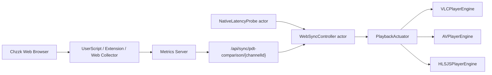
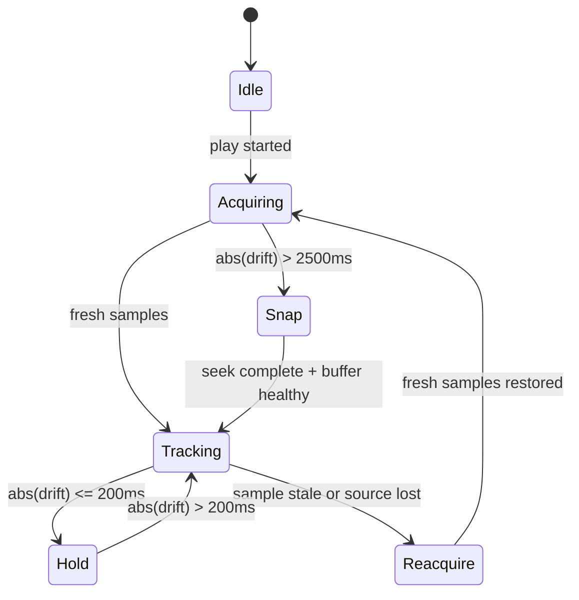

# 치지직 웹 브라우저 기준 라이브 영상 싱크 연구

작성일: 2026-04-25  
대상: CView_v2 macOS 앱, 치지직 라이브 HLS, Swift 6.x  
목표: 앱 재생 영상 위치를 웹 브라우저 치지직 라이브 재생 위치와 오차범위 내에서 동기화

## 1. 결론 요약

앱과 웹의 영상 싱크는 단순히 앱 목표 지연시간을 6초로 고정하는 방식으로는 안정적으로 맞출 수 없다. 치지직 웹 플레이어의 실제 지연은 스트림 세그먼트 길이, 웹 플레이어 설정, CDN 응답, 브라우저 MSE 버퍼, 스톨 복구 이력에 따라 움직인다. 따라서 기준값은 "추정 웹 기본값"이 아니라 웹 브라우저에서 수집한 실측 레이턴시여야 한다.

가장 현실적인 방법은 다음 구조다.

1. 웹 브라우저에서 `video.currentTime`, `hls.latency`, 가능하면 `hls.playingDate` 또는 `#EXT-X-PROGRAM-DATE-TIME` 기반 `currentPdtMs`를 수집한다.
2. 앱은 Swift 6 `actor` 기반 `WebSyncController`에서 웹 레이턴시와 앱 레이턴시를 같은 단위(ms)와 같은 기준 시각으로 정규화한다.
3. 드리프트가 큰 초기 구간은 seek으로 맞추고, 이후에는 재생속도 0.97x-1.06x 범위의 PLL(phase-locked loop)식 미세 보정으로 수렴시킨다.
4. 목표 오차는 운영 기준으로 `excellent <= 200ms`, `acceptable <= 500ms`, `recovery > 1000ms`로 둔다. 서버의 PDT 비교 API는 `<= 50ms` 정밀도를 목표로 하지만, 실제 영상 출력은 프레임 큐, 디코더 버퍼, 세그먼트 경계 때문에 200-500ms 운영 목표가 더 안전하다.

현재 코드에는 이미 `webSync` 프리셋, PDT 기반 앱 레이턴시 측정, 서버의 웹/앱 레이턴시 비교, 재생속도 보정 루프가 있다. 다만 정밀 동기화를 위해서는 다음 보강이 필요하다.

- Swift 클라이언트에 `/api/sync/pdt-comparison/{channelId}` 호출 경로가 없다.
- `MetricsForwarder`는 `/api/cview/sync-status/{channelId}` 기반의 상대적으로 거친 보정을 적용한다.
- `PlayerViewModel.currentTargetLatencyMs()`는 VLC에서 실제 웹 싱크 목표 6000ms가 아니라 `liveCaching` 값을 반환할 수 있다.
- `LowLatencyController`의 PID `deltaTime`이 실제 5초 폴링 주기와 다르게 1초로 고정되어 있다.
- 멀티라이브는 `enableLowLatency: !isMultiLive`라서 PID 보정이 꺼지고 PDT 모니터링 위주로 동작한다.

## 2. 동기화 목표와 오차범위

### 2.1 목표 정의

동기화 대상은 "방송 원본 절대 시각 대비 지연"이다.

```text
webLatencyMs = webNowReferenceMs - webPlayingPdtMs
appLatencyMs = appNowReferenceMs - appPlayingPdtMs
driftMs      = appLatencyMs - webLatencyMs
```

판정 방향은 다음과 같다.

| 조건 | 의미 | 조치 |
| --- | --- | --- |
| `driftMs > 0` | 앱이 웹보다 뒤처짐 | 앱을 가속하거나 앞으로 seek |
| `driftMs < 0` | 앱이 웹보다 앞섬 | 앱을 감속하거나 목표 위치 뒤로 seek |
| `abs(driftMs) <= tolerance` | 싱크 허용 범위 | 1.0x 유지 |

### 2.2 권장 오차 등급

| 등급 | 기준 | 사용자 체감 |
| --- | ---: | --- |
| Excellent | `abs(driftMs) <= 200ms` | 사실상 동시 재생 |
| Good | `<= 500ms` | 일반 시청에서 허용 가능 |
| Moderate | `<= 1000ms` | 채팅 반응/소리 비교 시 차이 체감 |
| Recovery | `> 1000ms` | 보정 필요 |
| Reacquire | `> 2500ms` 또는 샘플 신뢰도 낮음 | seek 또는 재동기화 |

서버의 `handle_pdt_comparison()`은 `±50ms`를 목표로 설계되어 있으나, 이는 PDT 계산 정밀도 목표다. 실제 플레이어 출력 싱크 목표는 프레임 단위와 버퍼 단위를 고려해 200-500ms로 잡는 것이 안정적이다.

## 3. 현재 구현 분석

### 3.1 앱의 웹 동기화 프리셋

현재 `LowLatencyController.Configuration.webSync`는 hls.js 기본 라이브 지연 가정을 기준으로 6초를 목표로 둔다.

근거:

- `Sources/CViewPlayer/LowLatencyController.swift:54-71`: `webSync` 목표 6.0초, 최대 12.0초, 재생속도 0.93x-1.08x.
- `Sources/CViewCore/Models/SettingsModels.swift:136-147`: `PlayerSettings` 기본값도 `latencyPreset = "webSync"`, `latencyTarget = 6.0`.
- `Sources/CViewCore/Models/SettingsModels.swift:280-302`: UI 프리셋 설명도 "웹 브라우저와 동일한 재생 위치 (6초 지연)"으로 정의.

이 방향은 맞지만 6초는 고정 정답이 아니다. hls.js 문서 기준으로 `liveSyncDurationCount`는 `EXT-X-TARGETDURATION` 배수이며 기본값 3이다. `targetLatency`는 `liveSyncDurationCount * EXT-X-TARGETDURATION`와 스톨 증가량으로 계산된다. 즉 치지직 스트림의 target duration이나 웹 플레이어 설정이 바뀌면 웹 지연도 같이 바뀐다.

### 3.2 앱의 실제 레이턴시 측정

앱은 PDT와 VLC 버퍼 지연을 합산하는 경로를 이미 갖고 있다.

- `Sources/CViewPlayer/PDTLatencyProvider.swift:230-240`: 마지막 세그먼트의 `programDateTime + duration`을 live edge로 보고 현재 시각과 비교한다.
- `Sources/CViewPlayer/PDTLatencyProvider.swift:268-283`: 초기 샘플 중앙값으로 clock offset을 보정한다.
- `Sources/CViewPlayer/StreamCoordinator+LowLatency.swift:83-90`: `PDTLatencyProvider.currentLatency()`에 VLC 버퍼 지연을 더해서 LowLatencyController 입력으로 사용한다.
- `Sources/CViewPlayer/StreamCoordinator+LowLatency.swift:139-160`: PDT가 없을 때는 `duration - currentTime` 기반 VLC 버퍼 레이턴시를 EWMA로 보정한다.

이 구조는 영상 싱크의 올바른 기준에 가깝다. 보강점은 "웹도 같은 PDT 기준으로 수집하고, 두 샘플의 freshness와 clock source를 명시적으로 비교하는 것"이다.

### 3.3 현재 보정 루프

`LowLatencyController`는 5초 주기로 레이턴시를 읽고, 초기 큰 차이는 seek, 이후는 PID 기반 rate 조정으로 처리한다.

- `Sources/CViewPlayer/LowLatencyController.swift:294-317`: 기본 동기화 루프는 5초 간격이다.
- `Sources/CViewPlayer/LowLatencyController.swift:354-378`: 최초 측정에서 목표보다 2초 이상 뒤처지면 seek, 이후 최대 지연 초과 시 seek.
- `Sources/CViewPlayer/LowLatencyController.swift:381-426`: PID 출력으로 playback rate를 계산하고 0.005 이상 변화만 반영한다.

정밀 싱크 관점의 문제는 `pidController.update(error: deltaTime: 1.0)`이 실제 폴링 간격과 맞지 않는다는 점이다. Swift 6 구현에서는 `ContinuousClock`으로 실제 `dt`를 계산해 PID에 넣어야 게인이 예측 가능해진다.

### 3.4 웹 기준 데이터 수집 경로

서버에는 웹 위치와 PDT 기반 비교 경로가 이미 존재한다.

- `server-dev/mirror/chzzk-collector/handlers/sync.py:22-101`: `/api/web-position`은 웹 `currentTime`, `bufferLength`, `latency`, `currentPdtMs`, `hasPdt`를 받고 치지직 서버 시간 기준 레이턴시로 정규화한다.
- `server-dev/mirror/chzzk-collector/handlers/sync.py:686-815`: `/api/sync/pdt-comparison/{channelId}`는 웹/앱 PDT 레이턴시를 비교하고 `driftMs`, `syncPrecision`, `recentDrifts`를 반환한다.
- `server-dev/mirror/chzzk-collector/server.py:400-407`: 위 API 라우트는 실제 서버에 등록되어 있다.

반면 Swift 클라이언트의 `MetricsEndpoint`에는 `cviewSyncStatus`와 `hybridHeartbeat`는 있지만 `pdt-comparison` 전용 case가 없다.

- `Sources/CViewNetworking/MetricsEndpoint.swift:44-48`: CView heartbeat, stats, sync status.
- `Sources/CViewNetworking/MetricsEndpoint.swift:114-117`: `/api/cview/sync-status/{id}`와 `/api/sync/hybrid-heartbeat`.

정밀 동기화를 목표로 한다면 앱은 `cviewSyncStatus`보다 `pdt-comparison`을 우선 조회해야 한다.

### 3.5 서버 추천 기반 보정의 현재 한계

`MetricsForwarder`는 서버 추천과 클라이언트 원시 `webLatency/appLatency`를 사용해 속도를 계산한다.

- `Sources/CViewMonitoring/MetricsForwarder.swift:941-959`: sync status를 받아 추천 속도와 적응형 폴링 간격을 적용한다.
- `Sources/CViewMonitoring/MetricsForwarder.swift:968-1023`: 드리프트 크기에 따라 3초에서 30초까지 폴링 간격을 바꾼다.
- `Sources/CViewMonitoring/MetricsForwarder.swift:1037-1048`: 서버 `latencyDelta` 대신 원시 `appLatency - webLatency`를 다시 계산한다.
- `Sources/CViewMonitoring/MetricsForwarder.swift:1085-1158`: 500ms 초과 시 0.01-0.05 범위의 속도 보정을 계산한다.

이 로직은 안정적이지만 "오차범위 내 영상 싱크" 목표에는 느릴 수 있다. 500ms 이내는 즉시 1.0x로 복귀하므로 200ms급 정밀 수렴은 별도 정밀 모드가 필요하다. 또한 서버 추천과 로컬 PID가 동시에 rate를 만지므로, 최종 소유권을 하나로 정해야 한다.

### 3.6 targetLatency 보고값 불일치

현재 `PlayerViewModel.currentTargetLatencyMs()`는 VLC에서 `streamingProfile.liveCaching`을 반환한다.

- `Sources/CViewApp/ViewModels/PlayerViewModel.swift:226-240`: VLC는 `liveCaching`, AVPlayer는 `catchupConfig.targetLatency`, HLS.js는 프로파일별 1/2/3초를 반환.

하지만 `webSync`의 실제 앱 목표는 6초다. 서버나 대시보드가 `targetLatency`를 기준으로 판단한다면 VLC는 "엔진 캐시 목표"와 "웹 싱크 목표"를 혼동할 수 있다. 문서화된 목표 싱크를 구현하려면 다음 두 값을 분리해야 한다.

```swift
struct LatencyTargets: Sendable, Equatable {
    var syncTargetMs: Double      // 웹 기준 영상 위치 목표
    var engineCacheMs: Double     // VLC liveCaching / AVPlayer forward buffer
    var toleranceMs: Double
}
```

### 3.7 멀티라이브 동기화 예외

`PlayerViewModel.startStream()`은 멀티라이브에서 `enableLowLatency: !isMultiLive`로 설정한다.

- `Sources/CViewApp/ViewModels/PlayerViewModel.swift:526-532`: 멀티라이브는 LowLatencyController가 꺼진다.
- `Sources/CViewPlayer/StreamCoordinator+Lifecycle.swift:170-175`: 저지연 컨트롤러가 꺼진 VLC는 PDT 모니터링만 수행한다.

멀티라이브에서 웹 기준 싱크를 맞추려면 선택 세션만 `WebSyncController`를 켜고, 비선택 세션은 측정만 하거나 느슨한 보정만 적용하는 구조가 필요하다. 모든 세션을 정밀 보정하면 네트워크, 디코더, 프록시 압력이 증가한다.

## 4. 기준 시각 설계

### 4.1 PDT가 1순위 기준

HLS의 `EXT-X-PROGRAM-DATE-TIME`은 미디어 세그먼트 첫 샘플을 절대 시각과 연결한다. RFC 8216은 PDT가 다음 미디어 세그먼트에 적용되고 ISO-8601 형식을 사용한다고 정의한다. 이 값이 있으면 웹과 앱은 서로 다른 플레이어라도 같은 방송 타임라인 위에서 비교할 수 있다.

우선순위:

1. 웹 `currentPdtMs`와 앱 `currentPdtMs`를 치지직 서버 시간 기준으로 비교.
2. 앱은 `PDT + engineBuffer`로 현재 출력 지연을 계산.
3. 웹에서 PDT를 얻지 못하면 `hls.latency`를 사용.
4. 둘 다 없으면 `video.seekable.end(last) - video.currentTime` 또는 VLC `duration - currentTime` fallback.

### 4.2 시간 소스

모든 샘플에는 다음 시간을 같이 보낸다.

```swift
public struct SyncSample: Sendable, Codable {
    public enum Source: String, Sendable, Codable {
        case webPDT
        case appPDT
        case hlsLatency
        case engineBuffer
        case serverFallback
    }

    public let channelId: String
    public let latencyMs: Double
    public let pdtMs: Double?
    public let mediaTimeSec: Double?
    public let playbackRate: Double
    public let bufferMs: Double?
    public let source: Source
    public let capturedAtWallMs: Int64
    public let receivedAtMono: ContinuousClock.Instant
}
```

`Date.now`는 절대 시각 계산에 필요하지만, 샘플 freshness와 제어 루프 `dt`는 `ContinuousClock`을 사용한다. 벽시계 보정이나 NTP 조정이 PID에 섞이면 rate가 흔들릴 수 있다.

### 4.3 샘플 freshness

동기화 계산은 오래된 웹 샘플을 쓰면 안 된다.

| 샘플 나이 | 처리 |
| --- | --- |
| `<= 2500ms` | 제어 입력으로 사용 |
| `2500-5000ms` | 보수적 rate만 허용, seek 금지 |
| `> 5000ms` | 웹 기준 상실로 보고 hold |
| `> 15000ms` | reacquire 상태, 웹 수집기 재확인 |

웹 수집 주기는 1초가 이상적이고, 서버 저장/전달을 거치면 앱 제어 주기는 1-2초가 적당하다. 현재 `LowLatencyController`의 5초 주기는 안정성에는 유리하지만 200-500ms 수렴에는 느리다.

## 5. Swift 6.x 제어 구조

### 5.1 핵심 컴포넌트



역할:

| 컴포넌트 | 책임 |
| --- | --- |
| `WebLatencyClient` | `pdt-comparison`, `web-position/latest`, `cviewSyncStatus` 조회 |
| `NativeLatencyProbe` | PDT, buffer, engine metrics를 하나의 앱 레이턴시 샘플로 정규화 |
| `WebSyncController` | 드리프트 필터링, 상태 전이, seek/rate 명령 생성 |
| `PlaybackActuator` | 엔진별 seek/rate 적용을 동일한 인터페이스로 캡슐화 |
| `SyncDiagnosticsStore` | 드리프트, 신뢰도, 조치 이력 저장 |

### 5.2 actor 기반 컨트롤러 예시

```swift
public actor WebSyncController {
    public enum Phase: Sendable {
        case idle
        case acquiring
        case snap
        case tracking
        case hold
        case reacquire(String)
    }

    public struct Policy: Sendable, Equatable {
        public var excellentMs: Double = 200
        public var acceptableMs: Double = 500
        public var seekThresholdMs: Double = 2500
        public var staleSampleMs: Double = 5000
        public var maxRate: Double = 1.06
        public var minRate: Double = 0.97
        public var microRateMax: Double = 1.015
        public var microRateMin: Double = 0.985
    }

    private let clock = ContinuousClock()
    private var phase: Phase = .idle
    private var policy = Policy()
    private var ewmaDriftMs: Double?
    private var lastTick: ContinuousClock.Instant?

    public func update(web: SyncSample, app: SyncSample) -> SyncCommand {
        let now = clock.now
        let dt = lastTick.map { now.duration(to: $0).components.seconds.magnitude } ?? 1
        lastTick = now

        guard isFresh(web, now: now), isFresh(app, now: now) else {
            phase = .hold
            return .setRate(1.0, reason: "stale sample")
        }

        let rawDrift = app.latencyMs - web.latencyMs
        ewmaDriftMs = smooth(previous: ewmaDriftMs, current: rawDrift, dt: dt)
        let drift = ewmaDriftMs ?? rawDrift
        let absDrift = abs(drift)

        if absDrift <= policy.excellentMs {
            phase = .tracking
            return .setRate(1.0, reason: "excellent")
        }

        if absDrift >= policy.seekThresholdMs {
            phase = .snap
            return .seekByLatencyDelta(ms: drift, reason: "large drift")
        }

        phase = .tracking
        return .setRate(rate(for: drift), reason: "tracking")
    }
}
```

`SyncCommand`는 직접 엔진을 호출하지 않는 값 타입이어야 한다. 이렇게 해야 테스트에서 drift 입력과 command 출력을 독립적으로 검증할 수 있다.

```swift
public enum SyncCommand: Sendable, Equatable {
    case none
    case setRate(Double, reason: String)
    case seekToLatency(ms: Double, reason: String)
    case seekByLatencyDelta(ms: Double, reason: String)
}
```

### 5.3 보정 곡선

권장 제어 함수:

```text
absDrift <= 200ms    -> 1.000x
200ms..500ms         -> 0.985x..1.015x
500ms..1000ms        -> 0.970x..1.030x
1000ms..2500ms       -> 0.970x..1.060x
> 2500ms             -> seek
```

가속은 버퍼 건강도에 따라 제한한다.

| bufferHealth | 가속 상한 | 이유 |
| --- | ---: | --- |
| `< 0.3` | `1.0x` | 추가 가속 시 버퍼링 가능성 높음 |
| `0.3-0.6` | `1.015x` | 미세 보정만 허용 |
| `>= 0.6` | 정책 상한 | 정상 추적 |

현재 `PlayerViewModel.applySyncSpeed()`도 같은 철학으로 bufferHealth에 따라 가속 상한을 1.0, 1.02, 1.08로 나누고 있다. 정밀 모드에서는 이 로직을 `WebSyncController.Policy`로 승격해 테스트 가능하게 만드는 편이 낫다.

## 6. 엔진별 적용 전략

### 6.1 VLC

VLC는 1차 대상이다. 이미 `LowLatencyController`가 `setRate`와 `seek` 콜백을 갖고 있으므로 가장 작은 변경으로 붙일 수 있다.

권장 변경:

1. `LowLatencyController`를 "목표 레이턴시 추적" 전용으로 유지하거나, 새 `WebSyncController`가 계산한 동적 목표를 `updateConfiguration()`으로 반영한다.
2. `deltaTime`을 고정 1.0에서 실제 경과 시간으로 변경한다.
3. acquisition 단계에서는 1초 간격, tracking 단계에서는 2초 간격, hold 단계에서는 5-10초 간격으로 제어 주기를 바꾼다.
4. `currentTargetLatencyMs()`는 VLC live cache가 아니라 sync target 6000ms 또는 웹 실측 target을 반환하게 분리한다.
5. seek은 `engine.duration - targetLatency` 기반이 아니라, 가능하면 PDT 기반 목표 media position으로 계산한다. VLC의 `duration/currentTime`이 live window 내부 상대값이기 때문이다.

### 6.2 AVPlayer

AVPlayer는 `configuredTimeOffsetFromLive`, `preferredForwardBufferDuration`, `player.rate`, `seekableTimeRanges`를 조합한다.

현재 코드의 특징:

- `AVLiveCatchupConfig.webSync`는 목표 5초, 최대 12초다.
- `adjustCatchupConfigForNetwork()`가 네트워크 타입에 따라 목표/버퍼를 바꾼다.
- `AVPlayerEngine`은 라이브 item에 `configuredTimeOffsetFromLive`를 설정한다.

웹 싱크 모드에서는 네트워크 타입별 자동 변경보다 웹 기준 `targetLatencyMs`가 우선이어야 한다. 예를 들어 웹 실측이 6500ms면 AVPlayer `configuredTimeOffsetFromLive`도 6.5초 근처가 되어야 한다. 단, `preferredForwardBufferDuration`은 target과 별개로 스톨 방지용 하한을 둔다.

### 6.3 HLS.js 엔진

앱의 HLS.js 엔진은 WKWebView 안에서 hls.js를 사용한다.

- `Sources/CViewPlayer/Resources/hlsjs-player.html:33-68`: 프로파일별 `liveSyncDurationCount`와 `liveMaxLatencyDurationCount`를 둔다.
- `Sources/CViewPlayer/Resources/hlsjs-player.html:93-131`: hls.js 생성 시 low latency, buffer, ABR 설정을 주입한다.
- `Sources/CViewPlayer/Resources/hlsjs-player.html:330-338`: 2초 주기로 메트릭을 수집한다.

웹 브라우저와 가장 비슷한 엔진이므로 디버깅 기준으로 유용하다. 다만 "치지직 공식 웹 플레이어와 동일"을 보장하지는 않는다. 공식 웹이 hls.js 옵션을 다르게 쓰거나 자체 플레이어 레이어를 얹을 수 있기 때문이다.

## 7. 웹 브라우저 수집기 요구사항

정밀 싱크를 위해 웹 수집기는 `/api/metrics/web`만이 아니라 `/api/web-position`도 보내야 한다.

필수 필드:

```json
{
  "channelId": "string",
  "channelName": "string",
  "currentTime": 1234.56,
  "duration": 1240.00,
  "bufferedEnd": 1238.80,
  "bufferLength": 4.24,
  "latency": 6.10,
  "currentPdtMs": 1777051234567,
  "hasPdt": true,
  "paused": false,
  "timestamp": 1777051235000
}
```

수집 방법 우선순위:

1. `window.hls` 또는 플레이어 내부 hls.js 인스턴스 접근이 가능하면 `hls.latency`, `hls.playingDate`, `hls.targetLatency`를 사용한다.
2. 접근이 불가능하면 비디오 태그의 `seekable.end(last) - currentTime`로 latency를 계산한다.
3. `PerformanceResourceTiming`과 미디어 플레이리스트 fetch를 관찰해 최신 M3U8을 가져올 수 있으면 `#EXT-X-PROGRAM-DATE-TIME`을 직접 파싱한다.
4. CORS나 캡슐화로 직접 파싱이 막히면 서버 측 headless collector 또는 기존 Chzzk API stream-info 경로로 웹 기준 target을 보정한다.

수집 주기:

- normal: 1000ms
- tab hidden: 3000-5000ms 또는 pause
- visibility 복귀 직후: 즉시 3회 burst 수집

## 8. 서버 계약 보강

현재 서버의 가장 좋은 정밀 비교 API는 `/api/sync/pdt-comparison/{channelId}`다. Swift 클라이언트에 다음 endpoint를 추가하는 것이 좋다.

```swift
public enum MetricsEndpoint {
    case pdtComparison(channelId: String)

    public var path: String {
        switch self {
        case .pdtComparison(let id):
            "/api/sync/pdt-comparison/\(id)"
        }
    }
}
```

응답 모델 예시:

```swift
public struct PDTComparisonResponse: Decodable, Sendable {
    public let success: Bool
    public let channelId: String
    public let comparison: Comparison
    public let sources: Sources
    public let metadata: Metadata
    public let trend: Trend

    public struct Comparison: Decodable, Sendable {
        public let webLatencyMs: Double?
        public let appLatencyMs: Double?
        public let driftMs: Double?
        public let syncQuality: Int
        public let syncPrecision: String
    }
}
```

운영 정책:

- `pdt-comparison`에 `webHasPdt=true`와 `appHasPdt=true`가 있으면 정밀 제어를 허용한다.
- 둘 중 하나가 false면 seek 금지, rate 보정만 허용한다.
- `webLastUpdated` 또는 `appLastUpdated`가 5초 이상 오래되면 hold.
- `recentDrifts`의 표준편차가 500ms 이상이면 네트워크나 샘플링 문제로 보고 보수 모드.

## 9. 단계별 구현 계획

### P0: 측정 기준 단일화

1. Swift에 `pdtComparison(channelId:)` endpoint와 응답 모델 추가.
2. `MetricsForwarder` 또는 신규 `WebLatencyClient`에서 `pdt-comparison`을 우선 조회.
3. `targetLatencyMs`를 `syncTargetMs`와 `engineCacheMs`로 분리.
4. `LowLatencyController` PID `deltaTime`을 실제 경과 시간으로 변경.
5. 웹 수집기가 `/api/web-position`에 `currentPdtMs`, `hasPdt`를 보내는지 검증.

### P1: 제어 루프 정밀화

1. `WebSyncController actor` 추가.
2. `SyncCommand` 값 타입과 `PlaybackActuator` 프로토콜 추가.
3. acquisition/tracking/hold/reacquire 상태 전이 구현.
4. drift 2.5초 이상은 1회 seek, 그 이하는 rate 보정.
5. 200ms 이내 hold, 500ms 이내 micro-rate 보정 옵션 추가.

### P2: 엔진별 안정화

1. VLC seek 계산을 PDT 기반으로 개선.
2. AVPlayer webSync에서 네트워크 타입별 target override를 제한.
3. HLS.js 앱 엔진은 디버깅용으로 웹과 동일한 profile mirror 모드 제공.
4. 멀티라이브는 선택 세션만 정밀 웹 싱크 허용.
5. 대시보드에 `webLatencyMs`, `appLatencyMs`, `driftMs`, `sampleAgeMs`, `command`를 표시.

### P3: 검증 자동화

1. 30분 단일 라이브 soak test.
2. foreground/background 전환 테스트.
3. 1080p60 고정, auto quality, 네트워크 지터 시나리오 비교.
4. 웹 수집기 중단/재개 시 hold/reacquire 검증.
5. 서버 시간 offset 변경, 로컬 clock skew, PDT 누락 playlist 테스트.

## 10. 검증 시나리오

### 10.1 단일 라이브 기본

조건:

- 웹 브라우저 치지직 라이브 1개.
- CView 단일 라이브 1개.
- AVPlayer 기본 엔진과 VLC 엔진 각각 테스트.

합격 기준:

- 60초 warm-up 이후 `abs(driftMs) <= 500ms` 비율 95% 이상.
- `abs(driftMs) <= 200ms` 비율 70% 이상.
- 10분 동안 seek 횟수 2회 이하.
- rebuffer 없이 rate 보정만으로 유지되는 시간이 전체의 90% 이상.

### 10.2 웹 탭 background/foreground

조건:

- 웹 탭을 2분간 background로 전환 후 foreground 복귀.

합격 기준:

- 웹 샘플 stale 동안 앱은 hold.
- foreground 복귀 후 10초 이내 reacquire.
- 큰 드리프트가 생긴 경우 1회 seek 후 tracking 상태 복귀.

### 10.3 네트워크 지터

조건:

- 앱 쪽 CDN segment 다운로드에 200-800ms 랜덤 지연 주입.

합격 기준:

- bufferHealth < 0.3일 때 가속 금지.
- drift가 커져도 반복 seek 없이 rate 보정 우선.
- rebuffer 발생 후 cooldown 동안 maxRate 제한.

### 10.4 멀티라이브

조건:

- 3-4개 세션, 선택 세션 1개만 웹 싱크.

합격 기준:

- 선택 세션 drift 500ms 이내 90% 이상.
- 비선택 세션은 측정만 수행하거나 1000ms 이내 느슨한 보정.
- 전체 CPU/GPU/네트워크 사용량이 단일 싱크 대비 비선형 증가하지 않음.

## 11. 주요 리스크와 대응

| 리스크 | 영향 | 대응 |
| --- | --- | --- |
| 공식 웹 플레이어 내부 hls.js 접근 불가 | `hls.latency`, `playingDate` 수집 실패 | `video.seekable` fallback, 서버 headless collector, M3U8 PDT 파싱 |
| PDT 없는 playlist | 절대 시각 비교 불가 | hls.js latency와 buffer 기반으로 degrade |
| 서버 시간 offset 오차 | 양쪽 latency가 같은 방향으로 왜곡 | 치지직 서버 시간 offset 수집, 샘플 중앙값 보정 |
| rate 보정과 서버 추천의 이중 적용 | playbackRate 진동 | `WebSyncController` 단일 소유권, MetricsForwarder는 관측 전용 |
| 최고화질 잠금으로 버퍼 부족 | 가속 시 rebuffer | bufferHealth 기반 maxRate 제한, ABR 잠금과 싱크 정책 분리 |
| 멀티라이브 전체 정밀 보정 | CPU/GPU/네트워크 과부하 | 선택 세션만 정밀 보정 |

## 12. 권장 최종 아키텍처



최종 책임 분리는 다음과 같이 둔다.

- `PDTLatencyProvider`: 앱의 절대 레이턴시 샘플 생성.
- `WebLatencyClient`: 서버에서 웹 기준 샘플 조회.
- `WebSyncController`: 제어 판단 단일 소유자.
- `MetricsForwarder`: 관측과 서버 전송 담당. 정밀 싱크 모드에서는 rate를 직접 바꾸지 않는다.
- `PlaybackActuator`: VLC/AVPlayer/HLS.js별 적용 차이를 흡수.

이 구조가 필요한 이유는 명확하다. 영상 싱크 문제는 플레이어 설정 하나의 문제가 아니라, 시간 기준, 샘플 신뢰도, 제어 루프, 엔진별 actuator가 모두 같은 기준으로 움직여야 해결된다.

## 13. 참고 자료

- Apple Developer, Low-Latency HLS 개요: https://developer.apple.com/documentation/http-live-streaming/enabling-low-latency-http-live-streaming-hls
- RFC 8216, `EXT-X-PROGRAM-DATE-TIME`: https://datatracker.ietf.org/doc/rfc8216/
- hls.js API, live sync parameters and live stream API: https://github.com/video-dev/hls.js/blob/master/docs/API.md
- 현재 코드 근거:
  - `Sources/CViewPlayer/LowLatencyController.swift`
  - `Sources/CViewPlayer/PDTLatencyProvider.swift`
  - `Sources/CViewPlayer/StreamCoordinator+LowLatency.swift`
  - `Sources/CViewPlayer/Resources/hlsjs-player.html`
  - `Sources/CViewMonitoring/MetricsForwarder.swift`
  - `server-dev/mirror/chzzk-collector/handlers/sync.py`
  - `server-dev/mirror/chzzk-collector/handlers/cview_app.py`
