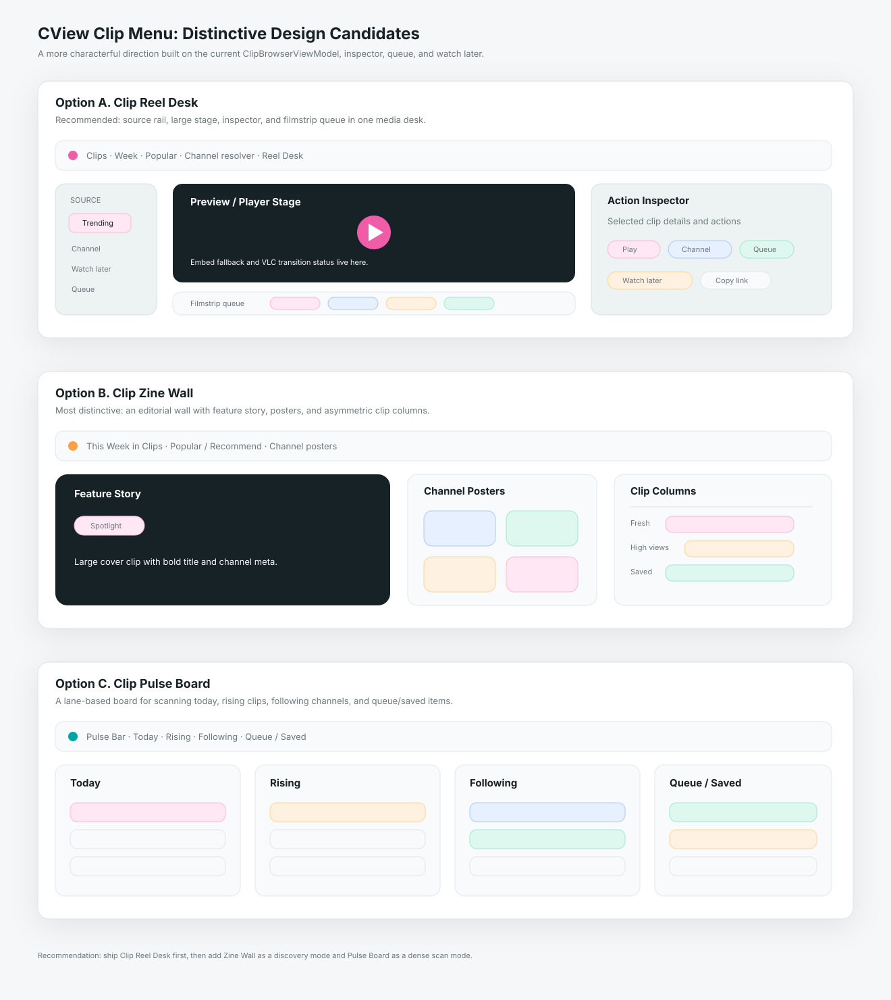

# CView 클립 메뉴 개성형 리디자인 후보 3안 및 개발 계획서

작성일: 2026-04-30  
범위: `PopularClipsView`, `ClipBrowserViewModel`, `ChannelResolver`, `SpotlightClipCard`, `ClipPreviewInspector`, `ClipPlayerView`, 클립 queue/watch later 흐름  
목적: 기존 안정형 클립 메뉴 설계보다 더 개성 있는 후보 3개를 선별하고, 현재 구현 위에서 실제 개발 가능한 계획으로 정리한다.

---

## 0. 결론

추천 순위는 다음이다.

| 순위 | 후보 | 핵심 성격 | 판단 |
|---|---|---|---|
| 1 | **Clip Reel Desk** | 큰 player stage, 하단 filmstrip queue, 좌측 source rail을 가진 편집 데스크형 UI | 기본 추천 |
| 2 | **Clip Zine Wall** | 잡지/포스터처럼 강한 대표 카드와 비대칭 클립 섹션을 쓰는 발견형 UI | 가장 개성 강함 |
| 3 | **Clip Pulse Board** | Today/Rising/Following/Queue를 lane으로 나누는 트렌드 보드형 UI | 정보 밀도와 분석감 강화 |



기본 적용은 **1안 Clip Reel Desk**가 가장 좋다. 이미 현재 클립 메뉴에는 `ClipBrowserViewModel`, `ChannelResolver`, `SpotlightClipCard`, `ClipPreviewInspector`, queue, watch later가 들어와 있다. 다음 단계에서 가장 큰 차이를 만드는 기능은 “카드 클릭 -> sheet 재생”을 “선택 -> stage preview/player -> filmstrip queue”로 바꾸는 것이다. 클립 메뉴는 홈/설정/메트릭보다 더 미디어적인 화면이어도 자연스럽기 때문에, 이 정도의 개성은 앱 컨셉과 충돌하지 않는다.

---

## 1. 현재 구현 기준

2026-04-30 현재 클립 메뉴는 이전보다 이미 개선된 상태다.

| 영역 | 현재 구현 |
|---|---|
| 상태 모델 | `ClipBrowserViewModel`이 trending/channel/selection/queue/watch later 상태를 관리 |
| 채널 입력 | `ChannelResolver`가 channelId와 Chzzk URL을 해석 |
| 채널명 검색 | `searchChannels(keyword:)` 기반 suggestion popover 제공 |
| 팔로잉 선택 | 팔로잉 채널 picker 제공 |
| 대표 카드 | `SpotlightClipCard`가 trending 첫 클립을 크게 표시 |
| 미리보기 | 넓은 창에서 `ClipPreviewInspector` 표시 |
| 큐 | `queueClips`와 queue popover 제공 |
| 나중에 보기 | `watchLaterUIDs`를 `UserDefaults`에 저장 |
| 재생 | `ClipPlayerView` sheet에서 WebView fallback + VLC 전환 처리 |
| 라우트 조회 | `ClipLookupView`가 `ClipPlayerView.swift` 쪽으로 이동됨 |

따라서 이번 문서의 개발 계획은 “기초 기능 추가”가 아니라 다음 단계다.

1. 현재 기능을 더 개성 있는 화면 구조로 재배치한다.
2. sheet 중심 재생을 stage/queue 중심으로 확장한다.
3. `PopularClipsView.swift`의 대형 파일화를 줄이고 클립 전용 컴포넌트 폴더로 분리한다.
4. watch later가 UID만 저장하는 한계를 줄인다.

---

## 2. 개성형 설계 원칙

이번 후보는 이전 `Clip Command Gallery`보다 시각적 정체성을 더 강하게 둔다. 다만 아래 제약은 유지한다.

- `MainContentView`의 `.clips` route는 유지한다.
- 자동재생되는 썸네일 격자는 만들지 않는다.
- 영상은 사용자가 선택한 뒤 stage 또는 sheet에서만 재생한다.
- 장식만 있는 그래픽보다 실제 클립, queue, channel, trend 상태를 보여준다.
- `DesignTokens`를 유지하되 클립 메뉴에만 별도 accent 조합을 허용한다.
- 넓은 창에서 개성이 살아야 하고, 좁은 창에서는 기존 grid/list로 접혀야 한다.
- 구현은 1안부터 하고, 2안/3안은 mode 또는 secondary section으로 흡수한다.

---

## 3. 후보 A: Clip Reel Desk

### 컨셉

클립 메뉴를 “영상 편집 데스크”처럼 만든다. 중앙에는 선택 클립을 크게 보여주는 stage가 있고, 하단에는 filmstrip queue, 좌측에는 source rail, 우측에는 clip inspector/action stack이 있다. 현재 `ClipPreviewInspector`와 queue를 가장 자연스럽게 확장할 수 있는 구조다.

### 레이아웃

```text
┌──────────────────────────────────────────────────────────────┐
│ Top Bar: 클립 · 기간 · 인기/추천 · 채널 resolver · 보기         │
├──────────────┬───────────────────────────────┬───────────────┤
│ Source Rail  │ Player / Preview Stage         │ Inspector     │
│ Trending     │ selected clip                  │ Play          │
│ Channel      │ loading/fallback state          │ Channel       │
│ Watch Later  │                               │ Copy/Queue    │
│ Queue        ├───────────────────────────────┴───────────────┤
│              │ Filmstrip Queue: now · next · saved · related   │
└──────────────┴───────────────────────────────────────────────┘
```

### 개성 포인트

- 클립 메뉴 첫인상이 일반 card grid가 아니라 “작업대”처럼 보인다.
- queue가 popover 뒤에 숨지 않고 filmstrip으로 보인다.
- `SpotlightClipCard`는 stage의 초기 상태로 흡수된다.
- 선택된 클립의 duration/read count/channel을 stage overlay에 배치한다.
- inspector는 현재처럼 우측에 두되 카드보다 더 도구 패널처럼 만든다.

### 현재 코드 매핑

| 디자인 요소 | 현재 코드 활용 |
|---|---|
| Source rail | `ClipBrowser.ClipTab`, watch later, queue 상태 |
| Stage | `SpotlightClipCard`, `ClipPreviewInspector`, 향후 `ClipPlayerStage` |
| Filmstrip | `queueClips`, `watchLaterUIDs`, `trendingClips`, `channelClips` |
| Inspector | `ClipPreviewInspector` |
| Player | `ClipPlayerViewModel`, `ClipPlayerView`에서 stage 분리 |

### 장점

- 개성이 강하지만 기능적으로 납득된다.
- 현재 구현과 연결성이 가장 좋다.
- 클립 메뉴를 앱 안의 독립 미디어 workspace처럼 만들 수 있다.
- queue/watch later의 존재감이 커진다.

### 단점

- `ClipPlayerView`를 embeddable stage로 나누는 작업이 필요하다.
- 좁은 창 fallback 규칙을 꼼꼼히 정의해야 한다.
- stage가 커지면 기존 grid scan 속도가 낮아질 수 있다.

### 추천 적용

이 안을 기본으로 개발한다. 1차에서는 실제 재생 stage까지 가지 않고 `preview stage + filmstrip queue`부터 구현하고, 2차에서 embedded player로 확장하는 방식이 안전하다.

---

## 4. 후보 B: Clip Zine Wall

### 컨셉

클립 메뉴를 “디지털 클립 매거진”처럼 만든다. 큰 대표 클립, 세로형 포스터 카드, 채널 배너, 작은 리스트가 섞인 비대칭 editorial layout이다. 현재 CView의 다른 메뉴보다 훨씬 강한 개성을 줄 수 있다.

### 레이아웃

```text
┌──────────────────────────────────────────────────────────────┐
│ Zine Header: 이번 주 클립 · 인기/추천 · 채널 검색              │
├──────────────────────────────────────────────────────────────┤
│ Feature Story: 큰 대표 클립 1개 + 보조 클립 2개                │
├───────────────────────┬──────────────────────────────────────┤
│ Channel Posters        │ Clip Columns                         │
│ 팔로잉/최근 채널        │ Fresh · Funny · High views · Saved     │
└───────────────────────┴──────────────────────────────────────┘
```

### 개성 포인트

- “카드 격자” 대신 잡지 첫 페이지처럼 보인다.
- 클립 제목과 썸네일의 비주얼 임팩트를 크게 살린다.
- 채널별 클립은 작은 입력 폼이 아니라 channel poster로 표현한다.
- 화면 자체가 더 브랜드 있는 클립 허브처럼 느껴진다.

### 현재 코드 매핑

| 디자인 요소 | 현재 코드 활용/추가 |
|---|---|
| Feature Story | `trendingClips.first`, `SpotlightClipCard` 변형 |
| 보조 클립 | `trendingClips.dropFirst().prefix(2)` |
| Channel Posters | 팔로잉 picker, `channelSuggestions`, `channelClips` |
| Clip Columns | `ClipGridCard`, `ClipListRow`를 editorial card로 확장 |
| Saved column | `watchLaterUIDs` |

### 장점

- 세 후보 중 가장 시각적으로 새롭다.
- 클립 메뉴만의 성격이 매우 분명해진다.
- 사용자가 “둘러보는 재미”를 느끼기 좋다.

### 단점

- 비대칭 layout은 SwiftUI에서 반응형 규칙이 더 까다롭다.
- thumbnail 비율이 제각각일 때 텍스트/카드 높이 관리가 어렵다.
- 정보 밀도는 1안/3안보다 낮아질 수 있다.

### 추천 적용

2안은 기본 화면 전체보다는 `Zine View` 모드로 두는 편이 좋다. 기본은 1안 `Reel Desk`, 대체 보기 모드로 `Zine Wall`을 제공하면 개성과 안정성을 같이 가져갈 수 있다.

---

## 5. 후보 C: Clip Pulse Board

### 컨셉

클립을 “트렌드 신호판”처럼 보여준다. 화면을 `Today`, `Rising`, `Following`, `Queue` lane으로 나누고, 각 lane에 클립을 카드/행으로 정렬한다. 미디어 감성은 1안/2안보다 약하지만, 정보 구조가 강하고 빠르게 스캔할 수 있다.

### 레이아웃

```text
┌──────────────────────────────────────────────────────────────┐
│ Pulse Bar: 기간 · 인기/추천 · 채널 · 저장됨 · 큐                │
├──────────────┬──────────────┬──────────────┬───────────────┤
│ Today         │ Rising        │ Following    │ Queue / Saved  │
│ top clips     │ high velocity │ channel clips│ next clips     │
│ fresh clips   │ high views    │ recent       │ watch later    │
└──────────────┴──────────────┴──────────────┴───────────────┘
```

### 개성 포인트

- 일반 grid가 아니라 lane board로 보인다.
- 클립을 “목록”보다 “흐름”으로 인식하게 한다.
- queue/watch later가 보조 기능이 아니라 하나의 lane으로 승격된다.
- 메트릭 메뉴처럼 무겁지 않으면서도 트렌드 감각을 준다.

### 현재 코드 매핑

| 디자인 요소 | 현재 코드 활용/추가 |
|---|---|
| Today lane | `TrendingFilter.today` |
| Rising lane | `TrendingOrder.recommend` 또는 readCount/date 기반 로컬 score |
| Following lane | 팔로잉 picker + `channelClips` |
| Queue/Saved lane | `queueClips`, `watchLaterUIDs` |
| Lane card | `ClipListRow` compact 변형 |

### 장점

- 정보 밀도가 높다.
- queue/watch later가 눈에 잘 들어온다.
- 넓은 macOS 창에서 잘 맞는다.
- 기본 grid보다 훨씬 개성 있지만 구현은 2안보다 예측 가능하다.

### 단점

- 진짜 rising 데이터를 API가 주지 않으므로 로컬 score가 필요하다.
- 각 lane의 데이터가 부족하면 화면이 비어 보일 수 있다.
- 미디어 몰입감은 1안보다 약하다.

### 추천 적용

3안은 `Pulse View` 또는 `Board View`로 두면 좋다. 운영/탐색 성격의 사용자는 좋아할 수 있지만, 클립 메뉴의 기본 첫 화면은 1안이 더 직관적이다.

---

## 6. 최종 권장 구조

최종 구조는 다음 순서가 좋다.

| 단계 | 적용 디자인 | 이유 |
|---|---|---|
| 1차 | Clip Reel Desk | 현재 구현을 가장 적게 버리면서 화면 정체성을 크게 강화 |
| 2차 | Clip Zine Wall view mode | 더 개성 있는 둘러보기 모드 제공 |
| 3차 | Clip Pulse Board view mode | 저장/큐/트렌드 스캔용 고밀도 모드 제공 |

권장 UI mode:

```text
ClipWorkspace
├── Reel Desk   기본
├── Zine Wall   발견형
└── Pulse Board 스캔형
```

기본 `grid/list` toggle은 완전히 없애지 말고, `Reel Desk` 안의 목록 표시 옵션으로 흡수한다.

---

## 7. 기능 개발 계획서

### Phase 0. 현재 구현 정리

목표: 이미 들어간 기능을 보존하면서 개성형 화면을 얹을 수 있게 파일 구조를 정리한다.

작업:

1. `PopularClipsView.swift`를 `Views/Clips/` 하위 컴포넌트로 나눈다.
2. `ClipBrowserViewModel`을 별도 파일로 이동한다.
3. `ChannelResolver`를 별도 파일로 이동하고 테스트를 추가한다.
4. `SpotlightClipCard`, `ClipPreviewInspector`, queue/watch later popover를 별도 파일로 이동한다.
5. 기존 `.clips` route와 `PopularClipsView()` 진입점은 유지한다.

산출물:

- `ClipWorkspace.swift`
- `ClipBrowserViewModel.swift`
- `ChannelResolver.swift`
- `ClipPreviewInspector.swift`

### Phase 1. Reel Desk 기본 화면

목표: 첫 화면을 `Reel Desk` 구조로 바꾼다.

작업:

1. `ClipWorkspaceMode`를 추가한다. 초기값은 `.reelDesk`.
2. 좌측 `ClipSourceRail`을 만든다.
3. 중앙 `ClipStagePreview`를 만든다.
4. 우측 `ClipActionInspector`는 현재 `ClipPreviewInspector`를 확장한다.
5. 하단 `ClipFilmstripQueue`를 만든다.
6. 카드 click은 바로 sheet가 아니라 stage preview 선택으로 연결한다.
7. `재생` 버튼은 기존 sheet 재생을 호출한다.

검증:

- 900px 이하에서는 source rail과 inspector가 접히는지
- stage에 선택 클립이 없을 때 trending 첫 클립을 보여주는지
- queue/watch later 상태가 filmstrip에 반영되는지

### Phase 2. Embedded Player Stage

목표: sheet 반복 재생을 줄이고 Reel Desk 안에서 클립을 볼 수 있게 한다.

작업:

1. `ClipPlayerView`에서 playback chrome을 분리해 `ClipPlayerStage`를 만든다.
2. `ClipPlayerViewModel`은 sheet와 embedded stage에서 공유 가능하게 유지한다.
3. WebView fallback 표시, VLC 전환, 종료/오류 overlay를 stage에서도 처리한다.
4. queue의 다음 클립 이동을 stage에 연결한다.
5. 자동 다음 재생은 기본 off로 둔다.

검증:

- sheet 재생 기존 동작 유지
- embedded stage에서 WebView fallback 종료 시 메모리 해제
- 다음 클립 이동 시 이전 player stop이 확실한지

### Phase 3. Zine Wall 보기 모드

목표: 가장 개성 있는 editorial browsing mode를 추가한다.

작업:

1. `ClipWorkspaceMode.zineWall`을 추가한다.
2. `ZineFeatureStory`를 만든다.
3. `ZineSupportCards`를 만든다.
4. `ChannelPosterRail`을 만든다.
5. `ZineClipColumn`을 만든다.
6. thumbnail 비율이 깨지지 않도록 카드 높이와 aspect ratio를 고정한다.

검증:

- 긴 클립 제목에서 카드가 깨지지 않는지
- 900px 이하에서 linear list로 fallback 되는지
- motion reduce 환경에서 transition이 과하지 않은지

### Phase 4. Pulse Board 보기 모드

목표: 트렌드/저장/큐를 빠르게 스캔하는 lane board를 만든다.

작업:

1. `ClipWorkspaceMode.pulseBoard`를 추가한다.
2. `ClipLane` 모델을 만든다.
3. Today/Rising/Following/Queue lane을 만든다.
4. Rising score는 `readCount`, `createdDate`, source를 조합한 로컬 점수로 시작한다.
5. 각 lane이 비었을 때 compact empty state를 둔다.
6. drag reorder는 1차에서 제외하고 queue reorder만 후순위로 둔다.

검증:

- 한 lane만 데이터가 있어도 화면이 빈약하지 않은지
- lane 가로 스크롤과 앱 전체 스크롤이 충돌하지 않는지
- queue lane의 중복 제거가 유지되는지

### Phase 5. 저장 데이터 개선

목표: `watchLaterUIDs`만 저장하는 현재 구조를 사용자 경험에 맞게 보강한다.

작업:

1. `SavedClipSnapshot` 모델을 만든다.
2. UID, title, thumbnailURL, channelId, channelName, duration, readCount, savedAt을 저장한다.
3. 기존 `watchLaterUIDs`는 migration으로 snapshot에 흡수한다.
4. queue는 session-only로 유지하되, 사용자가 원하면 저장 queue로 전환할 수 있게 한다.

검증:

- 앱 재시작 후 나중에 보기 목록에 title/thumbnail이 남는지
- 없는 thumbnail URL일 때 placeholder fallback이 안정적인지
- 기존 UID-only 데이터가 손실되지 않는지

---

## 8. 구현 우선순위

| 우선순위 | 항목 | 이유 |
|---|---|---|
| P0 | 파일 구조 분리 | 현재 한 파일에 ViewModel/Resolver/UI가 집중됨 |
| P0 | Reel Desk preview stage | 가장 큰 시각 변화와 사용성 개선 |
| P1 | Filmstrip queue | 개성형 UI의 핵심이자 현재 queue 기능의 자연스러운 확장 |
| P1 | Embedded player stage | sheet 반복 흐름을 줄임 |
| P2 | Zine Wall mode | 가장 개성 강한 발견형 모드 |
| P2 | SavedClipSnapshot | 나중에 보기 기능의 완성도 개선 |
| P3 | Pulse Board mode | 고급 탐색/스캔 모드 |

---

## 9. 권장 파일 구조

```text
Sources/CViewApp/Views/Clips/
├── ClipWorkspace.swift
├── ClipSourceRail.swift
├── ClipStagePreview.swift
├── ClipFilmstripQueue.swift
├── ClipActionInspector.swift
├── ClipZineWallView.swift
├── ClipPulseBoardView.swift
├── ClipQueuePopover.swift
├── ClipWatchLaterPopover.swift
├── ClipPlayerStage.swift
└── ClipLookupView.swift

Sources/CViewApp/ViewModels/
└── ClipBrowserViewModel.swift

Sources/CViewCore/Models/
├── ClipModels.swift
└── SavedClipSnapshot.swift
```

---

## 10. 최종 추천

이번 요청의 방향은 “더 개성 있는 클립 메뉴”이므로, 단순히 기존 gallery를 예쁘게 다듬는 수준보다 **Clip Reel Desk**로 가는 것이 맞다. CView의 클립 메뉴는 짧은 미디어를 탐색하고 재생하는 화면이라 다른 메뉴보다 강한 시각 언어를 가져도 된다.

개발 순서는 `Reel Desk 기본 화면 -> embedded player stage -> Zine Wall -> SavedClipSnapshot -> Pulse Board`가 가장 현실적이다. 이 순서면 기존 구현을 버리지 않고도 클립 메뉴만의 독립적인 성격을 만들 수 있다.
