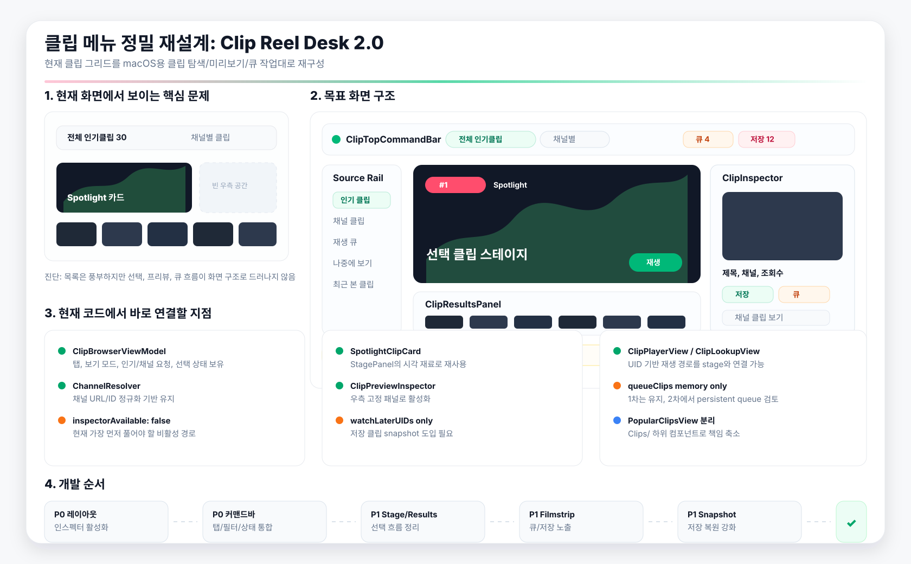

# CView 클립 메뉴 정밀 재설계 및 리디자인 사양서

- 작성일: 2026-04-30
- 대상 화면: 클립 메뉴
- 기준 자료: 현재 클립 메뉴 스크린샷, `Sources/CViewApp/Views/PopularClipsView.swift`, `Sources/CViewApp/Views/ClipPlayerView.swift`
- 산출물: 최종 권장 디자인 1안, 기능 재구성 계획, 구현 단계, 검증 기준



## 0. 결론

현재 클립 메뉴는 이미 `인기 클립`, `채널별 클립`, `채널 입력/추천`, `큐`, `나중에 보기`, `프리뷰 인스펙터`, `클립 플레이어`의 기능 재료를 상당히 갖고 있다. 문제는 기능 부족보다 **화면 구조가 기능의 우선순위를 보여주지 못하고, 일부 기능이 팝오버나 비활성 경로에 숨어 있는 것**이다.

최종 권장안은 **Clip Reel Desk 2.0**이다. 홈/라이브/검색과 동일하게 macOS 데스크톱 앱의 넓은 화면을 활용하되, 단순 카드 그리드가 아니라 `탐색 -> 선별 -> 미리보기 -> 재생/저장/큐`의 흐름을 한 화면 안에서 완결한다.

핵심 변경은 다음 5가지다.

1. `전체 인기클립 / 채널별 클립` 탭을 화면 상단의 긴 탭바가 아니라, 상태와 필터가 붙은 **클립 커맨드바**로 재구성한다.
2. 현재 좌측에만 붙어 있는 Spotlight 카드를 중앙의 **클립 스테이지**로 승격한다.
3. 코드에 이미 있는 `ClipPreviewInspector`를 실제 레이아웃에 연결해 **우측 인스펙터**를 활성화한다.
4. `재생 큐`와 `나중에 보기`를 작은 팝오버 버튼에서 끝내지 않고, 화면 하단의 **Filmstrip Dock**으로 노출한다.
5. `PopularClipsView.swift`의 거대한 단일 파일 구조를 `Clips/` 하위 컴포넌트와 ViewModel 파일로 분리한다.

## 1. 현재 화면 정밀 진단

### 1.1 스크린샷 기준 UI 문제

| 영역 | 현재 상태 | 문제 | 리디자인 방향 |
|---|---|---|---|
| 상단 탭 | `전체 인기클립 30`, `채널별 클립`이 넓은 상단에 분산됨 | 탭이 화면 구조를 지배하지 못하고, 필터/상태/액션과 연결이 약함 | `탐색 소스 + 기간/정렬 + 상태 + 액션`을 한 줄로 묶는 커맨드바 |
| Spotlight | 좌측 상단에 큰 대표 카드가 있음 | 오른쪽 대부분이 빈 공간으로 남아 넓은 macOS 화면을 활용하지 못함 | 선택/대표 클립을 중앙 스테이지로 배치하고 우측 인스펙터와 연결 |
| 클립 그리드 | 촘촘한 카드 벽 형태 | 많은 항목을 볼 수는 있지만 위계가 약하고, 선택 상태가 보이지 않음 | `대표/최근/채널/큐` 섹션과 선택 강조를 적용 |
| 큐/나중에 보기 | 상단 아이콘 팝오버 중심 | 주요 작업 흐름인데 보조 기능처럼 보임 | 하단 Filmstrip Dock으로 승격, 팝오버는 보조 유지 |
| 채널별 클립 | 탭 전환 후 접근 | 현재 화면에서 채널 탐색 흐름이 보이지 않음 | Source Rail 또는 커맨드바 안에 채널 선택 상태를 지속 표시 |
| 미리보기 | 스크린샷에서 보이지 않음 | 카드 클릭 후 즉시 재생인지 미리보기인지 예측하기 어려움 | 우측 인스펙터로 선택 클립의 상세/액션을 고정 제공 |

### 1.2 현재 코드 기준 기능 상태

| 코드 위치 | 확인 내용 | 판단 |
|---|---|---|
| `PopularClipsView.swift:16` | `ClipTab`은 `전체 인기클립`, `채널별 클립` 2개 | 소스 구조는 단순하고 유지 가능 |
| `PopularClipsView.swift:95` | `ChannelResolver`가 URL/ID 입력을 정규화 | 기능적으로 좋은 기반 |
| `PopularClipsView.swift:145` | `ClipBrowserViewModel`이 탭, 보기 모드, 인기/채널 상태를 관리 | ViewModel 분리는 이미 시작됨 |
| `PopularClipsView.swift:176` | `selectedClip`, `previewClip` 상태 존재 | 프리뷰/재생 분리 기반이 있음 |
| `PopularClipsView.swift:183` | `watchLaterUIDs`, `queueClips` 존재 | 저장/큐 기능은 있으나 표현과 지속성 개선 필요 |
| `PopularClipsView.swift:305` | `handleClipTap(_:inspectorAvailable:)`가 인스펙터 여부에 따라 동작 | 반응형 레이아웃 연결만 되면 UX 개선 가능 |
| `PopularClipsView.swift:482` | `trendingContent(inspectorAvailable: false)`로 고정 | 현재 렌더링 경로에서는 인스펙터가 사실상 비활성 |
| `PopularClipsView.swift:485` | `channelContent(inspectorAvailable: false)`로 고정 | 채널 화면도 동일하게 인스펙터 미사용 |
| `PopularClipsView.swift:881` | 큐 버튼은 팝오버 중심 | 기능은 있으나 주 작업 흐름에서 숨겨짐 |
| `PopularClipsView.swift:1033` | 나중에 보기는 현재 메모리에 로드된 클립에서만 복원 | UID만 저장하므로 앱 재시작/목록 미로드 상황에 취약 |
| `PopularClipsView.swift:1501` | `SpotlightClipCard` 존재 | 대표 카드 디자인 재료는 좋음 |
| `PopularClipsView.swift:1722` | `ClipPreviewInspector` 존재 | 우측 패널로 활성화할 가치가 높음 |
| `ClipPlayerView.swift:842` | `ClipLookupView`가 별도 클립 UID 재생을 지원 | 스테이지/딥링크/인스펙터 재생에 활용 가능 |

## 2. 최종 리디자인 콘셉트: Clip Reel Desk 2.0

### 2.1 목표

Clip Reel Desk 2.0은 클립 메뉴를 “짧은 영상 목록”이 아니라 **클립 작업대**로 만든다. 사용자는 인기 클립을 훑고, 채널별 클립으로 좁히고, 한 클립을 미리 보고, 바로 재생하거나 저장/큐에 넣는 과정을 화면 이동 없이 처리한다.

### 2.2 유지할 것

- 좌측 앱 사이드바와 `홈 / 라이브 / 카테고리 / 검색 / 클립`의 큰 내비게이션 구조
- `전체 인기클립`, `채널별 클립`이라는 현재 정보 구조
- 현재 `ClipBrowserViewModel`이 가진 API 요청, 요청 토큰, 채널 입력 정규화
- `SpotlightClipCard`, `ClipPreviewInspector`, `ClipPlayerView`, `ClipLookupView`의 기본 기능
- 현재 디자인 토큰과 앱의 밝은 macOS 톤

### 2.3 바꿀 것

- 상단 탭 중심 구조를 `ClipTopCommandBar`로 교체
- 목록의 첫 번째 클립만 커지는 구조를 `ClipStagePanel` 중심 구조로 변경
- 카드 클릭 동작을 폭에 따라 `인스펙터 미리보기` 또는 `재생 시트`로 분기
- 큐/나중에 보기 팝오버를 유지하되 `Filmstrip Dock`으로 상시 노출
- 채널 입력을 단순 텍스트 필드가 아니라 `채널 소스 선택 상태`로 시각화
- `PopularClipsView.swift`를 기능 단위 파일로 분리

## 3. 화면 구조 사양

### 3.1 레이아웃 개요

```text
┌──────────────────────────────────────────────────────────────────────────────┐
│ ClipTopCommandBar                                                            │
│ Source segmented | 기간/정렬 | 채널 입력/선택 상태 | 보기 | 큐 | 저장        │
├──────────────┬──────────────────────────────────────────────┬────────────────┤
│ Source Rail   │ Clip Stage + Results                         │ Inspector      │
│ Trending      │ 선택/대표 클립 스테이지                       │ 미리보기       │
│ Channel       │ 클립 결과 그리드/리스트                       │ 액션/메타      │
│ Queue         │ 섹션 헤더, 선택 상태, 무한 스크롤              │ 관련 채널      │
│ Saved         │                                                │                │
├──────────────┴──────────────────────────────────────────────┴────────────────┤
│ Filmstrip Dock: 지금 볼 클립 / 재생 큐 / 나중에 보기                         │
└──────────────────────────────────────────────────────────────────────────────┘
```

### 3.2 `ClipTopCommandBar`

상단은 더 이상 넓은 탭바가 아니라 화면의 조작 중심이다.

구성:

- 좌측: `클립` 타이틀, 현재 소스 상태, 로드된 항목 수
- 중앙: `전체 인기클립 / 채널별 클립` segmented control
- 인기 모드: `오늘 / 이번 주 / 이번 달`, `인기순 / 추천순`
- 채널 모드: 채널 입력 필드, 추천 목록, 선택된 채널 칩, `인기순 / 최신순`
- 우측: 그리드/리스트 전환, 큐, 나중에 보기, 새로고침

디자인 규칙:

- 높이 56-64pt
- 배경은 `surfaceBase` 또는 아주 옅은 material
- 현재 스크린샷의 긴 초록 라인은 유지하되, 선택 모드 진행선처럼 얇고 짧게 사용
- 탭 텍스트만 중앙에 흩어지지 않도록 모든 상태를 한 줄에 묶음

### 3.3 `Source Rail`

넓은 화면에서만 보이는 보조 소스 레일이다. 현재 사이드바와 중복되지 않도록 앱 메뉴가 아니라 클립 내부 소스만 다룬다.

항목:

- 인기 클립
- 채널 클립
- 재생 큐
- 나중에 보기
- 최근 본 클립

역할:

- 현재 탭의 의미를 시각적으로 고정
- 큐/저장 목록을 팝오버 밖으로 끌어냄
- 채널별 클립 진입점을 항상 보이게 함

### 3.4 `ClipStagePanel`

현재 Spotlight 카드를 확장한 중심 영역이다.

상태:

- 선택 클립이 없으면 인기 1위 또는 최근 선택 클립 표시
- 카드 클릭 시 넓은 화면에서는 `previewClip`을 갱신하고 스테이지/인스펙터 동시 갱신
- `재생`, `큐에 추가`, `나중에 보기`, `채널 클립 보기`, `원본 열기`를 직접 제공

시각:

- 16:9 미디어 썸네일
- 하단에는 제목, 채널, 조회수, 업로드 시점
- 너무 큰 hero가 아니라 결과 목록과 함께 보는 300-380pt 높이의 작업대형 스테이지

### 3.5 `ClipResultsPanel`

기존 클립 그리드는 유지하되 선택과 섹션을 강화한다.

그리드 모드:

- 카드 최소 폭 180-220pt
- 넓은 화면에서도 무한히 펼치지 않고 중앙 컬럼 최대 폭을 제한
- 선택된 카드에는 1px accent border와 좌상단 작은 상태점 표시
- duration, rank, channel badge는 썸네일 위에 유지

리스트 모드:

- 썸네일 120x68pt
- 제목 2줄
- 채널/조회수/업로드 시점
- 우측 액션: 재생, 저장, 큐

섹션:

- 인기 모드: `Spotlight`, `상승 중`, `전체 클립`
- 채널 모드: `선택 채널`, `최신 업로드`, `인기 클립`
- 저장/큐 모드: `다음 재생`, `나중에 보기`

### 3.6 `ClipInspectorPanel`

코드에 이미 있는 `ClipPreviewInspector`를 우측 패널로 활성화한다.

표시 조건:

- 화면 폭이 1280pt 이상이면 우측 고정 패널
- 900-1279pt에서는 필요 시 drawer
- 900pt 미만에서는 bottom sheet 또는 기존 재생 sheet 우선

내용:

- 썸네일 프리뷰
- 제목, 채널, 조회수, 업로드 날짜, duration
- 주요 액션: 재생, 채널 클립 보기, 큐 추가/제거, 나중에 보기, 링크 복사, 원본 열기
- 같은 채널의 다른 클립 3-5개
- 현재 선택 클립이 큐/저장에 포함되어 있는지 명확히 표시

### 3.7 `Filmstrip Dock`

큐와 나중에 보기를 하단의 얇은 도크로 만든다.

구성:

- 좌측: `지금 선택한 클립`
- 중앙: `재생 큐` 가로 썸네일
- 우측: `나중에 보기` 최근 저장 3개와 전체 열기

규칙:

- 큐가 비어 있으면 높이를 44pt까지 축소
- 큐가 있으면 84-104pt
- 팝오버는 상세 관리용으로 유지
- `queueClips`가 메모리 전용인 현재 구조는 1차에서는 유지하고, 2차에서 snapshot 저장으로 확장

## 4. 반응형 폭 규칙

| 폭 | 구조 | 인스펙터 | 큐/저장 |
|---|---|---|---|
| 1440pt 이상 | Source Rail + Stage/Results + Inspector + Filmstrip | 우측 고정 340-380pt | 하단 도크 상시 |
| 1100-1439pt | Stage/Results + Inspector | 우측 고정 320pt | 하단 도크 축소 |
| 760-1099pt | Stage + Results | drawer/sheet | 하단 미니 도크 |
| 760pt 미만 | 리스트 우선 | 재생 sheet 우선 | 상단 버튼 + sheet |

구현 메모:

- 현재 `inspectorMinWidth = 1180`, `inspectorWidth = 330` 계열 상수를 실제 `GeometryReader` 결과에 연결한다.
- `inspectorAvailable`을 `false`로 고정하지 않고 `proxy.size.width >= inspectorMinWidth`로 계산한다.
- 좁은 화면에서 카드 클릭은 기존처럼 `selectedClip` 재생 sheet로 연결한다.

## 5. 기능 재설계 계획

### 5.1 인스펙터 활성화

현재 가장 큰 즉시 개선 지점이다.

작업:

- `PopularClipsView.body`에 `GeometryReader` 또는 별도 `ClipWorkspaceLayout` 추가
- 넓은 화면에서는 `trendingContent(inspectorAvailable: true)` 또는 계산값 전달
- `vm.previewClip`이 있으면 `ClipPreviewInspector` 표시
- `previewClip == nil`이면 첫 번째 인기 클립 또는 선택 채널의 첫 클립을 placeholder preview로 표시

완료 기준:

- 스크린샷과 같은 넓은 창에서 카드 클릭 시 재생 sheet가 바로 뜨지 않고 우측 인스펙터가 갱신된다.
- 인스펙터의 `재생` 버튼을 눌렀을 때만 `ClipPlayerView`가 열린다.

### 5.2 저장 클립 snapshot 도입

현재 `watchLaterUIDs`만 저장하면 앱 재시작 후 해당 클립이 현재 목록에 없을 때 카드 정보를 복원할 수 없다.

새 모델:

```swift
struct SavedClipSnapshot: Codable, Identifiable, Hashable {
    let id: String
    let clipUID: String
    let title: String
    let thumbnailURL: URL?
    let channelID: String?
    let channelName: String?
    let duration: Int?
    let readCount: Int?
    let savedAt: Date
}
```

작업:

- `watchLaterUIDs`는 중복 방지 인덱스로 유지
- `savedClipSnapshots`를 `UserDefaults` 또는 앱 로컬 저장소에 추가
- `collectWatchLaterClips()`는 snapshot 기반으로 fallback 표시
- 추후 서버 저장으로 확장 가능하게 repository 분리

완료 기준:

- 앱 재시작 후 인기/채널 목록을 불러오지 않아도 저장 클립 목록에 제목/썸네일이 보인다.

### 5.3 큐를 1급 기능으로 승격

현재 `queueClips`는 메모리 배열이며 popover에서만 관리된다. 재설계에서는 하단 Filmstrip Dock이 큐의 기본 UI가 된다.

작업:

- 큐 추가/제거 버튼을 모든 카드/인스펙터/스테이지에 동일하게 배치
- 큐 도크에서 순서 변경, 삭제, 모두 비우기, 다음 재생 제공
- `nextQueuedClip(after:)`를 플레이어 종료/다음 버튼과 연결할 준비
- 1차는 메모리 유지, 2차에서 `ClipQueueSnapshot` 저장 검토

완료 기준:

- 사용자가 현재 목록을 떠나지 않고도 다음에 볼 클립들을 확인할 수 있다.

### 5.4 채널별 클립 흐름 개선

현재 URL/ID 입력과 채널명 검색 기반은 좋다. 리디자인은 입력 이후 상태를 강화한다.

작업:

- 채널 선택 후 `선택된 채널 칩` 표시
- 칩에 채널 이미지, 이름, ID 일부, 변경 버튼 제공
- 검색 실패/입력 오류는 toolbar 아래 inline status로 표시
- `채널별 클립` 탭을 누르면 빈 화면 대신 최근 선택 채널 또는 추천 입력 상태를 표시

완료 기준:

- 사용자가 URL/ID/이름 중 무엇을 입력했는지와 어떤 채널로 resolve 되었는지 화면에서 즉시 알 수 있다.

### 5.5 플레이어와 스테이지 연결

`ClipLookupView`가 이미 UID 기반 재생을 지원하므로 스테이지와 인스펙터에서 같은 재생 경로를 쓰도록 정리한다.

작업:

- 1차: 기존 sheet `ClipPlayerView(clip:)` 유지
- 2차: 넓은 화면에서 stage 안에 embedded player 옵션 검토
- 3차: 큐의 `다음 클립`과 플레이어 종료 이벤트 연결

완료 기준:

- 클립 클릭, 인스펙터 재생, 큐 재생, 딥링크 재생이 같은 플레이어 상태 모델로 수렴한다.

## 6. 구현 구조 제안

현재 `PopularClipsView.swift`는 화면, ViewModel, resolver, 카드, popover, inspector가 한 파일에 모여 있다. 다음 구조로 분리한다.

```text
Sources/CViewApp/Views/Clips/
├── PopularClipsView.swift              // route entry, environment, sheet
├── ClipBrowserViewModel.swift           // state, API request, queue/save actions
├── ClipBrowserTypes.swift               // ClipTab, ViewMode, SortOrder, filters
├── ChannelResolver.swift                // channel URL/ID parsing
├── Components/
│   ├── ClipTopCommandBar.swift
│   ├── ClipSourceRail.swift
│   ├── ClipStagePanel.swift
│   ├── ClipResultsPanel.swift
│   ├── ClipCard.swift
│   ├── ClipRow.swift
│   ├── ClipPreviewInspector.swift
│   └── ClipFilmstripDock.swift
└── Persistence/
    ├── SavedClipSnapshot.swift
    └── ClipLibraryStore.swift
```

분리 원칙:

- API 요청과 UI 이벤트는 `ClipBrowserViewModel`에 유지
- 카드/행/인스펙터는 순수 View에 가깝게 유지
- 저장/큐 지속성은 별도 store로 이동
- 기존 public 진입점 `PopularClipsView`의 이름은 유지해 라우팅 변경을 최소화

## 7. 개발 단계

### Phase 1. 레이아웃 골격 및 인스펙터 활성화

우선순위: P0

작업:

- `ClipWorkspaceLayout` 추가
- 폭 기준으로 `inspectorAvailable` 계산
- 기존 `ClipPreviewInspector`를 우측 패널에 배치
- 선택 카드 강조 상태 추가
- 스크린샷의 빈 우측 공간을 인스펙터/스테이지로 채움

검증:

- 1440pt 이상 창에서 카드 클릭 시 우측 인스펙터 표시
- 900pt 이하 창에서 기존 재생 sheet 흐름 유지

### Phase 2. 상단 커맨드바 재구성

우선순위: P0

작업:

- 기존 `toolbar`, `tabBar`, `trendingControls`, `channelControls`를 `ClipTopCommandBar`로 병합
- 로딩/오류/총 개수 상태를 커맨드바 안에 표시
- 채널 선택 칩 추가

검증:

- 인기/채널 전환, 기간/정렬 변경, 보기 모드 변경이 한 영역에서 가능
- 상단이 스크린샷처럼 넓은 빈 탭바로 보이지 않음

### Phase 3. Stage + Results 정리

우선순위: P1

작업:

- `SpotlightClipCard`를 `ClipStagePanel`로 확장
- 결과 목록은 `ClipResultsPanel`로 분리
- grid/list 카드의 액션 위치 통일
- 선택된 클립의 stage/inspector 동기화

검증:

- 첫 진입 시 대표 클립이 명확히 보임
- 카드 클릭 후 stage와 inspector가 같은 클립을 표시

### Phase 4. Filmstrip Dock 및 큐 UX 개선

우선순위: P1

작업:

- `ClipFilmstripDock` 추가
- 큐 썸네일 가로 스크롤
- `나중에 보기` 최근 저장 노출
- popover는 상세 목록으로 유지

검증:

- 큐에 1개 이상 추가하면 하단 도크가 확장됨
- 도크에서 클립 재생/삭제 가능

### Phase 5. 저장 snapshot 도입

우선순위: P1

작업:

- `SavedClipSnapshot`, `ClipLibraryStore` 추가
- 기존 `watchLaterUIDs`와 마이그레이션 경로 마련
- 앱 재시작 후 저장 목록 복원

검증:

- 현재 목록에 없는 저장 클립도 제목/썸네일 fallback이 표시됨

### Phase 6. 파일 분리와 테스트

우선순위: P2

작업:

- `PopularClipsView.swift` 컴포넌트 분리
- `ChannelResolver` 단위 테스트
- `SavedClipSnapshot` encode/decode 테스트
- ViewModel 요청 토큰 stale result 테스트

검증:

- 기능 회귀 없이 파일 크기와 책임이 줄어듦
- 탭 전환/채널 검색/무한 스크롤/큐/저장이 서로 상태를 덮어쓰지 않음

## 8. 세부 UX 규칙

### 8.1 카드 클릭 규칙

| 조건 | 동작 |
|---|---|
| 인스펙터 가능 폭 | `previewClip` 갱신, 우측 인스펙터 표시 |
| 인스펙터 불가능 폭 | 기존처럼 `selectedClip` sheet 재생 |
| 카드의 명시적 재생 버튼 | 폭과 관계없이 재생 |
| 카드의 저장/큐 버튼 | 재생하지 않고 상태만 토글 |

### 8.2 로딩/오류 규칙

- 인기 클립 로딩: Stage skeleton + 결과 skeleton 8개
- 채널 클립 로딩: 선택 채널 칩은 유지하고 결과만 skeleton
- 채널 입력 오류: toolbar 아래 32pt inline warning
- 네트워크 오류: 결과 영역에 재시도 버튼, 기존 데이터가 있으면 유지

### 8.3 선택 상태 규칙

- `previewClip`이 현재 선택 상태
- 선택 카드: accent border + 배경 2-4% tint
- Stage와 Inspector가 같은 클립을 표시해야 함
- 선택 클립이 큐/저장에 들어 있으면 모든 버튼 상태가 동기화되어야 함

## 9. 디자인 토큰 방향

기존 CView의 밝고 얇은 macOS 앱 톤을 유지한다.

| 항목 | 권장 |
|---|---|
| 배경 | `surfaceBase`, `surfaceElevated`, 아주 약한 material |
| 강조색 | chzzk green은 상태/선택, pink/orange는 큐/저장 보조 |
| radius | 카드 8-10pt, 큰 panel 10-12pt 이하 |
| border | 0.5-1px hairline |
| shadow | 썸네일/스테이지에만 약하게 |
| typography | 카드 제목 12-13pt, stage 제목 18-22pt, toolbar 12-13pt |

피해야 할 것:

- 화면 전체를 카드로 감싸는 중첩 카드 구조
- 장식용 큰 gradient blob
- 클립 그리드를 무한히 넓게 펼쳐 밀도를 깨는 레이아웃
- 큐/저장 같은 핵심 행동을 아이콘만 있는 팝오버에 숨기는 구조

## 10. 완료 기준

리디자인 구현은 다음 상태를 만족해야 완료로 본다.

- 넓은 창에서 현재 스크린샷의 우측 빈 공간이 스테이지/인스펙터로 사용된다.
- `PopularClipsView.swift:482`, `PopularClipsView.swift:485`의 `inspectorAvailable: false` 고정이 제거된다.
- 카드 클릭과 재생 버튼의 동작이 분리된다.
- 큐와 나중에 보기가 화면 안에서 항상 현재 상태를 보여준다.
- 채널 URL/ID/이름 입력 후 선택된 채널이 칩으로 명확히 남는다.
- 앱 재시작 후 저장 클립이 UID만 남는 문제가 해결된다.
- `PopularClipsView.swift`가 route entry 수준으로 줄고, 클립 컴포넌트가 `Views/Clips/` 아래로 분리된다.

## 11. 첫 구현 패치 범위 제안

첫 패치는 과하게 넓히지 않고 다음만 처리하는 것이 좋다.

1. `ClipWorkspaceLayout` 또는 `GeometryReader` 기반 레이아웃 추가
2. `inspectorAvailable` 계산값 연결
3. `ClipPreviewInspector` 우측 패널 활성화
4. 선택 카드 강조
5. 빈 우측 공간을 줄이는 stage/results 최대 폭 조정

이 범위는 서버 API, 플레이어 엔진, 저장 모델을 건드리지 않으면서도 현재 스크린샷에서 가장 크게 보이는 구조 문제를 바로 개선한다.
