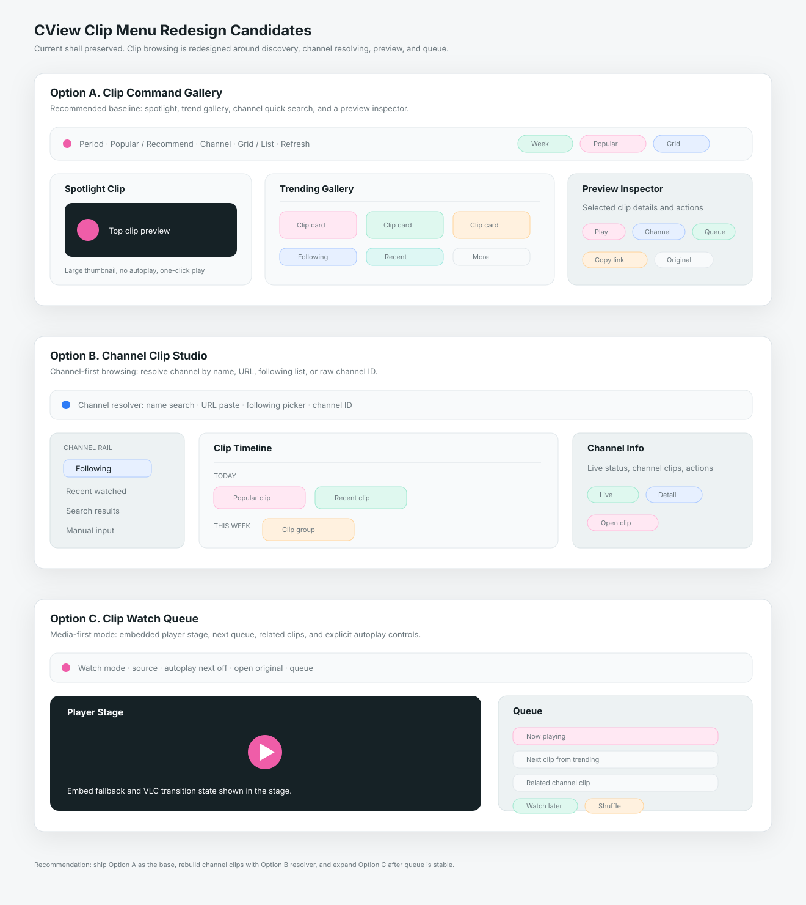

# CView 클립 메뉴 리디자인 후보 3안 및 기능 개발 계획서

작성일: 2026-04-29  
범위: `MainContentView`의 클립 route, `PopularClipsView`, `PopularClipCards`, `ClipPlayerView`, `ClipPlayerViewModel`, `ClipModels`, Chzzk 클립 API  
목적: 클립 메뉴를 새롭게 다시 만들 때 선택할 수 있는 디자인 3개를 선별하고, 기능 구현 계획을 개발 단위로 정리한다.

---

## 0. 결론

추천 순위는 다음이다.

| 순위 | 후보 | 핵심 성격 | 판단 |
|---|---|---|---|
| 1 | **Clip Command Gallery** | 인기/추천/채널 클립을 하나의 탐색 갤러리와 우측 preview inspector로 정리 | 기본 추천 |
| 2 | **Channel Clip Studio** | 특정 채널의 클립을 검색, 정렬, 타임라인으로 보는 채널 중심 탐색 도구 | 팔로잉/채널 분석 사용자에게 적합 |
| 3 | **Clip Watch Queue** | 클립을 연속 시청하고 저장/공유/다음 클립으로 넘기는 미디어 플레이리스트형 화면 | 시청 몰입 모드로 적합 |



기본 적용은 **1안 Clip Command Gallery**가 가장 안전하다. 현재 클립 메뉴는 이미 `전체 인기클립`, `채널별 클립`, 기간 필터, 추천순/인기순, 그리드/리스트 보기, 클립 재생 sheet를 갖고 있다. 따라서 새 디자인의 핵심은 API를 무리하게 늘리는 것이 아니라 `첫 화면 위계`, `채널 ID 입력 개선`, `preview inspector`, `재생 queue`, `클립 액션`, `상태 모델 분리`를 정리하는 것이다.

---

## 1. 현재 구현 기준

현재 `MainContentView`는 사이드바의 `.clips` route에서 `PopularClipsView()`를 표시한다. `PopularClipsView` 내부에는 두 탭이 있다.

| 탭 | 현재 역할 |
|---|---|
| 전체 인기클립 | `homePopularClips(filterType:orderType:)`로 치지직 추천/인기 클립 목록을 가져옴 |
| 채널별 클립 | 사용자가 입력한 channelId로 `clipList(channelId:page:size:)`를 호출함 |

관련 구현 지점:

| 역할 | 현재 코드 |
|---|---|
| 클립 route | `Sources/CViewApp/Views/MainContentView.swift` |
| 클립 메뉴 UI | `Sources/CViewApp/Views/PopularClipsView.swift` |
| 그리드/리스트 카드 | `Sources/CViewApp/Views/PopularClipCards.swift` |
| 클립 재생 | `Sources/CViewApp/Views/ClipPlayerView.swift` |
| 클립 재생 상태 | `Sources/CViewApp/ViewModels/ClipPlayerViewModel.swift` |
| 클립 모델 | `Sources/CViewCore/Models/ClipModels.swift`, `SearchModels.swift`의 `ClipInfo` |
| API endpoint | `Sources/CViewNetworking/APIEndpoint.swift` |
| API client | `Sources/CViewNetworking/ChzzkAPIClient+Content.swift` |
| clip route lookup | `Sources/CViewApp/Views/ChatSettingsQualityView.swift` 안의 `ClipLookupView` |

현재 동작:

- `TrendingFilter`: 오늘, 이번 주, 이번 달
- `TrendingOrder`: 인기순, 추천순
- `ViewMode`: grid, list
- 전체 인기 클립은 `WITHIN_1_DAY`, `WITHIN_7_DAYS`, `WITHIN_30_DAYS`와 `POPULAR`, `RECOMMEND` 조합으로 조회한다.
- 채널별 클립은 channelId를 직접 입력해야 한다.
- 채널별 클립은 infinite scroll로 다음 page를 불러온다.
- 클립 카드는 thumbnail, duration, title, channel, read count, relative date를 보여준다.
- 클릭하면 `ClipPlayerView` sheet가 열린다.
- `ClipPlayerViewModel`은 먼저 embed WebView fallback을 띄우고, detail/inkey/m3u8 추출에 성공하면 VLC 직접 재생으로 전환한다.

---

## 2. 현재 클립 메뉴의 주요 개선 지점

### 2.1 첫 화면이 “인기 목록”에 머문다

현재 첫 화면은 인기 클립 그리드다. 좋은 기본값이지만, 사용자는 보통 아래 세 질문을 빠르게 해결하고 싶다.

1. 지금 볼 만한 인기 클립은 무엇인가
2. 내가 자주 보는 채널의 클립은 어디에 있는가
3. 이 클립을 재생, 채널 이동, 공유, 나중에 보기로 어떻게 이어갈 것인가

현재 구조는 1번은 해결하지만 2번과 3번은 약하다.

### 2.2 채널별 클립 입력이 channelId만 받는다

채널별 클립 탭은 `채널 ID 입력`을 요구한다. 일반 사용자는 채널명을 알고 있거나 URL을 붙여 넣는다. 검색 메뉴에는 이미 채널 검색 API가 있으므로 클립 메뉴도 `채널명 검색`, `URL 붙여넣기`, `팔로잉 채널 picker`를 제공해야 한다.

### 2.3 클립 preview와 상세 액션이 부족하다

현재 카드를 클릭하면 곧바로 sheet 재생으로 넘어간다. 클립 메뉴가 미디어 탐색 화면이라면 선택한 클립을 우측 inspector에서 미리 보고, 다음 액션을 고를 수 있어야 한다.

- 재생
- 채널 열기
- 라이브 중이면 라이브 열기
- 링크 복사
- 치지직에서 열기
- 나중에 보기
- queue에 추가

### 2.4 상태가 View에 직접 많다

`PopularClipsView` 안에 trending, channel, tab, view mode, loading, error, pagination 상태가 모두 들어 있다. 기능이 늘어나면 테스트가 어려워진다. `ClipBrowserViewModel` 또는 `ClipMenuViewModel`로 상태를 분리하는 편이 좋다.

### 2.5 `ClipLookupView`의 위치가 부자연스럽다

`AppRoute.clip(clipUID:)`는 존재하지만, `ClipLookupView`가 `ChatSettingsQualityView.swift` 내부에 있다. 클립 route 유지보수 관점에서는 `ClipLookupView.swift` 또는 `ClipPlayerView.swift` 주변으로 이동해야 한다.

### 2.6 인기 클립과 채널 클립의 역할이 분리되어 있다

현재는 인기 탭과 채널 탭이 완전히 나뉜다. 하지만 실제 사용 흐름은 “인기 클립 발견 -> 채널의 다른 클립 보기 -> 라이브/채널로 이동”이다. 이 연결이 화면에 드러나야 한다.

---

## 3. 공통 리디자인 원칙

세 후보 모두 아래 원칙을 지킨다.

- `MainContentView`의 `.clips` route는 유지한다.
- 클립 메뉴 안에 heavy autoplay grid를 넣지 않는다.
- 기본 화면은 빠르게 열려야 하며, 클립 재생은 explicit 선택 후 시작한다.
- `DesignTokens`와 현재 검색/홈/라이브의 경량 macOS 톤을 유지한다.
- 그리드와 리스트는 유지하되, 첫 화면 위계를 재정렬한다.
- 채널 ID만 요구하지 않고 채널명, URL, 팔로잉 picker를 받아들인다.
- 치지직 API에 없는 “전역 클립 검색”은 UI에서 과장하지 않는다.
- 클립 재생 fallback 특성, 로그인 쿠키 필요 가능성, inkey 실패 가능성을 상태로 표시한다.
- 넓은 창에서는 우측 inspector를 쓰고, 좁은 창에서는 inspector를 sheet/popover로 접는다.

---

## 4. 후보 A: Clip Command Gallery

### 컨셉

클립 메뉴를 “인기 클립 그리드”에서 “클립 탐색 커맨드 갤러리”로 확장한다. 상단에는 기간, 정렬, 채널 선택, 보기 모드를 담은 얇은 command bar를 두고, 중앙에는 `Spotlight Clip`, `Trending`, `Following Channels`, `Recently Watched Channels` 섹션을 배치한다. 오른쪽에는 선택한 클립 preview inspector를 둔다.

### 레이아웃

```text
┌──────────────────────────────────────────────────────────────┐
│ Clip Command Bar: 기간 · 인기/추천 · 채널 · 보기 · 새로고침      │
├─────────────────────────────────────┬────────────────────────┤
│ Spotlight Clip                       │ Preview Inspector      │
│ Trending Grid / List                 │ play · open channel    │
│ Following Channel Clips              │ copy · queue · detail   │
│ Recently Watched Channel Clips        │                        │
└─────────────────────────────────────┴────────────────────────┘
```

### 세부 디자인

- 첫 카드 1개를 `Spotlight Clip`으로 승격한다. 자동재생은 하지 않고 큰 thumbnail + play 버튼만 둔다.
- 전체 인기 클립은 기존 `TrendingFilter`, `TrendingOrder`를 그대로 사용한다.
- 채널별 클립은 탭으로 숨기지 않고 `Channel Quick Search` 또는 `Following Channels` 섹션으로 연결한다.
- 선택한 클립은 우측 inspector에 표시한다.
- inspector에는 thumbnail, 제목, 채널, 조회수, 생성일, duration, 재생 상태를 표시한다.
- action은 `재생`, `채널`, `치지직`, `링크 복사`, `queue`, `나중에 보기` 순서로 둔다.
- grid/list toggle은 유지하되 toolbar 오른쪽에 둔다.

### 현재 코드 매핑

| 디자인 요소 | 현재 코드 활용 |
|---|---|
| 인기 클립 | `PopularClipsView.trendingClips` |
| 기간 필터 | `TrendingFilter` |
| 인기/추천 정렬 | `TrendingOrder` |
| 그리드/리스트 | `ViewMode`, `ClipGridCard`, `ClipListRow` |
| 클립 재생 | `ClipPlayerView`, `ClipPlayerViewModel` |
| 클립 상세 | `apiClient.clipDetail(clipUID:)` |
| 채널별 클립 | `apiClient.clipList(channelId:page:size:)` |

### 장점

- 현재 코드와 가장 잘 맞는다.
- 인기 클립 화면의 장점을 유지하면서 첫 화면이 더 선명해진다.
- 우측 inspector만 추가해도 재생 전 판단과 액션이 좋아진다.
- 2안/3안 기능을 나중에 흡수하기 쉽다.

### 단점

- `PopularClipsView`의 상태를 ViewModel로 분리하지 않으면 파일이 더 커진다.
- inspector에서 clip detail을 불러오는 시점과 취소 정책을 정해야 한다.

### 추천 적용

기본 클립 메뉴는 이 안으로 가는 것이 좋다. 1차 구현은 `ClipBrowserViewModel`, `ClipCommandBar`, `ClipPreviewInspector`, `SpotlightClipCard`를 추가하는 범위가 적절하다.

---

## 5. 후보 B: Channel Clip Studio

### 컨셉

특정 채널의 클립을 깊게 탐색하는 도구형 UI다. 왼쪽에는 팔로잉/최근/검색된 채널 rail, 중앙에는 선택 채널의 클립 timeline, 오른쪽에는 clip preview와 채널 요약을 둔다. 채널 ID를 직접 입력하는 현재 문제를 가장 크게 해결한다.

### 레이아웃

```text
┌──────────────────────────────────────────────────────────────┐
│ Channel Resolver: 채널명 검색 · URL 붙여넣기 · 팔로잉 선택       │
├───────────────┬──────────────────────────────┬───────────────┤
│ Channel Rail  │ Clip Timeline / Grid          │ Channel Info   │
│ 팔로잉         │ 날짜별 그룹                    │ selected clip   │
│ 최근 시청      │ 인기순 / 최신순 / 조회수         │ actions         │
│ 직접 입력      │ infinite scroll                │                │
└───────────────┴──────────────────────────────┴───────────────┘
```

### 세부 디자인

- 입력 필드는 channelId가 아니라 `채널명, 채널 URL, 채널 ID`를 모두 받는다.
- 채널명 검색은 `searchChannels(keyword:)`를 사용한다.
- URL은 `https://chzzk.naver.com/{channelId}` 패턴을 파싱한다.
- 팔로잉 채널과 최근 시청 채널을 빠른 선택 rail에 둔다.
- 클립은 날짜별 group 또는 dense grid로 보여준다.
- 정렬은 API가 지원하지 않으면 local sort임을 내부 모델에 명확히 표시한다.
- 선택 채널이 라이브 중이면 `라이브 열기`, `멀티라이브 추가` 액션을 제공한다.

### 현재 코드 매핑

| 디자인 요소 | 현재 코드 활용/추가 |
|---|---|
| 채널 검색 | `apiClient.searchChannels(keyword:)` 재사용 |
| 팔로잉 채널 | `HomeViewModel.followingChannels` |
| 최근 시청 | `RecentFavoritesView`/DataStore channel 데이터 |
| 채널 클립 목록 | `apiClient.clipList(channelId:page:size:)` |
| 채널 상세 | `ChannelInfoView(channelId:)` 또는 `apiClient.channelInfo` |
| URL 파싱 | `ChannelResolver` 신규 |

### 장점

- 현재 채널별 클립 탭의 가장 큰 사용성 문제를 직접 해결한다.
- 팔로잉 사용자에게 매우 유용하다.
- 검색 메뉴/채널 상세/클립 메뉴가 자연스럽게 연결된다.

### 단점

- 전체 인기 클립보다 구현 범위가 넓다.
- 채널 resolver, channel rail, 선택 상태, pagination 상태가 새로 필요하다.
- 채널이 라이브 중인지 확인하려면 추가 API 호출이 필요하다.

### 추천 적용

2안은 1안의 `Channel` 섹션을 강화하는 형태로 도입하는 것이 좋다. 별도 기본 화면으로 만들기보다 `채널별 클립` 모드를 이 구조로 재작성한다.

---

## 6. 후보 C: Clip Watch Queue

### 컨셉

클립 메뉴를 짧은 영상 연속 시청 화면으로 만든다. 왼쪽 또는 상단에는 큰 player/preview를 두고, 오른쪽에는 queue와 관련 클립을 둔다. 사용자는 클립을 하나씩 sheet로 열지 않고, 같은 화면에서 다음 클립으로 넘겨 본다.

### 레이아웃

```text
┌──────────────────────────────────────────────────────────────┐
│ Watch Mode: period · source · autoplay next · open original   │
├────────────────────────────────────┬─────────────────────────┤
│ Player / Preview                    │ Queue                   │
│ selected clip playback              │ next clips              │
│ controls                            │ related channel clips   │
└────────────────────────────────────┴─────────────────────────┘
```

### 세부 디자인

- sheet가 아니라 클립 메뉴 내부에 player stage를 둔다.
- queue는 `인기`, `추천`, `채널`, `나중에 보기` source를 가질 수 있다.
- `다음 클립 자동 재생`은 기본 off로 둔다.
- 키보드: Space, J/K/L 또는 좌우, Esc, Enter를 정의한다.
- 재생 실패 시 WebView fallback/VLC 전환 상태를 stage에 표시한다.
- queue item에는 duration, read count, channel, source badge를 표시한다.

### 현재 코드 매핑

| 디자인 요소 | 현재 코드 활용/추가 |
|---|---|
| 재생 stage | `ClipPlayerView`를 sheet 전용에서 embeddable component로 분리 |
| 재생 상태 | `ClipPlayerViewModel` |
| queue | `ClipQueueState` 신규 |
| next clip | `trendingClips` 또는 `channelClips` |
| open original | 현재 `ClipPlayerView.toolbar`의 치지직 열기 액션 |

### 장점

- 클립을 많이 보는 사용자에게 가장 몰입감이 좋다.
- sheet를 반복해서 열고 닫는 흐름이 사라진다.
- 추천/채널 클립을 playlist로 이어볼 수 있다.

### 단점

- 구현 리스크가 가장 크다.
- `ClipPlayerView`를 sheet 전용 구조에서 분리해야 한다.
- WebView fallback과 VLC 전환을 embedded stage에서 안정적으로 처리해야 한다.

### 추천 적용

3안은 기본 화면이 아니라 `Watch Mode` 토글로 두는 것이 좋다. 1차 릴리스에서 바로 넣기보다 inspector의 `queue` 기능이 안정된 뒤 별도 모드로 확장한다.

---

## 7. 최종 권장 구조

최종 클립 메뉴는 **1안 Clip Command Gallery를 기본 화면**으로 두고, **2안의 채널 resolver**를 `채널별 클립` 기능에 흡수하며, **3안의 queue/player stage**는 2차 이후 Watch Mode로 확장하는 구성이 가장 현실적이다.

권장 정보 구조:

| 영역 | 역할 | 기본 표시 |
|---|---|---|
| Clip Command Bar | 기간, 추천/인기, 채널, 보기 모드, 새로고침 | 항상 |
| Spotlight Clip | 가장 강한 추천/인기 클립 1개 | 인기 데이터가 있을 때 |
| Trending Gallery | 현재 기간/정렬의 클립 목록 | 기본 |
| Channel Quick Search | 채널명, URL, ID 입력 및 팔로잉 선택 | 접힘 또는 보조 영역 |
| Preview Inspector | 선택 클립 상세와 빠른 액션 | 넓은 창 |
| Clip Queue | 나중에 보기, 다음 클립, 관련 클립 | 2차 |
| Watch Mode | 메뉴 내부 재생 stage | 3차 |

---

## 8. 기능 개발 계획서

### Phase 0. 설계 고정

목표: 현재 클립 메뉴의 역할을 “인기 클립 보기”에서 “클립 발견, preview, 재생, 채널 이동”으로 재정의한다.

작업:

1. 기본 디자인은 `Clip Command Gallery`로 확정한다.
2. `전체 인기클립`과 `채널별 클립`을 탭으로 완전히 분리할지, command bar scope로 바꿀지 결정한다.
3. 클립 action matrix를 정한다.
4. `ClipLookupView`를 클립 전용 파일로 이동하는 구조를 정한다.
5. `ClipPlayerView`를 sheet 전용으로 유지할지, embeddable player component로 분리할지 결정한다.

산출물:

- `ClipBrowserState` 상태 설계
- `ClipAction` matrix
- `ChannelResolver` 입력 규칙

### Phase 1. ClipBrowserViewModel 분리

목표: `PopularClipsView`에 몰려 있는 상태를 테스트 가능한 ViewModel로 분리한다.

작업:

1. `ClipBrowserViewModel`을 만든다.
2. `ClipSource`: trending, channel, queue, later 후보를 정의한다.
3. `ClipFilterState`: period, order, viewMode, selectedChannel, page를 정의한다.
4. trending loading/error/refresh 상태를 bucket으로 분리한다.
5. channel loading/error/pagination 상태를 bucket으로 분리한다.
6. 동시에 여러 요청이 끝날 때 stale result가 반영되지 않도록 request token을 둔다.
7. ViewModel 테스트를 추가한다.

주요 파일:

- `Sources/CViewApp/Views/PopularClipsView.swift`
- 신규 후보: `Sources/CViewApp/ViewModels/ClipBrowserViewModel.swift`
- `Sources/CViewCore/Models/ClipModels.swift`
- `Tests/CViewCoreTests` 또는 신규 `Tests/CViewAppTests`

테스트:

- 기간/정렬 변경 시 trending list reset
- channel 변경 시 page reset
- 이전 channel request가 최신 channel 결과를 덮어쓰지 않음
- 인기순 local sort가 pagination append 후 일관되게 동작

### Phase 2. Clip Command Gallery UI

목표: 현재 toolbar + grid/list를 command gallery 구조로 재배치한다.

작업:

1. `ClipCommandBar`를 분리한다.
2. `SpotlightClipCard`를 추가한다.
3. `ClipGallerySection`을 만들어 trending/channel list를 같은 구조로 렌더링한다.
4. `ClipPreviewInspector`를 추가한다.
5. grid/list card의 action slot을 추가한다.
6. 넓은 창에서는 inspector를 오른쪽에, 좁은 창에서는 sheet/popover로 표시한다.
7. loading/error/empty state를 section 단위로 표시한다.

주요 파일:

- `Sources/CViewApp/Views/PopularClipsView.swift`
- `Sources/CViewApp/Views/PopularClipCards.swift`
- 신규 후보: `Sources/CViewApp/Views/Clips/ClipCommandBar.swift`
- 신규 후보: `Sources/CViewApp/Views/Clips/ClipPreviewInspector.swift`

검증:

- 900px 이하에서 inspector가 접히는지
- grid/list toggle 전환 시 layout jump가 적은지
- thumbnail lazy loading이 유지되는지
- Light/Dark/System 테마에서 contrast가 유지되는지

### Phase 3. Channel Resolver 개선

목표: 채널별 클립을 channelId 직접 입력이 아니라 실제 사용자가 쓰는 방식으로 찾게 한다.

작업:

1. `ChannelResolver`를 만든다.
2. 입력값이 URL이면 channelId를 파싱한다.
3. 입력값이 channelId처럼 보이면 바로 `clipList`를 호출한다.
4. 그 외에는 `searchChannels(keyword:)`로 채널 후보를 표시한다.
5. 팔로잉/최근 시청 채널 quick picker를 제공한다.
6. 선택 채널 summary를 command bar 아래에 표시한다.
7. 잘못된 channelId와 클립 없음 상태를 구분한다.

주요 파일:

- `Sources/CViewApp/Views/PopularClipsView.swift`
- `Sources/CViewApp/ViewModels/HomeViewModel.swift`
- `Sources/CViewNetworking/ChzzkAPIClient+Content.swift`
- 신규 후보: `Sources/CViewApp/Views/Clips/ChannelClipResolverView.swift`

검증:

- 채널 URL 붙여넣기
- 채널명 검색 후 선택
- 팔로잉 채널 선택
- 빈 결과/권한/네트워크 오류 문구 구분

### Phase 4. 클립 액션 및 Queue

목표: 클립 카드를 단순 재생 버튼에서 작업 가능한 미디어 항목으로 확장한다.

작업:

1. `ClipAction`: play, inspect, openChannel, openOriginal, copyLink, addQueue, watchLater를 정의한다.
2. `ClipQueueState`를 만든다.
3. queue 중복 추가를 막는다.
4. `나중에 보기`는 1차에서는 `UserDefaults` 또는 DataStore 신규 모델 중 하나를 선택한다.
5. 클립 링크 복사는 `https://chzzk.naver.com/clips/{clipUID}`로 통일한다.
6. 채널 정보가 없는 `ClipInfo`는 detail fetch로 보강한다.

주요 파일:

- `Sources/CViewApp/Views/PopularClipCards.swift`
- `Sources/CViewApp/Views/ClipPlayerView.swift`
- `Sources/CViewCore/Models/ClipModels.swift`
- `Sources/CViewPersistence` 신규 모델 후보

검증:

- 같은 클립 queue 중복 추가 방지
- 링크 복사 실패/성공 상태
- 채널 정보 없는 클립의 inspector 보강
- 클립 detail 실패 시 기존 목록 정보 유지

### Phase 5. Watch Mode 확장

목표: 클립을 sheet 반복이 아니라 메뉴 내부에서 연속 시청할 수 있게 한다.

작업:

1. `ClipPlayerView`에서 player chrome과 playback stage를 분리한다.
2. `ClipPlayerStage`를 만든다.
3. sheet 재생과 embedded 재생이 같은 ViewModel을 공유할 수 있게 한다.
4. queue의 다음/이전 이동을 구현한다.
5. 자동 다음 재생은 기본 off로 둔다.
6. WebView fallback, VLC 전환, 종료/오류 overlay를 embedded stage에서도 검증한다.

주요 파일:

- `Sources/CViewApp/Views/ClipPlayerView.swift`
- `Sources/CViewApp/ViewModels/ClipPlayerViewModel.swift`
- 신규 후보: `Sources/CViewApp/Views/Clips/ClipPlayerStage.swift`

검증:

- sheet 재생 기존 동작 유지
- embedded stage 재생/종료/재시도
- WebView fallback에서 닫기/전환/메모리 해제
- queue 다음 이동 시 이전 player 정리

---

## 9. 구현 우선순위

| 우선순위 | 항목 | 이유 |
|---|---|---|
| P0 | `ClipBrowserViewModel` 분리 | 현재 View 상태가 커서 기능 확장 전 안정화 필요 |
| P0 | `ClipLookupView` 위치 정리 | route와 기능 ownership이 맞지 않음 |
| P0 | Channel Resolver | 채널별 클립의 사용성 병목 |
| P1 | Clip Preview Inspector | 재생 전 판단과 액션을 개선 |
| P1 | Spotlight Clip + section 구조 | 첫 화면 위계를 개선 |
| P1 | 클립 액션: 채널, 원본, 복사 | 구현 리스크 대비 체감 개선 큼 |
| P2 | Queue / 나중에 보기 | Watch Mode의 기반 |
| P3 | Embedded Watch Mode | 가장 큰 경험 개선이지만 재생 안정성 검증 필요 |

---

## 10. 권장 파일 구조

```text
Sources/CViewApp/Views/Clips/
├── ClipWorkspace.swift
├── ClipCommandBar.swift
├── SpotlightClipCard.swift
├── ClipGallerySection.swift
├── ClipPreviewInspector.swift
├── ChannelClipResolverView.swift
├── ClipQueuePanel.swift
├── ClipPlayerStage.swift
└── ClipLookupView.swift

Sources/CViewApp/ViewModels/
├── ClipBrowserViewModel.swift
└── ClipPlayerViewModel.swift

Sources/CViewCore/Models/
└── ClipModels.swift
```

기존 `PopularClipsView.swift`는 바로 삭제하지 말고, `ClipWorkspace`로 감싸는 방식으로 점진 분리하는 편이 좋다.

---

## 11. 수용 기준

1. 클립 메뉴 첫 화면에서 `Spotlight Clip`, 인기 클립 목록, 기간/정렬 컨트롤이 보인다.
2. 채널별 클립은 채널 ID, 채널 URL, 채널명 검색, 팔로잉 선택으로 진입할 수 있다.
3. 클립 선택 시 우측 inspector 또는 compact sheet에서 상세와 액션이 보인다.
4. 클립 카드에서 원본 열기, 링크 복사, 채널 열기가 가능하다.
5. `ClipLookupView`가 클립 전용 파일로 이동되어 route ownership이 명확하다.
6. 인기/채널 클립 로딩 오류가 서로의 결과를 지우지 않는다.
7. 채널 변경 중 이전 요청이 늦게 끝나도 최신 채널 결과를 덮어쓰지 않는다.
8. 그리드/리스트 전환 시 layout이 크게 흔들리지 않는다.
9. 클립 재생 sheet 기존 동작이 유지된다.
10. 라이트/다크/시스템 테마에서 thumbnail, badge, action contrast가 유지된다.

---

## 12. 최종 추천

이번 리디자인은 **Clip Command Gallery**를 기준으로 진행하는 것이 맞다. 현재 클립 메뉴는 기본 API와 카드 UI가 이미 갖춰져 있으므로, 새로 만들 때의 핵심은 `채널 resolver`, `preview inspector`, `클립 액션`, `상태 모델 분리`, `queue 기반 확장성`이다.

1차 릴리스는 `ClipBrowserViewModel + Clip Command Gallery + Channel Resolver + Inspector`까지 잡고, 2차에서 `Queue/나중에 보기`, 3차에서 `Embedded Watch Mode`를 붙이는 순서가 가장 안전하다.
