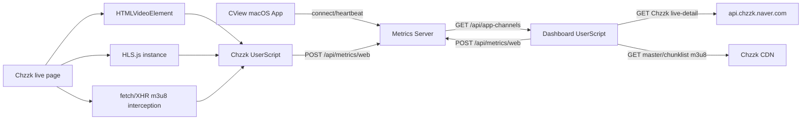

# CView Chzzk Metrics Collector 안정성 및 효율성 분석

작성일: 2026-04-24  
대상: Tampermonkey UserScript `CView Chzzk Metrics Collector` v3.3.0, CView Metrics Server API 계약

## 1. 요약

이 스크립트는 치지직 라이브 페이지와 CView 대시보드에서 동작하며, CView 앱이 재생 중인 채널을 감지한 뒤 웹/HLS 레이턴시 메트릭을 `cv.dododo.app` 메트릭 서버로 전송한다. 기능 범위는 단순한 브라우저 계측을 넘어 다음 세 흐름을 동시에 처리한다.

1. 치지직 라이브 탭에서 `video`, HLS.js, m3u8 응답을 관찰해 웹 재생 메트릭을 수집한다.
2. 대시보드에서 `/api/app-channels`를 폴링해 CView 앱 재생 채널을 감지한다.
3. 대시보드에서 탭을 열지 않고 Chzzk `live-detail`과 HLS m3u8을 직접 fetch해 백그라운드 HLS 메트릭을 전송한다.

현재 구조는 실용적이고 기능적으로 넓지만, Tampermonkey 권한이 크고, 폴링 루프가 많으며, 클라이언트와 서버 사이의 payload 계약이 암묵적이다. 안정성 극대화를 위해서는 우선 보안 경계를 줄이고, 수집 루프에 backoff/state machine을 도입하며, latency 단위와 source/engine 의미를 명문화해야 한다.

가장 먼저 처리할 개선 항목은 다음이다.

| 우선순위 | 개선 항목 | 기대 효과 |
| --- | --- | --- |
| P0 | `@connect *` 제거 또는 allowlist 축소 | 스크립트 탈취/오용 시 외부 전송 범위 제한 |
| P0 | `SERVER_URL` 입력 검증 및 허용 도메인 제한 | 임의 서버로 App Secret/JWT/메트릭 전송 방지 |
| P0 | 인증 실패, Chzzk API 실패, m3u8 실패에 exponential backoff 적용 | 서버/CDN 장애 시 request storm 방지 |
| P0 | background collector runaway 방지 강화 | 다중 채널/실패 상태에서 타이머 누수와 과도한 fetch 차단 |
| P1 | latency payload schema 명문화 | ms/s 혼재와 서버 분류 오류 예방 |
| P1 | `live-detail`/stream URL TTL cache 도입 | 반복 API 호출 감소 |
| P1 | foreground/background 공통 m3u8 parser 분리 | 계산 로직 불일치와 유지보수 비용 감소 |

## 2. 현재 구조 분석

### 2.1 실행 위치와 역할

UserScript metadata는 다음 페이지에서 실행된다.

| match | 역할 |
| --- | --- |
| `https://chzzk.naver.com/*` | 라이브 페이지 video/HLS.js/m3u8 감지, 웹 메트릭 전송 |
| `https://cv.dododo.app/*` | CView 대시보드에서 앱 채널 감지 및 background HLS collector 실행 |
| `https://cv.dododo.app:8443/*` | 동일 서버의 포트 기반 접근 지원 |

스크립트 권한은 `GM_xmlhttpRequest`, `GM_getValue`, `GM_setValue`, `GM_registerMenuCommand`, `GM_notification`이며, 네트워크 권한은 `@connect cv.dododo.app`와 `@connect *`를 모두 가진다.

### 2.2 주요 데이터 흐름



### 2.3 서버 계약 확인

관련 서버 구현은 다음 파일에서 확인된다.

| API | 서버 구현 | 현재 계약 |
| --- | --- | --- |
| `POST /api/auth/token` | `server-dev/mirror/chzzk-collector/jwt_auth.py` | `device_id`, `app_secret`으로 JWT 발급. 공개 경로 |
| `POST /api/metrics/web` | `server-dev/mirror/chzzk-collector/handlers/metrics.py` | JWT 필요. `process_metric(data, "web")` 후 InfluxDB 저장, WebSocket broadcast |
| `GET /api/app-channels` | `server-dev/mirror/chzzk-collector/handlers/cview_app.py` | 인증 없이 활성 CView 앱 채널 목록 반환 |
| metric 분류 | `server-dev/mirror/chzzk-collector/metric_processing.py` | `source_type == "web"`이면 대부분 web sample로 저장 |

중요한 점은 `GET` 요청은 JWT middleware에서 인증을 생략한다는 것이다. 따라서 `/api/app-channels`는 의도적으로 공개 API처럼 동작한다. 반면 `/api/metrics/web`은 `POST`라서 JWT가 필요하고, UserScript는 `Authorization: Bearer ...`를 붙여 전송한다.

### 2.4 UserScript 내부 모듈

| 영역 | 주요 함수 | 역할 |
| --- | --- | --- |
| HLS hook | `hookHlsConstructor()` | page window의 `Hls` 생성자를 proxy로 감싸 HLS.js instance 캡처 |
| m3u8 hook | `hookFetchAndXHR()`, `processM3u8Response()` | fetch/XHR m3u8 응답 clone 후 segment/PDT/LL-HLS 정보 추출 |
| 인증 | `authenticate()` | App Secret으로 JWT 발급, `_authPromise`로 중복 인증 방지 |
| 앱 채널 감지 | `startAppChannelPolling()`, `pollAppChannels()` | `/api/app-channels` 폴링 후 앱 재생 채널 목록 유지 |
| 웹 수집 | `waitForVideoAndStart()`, `collectMetrics()`, `tick()` | video/HLS.js/m3u8 기반 메트릭 전송 |
| background HLS | `startBgCollector()`, `fetchStreamUrl()`, `fetchChunklistUrl()`, `fetchChunklistMetrics()` | 대시보드에서 직접 HLS manifest를 폴링해 메트릭 전송 |
| UI | `updateStatusUI()`, `registerMenuCommands()` | 상태 오버레이, App Secret/서버 URL/디버그 메뉴 |

## 3. 주요 리스크

### 3.1 인증 및 보안

#### S-1. `@connect *`가 권한 경계를 과도하게 넓힌다

현재 metadata는 `@connect cv.dododo.app`와 함께 `@connect *`를 포함한다. 이 권한은 background HLS collector가 Chzzk API와 CDN에 직접 접근하기 위해 필요했을 가능성이 높다. 그러나 Tampermonkey 스크립트가 탈취되거나 XSS/공급망 문제가 생기면 App Secret, JWT, 메트릭 payload를 임의 외부 도메인으로 보낼 수 있다.

권장:

- `@connect *`를 제거하고 실제 필요한 도메인만 allowlist에 추가한다.
- 최소 후보: `cv.dododo.app`, `api.chzzk.naver.com`, 실제 HLS CDN hostname 패턴.
- CDN hostname이 동적으로 넓다면 서버에서 stream URL을 proxy하거나, collector 전용 read endpoint를 제공해 브라우저 권한을 줄인다.

#### S-2. 서버 URL 설정이 임의 origin을 허용한다

Tampermonkey 메뉴의 `서버 URL 설정`은 사용자가 입력한 URL을 그대로 `CONFIG.SERVER_URL`에 저장한다. 이후 인증 요청과 메트릭 전송이 모두 해당 URL로 간다. 오타, 피싱 URL, 악성 안내에 의해 App Secret이 외부 서버로 전송될 수 있다.

권장:

- URL scheme은 `https:`만 허용한다.
- hostname은 기본적으로 `cv.dododo.app`만 허용한다.
- 개발용 예외가 필요하면 `localhost`, `127.0.0.1`, 사설망 IP만 별도 debug mode에서 허용한다.
- 저장 전 `new URL()`로 정규화하고 path/query/hash는 제거한다.

#### S-3. App Secret이 GM storage에 평문 저장된다

`GM_setValue('appSecret', secret)`은 브라우저/확장 저장소에 평문을 남긴다. Tampermonkey 환경 특성상 완전한 secret storage를 기대하기 어렵지만, 운영 관점에서는 장기 secret보다 회전 가능한 device token이 안전하다.

권장:

- App Secret은 최초 bootstrap 전용으로만 사용하고, 서버가 device-scoped refresh token 또는 long-lived device token을 발급하도록 분리한다.
- token 발급 시 `device_id`, user-agent, createdAt, lastSeenAt을 서버에 기록한다.
- UI에 "저장된 secret 삭제" 메뉴를 추가한다.
- 서버는 App Secret 변경/회전 시 기존 JWT와 device token 폐기 절차를 제공한다.

#### S-4. `/api/app-channels`가 무인증 공개 조회다

서버 middleware는 `GET`을 safe method로 보고 인증을 생략한다. `/api/app-channels`는 현재 활성 채널명, engine, heartbeat timestamp, clientCount를 반환한다. 민감도가 아주 높지는 않지만, 시청 상태와 운영 정보를 외부에서 관찰할 수 있다.

권장:

- 운영 배포에서는 `/api/app-channels`에 read-token 또는 JWT 인증을 적용한다.
- 최소한 origin/rate limit/IP allowlist를 둔다.
- 공개 유지가 필요하면 channelName을 optional로 만들고, clientCount/heartbeat precision을 낮춘다.

### 3.2 안정성

#### R-1. polling loop가 많고 실패 시 backoff가 부족하다

현재 주요 interval은 다음과 같다.

| 루프 | 기본 주기 | 비고 |
| --- | --- | --- |
| 웹 메트릭 수집 | 3초 | `_tickBusy`로 중복 실행 방지 |
| 방송 정보 갱신 | 30초 | live-detail 호출 |
| 앱 채널 폴링 | 10초 | 모든 실행 페이지에서 동작 |
| background m3u8 폴링 | 5초 | 채널별 timer |
| background 방송 정보 갱신 | 30초 | 채널별 live-detail 호출 |
| 상태 UI 갱신 | 3초 | 조건부 DOM 갱신 |

각 tick에는 busy flag가 있지만, 실패 상태에서 주기가 늘어나지는 않는다. 서버 장애, 인증 실패, Chzzk API 장애, CDN timeout이 발생하면 동일 주기로 계속 재시도한다.

권장:

- 인증 실패: 5초, 15초, 30초, 60초, 5분 상한 backoff.
- Chzzk live-detail 실패: 채널별 backoff와 jitter 적용.
- chunklist 실패: URL 재해석은 즉시 반복하지 않고 짧은 cool-down을 둔다.
- `/api/app-channels` 실패: 빈 목록으로 즉시 종료 처리하지 말고, 마지막 성공 상태에 TTL을 둔다.

#### R-2. background collector의 초기화 실패가 타이머 생명주기와 분리되어 있다

`startBgCollector()`는 먼저 interval을 등록하고 `_bgCollectors`에 넣은 뒤 `initAndTick()`을 비동기로 실행한다. 초기 stream URL 획득 실패 시 collector는 남아 있고, 다음 tick에서 재시도한다. 이것은 복구성에는 유리하지만, 오프라인 채널이나 잘못된 channelId가 반복 감지되면 timer가 장기간 유지된다.

현재 `BG_MAX_CONSECUTIVE_FAILS`는 36회지만, `initAndTick()`의 stream URL 없음은 `failCount`를 증가시키지 않는다. 따라서 초기 실패가 반복될 경우 자동 중단 조건에 늦게 도달하거나 도달하지 않을 수 있다.

권장:

- 모든 실패 경로가 동일한 `recordFailure(reason)`을 호출하게 한다.
- 초기화 실패도 failCount와 lastError를 갱신한다.
- `lastSuccessAt`, `startedAt`, `lastAttemptAt`을 두고 최대 무성공 시간을 제한한다.
- app channel heartbeat가 사라진 채널은 collector를 즉시 중단한다.

#### R-3. fetch/XHR monkey patch는 다른 스크립트와 충돌 가능성이 있다

스크립트는 pageWindow의 `fetch`, `XMLHttpRequest.prototype.open/send`, `history.pushState/replaceState`, `Hls` property를 직접 감싼다. 이는 document-start에서 동작해야 HLS를 잡을 수 있다는 장점이 있지만, 치지직 자체 코드나 다른 확장 스크립트도 같은 API를 patch하면 순서 의존 문제가 생길 수 있다.

권장:

- wrapper 함수에 sentinel property를 붙여 중복 hook을 방지한다.
- 원본 함수 참조와 wrapper 체인을 진단 메뉴에서 확인할 수 있게 한다.
- 예외 발생 시 원본 호출은 반드시 유지한다.
- `history.pushState`/`replaceState` wrapper도 descriptor 보존과 idempotent guard를 적용한다.

#### R-4. SPA navigation과 상태 reset 경계가 넓다

채널 변경 시 `_hlsInstance`, `_lastChunklistContent`, PDT 상태, stream info를 reset한다. 다만 fetch/XHR hook은 전역으로 유지되고, 이전 채널 m3u8 응답이 늦게 도착하면 새 채널 상태에 섞일 가능성이 있다.

권장:

- `processM3u8Response(url, content)`에서 URL과 현재 channelId/sessionId를 연결한다.
- channel navigation마다 `collectionSessionId`를 증가시키고, async callback이 오래된 session이면 무시한다.
- m3u8 URL에서 channel identifier를 추론할 수 없으면 capture time과 navigation time 기준으로 grace period를 둔다.

### 3.3 효율성

#### E-1. `live-detail` 호출이 foreground/background에서 중복된다

치지직 탭은 `refreshBroadcastInfo()`로 30초마다 live-detail을 호출한다. 대시보드는 background collector마다 `fetchStreamUrl()`과 `refreshBroadcast()`가 live-detail을 호출한다. 여러 채널을 동시에 수집하면 채널 수에 비례해 호출이 증가한다.

권장:

- channelId별 live-detail cache를 둔다.
- stream URL과 broadcast info TTL을 분리한다.
- status/openDate/viewerCount 같은 방송 정보는 30초 TTL, masterUrl은 변경 감지가 필요할 때만 30-60초 TTL을 둔다.
- 동일 채널 foreground와 background collector가 동시에 있으면 하나만 active source가 되게 한다.

#### E-2. m3u8 parser가 foreground/background에 중복 구현되어 있다

`processM3u8Response()`와 `fetchChunklistMetrics()`는 segment timestamp, PDT, target duration, part target, LL-HLS 감지를 각각 구현한다. 로직이 거의 같지만 validation과 latency fallback 순서가 조금씩 다르다.

권장:

- `parseM3u8Metrics(content, now, options)` 형태의 순수 함수로 분리한다.
- 반환값은 `{ latencyMs, latencySource, isLowLatency, segmentDuration, partDuration, programDateTimeEdgeMs, streamInfo }`로 표준화한다.
- foreground hook과 background collector는 같은 parser 결과를 payload로 변환만 한다.

#### E-3. UI 갱신이 전체 HTML 재구성 방식이다

`updateStatusUI()`는 상태 변경 여부와 무관하게 문자열을 새로 만들고 `innerHTML`을 갱신한다. 현재 scale에서는 큰 문제는 아니지만, 다중 채널/오류 로그가 많아질수록 DOM work와 HTML escape 비용이 증가한다.

권장:

- 마지막 렌더 문자열을 저장하고 변경될 때만 `innerHTML`을 갱신한다.
- background collector 상태는 metricsSent, latency, lastError 변경 시에만 dirty 처리한다.
- 상태 UI refresh interval은 3초 유지 가능하나, hidden tab에서는 10-30초로 늘린다.

#### E-4. 모든 페이지에서 앱 채널 폴링을 시작한다

`init()`은 치지직/대시보드 모두 `startAppChannelPolling()`을 호출한다. 치지직 탭 여러 개가 열려 있으면 각 탭이 `/api/app-channels`를 10초마다 호출한다.

권장:

- background HLS collector는 대시보드에서만 필요하므로 앱 채널 폴링도 기본적으로 대시보드에 제한한다.
- 치지직 탭에서 "앱 재생 중인 채널이면 자동 수집" 기능이 필요하다면 BroadcastChannel/localStorage leader election으로 탭 하나만 poll한다.
- 또는 서버 WebSocket push로 활성 채널 변경 이벤트를 전달한다.

### 3.4 데이터 품질

#### D-1. latency 단위가 암묵적이다

UserScript는 대부분 ms 값을 보낸다. 서버는 `latency > 100`이면 ms, `< 100`이면 seconds로 추정한다. 이 휴리스틱은 50ms 같은 낮은 latency가 들어오면 seconds로 오해될 수 있고, future collector가 seconds/ms를 다르게 보내면 품질 문제가 생긴다.

권장:

- payload에 `latencyUnit: "ms"`를 추가한다.
- 서버는 schemaVersion이 있는 payload에서는 휴리스틱 대신 명시 단위를 사용한다.
- 기존 클라이언트 호환을 위해 `latencyUnit`이 없을 때만 현재 휴리스틱을 유지한다.

#### D-2. `tampermonkey-bg`는 서버에서 일반 web sample로 처리된다

현재 background payload는 `source: "tampermonkey-bg"`, `engine: "Background HLS"`를 보낸다. 서버의 `handle_web_metrics()`는 `process_metric(data, "web")`로 고정 호출하므로 `tampermonkey-bg`도 web sample에 들어간다. 기능적으로는 맞지만, 실제 브라우저 video 재생 기반 값과 headless/background HLS polling 값이 같은 web bucket에 섞인다.

권장:

- payload에 `collectorMode: "foreground-video" | "background-hls"`를 추가한다.
- 서버 `ChannelStats`는 web foreground와 background/headless sample을 분리하거나, 최소한 `web_last_source`에 collectorMode를 반영한다.
- 대시보드에는 "브라우저 재생값"과 "백그라운드 HLS 추정값"을 구분해서 표시한다.

#### D-3. PDT fallback은 segment duration 추정이 부정확할 수 있다

PDT 기반 계산은 마지막 `#EXT-X-PROGRAM-DATE-TIME` 이후 첫 `#EXTINF` 길이를 더해 live edge를 추정한다. LL-HLS의 `#EXT-X-PART`가 많은 경우, 마지막 part 기준 edge와 차이가 날 수 있다.

권장:

- `#EXT-X-PART`가 있으면 마지막 part duration까지 누적해 edge를 계산한다.
- `#EXT-X-PRELOAD-HINT`는 아직 도착하지 않은 part이므로 latency edge 계산에는 별도 취급한다.
- latencySource를 `program-date-time-segment`와 `program-date-time-part`로 나눠 신뢰도를 구분한다.

#### D-4. foreground metrics는 currentTime을 보내지 않는다

서버 `handle_web_metrics()`는 `currentTime`과 `bufferLength/bufferHealth`가 있으면 `state.web_position_store`를 갱신한다. UserScript foreground metrics는 `bufferHealth`는 보내지만 `currentTime`은 보내지 않아 position sync 품질이 제한된다.

권장:

- foreground `collectMetrics()`에 `currentTime`, `duration`, `paused`, `readyState`, `networkState`를 추가한다.
- background HLS collector는 video position이 없으므로 `collectorMode`로 position-less metric임을 명확히 한다.

### 3.5 버전 및 운영 관측성

metadata는 `@version 3.3.0`인데, 상태 메뉴와 초기 로그는 `v3.2.0`을 표시한다. 운영 중 이 불일치는 사용자 신고와 서버 로그 상관관계를 어렵게 만든다.

권장:

- `CONFIG.VERSION = "3.3.0"`을 두고 metadata, 로그, 상태 메뉴의 단일 source of truth로 사용한다.
- metrics payload에도 `collectorVersion`을 포함한다.
- 서버 로그에 `collectorVersion`, `schemaVersion`, `collectorMode`를 남긴다.

## 4. 개선 우선순위

### P0. 즉시 적용 권장

| ID | 개선 | 세부 내용 | 완료 기준 |
| --- | --- | --- | --- |
| P0-1 | 네트워크 권한 축소 | `@connect *` 제거, 필요한 Chzzk API/CDN 도메인 allowlist화 | Tampermonkey 권한 화면에서 wildcard 제거 |
| P0-2 | 서버 URL 검증 | `https`, hostname allowlist, path/query 제거, 개발 예외 분리 | 악성 URL 입력 시 저장 거부 |
| P0-3 | 인증 실패 backoff | 401/timeout/network error에 exponential backoff, 성공 시 reset | 서버 장애 중 인증 요청 빈도 상한 확인 |
| P0-4 | collector 실패 lifecycle 통합 | 모든 실패 경로가 failCount/lastError/lastAttemptAt 갱신 | 초기화 실패도 자동 중단 조건에 포함 |
| P0-5 | app channel 공개 범위 검토 | `/api/app-channels` 인증/read-token/rate limit 도입 검토 | 외부 무인증 조회 정책이 명시됨 |

### P1. 구조 개선

| ID | 개선 | 세부 내용 | 완료 기준 |
| --- | --- | --- | --- |
| P1-1 | adaptive polling | foreground/background/API별 backoff와 jitter 적용 | 장애 시 request rate 감소, 정상 시 기존 주기 유지 |
| P1-2 | stream/broadcast cache | channelId별 live-detail TTL cache | 동일 채널 중복 호출 제거 |
| P1-3 | 공통 m3u8 parser | foreground/background latency 계산 로직 통합 | parser fixture 테스트 가능 |
| P1-4 | 수집 상태 machine | idle, authenticating, collecting, degraded, stopped 상태 명시 | interval/timer 전이가 한 곳에서 관리됨 |
| P1-5 | payload schema 표준화 | `schemaVersion`, `collectorMode`, `latencyUnit`, `collectorVersion` 추가 | 서버가 명시 필드 우선 처리 |

### P2. 운영 품질 개선

| ID | 개선 | 세부 내용 | 완료 기준 |
| --- | --- | --- | --- |
| P2-1 | UI dirty render | 상태 문자열 변경 시에만 DOM 갱신 | 다중 채널에서도 UI 갱신 비용 안정 |
| P2-2 | 로그 sampling | 반복 timeout/HTTP 오류는 N회마다 출력 | 콘솔 노이즈 감소 |
| P2-3 | 설정 schema/versioning | GM storage에 `settingsVersion`, interval bounds, reset 메뉴 추가 | 잘못된 설정 복구 가능 |
| P2-4 | 진단 메뉴 강화 | hook 상태, token 만료, timers, collector state 표시 | 사용자 신고 시 원인 파악 시간 단축 |
| P2-5 | 서버 대시보드 표시 개선 | foreground web vs background HLS 구분 | 지표 해석 혼동 감소 |

## 5. 권장 인터페이스 개선

문서 작성 자체는 public API나 타입을 변경하지 않는다. 다만 안정적인 구현을 위해 다음 계약을 명문화하는 것이 좋다.

### 5.1 UserScript 설정

권장 설정 모델:

```json
{
  "settingsVersion": 1,
  "serverUrl": "https://cv.dododo.app:8443",
  "debug": false,
  "collectIntervalMs": 3000,
  "appChannelPollIntervalMs": 10000,
  "backgroundHlsPollIntervalMs": 5000
}
```

검증 규칙:

| 필드 | 권장 규칙 |
| --- | --- |
| `serverUrl` | `https:`와 allowlisted hostname만 허용 |
| `collectIntervalMs` | 최소 1000ms, 권장 3000ms 이상 |
| `appChannelPollIntervalMs` | 최소 5000ms, 권장 10000ms 이상 |
| `backgroundHlsPollIntervalMs` | 최소 3000ms, 권장 5000ms 이상 |
| `debug` | boolean만 허용 |

### 5.2 서버 API

권장:

- `/api/app-channels`는 운영 환경에서 인증 또는 read-token을 요구한다.
- `/api/metrics/web`는 payload schema를 문서화하고, unknown field는 허용하되 필수 field는 검증한다.
- 서버 응답에 `serverTime`, `acceptedSchemaVersion`, `warnings`를 선택적으로 포함해 클라이언트 진단성을 높인다.

### 5.3 메트릭 payload

권장 payload 확장:

```json
{
  "schemaVersion": 2,
  "collectorVersion": "3.3.0",
  "collectorMode": "background-hls",
  "source": "tampermonkey-bg",
  "platform": "web",
  "engine": "Background HLS",
  "channelId": "channel-id",
  "channelName": "channel-name",
  "latency": 1800,
  "latencyUnit": "ms",
  "latencySource": "program-date-time-part",
  "isLowLatency": true
}
```

필드 의미:

| 필드 | 의미 |
| --- | --- |
| `source` | 수집 구현 식별자. 예: `tampermonkey`, `tampermonkey-bg` |
| `engine` | 재생/계측 엔진. 예: `HLS.js`, `Background HLS`, `VLC`, `AVPlayer` |
| `collectorMode` | 실제 video 기반인지, background HLS polling인지 구분 |
| `latencyUnit` | `latency` 단위. 신규 payload는 `ms` 고정 권장 |
| `schemaVersion` | 서버가 명시 계약으로 파싱할 수 있는 버전 |
| `collectorVersion` | 운영 진단용 UserScript 버전 |

## 6. 검증 시나리오

### 6.1 인증 및 설정

| 시나리오 | 기대 결과 |
| --- | --- |
| App Secret 미설정 | 최초 설정 overlay 표시, 메트릭 전송 실패가 과도하게 반복되지 않음 |
| 잘못된 App Secret | `/api/auth/token` 401 후 backoff, UI에 인증 실패 표시 |
| JWT 만료 | 다음 전송 전 재인증 또는 401 수신 후 token reset |
| 악성 서버 URL 입력 | 저장 거부, 기존 서버 URL 유지 |
| debug toggle | reload 후에도 설정 유지 |

### 6.2 치지직 foreground 수집

| 시나리오 | 기대 결과 |
| --- | --- |
| 라이브 페이지 직접 진입 | video playing 후 수집 시작 |
| 비라이브 페이지에서 SPA로 라이브 이동 | HLS hook 유지, channelId 감지 후 수집 시작 |
| 라이브에서 다른 라이브 채널로 SPA 이동 | 이전 수집 중단, 상태 reset, 새 채널 수집 시작 |
| 라이브 페이지 이탈 | interval 정리, overlay 숨김 |
| HLS.js instance 없음 | m3u8/PDT 기반 fallback으로 가능한 메트릭만 전송 |

### 6.3 background HLS collector

| 시나리오 | 기대 결과 |
| --- | --- |
| 대시보드에서 앱 채널 1개 감지 | collector 1개 시작, master/chunklist 해석, 메트릭 전송 |
| 앱 채널 여러 개 감지 | 채널별 collector 생성, per-channel busy guard 동작 |
| 앱 재생 종료 | 해당 collector timer/broadcastTimer 정리 |
| master URL 변경 | chunklist URL reset 후 재해석 |
| chunklist HTTP 오류/timeout | failCount 증가, backoff, 임계값 초과 시 중단 |
| 방송 종료 | live-detail status 비OPEN 또는 stream 없음이면 collector 중단 |

### 6.4 latency sanity check

| latencySource | 검증 방법 |
| --- | --- |
| `hls-segment-timestamp` | segment filename의 13자리 timestamp와 현재 시각 차이가 100-30000ms 범위인지 확인 |
| `hls.js-latency` | `hls.latency * 1000` 값과 payload ms 값 일치 확인 |
| `program-date-time` | 마지막 PDT + segment/part duration 기준 live edge 계산 확인 |
| `llhls-estimate` | target duration, part target, fetchTime 기반 추정값이 상한을 넘지 않는지 확인 |
| `hls-estimate` | target duration x 2 + fetchTime fallback이 과도한 실제값으로 오해되지 않는지 확인 |

### 6.5 서버 수신 후 상태 반영

| 시나리오 | 기대 결과 |
| --- | --- |
| `/api/metrics/web` 수신 | `process_metric(data, "web")` 호출, `web_last` 업데이트 |
| background payload 수신 | `source=tampermonkey-bg`, `engine=Background HLS`가 보존됨 |
| InfluxDB 활성 | web measurement 저장 성공 |
| WebSocket client 연결 | metric broadcast에 channelId, source, latency, engine 포함 |
| dashboard forwarding 활성 | forward interval에 맞춰 dashboard DB로 payload 전달 |

## 7. 적용 순서 제안

1. P0 보안 경계부터 줄인다. `@connect *`, 서버 URL 검증, `/api/app-channels` 공개 정책을 먼저 정리한다.
2. 인증/네트워크 실패 backoff와 collector lifecycle을 통합한다. 이 단계가 끝나면 장애 시 서버/CDN을 과도하게 두드리지 않는다.
3. payload schema를 추가하고 서버는 신규 필드를 우선 처리하되 기존 클라이언트 호환을 유지한다.
4. m3u8 parser를 공통화하고 fixture 기반 테스트를 추가한다.
5. UI/로그/진단 메뉴를 정리해 운영 중 원인 파악 시간을 줄인다.

## 8. 결론

현재 스크립트는 CView 앱과 웹/대시보드를 연결하는 실용적인 collector 역할을 이미 수행한다. 가장 큰 위험은 기능 부족이 아니라 넓은 Tampermonkey 네트워크 권한, 실패 시 고정 주기 재시도, 암묵적인 메트릭 payload 계약이다.

따라서 안정성 및 효율성 극대화의 핵심은 다음 세 가지다.

1. 브라우저 권한과 서버 공개 API를 최소화한다.
2. 모든 수집 루프를 상태 machine과 backoff 중심으로 재구성한다.
3. latency/source/engine/collectorMode/schemaVersion을 명시해 데이터 품질을 보장한다.

이 세 가지를 먼저 적용하면 장애 상황에서의 request storm, 잘못된 지표 해석, 운영 진단 지연을 크게 줄일 수 있다.
