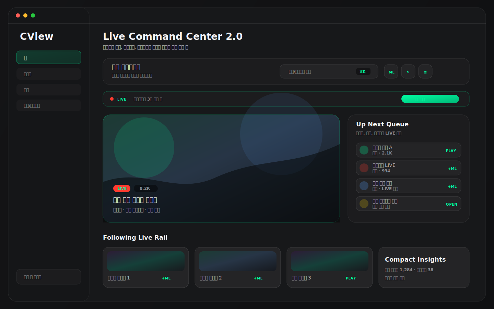
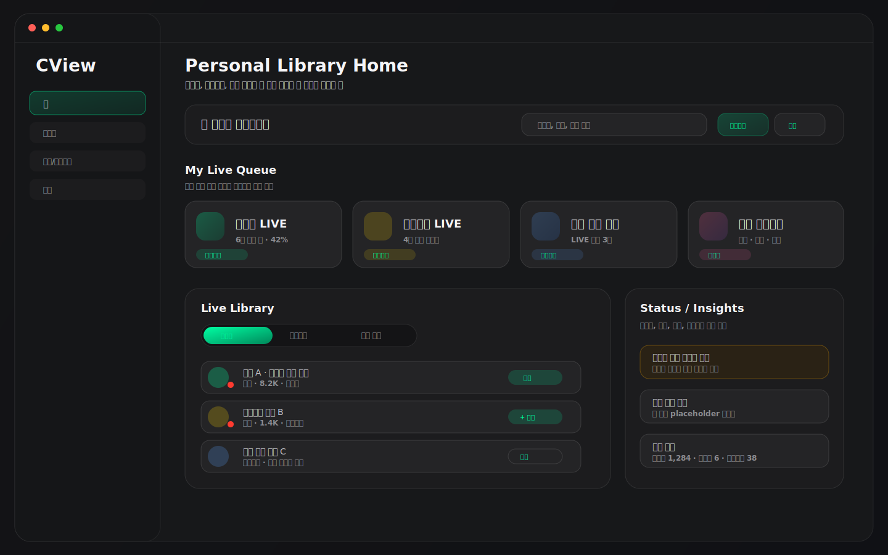
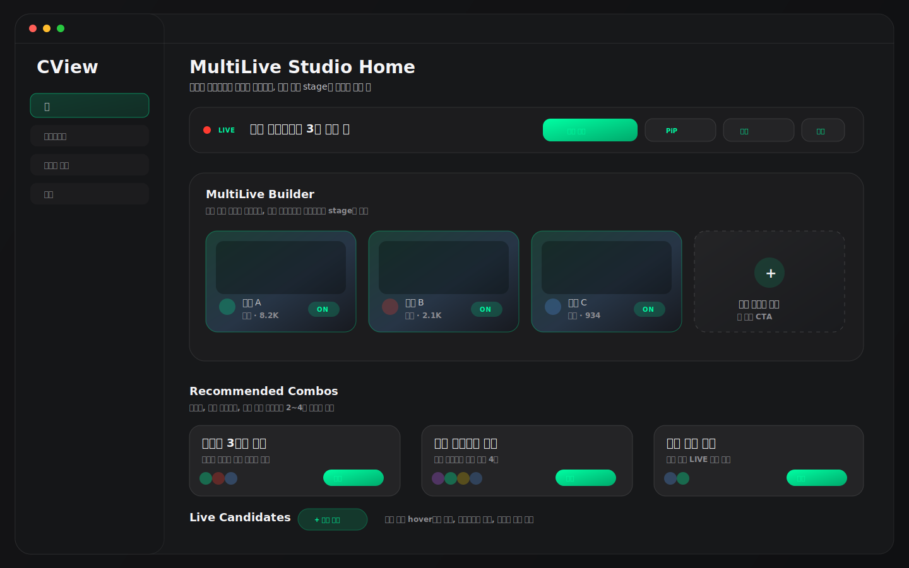

# CView 메인 홈화면 디자인 추천 3안

작성일: 2026-04-27  
범위: `MainContentView`, `HomeView_v2`, `HomeV2/*`, `HomeViewModel`, `SearchViews`, `RecentFavoritesView`, `FollowingView`, `DesignTokens`  
목적: 현재 프로젝트의 실제 홈 구현을 기준으로, 다음 개선 단계에서 선택할 수 있는 홈 화면 디자인 방향 3가지를 제안한다.

---

## 0. 결론

현재 앱의 활성 홈은 레거시 `HomeView`가 아니라 `HomeView_v2`다. `MainContentView`가 `@AppStorage("home.useV2")`를 기본 `true`로 두고 홈 메뉴에서 `HomeView_v2(viewModel:)`를 렌더링한다. 따라서 새 디자인은 기존 V2를 버리는 방식보다, 이미 구현된 커맨드 바, 추천 히어로, 팔로잉 라이브, 이어보기/즐겨찾기, 멀티라이브 strip, 카테고리 칩, 간이 통계를 재배치하고 밀도를 조정하는 방식이 가장 안전하다.

추천 우선순위는 다음과 같다.

| 순위 | 추천안 | 적합한 목표 | 판단 |
|---|---|---|---|
| 1 | Live Command Center 2.0 | 일반 사용자, 빠른 시청, 낮은 구현 리스크 | 기본 추천 |
| 2 | Personal Library Home | 팔로잉/최근/즐겨찾기 중심의 재방문 사용자 | 로그인 사용자 만족도 강화 |
| 3 | MultiLive Studio Home | CView의 차별 기능인 멀티라이브를 홈 전면에 노출 | 제품 정체성 강화, 구현 리스크는 가장 큼 |

바로 적용한다면 1안을 기본 구조로 삼고, 2안의 개인 라이브 큐와 3안의 멀티라이브 세션 빌더를 일부 섞는 방식이 가장 현실적이다.

### 예시 이미지 미리보기

아래 이미지는 실제 구현 화면 캡처가 아니라, 현재 코드 구조와 `DesignTokens` 톤을 기준으로 만든 디자인 방향 mockup이다.







---

## 1. 현재 구현 분석

### 1.1 활성 홈 라우팅

근거:

- `Sources/CViewApp/Views/MainContentView.swift`: `@AppStorage("home.useV2") private var useHomeV2: Bool = true`
- `Sources/CViewApp/Views/MainContentView.swift`: 홈 detail에서 `useHomeV2`가 true이면 `HomeView_v2(viewModel:)`를 사용
- `Sources/CViewApp/Navigation/AppRouter.swift`: 사이드바 메뉴는 홈, 라이브, 카테고리, 검색, 클립, 최근/즐겨찾기, 메트릭, 설정으로 분리

의미:

- 홈 디자인 개선은 레거시 통계 대시보드가 아니라 `Sources/CViewApp/Views/HomeV2/` 하위 구현을 기준으로 해야 한다.
- 검색, 최근/즐겨찾기, 팔로잉/멀티라이브가 별도 메뉴로도 존재하므로, 홈은 전체 기능을 복제하기보다 첫 행동만 끌어오는 허브가 되어야 한다.

### 1.2 현재 V2 홈 정보 구조

`HomeView_v2`는 다음 순서로 화면을 구성한다.

1. Sticky `HomeCommandBar`
2. 로그인 필요 배너
3. `HomeActiveMultiLiveStrip`
4. `HomeHeroLiveCard`
5. 팔로잉 라이브 섹션
6. 이어보기 / 즐겨찾기 strip
7. 추천 Discover grid
8. 인기 채널 grid
9. `HomeInsightsCompactStrip`

좋은 점:

- 홈의 목적이 이미 "라이브 커맨드 센터"에 가깝게 바뀌었다.
- `HomeCommandBar`에 검색, 멀티라이브, 모니터, 새로고침 액션이 있다.
- `HomeRecommendationEngine`이 팔로잉, 즐겨찾기, 최근 시청, 관심 카테고리, 시청자 수, 이미 시청 중인 세션을 반영해 추천 점수를 만든다.
- `HomeActiveMultiLiveStrip`과 `LiveCardActionMenu`가 멀티라이브 진입을 홈 카드 수준까지 확장한다.
- `HomeV2Effects`가 `accessibilityReduceMotion`, 고정 shadow radius, `.drawingGroup()` 등 성능 보존 패턴을 이미 갖고 있다.

아쉬운 점:

- 첫 화면이 여전히 세로 섹션 나열에 가깝다. 상단에서 "무엇을 바로 볼지"의 선택지가 한눈에 압축되지 않는다.
- `HomeHeroLiveCard`가 고정 320pt 높이를 사용해 창 크기와 사용자 밀도 설정에 덜 민감하다.
- `home.v2.density`는 `HomeLayoutMenu`에 picker로 존재하지만 실제 카드 크기, spacing, grid minimum에 연결된 흔적이 없다.
- 검색 버튼은 `CommandPalette`를 여는 진입점이고, `SearchView`의 실제 검색바/자동완성 경험과 홈 상단이 아직 완전히 이어지지 않는다.
- 이어보기와 즐겨찾기가 두 개의 같은 폭 strip으로 나란히 배치되어 좁은 폭에서는 정보가 밀릴 수 있다.
- 추천 결과가 비어 있으면 hero 자체가 사라져 홈 상단의 시각적 중심이 약해질 수 있다.

### 1.3 재사용 가능한 자산

| 자산 | 현재 위치 | 디자인에서 재사용할 방식 |
| --- | --- | --- |
| 홈 V2 섹션 조립 | `HomeView_v2.swift` | 3개 추천안 모두의 기본 뼈대 |
| 커맨드 바 | `HomeV2Components.swift` | 검색, 새로고침, 멀티라이브, 모니터 액션 유지 |
| 히어로 카드 | `HomeV2Components.swift` | 첫 추천 또는 "지금 볼 방송"의 대표 카드 |
| 추천 엔진 | `HomeRecommendationEngine.swift` | 개인화 추천의 초기 점수 모델 |
| 활성 멀티라이브 strip | `HomeV2Extras.swift` | 1안/3안의 상단 상태 바 |
| 카드 context menu | `HomeV2Extras.swift` | 재생, 멀티라이브 추가, 채팅, 채널 상세, 즐겨찾기 |
| 검색 화면 | `SearchViews.swift` | 홈 search field 또는 command palette 결과 경험 |
| 최근/즐겨찾기 데이터 | `RecentFavoritesView.swift`, `DataStore` | 복귀 큐, 즐겨찾기 라이브 우선 정렬 |
| 팔로잉/멀티라이브 | `FollowingView*`, `MultiLiveManager` | 멀티라이브 추가와 세션 복원 |
| 디자인 토큰 | `DesignTokens.swift` | Dark Glass, chzzk green, 4-layer surface, adaptive color 유지 |

---

## 2. 디자인 추천안 1: Live Command Center 2.0


### 핵심 컨셉

앱을 열자마자 "검색, 지금 볼 라이브, 멀티라이브 시작"이 한 화면 위쪽에서 끝나는 구조다. 현재 `HomeView_v2`의 의도와 가장 잘 맞고, 기존 코드를 가장 많이 재사용할 수 있다.

### 추천 레이아웃

```text
┌──────────────────────────────────────────────────────────────┐
│ Sticky Command Bar                                            │
│ 인사말 / 검색 / 멀티라이브 / 새로고침 / 홈 편집               │
├──────────────────────────────────────────────────────────────┤
│ Active MultiLive Strip, 세션이 있을 때만 표시                 │
├──────────────────────────────────────────────────────────────┤
│ Featured Live                         │ Up Next Queue         │
│ 큰 썸네일 히어로                      │ 팔로잉/최근/즐겨찾기   │
│ 재생 / 멀티라이브 추가 / 채널 상세    │ 작은 행 5~7개          │
├──────────────────────────────────────────────────────────────┤
│ Following Live Rail                                           │
├──────────────────────────────────────────────────────────────┤
│ Discover Grid + Category Chips                                │
├──────────────────────────────────────────────────────────────┤
│ Compact Insights, 접이식                                      │
└──────────────────────────────────────────────────────────────┘
```

### 구체 개선

1. 히어로 옆에 `Up Next Queue`를 추가한다.
   - `cachedRecommendations.dropFirst()`
   - `viewModel.recentLiveFollowing`
   - `recentItems`, `favoriteItems`
   - 위 데이터를 하나의 `WatchNextItem` 모델로 합쳐 5~7개만 표시한다.

2. `HomeHeroLiveCard` 높이를 반응형으로 바꾼다.
   - 현재는 320pt 고정이다.
   - 제안: comfortable 300~320pt, compact 220~260pt
   - 폭이 좁으면 히어로와 큐를 세로 배치한다.

3. 검색 경험을 command palette와 실제 검색 화면 사이로 연결한다.
   - 상단 search field 클릭: `CommandPalette` 또는 인라인 overlay
   - 검색어 입력 후 상세 결과: `SearchView`
   - 팔로잉 자동완성은 `SearchViewModel.followingChannelNames` 자산 재사용

4. 추천 결과가 없을 때도 첫 화면 중심을 유지한다.
   - 추천이 없으면 `viewModel.topChannels.first` 또는 `viewModel.recentLiveFollowing.first`를 fallback hero로 사용한다.
   - 데이터가 전혀 없으면 "라이브 불러오기" CTA와 새로고침 버튼을 보여준다.

### 장점

- 현재 V2 구조와 가장 가깝다.
- 구현 범위가 `HomeView_v2`, `HomeV2Components`, `HomeV2Layout` 안에서 대부분 끝난다.
- 홈이 더 현대적인 미디어 앱처럼 보이면서도 성능 위험이 낮다.

### 리스크

- 히어로와 큐를 잘못 크게 만들면 첫 화면이 과밀해질 수 있다.
- 현재 hover, thumbnail, prefetch가 이미 많은 편이므로 카드 수를 무리하게 늘리면 메뉴 전환 성능이 다시 나빠질 수 있다.

### 적용 우선순위

| 우선순위 | 작업 |
| --- | --- |
| P0 | `home.v2.density`를 실제 spacing, grid min width, hero height에 연결 |
| P0 | 추천 없음 fallback hero 추가 |
| P1 | `Featured + Up Next` 2열 상단 레이아웃 추가 |
| P1 | 검색 진입을 `SearchView`/CommandPalette와 더 명확히 연결 |
| P2 | 사용자 섹션 순서 저장까지 확장 |

---

## 3. 디자인 추천안 2: Personal Library Home


### 핵심 컨셉

홈을 "내 라이브 라이브러리"로 만든다. 팔로잉, 즐겨찾기, 최근 시청, 관심 카테고리를 가장 먼저 보여주고, 인기/추천은 아래로 내린다. 로그인 사용자와 반복 사용자를 위한 구조다.

### 추천 레이아웃

```text
┌──────────────────────────────────────────────────────────────┐
│ Compact Command Bar                                           │
├──────────────────────────────────────────────────────────────┤
│ My Live Queue                                                 │
│ [팔로잉 라이브] [즐겨찾기 LIVE] [최근 보던 채널] [관심 카테고리] │
├──────────────────────────────┬───────────────────────────────┤
│ Live Library                  │ Status / Insights             │
│ 팔로잉 라이브 리스트          │ 로그인, 쿠키, 메트릭, 캐시      │
│ 즐겨찾기 / 최근 segmented     │ 접이식 요약                    │
├──────────────────────────────┴───────────────────────────────┤
│ Discover는 보조 섹션으로 하단 배치                            │
└──────────────────────────────────────────────────────────────┘
```

### 구체 개선

1. `RecentFavoritesView`의 탭형 패턴을 홈의 "내 라이브" 영역으로 축약한다.
   - 전체 목록은 별도 메뉴에 유지한다.
   - 홈에는 최근 4개, 즐겨찾기 4개, 라이브 중인 항목 우선만 노출한다.

2. 팔로잉 라이브를 `recentLiveFollowing` 6개 제한에서 조금 더 풍부한 queue로 확장한다.
   - 상단은 LIVE 중인 팔로잉
   - 다음 줄은 오프라인 즐겨찾기, 최근 시청, 관심 카테고리
   - 카드 대신 `PremiumChannelRow` 계열의 밀도 높은 list UI를 재사용할 수 있다.

3. 로그인/쿠키 상태를 첫 화면의 작은 상태 패널로 정리한다.
   - `needsCookieLogin` 배너는 현재 상단에 조건부 노출된다.
   - 2안에서는 오른쪽 상태 패널에 넣어 홈 흐름을 덜 끊게 만든다.

4. Discover를 하단 보조 영역으로 낮춘다.
   - 일반 추천은 사용자가 개인 큐를 다 본 뒤 탐색하는 흐름으로 둔다.
   - 카테고리 칩은 유지하되 더 작은 toolbar 형태가 적절하다.

### 장점

- 개인화 체감이 가장 강하다.
- 로그인한 사용자에게 "내가 왜 이 앱을 켰는지"가 명확하다.
- 최근/즐겨찾기 메뉴의 발견성 문제를 홈에서 해결한다.

### 리스크

- 비로그인 사용자는 화면이 비어 보일 수 있다.
- 팔로잉 데이터와 최근/즐겨찾기 데이터가 부족할 때 fallback 설계가 중요하다.
- 신규 사용자가 인기 방송을 탐색하는 흐름은 1안보다 약하다.

### 적용 우선순위

| 우선순위 | 작업 |
|---|---|
| P0 | 최근/즐겨찾기 라이브 우선 정렬 helper 추가 |
| P0 | 비로그인/데이터 없음 상태의 Discover fallback 강화 |
| P1 | `My Live Queue` segmented control 또는 compact tabs 추가 |
| P1 | 쿠키 로그인 배너를 상태 패널로 축소 |
| P2 | 관심 카테고리 기반 "내 카테고리" row 추가 |

---

## 4. 디자인 추천안 3: MultiLive Studio Home


### 핵심 컨셉

CView의 차별 기능은 멀티라이브와 멀티채팅이다. 홈을 단순 추천 피드가 아니라 "멀티라이브 세션을 구성하는 스튜디오"처럼 만든다. 여러 방송을 동시에 보는 사용자를 명확한 타깃으로 삼는다.

### 추천 레이아웃

```text
┌──────────────────────────────────────────────────────────────┐
│ Command Bar + Active Session Summary                          │
├──────────────────────────────────────────────────────────────┤
│ MultiLive Builder                                              │
│ [Slot 1] [Slot 2] [Slot 3] [Slot 4]   [전체 보기] [PiP]        │
│ 비어 있는 슬롯에는 추천 라이브 drop/add CTA                    │
├──────────────────────────────────────────────────────────────┤
│ Recommended Combos                                             │
│ 팔로잉 조합 / 같은 카테고리 조합 / 최근 시청 조합              │
├──────────────────────────────────────────────────────────────┤
│ Live Candidates                                                 │
│ 각 카드: 재생 / 멀티라이브 추가 / 채팅만 열기                  │
└──────────────────────────────────────────────────────────────┘
```

### 구체 개선

1. `HomeActiveMultiLiveStrip`을 더 강한 "세션 요약"으로 확장한다.
   - 현재 세션 수, 채널 chip, 전체 보기 CTA는 이미 존재한다.
   - 3안에서는 strip 아래에 슬롯형 builder를 둔다.

2. 실제 플레이어를 홈에 직접 넣지 않는다.
   - 홈은 세션 구성과 상태 표시까지만 담당한다.
   - 재생 stage는 기존 `FollowingView+MultiLive` 또는 전용 멀티라이브 화면으로 보낸다.
   - 이렇게 해야 홈의 thumbnail/prefetch 비용이 VLC/AVPlayer 비용과 겹치지 않는다.

3. 추천 조합을 만든다.
   - 팔로잉 라이브 상위 2~4개
   - 같은 카테고리 인기 2~4개
   - 최근 시청 중 현재 LIVE인 채널 2~4개
   - 이미 세션에 포함된 채널은 제외한다.

4. 모든 라이브 카드에 멀티라이브 추가 액션을 더 눈에 보이게 만든다.
   - 현재 `LiveCardActionMenu`는 context menu 기반이다.
   - 3안에서는 hover 시 `+` icon button을 카드 우상단에 드러내는 방식이 적절하다.

### 장점

- CView만의 정체성이 가장 뚜렷하다.
- 멀티라이브 기능 발견성이 크게 좋아진다.
- 팔로잉 화면으로 이동하기 전 홈에서 시청 구성을 끝낼 수 있다.

### 리스크

- 가장 구현 범위가 크다.
- 홈에 너무 많은 세션 상태와 액션이 들어오면 초보 사용자에게 복잡해 보일 수 있다.
- 플레이어 preview까지 홈에 넣으면 성능 리스크가 커진다. 홈에서는 썸네일과 슬롯만 사용해야 한다.

### 적용 우선순위

| 우선순위 | 작업 |
|---|---|
| P0 | 홈 카드 hover에 visible `+ 멀티라이브` 액션 추가 |
| P0 | 현재 세션 슬롯 2~4개 요약 UI 추가 |
| P1 | 추천 조합 생성 helper 추가 |
| P1 | "이 조합으로 멀티라이브 시작" 액션 추가 |
| P2 | PiP/채팅 동시 시작 프리셋 제공 |

---

## 5. 세 안의 비교

| 항목 | 1안 Live Command Center | 2안 Personal Library | 3안 MultiLive Studio |
| --- | ---: | ---: | ---: |
| 기존 코드 재사용 | 높음 | 높음 | 중간 |
| 구현 난이도 | 낮음~중간 | 중간 | 높음 |
| 첫 사용 이해도 | 높음 | 중간 | 중간 |
| 재방문 사용자 만족도 | 높음 | 매우 높음 | 높음 |
| CView 차별성 | 중간 | 중간 | 매우 높음 |
| 성능 리스크 | 낮음 | 낮음~중간 | 중간~높음 |
| 추천 적용 순서 | 1순위 | 2순위 | 3순위 |

---

## 6. 최종 권장 조합

가장 좋은 실제 적용안은 1안을 기본으로 하고, 2안과 3안의 일부를 흡수하는 것이다.

```text
Live Command Center 2.0
├─ 상단: Sticky Command Bar
├─ 상태: Active MultiLive Strip
├─ 핵심: Featured Live + Up Next Queue
│  ├─ 팔로잉 라이브
│  ├─ 즐겨찾기 LIVE
│  └─ 최근 시청 LIVE
├─ 탐색: Category Chips + Discover Grid
├─ 차별화: 카드 hover `+ 멀티라이브`
└─ 보조: Compact Insights
```

이 조합이 좋은 이유:

- 현재 V2 홈의 방향성을 유지한다.
- 첫 화면이 더 선명해진다.
- 개인화와 멀티라이브를 둘 다 강화한다.
- 성능 리스크가 큰 플레이어 embed 없이도 제품 차별성을 드러낼 수 있다.

### 6.1 조합형 최종 레이아웃(리디자인 확정안)

아래 구조를 "하나의 기본 홈"으로 사용한다. 핵심은 1안의 커맨드 중심 흐름, 2안의 개인 라이브 큐, 3안의 멀티라이브 진입성을 첫 화면 상단 2개 fold 안에 압축하는 것이다.

```text
┌─────────────────────────────────────────────────────────────────────────────┐
│ [A] Smart Command Bar                                                      │
│ 검색(통합) · 멀티라이브 시작 · 새로고침 · 편집                             │
├─────────────────────────────────────────────────────────────────────────────┤
│ [B] Session Status Strip                                                   │
│ 활성 멀티라이브 n개 · 빠른 복원 · 전체 보기                                │
├──────────────────────────────────────┬──────────────────────────────────────┤
│ [C] Featured Live (Hero)             │ [D] Up Next Personal Queue          │
│ 지금 볼 1개                          │ 팔로잉 LIVE / 즐겨찾기 LIVE / 최근   │
│ 재생 · +멀티 · 채팅 · 상세           │ 6~8개 condensed row                  │
├──────────────────────────────────────┴──────────────────────────────────────┤
│ [E] Quick Segments: 팔로잉 | 즐겨찾기 | 최근 시청 | 관심 카테고리          │
├─────────────────────────────────────────────────────────────────────────────┤
│ [F] Discover Grid + Category Chips (보조 탐색)                             │
├─────────────────────────────────────────────────────────────────────────────┤
│ [G] Compact Insights (로그인/쿠키/캐시/간이 통계, 접이식)                  │
└─────────────────────────────────────────────────────────────────────────────┘
```

### 6.2 블록별 조합 근거

| 블록 | 가져온 디자인 | 목적 |
|---|---|---|
| A Command Bar | 1안 | 홈 진입 즉시 액션(검색, 새로고침, 멀티라이브) 고정 |
| B Session Strip | 3안 | CView 차별점인 멀티라이브 세션 복귀를 상단 노출 |
| C Hero | 1안 | "지금 볼 것" 결정을 1클릭으로 끝냄 |
| D Personal Queue | 2안 | 재방문 사용자의 실제 소비 흐름(팔로잉/즐겨찾기/최근) 반영 |
| E Quick Segments | 2안 | 개인 라이브러리 관점 전환을 빠르게 제공 |
| F Discover | 1안+2안 | 개인 큐 소진 후 탐색 동선 유지 |
| G Insights | 2안 | 상태성 정보는 작은 패널로 축약해 메인 흐름 보호 |

### 6.3 인터랙션 규칙(리디자인 기준)

1. 홈 카드 공통 1차 액션은 항상 `재생`, 2차 액션은 항상 `+ 멀티라이브`로 통일한다.
2. hover 가능한 환경에서는 카드 우상단에 `+` quick action을 노출하고, touch 환경에서는 long press action menu를 유지한다.
3. 추천/팔로잉 데이터가 비어도 Hero 영역을 제거하지 않는다.
   - fallback 우선순위: `topChannels.first` -> `recentLiveFollowing.first` -> empty CTA
4. 검색은 홈에서 시작하고 결과는 검색 화면으로 이어지는 2-step으로 고정한다.
   - Step 1: 홈 상단 검색 입력(최근/팔로잉 자동완성)
   - Step 2: 상세 결과, 필터, 정렬은 검색 화면에서 처리
5. Insights는 기본 접힘 상태를 사용해 콘텐츠 첫 인지 영역을 방해하지 않는다.

### 6.4 반응형 레이아웃 규칙

| 너비 | 레이아웃 |
| --- | --- |
| 1280 이상 | Hero + Queue 2열 유지, Discover 4열 |
| 1024~1279 | Hero + Queue 2열 유지, Discover 3열 |
| 900~1023 | Hero 위 / Queue 아래 단일열, Discover 2열 |
| 899 이하 | 상단 블록 모두 단일열, Insights는 기본 숨김(접힘) |

밀도 설정(`home.v2.density`)은 아래 값으로 실제 연결한다.

| density | hero 높이 | section spacing | 카드 내 패딩 |
|---|---:|---:|---:|
| compact | 236 | 12 | 10 |
| comfortable | 292 | 16 | 12 |
| spacious | 336 | 20 | 14 |

### 6.5 조합안 와이어프레임 자산 사용

- 베이스 프레임: `docs/assets/home-design-command-center.svg`
- 개인화 큐/상태 패널 패턴: `docs/assets/home-design-personal-library.svg`
- 멀티라이브 세션 스트립/퀵 액션 패턴: `docs/assets/home-design-multilive-studio.svg`

위 3개를 합친 최종 구현 기준은 "상단 액션 우선 + 개인 큐 중심 + 멀티라이브 즉시 진입"이다.

### 6.6 구현 순서(조합안 기준)

1. 상단 재배치: Command Bar + Session Strip + Hero/Queue 2열
2. 개인 큐 통합: 팔로잉/즐겨찾기/최근을 `Up Next` 모델로 단일화
3. 카드 액션 통합: 모든 라이브 카드에 `+ 멀티라이브` quick action 노출
4. 반응형 및 density 연동: breakpoints, heroHeight, spacing 실제 연결
5. 보조 영역 정리: Discover/Insights 우선순위와 접힘 상태 확정

완료 기준:

- 첫 화면 5초 내 "검색/재생/멀티라이브" 중 하나를 실행할 수 있어야 한다.
- 비로그인/저데이터 상태에서도 홈 중심 레이아웃이 무너지지 않아야 한다.
- 900px 이하에서도 카드 겹침 없이 모든 1차 액션이 보여야 한다.

---

## 7. 구현 체크리스트

### P0

- `home.v2.density`를 실제 layout 값에 연결한다.
  - `heroHeight`
  - `gridMinWidth`
  - `sectionSpacing`
  - `cardPadding`
- 추천 결과 없음 fallback hero를 추가한다.
- `Featured Live + Up Next Queue` 상단 조합을 만든다.
- 카드 hover에서 `+ 멀티라이브` 액션을 눈에 보이게 한다.
- 좁은 폭에서 이어보기/즐겨찾기 `HStack`을 세로 stack으로 바꾼다.

### P1

- 홈 search field가 command palette, `SearchView`, 자동완성을 자연스럽게 이어주도록 정리한다.
- 최근/즐겨찾기 live 우선 정렬을 홈 전용 helper로 분리한다.
- 카테고리 칩과 추천 grid의 empty state를 강화한다.
- 쿠키 로그인 배너를 상태 패널 또는 compact alert로 축소한다.

### P2

- 섹션 표시 여부뿐 아니라 섹션 순서까지 사용자 설정으로 저장한다.
- 추천 조합 기반 멀티라이브 시작을 추가한다.
- 홈 화면 variant를 사용자 설정으로 제공한다.
  - 기본: Command Center
  - 개인화: Library
  - 고급: MultiLive Studio

---

## 8. 검증 시나리오

| 시나리오 | 확인할 것 |
|---|---|
| 앱 첫 실행, 캐시 있음 | hero와 추천이 placeholder 없이 즉시 보이는지 |
| 앱 첫 실행, 캐시 없음 | fallback hero 또는 empty CTA가 화면 중심을 유지하는지 |
| 비로그인 상태 | 팔로잉/즐겨찾기 의존 UI가 빈 화면으로 보이지 않는지 |
| 쿠키 로그인 필요 상태 | 배너가 홈 상단 흐름을 과하게 밀어내지 않는지 |
| 멀티라이브 세션 0개 | strip/builder가 불필요하게 공간을 차지하지 않는지 |
| 멀티라이브 세션 2개 이상 | active strip, 슬롯, 전체보기 CTA가 명확한지 |
| 900px 이하 좁은 창 | 히어로+큐, 이어보기+즐겨찾기가 겹치지 않는지 |
| Reduce Motion 활성화 | hover/appear/pulse가 과하게 움직이지 않는지 |
| 사이드바 메뉴 전환 직후 | thumbnail prefetch, appear animation, 추천 재계산이 첫 프레임과 겹치지 않는지 |
| 라이트 모드 | chzzk green, live red, surface stack 대비가 충분한지 |

---

## 9. 한 줄 권고

다음 홈 개선은 전면 재작성보다 `HomeView_v2`를 유지한 상태에서 `Live Command Center 2.0` 구조로 상단을 재배치하는 것이 가장 좋다. 이후 사용자 데이터가 충분하면 `Personal Library` 요소를 강화하고, 멀티라이브를 제품 핵심으로 더 밀고 싶을 때 `MultiLive Studio` 요소를 단계적으로 붙이는 순서가 안전하다.
