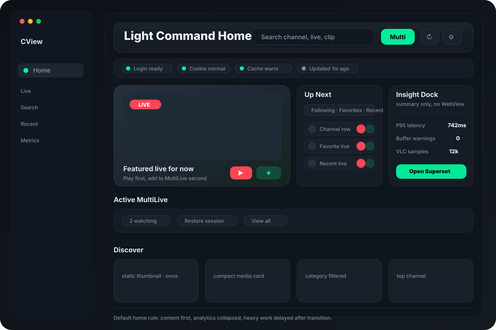

# CView 홈 화면 최종 경량 디자인 사료

작성일: 2026-04-28  
범위: `HomeView_v2`, `HomeV2/*`, `MainContentView`, 홈 디자인 관련 문서 전체  
목적: 여러 홈 디자인 `.md`의 결론을 하나의 기본 홈 디자인으로 통합한다. 기본 전제는 **홈은 가벼운 시청 시작 화면**이어야 한다는 점이다.

---

## 0. 최종 결론

최종 홈 디자인은 **Light Command Home**으로 정리한다.

핵심은 하나다. 홈은 분석 대시보드나 멀티라이브 스튜디오 전체가 아니라, 앱을 열자마자 `검색`, `재생`, `멀티라이브 추가` 중 하나를 빠르게 실행하는 얇은 command surface다.



기본 구조:

```text
Light Command Home
├─ Sticky Command Bar
├─ Lightweight Status Chips
├─ Featured Live + Up Next Queue + Optional Insight Dock
├─ Active MultiLive Strip
├─ Continue / Favorites / Following condensed rails
├─ Discover compact grid
└─ Compact Insights, collapsed by default
```

이 디자인은 기존 `Live Command Center 2.0`을 뼈대로 삼고, `Personal Library Home`의 개인 큐와 `MultiLive Studio Home`의 세션 복귀성을 작은 단위로 흡수한다. Superset은 홈 본문이 아니라 `Insight Dock + deep link`로만 둔다.

---

## 1. 분석한 Markdown 문서

| 문서 | 최종안에 반영한 내용 |
|---|---|
| `docs/home-design-recommendations-2026-04-27.md` | `Live Command Center 2.0`을 기본으로 선택하고, 개인 큐와 멀티라이브 액션만 흡수 |
| `docs/home-screen-redesign-analysis-2026-04-24.md` | 홈의 역할을 `바로 시청 / 검색 / 최근 복귀 / 멀티라이브 시작`으로 재정의 |
| `docs/home-superset-integration-designs-2026-04-27.md` | Superset은 WebView가 아니라 요약 도크와 `https://<host>:9443/` 딥링크로 연결 |
| `docs/home-frame-drop-analysis-2026-04-24.md` | 첫 프레임에 데이터 로드, 추천 계산, prefetch, appear animation을 겹치지 않게 하는 경량 제약 |
| `docs/design-improvement-plan-2026-04.md` | 4-layer surface, token 기반 컴포넌트화, 과한 white/blur/material 반복 축소 |
| `docs/PROJECT_ANALYSIS.md` | 현재 앱 셸은 홈/라이브/검색/최근/메트릭 사이드바 구조이므로 홈 내부에서 별도 사이드바를 만들지 않음 |

`docs/archive/live-design-sources-2026-04-28/*`의 라이브 메뉴 문서들은 홈 화면 설계의 직접 대상이 아니므로 기본 구조에는 넣지 않았다. 다만 “가벼운 mode bar, media-first, 얇은 chrome”이라는 시각 방향만 참고했다.

---

## 2. 하나로 합친 디자인 원칙

### 2.1 홈의 1차 역할

홈은 다음 3개 행동을 1화면 안에서 끝내야 한다.

1. 채널/라이브/클립 검색
2. 추천 또는 팔로잉 라이브 재생
3. 라이브를 멀티라이브에 추가

통계, Superset, 운영 상태, 상세 차트는 홈의 주인공이 아니다. 홈에서는 요약만 보여주고, 상세는 `MetricsDashboardView` 또는 Superset으로 이동한다.

### 2.2 기본 화면은 가볍게

기본 홈에서 금지할 것:

- Superset WebView 자동 로드
- VLC/AVPlayer 미리보기 embed
- 대형 차트 hero
- 여러 디자인 preset을 첫 화면에 노출
- 동일한 통계 카드 반복
- hover마다 shadow radius가 바뀌는 카드
- 모든 썸네일의 live loop refresh

기본 홈에 남길 것:

- sticky command bar
- 짧은 상태 chip row
- hero 1개
- `Up Next` 6~8개
- active multilive strip
- compact discover grid
- 접힌 insight/analytics 요약

### 2.3 기존 셸 유지

`MainContentView`와 현재 사이드바 구조는 유지한다. 홈 내부에 별도 sidebar, inspector, dashboard workspace를 추가하지 않는다. 홈은 상위 메뉴들의 첫 행동만 가져오는 허브다.

---

## 3. 최종 레이아웃

### 3.1 Wide macOS window

```text
┌──────────────────────────────────────────────────────────────────────────┐
│ Sticky Command Bar                                                       │
│ Greeting · Search · MultiLive · Refresh · Home Layout                    │
├──────────────────────────────────────────────────────────────────────────┤
│ Status Chips                                                             │
│ Login · Cookie · Cache · Data Health · Updated At                        │
├──────────────────────────────┬──────────────────────┬────────────────────┤
│ Featured Live                │ Up Next Queue        │ Insight Dock        │
│ 16:9 thumbnail               │ Following/Favorite   │ P95 latency         │
│ Play · +Multi · Chat · Info  │ Recent live rows     │ Buffer · VLC · link │
├──────────────────────────────┴──────────────────────┴────────────────────┤
│ Active MultiLive Strip, only when useful                                  │
├──────────────────────────────────────────────────────────────────────────┤
│ Continue Watching / Favorites / Following condensed rails                  │
├──────────────────────────────────────────────────────────────────────────┤
│ Discover compact grid + category chips                                    │
├──────────────────────────────────────────────────────────────────────────┤
│ Compact Insights, collapsed by default                                    │
└──────────────────────────────────────────────────────────────────────────┘
```

### 3.2 Narrow macOS window

```text
┌──────────────────────────────┐
│ Command Bar                  │
│ Status Chips                 │
│ Featured Live                │
│ Up Next Queue                │
│ Active MultiLive Strip       │
│ Continue / Favorites         │
│ Discover 2-column grid       │
│ Insights collapsed           │
└──────────────────────────────┘
```

좁은 창에서는 `Insight Dock`을 hero 옆에 두지 않는다. `Up Next` 아래로 내려가거나 기본 접힘 상태로 숨긴다.

---

## 4. 영역별 최종 기준

| 영역 | 최종 디자인 | 이유 |
|---|---|---|
| Command Bar | 항상 상단 sticky | 홈에서 가장 자주 쓰는 검색/새로고침/멀티라이브를 안정적으로 노출 |
| Status Chips | 배너 대신 작은 chip row | 로그인/쿠키/캐시 상태가 홈 흐름을 밀어내지 않게 함 |
| Featured Live | 대표 live 1개만 크게 | 홈 첫 결정을 단순화하고 thumbnail loop 수를 제한 |
| Up Next Queue | 팔로잉/즐겨찾기/최근 segmented queue | 개인화와 복귀 행동을 하나의 작은 패널로 압축 |
| Insight Dock | 옵션 도크, summary only | Superset/metrics는 홈 보조 정보로만 유지 |
| Active MultiLive | 세션이 있을 때만 strip | 멀티라이브 정체성은 노출하되 builder는 홈에 넣지 않음 |
| Continue/Favorites | condensed strip | 전체 목록은 `RecentFavoritesView`로 보내고 홈은 4~8개만 |
| Discover | compact media grid | 탐색은 유지하되 첫 화면을 피드처럼 과밀하게 만들지 않음 |
| Compact Insights | 접힘 기본값 | 홈이 운영 대시보드처럼 보이는 문제 방지 |

---

## 5. 현재 코드와의 매핑

현재 체크아웃의 `HomeView_v2`는 이미 통합안의 상당 부분을 갖고 있다.

| 최종 기준 | 현재 코드 상태 |
|---|---|
| `MainContentView -> HomeView_v2` 기본 라우팅 | `home.useV2 = true` |
| Sticky Command Bar | `HomeCommandBar`가 `ScrollView` 밖에 위치 |
| Status Chips | `statusPanelSection` |
| Featured + Up Next + Insight Dock | `topFocusSection(hero:)` |
| Up Next segmented queue | `UpNextSegment`, `upNextQueuePanel` |
| Active MultiLive Strip | `HomeActiveMultiLiveStrip` |
| Superset summary dock | `HomeSupersetInsightDock` |
| Density 연결 | `heroHeight`, `sectionSpacing`, `discoverGridMinimum`, `queueLimit` |
| 첫 프레임 작업 지연 | `bootTask` 380ms 지연 |
| prefetch 취소 | `HomeThumbnailPrefetcher.cancel()` |
| thumbnail loop 제한 | `LiveThumbnailView.RefreshPolicy.once` |

즉, 새 디자인은 전면 재작성안이 아니라 **현재 구현을 기준으로 남길 것과 줄일 것을 확정하는 기준안**이다.

---

## 6. 시각 스타일

### 6.1 톤

- macOS 도구 앱처럼 얇고 조용한 surface
- `chzzkGreen`은 primary action과 상태 OK에만 사용
- `live red`는 재생/라이브 상태에만 사용
- 배경은 4-layer surface stack 유지
- card radius는 8~12pt 중심, 큰 landing card 느낌은 피함

### 6.2 줄일 표현

- 큰 gradient hero 배경
- glass/blur/material 중첩
- shadow radius animation
- dashboard card 4개 이상 동시 노출
- 모든 섹션의 entrance stagger animation

### 6.3 권장 밀도

| density | hero height | section spacing | queue rows | discover min |
|---|---:|---:|---:|---:|
| compact | 236 | 12 | 6 | 200 |
| comfortable | 292 | 16 | 7 | 220 |
| spacious | 336 | 20 | 8 | 250 |

기본값은 `comfortable`이 맞다. 다만 “홈은 가벼워야 한다”는 요구를 기준으로 실제 제품 기본값은 `comfortable` 유지, 좁은 창 또는 저전력 상태에서는 `compact` 자동 제안이 적절하다.

---

## 7. 인터랙션 규칙

1. 모든 live card의 1차 액션은 `재생`이다.
2. 모든 live card의 2차 액션은 `+ 멀티라이브`다.
3. 상세 분석, 채널 상세, 채팅 단독 열기는 secondary action menu에 둔다.
4. 검색은 홈에서 시작하지만 상세 결과는 `SearchView`로 보낸다.
5. Superset은 홈에서 열지 않고 `Open Superset` deep link로 보낸다.
6. 멀티라이브 builder는 홈에 넣지 않는다. 홈에서는 strip, slot summary, quick add까지만 담당한다.
7. 데이터가 비어도 hero 영역은 제거하지 않는다. fallback은 `topChannels.first -> recentLiveFollowing.first -> empty CTA` 순서다.

---

## 8. 성능 기준

홈 디자인의 경량 조건은 다음을 만족해야 한다.

| 기준 | 목표 |
|---|---|
| 첫 렌더 | static shell 먼저 표시, 데이터/이미지 작업은 transition 이후 |
| 썸네일 | hero와 상단 소수만 live loop, grid는 once 또는 cached thumbnail |
| prefetch | debounce + cancellable |
| Superset | 기본 WebView 없음, HEAD/check와 summary metric만 |
| 애니메이션 | 메뉴 전환 중 section appear 생략 |
| monitor | 기본 off, 사용자가 켤 때만 overlay |
| 카드 수 | 첫 fold 기준 hero 1 + queue 6~8 + dock 1 이하 |

---

## 9. 남기는 디자인과 폐기하는 디자인

### 남기는 것

- `Live Command Center 2.0`의 상단 command 구조
- `Personal Library Home`의 팔로잉/즐겨찾기/최근 queue
- `MultiLive Studio Home`의 active session strip과 `+ 멀티라이브` quick action
- `Superset Insight Dock`의 summary + deep link
- `home-frame-drop` 문서의 지연 로드, prefetch 취소, thumbnail loop 제한

### 폐기하거나 고급 모드로 내리는 것

- 분석형 홈 workspace
- 운영 모니터 홈
- 홈 내부 Superset WebView
- 멀티라이브 슬롯 builder 상시 노출
- 통계/차트 중심 legacy dashboard
- 3개 이상의 홈 디자인 variant를 사용자가 직접 고르게 하는 기본 UI

---

## 10. 구현/정리 우선순위

이미 현재 구현에 반영된 항목은 유지하고, 추가 정리는 아래 순서가 좋다.

| 우선순위 | 작업 |
|---|---|
| P0 | `Insight Dock` 기본 표시 여부 재검토: 일반 홈에서는 접힘 또는 `show.supersetDock` off 기본도 검토 |
| P0 | hero가 없을 때 fallback CTA가 항상 화면 중심을 유지하는지 확인 |
| P0 | Discover/Top grid의 `LiveThumbnailView`가 `.once` 정책을 쓰는지 전부 확인 |
| P1 | status chip row가 좁은 창에서 과도한 가로 scroll이 되지 않도록 chip 우선순위 부여 |
| P1 | `Up Next` empty state에서 바로 `Discover` 또는 `Search`로 이어지는 작은 CTA 추가 |
| P1 | Superset 연결 확인은 홈 첫 진입마다 즉시 수행하지 말고 짧은 cache TTL 적용 |
| P2 | 고급 사용자용으로만 `운영 모드`를 추가하고 기본 홈과 분리 |

---

## 11. 검증 시나리오

| 시나리오 | 확인 |
|---|---|
| 캐시 있는 첫 실행 | command bar, hero, queue가 skeleton 과다 없이 표시 |
| 캐시 없는 첫 실행 | hero fallback/empty CTA가 화면 중심 유지 |
| 비로그인 | 개인 queue는 빈 화면이 아니라 로그인 CTA + Discover로 연결 |
| 쿠키 만료 | 큰 배너 대신 status chip 또는 inline alert로 처리 |
| Superset offline | 홈 재생/검색/멀티라이브 기능이 영향받지 않음 |
| Metrics offline | Insight Dock만 degraded, 홈 콘텐츠는 유지 |
| 900px 이하 | hero, queue, dock이 단일열로 내려가며 겹치지 않음 |
| 메뉴 전환 직후 | appear animation, prefetch, 추천 계산이 첫 프레임과 겹치지 않음 |
| Reduce Motion | pulse/appear/hover scale이 과하게 동작하지 않음 |
| Light mode | green/live/status text 대비가 유지 |

---

## 12. 최종 한 줄 기준

홈 화면은 **가벼운 시청 명령판**이어야 한다. 기본 홈에는 `검색`, `대표 라이브`, `Up Next`, `+ 멀티라이브`, `요약 도크`만 남기고, 분석/운영/대시보드 성격은 접거나 별도 화면으로 보낸다.
