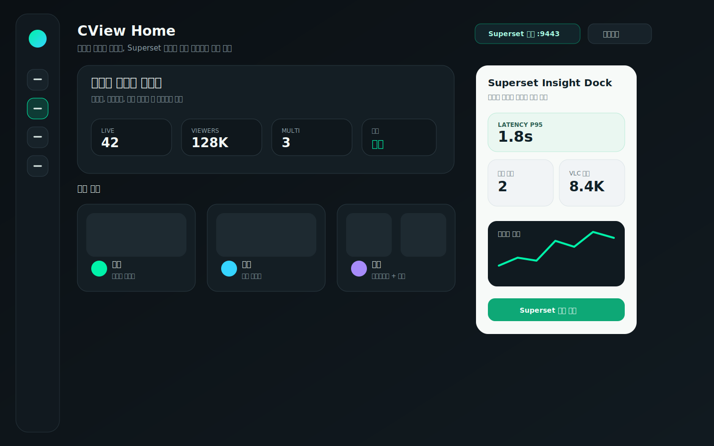
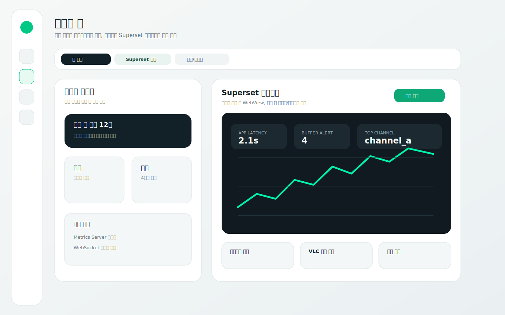
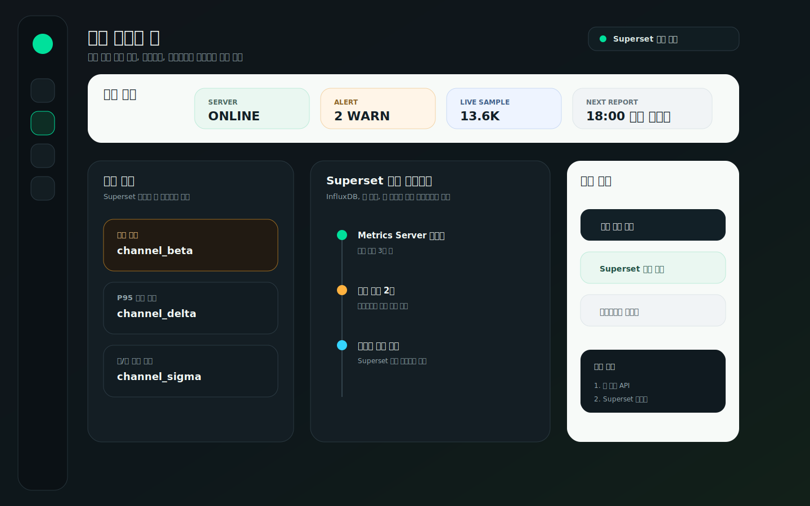

# CView 홈 Superset 연동 강화 디자인 3안

작성일: 2026-04-27  
대상: `HomeView_v2` 기반 CView 홈 화면, Metrics Server, Superset 대시보드

## 1. 현재 구현 기준

현재 홈은 `MainContentView`에서 `home.useV2` 기본값 `true`로 `HomeView_v2`를 표시한다. 홈 내부에는 이미 다음 성격의 요소가 있다.

- 라이브 우선 진입: 팔로잉, 최근 시청, 즐겨찾기, 추천, 상위 채널 섹션
- 간이 지표: `HomeInsightsCompactStrip`
- 우상단 성능 모니터: `HomeMonitorPanel`
- 별도 도구 메뉴: `MetricsDashboardView`

서버 쪽 Superset은 일반 `/superset` 서브경로에 직접 붙어 있지 않다. `nginx-ssl` 설정상 `/superset`은 `https://host:9443/`로 리다이렉트되고, 9443 포트에서 `chzzk-superset:8088`을 루트로 프록시한다. 즉, 홈 연동 설계는 “앱 홈 안에 Superset 전체를 무조건 삽입”보다 “홈에는 요약, 상세 분석은 Superset으로 연결”이 더 안전하다.

## 2. 설계 원칙

1. 홈은 여전히 시청 시작 화면이어야 한다. Superset은 분석 보조 레이어로 둔다.
2. 첫 화면은 가벼워야 한다. Superset WebView 또는 대형 차트는 사용자가 요청할 때만 로드한다.
3. 앱 네이티브 요약과 Superset 상세 분석의 역할을 분리한다.
4. 레이턴시, 버퍼, VLC 샘플, 웹/앱 싱크 편차처럼 CView의 라이브 품질과 직접 연결되는 지표를 우선 노출한다.
5. Superset이 인증, 세션, 임베드 정책 때문에 표시되지 않아도 홈 기능은 깨지지 않아야 한다.

## 3. 디자인 A: Superset Insight Dock

### 컨셉

현재 홈 구조를 가장 적게 흔드는 추천안이다. 좌측과 중앙은 기존 `HomeView_v2`의 라이브 진입 흐름을 유지하고, 우측에 “Superset Insight Dock”을 붙인다. 홈에서는 지표 원본 차트가 아니라 요약 KPI만 보여주고, 상세 분석은 `Superset 상세 열기` 버튼으로 9443 대시보드에 연결한다.

### 화면 구성

- 상단: CView Home 제목, 서버/Superset 상태, Superset 열기 버튼
- 중앙: 오늘의 라이브 지휘판, 탐색/시청/멀티 카드
- 우측 도크: P95 레이턴시, 버퍼 경고, VLC 샘플 수, 시청자 추이 미니 차트

### 장점

- 앱 컨셉이 “시청 앱”으로 유지된다.
- Superset 연동이 실패해도 홈의 핵심 기능이 영향받지 않는다.
- 현재 `HomeInsightsCompactStrip`, `HomeMonitorPanel`, `MetricsDashboardView`와 자연스럽게 이어진다.

### 구현 난이도

중간. 앱은 Superset 자체를 직접 렌더링하기보다 Metrics API에서 집계 요약을 받아 표시하고, 버튼은 `https://host:9443/` 딥링크를 연다.

## 4. 디자인 B: 분석형 홈 Workspace

### 컨셉

홈 안에 “홈 요약 / Superset 분석 / 알림 리포트” 탭을 두고, 분석 탭에서 Superset 대시보드 미리보기를 제공한다. 운영자나 품질 분석을 자주 보는 사용자에게 적합하다.

### 화면 구성

- 좌측: 라이브 컨트롤, 탐색/멀티 시작, 서버 상태
- 우측: Superset 미리보기 패널
- 하단: 레이턴시 보드, VLC 품질 보드, 채널 랭킹 보드 바로가기

### 장점

- Superset을 홈 주요 경험으로 끌어올릴 수 있다.
- 분석 중심 사용자에게는 메뉴 이동이 줄어든다.
- 현재 별도 `MetricsDashboardView`와 Superset의 역할을 하나의 홈 작업공간으로 통합할 수 있다.

### 주의점

- macOS WebView 임베드를 쓸 경우 Superset의 인증 세션, CSP, frame 정책, 포트 9443 인증서 처리가 UX 리스크가 된다.
- 홈 첫 진입부터 WebView를 로드하면 무거워 보일 수 있으므로 탭 선택 후 지연 로드가 필요하다.

### 구현 난이도

높음. 임베드 정책을 정리해야 하고, 실패 시 썸네일/딥링크 fallback이 필요하다.

## 5. 디자인 C: 운영 모니터 홈

### 컨셉

홈을 “시청 전 운영 상태 확인 화면”으로 확장한다. Superset 알림과 Metrics Server 상태를 홈 상단에 보여주고, 위험 채널을 바로 단일 라이브나 멀티라이브로 열 수 있게 한다.

### 화면 구성

- 상단: 서버 온라인, 경고 수, 라이브 샘플, 다음 리포트
- 좌측: 위험 채널 목록
- 중앙: Superset 진단 타임라인
- 우측: 문제 채널 열기, Superset 원본 보기, 멀티라이브 재배치

### 장점

- 레이턴시/버퍼링 문제를 보는 앱 운영자에게 가장 강하다.
- Superset 대시보드의 발견 사항을 실제 CView 액션으로 연결한다.
- 멀티라이브 안정성, VLC 품질, 웹/앱 싱크 개선 작업과 잘 맞는다.

### 주의점

- 일반 시청자에게는 홈이 감시 도구처럼 보일 수 있다.
- 기본 홈으로 쓰기보다 `운영 모드` 또는 `고급 모니터` 토글 뒤에 두는 편이 적합하다.

### 구현 난이도

중간 이상. Superset Alert/Report 또는 별도 요약 API를 홈 카드 데이터로 변환해야 한다.

## 6. 비교

| 항목 | A. Insight Dock | B. 분석형 Workspace | C. 운영 모니터 |
|---|---|---|---|
| 기본 홈 적합성 | 높음 | 중간 | 낮음 |
| Superset 존재감 | 중간 | 높음 | 높음 |
| 가벼움 | 높음 | 낮음~중간 | 중간 |
| 구현 리스크 | 낮음~중간 | 높음 | 중간 |
| 추천 사용자 | 일반 시청자 + 파워유저 | 분석 중심 사용자 | 운영/디버깅 사용자 |
| 기존 구조와의 궁합 | 매우 좋음 | 보통 | 좋음 |

## 7. 최종 추천

기본 홈에는 **A. Superset Insight Dock**을 추천한다. 현재 앱이 이미 홈 인사이트, 성능 모니터, 메트릭 대시보드를 갖고 있으므로 Superset을 홈의 주인공으로 올리기보다 “요약 도크 + 상세 열기”로 붙이는 편이 가장 자연스럽다.

추가로 다음 단계 확장이 좋다.

1. 1차: Insight Dock 추가  
   홈 우측 또는 상단 보조 영역에 Superset 요약 KPI와 `Superset 열기` 버튼을 둔다.

2. 2차: 분석형 Workspace를 선택 탭으로 제공  
   사용자가 `Superset 분석` 탭을 눌렀을 때만 WebView 또는 썸네일 미리보기를 로드한다.

3. 3차: 운영 모니터를 고급 모드로 제공  
   버퍼 경고, 레이턴시 급등, 웹/앱 싱크 편차를 실제 라이브/멀티라이브 액션으로 연결한다.

## 8. 구현 메모

- 홈 데이터는 Superset 직접 쿼리보다 Metrics API 요약값을 우선 사용한다.
- Superset 상세 진입 URL은 현재 서버 구조 기준 `https://<host>:9443/`를 기본으로 둔다.
- `/superset` 경로는 nginx에서 9443으로 리다이렉트되므로 앱 설정에는 `supersetBaseURL`을 별도 값으로 두는 편이 명확하다.
- WebView 임베드는 첫 단계에서 피하고, 버튼/딥링크/스냅샷부터 도입한다.
- Superset unavailable 상태를 홈 카드에서 명확히 보여주되, 라이브 탐색과 시청 버튼은 항상 활성으로 유지한다.

## 9. 검증 시나리오

1. Superset 정상: 홈 KPI가 표시되고 `Superset 열기`가 9443 대시보드로 이동한다.
2. Superset 비정상: 홈에는 `Superset 연결 실패`만 표시되고 라이브 탐색/시청/멀티 진입은 정상 동작한다.
3. Metrics Server 정상, Superset 비정상: 홈 요약 KPI는 계속 표시하고 상세 분석 버튼만 비활성화한다.
4. Metrics Server 비정상: 기존 홈 라이브 데이터와 로컬 추천은 유지하고 분석 도크는 skeleton 또는 오프라인 상태로 표시한다.
5. 메뉴 전환: 홈 진입 첫 프레임에서 WebView나 대형 차트를 로드하지 않아 프레임 드랍을 만들지 않는다.
