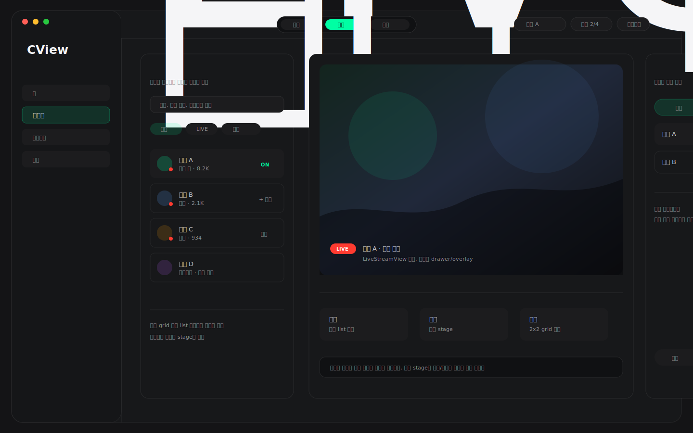

# CView 라이브 최종 종합 디자인안

작성일: 2026-04-27  
목적: 지금까지 제안한 라이브 디자인을 조합해 하나의 최종 방향으로 정리한다.

---

## 최종안: Light Live Hub



## 핵심 조합

이 최종안은 다음 요소를 조합했다.

| 가져온 방향 | 반영 방식 |
|---|---|
| Minimal Mode Bar | 상단에 얇은 `탐색 / 시청 / 멀티` 모드 바 배치 |
| Focus Split | 왼쪽에는 탐색 list를 유지하고 중앙 stage만 전환 |
| Floating Switcher | 영상/미디어 stage가 화면의 중심이 되도록 chrome 최소화 |
| MultiLive Workbench | 멀티 모드에서는 중앙 stage가 2x2 grid로 전환 |
| Live Command Board | 탐색 list에서 재생, 멀티 추가, 채팅 진입을 빠르게 제공 |

## 화면 구조

```text
┌──────────────────────────────────────────────────────────────┐
│ Slim Mode Bar: [탐색] [시청] [멀티]   현재 채널 / 세션 / 갱신 │
├───────────────┬───────────────────────────────┬──────────────┤
│ 탐색 List      │ Media Stage                    │ Drawer       │
│ 검색/필터      │ 시청: 단일 LiveStreamView       │ 채팅/설정     │
│ 라이브 목록    │ 멀티: 2x2 MultiLive grid        │ 필요 시 표시  │
└───────────────┴───────────────────────────────┴──────────────┘
```

## 왜 이 디자인이 가장 적합한가

- 이전 시안보다 panel과 card 중첩이 적어 가볍다.
- `탐색 / 시청 / 멀티` 버튼 모델이 명확하다.
- 탐색 목록은 유지하면서 중앙만 전환하므로 채널을 바꾸는 흐름이 빠르다.
- 단일 시청과 멀티 시청이 같은 stage 안에서 전환되어 앱 컨셉이 일관된다.
- 채팅과 설정은 오른쪽 drawer로 빼서 기본 화면을 덜 복잡하게 만든다.

## 구현 방향

1. `LiveMode` enum을 추가한다.
   - `explore`
   - `watch`
   - `multi`
2. 상단에 `LiveModeBar`를 추가한다.
3. 왼쪽 탐색 list는 compact variant로 유지한다.
4. 중앙 stage는 mode에 따라 전환한다.
   - `watch`: 단일 `LiveStreamView` 기반 player
   - `multi`: `multiLiveInlinePanel` 기반 grid
5. 오른쪽 drawer는 채팅/설정/세션 도구를 필요할 때만 보여준다.

## 한 줄 결론

최종 방향은 **가벼운 3모드 Live Hub**다. `탐색`은 왼쪽에 남기고, `시청`과 `멀티`는 중앙 stage에서 전환하며, 채팅과 설정은 오른쪽 drawer로 분리하는 구조가 현재 앱 컨셉에 가장 잘 맞는다.
