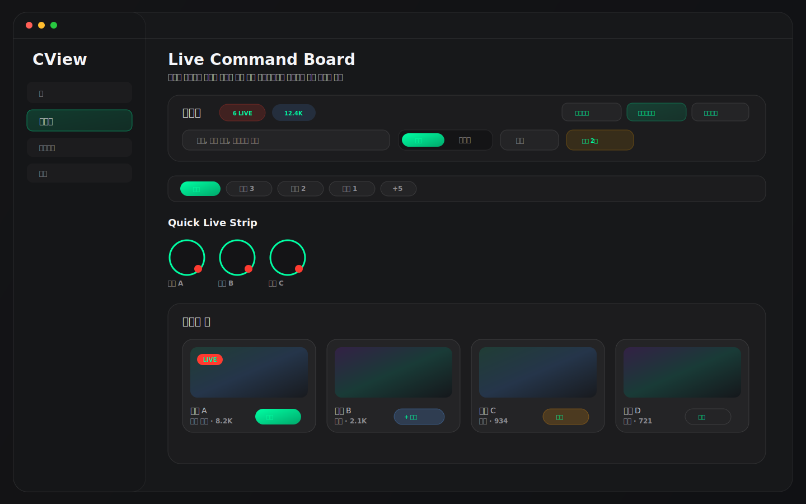
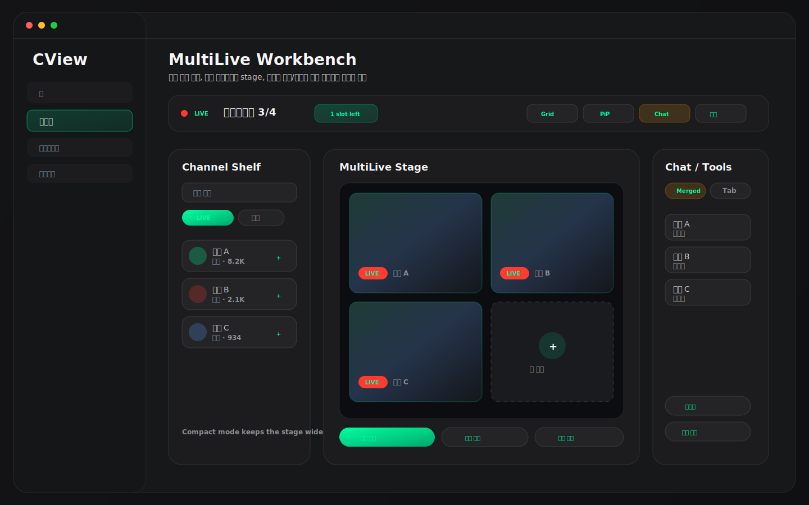
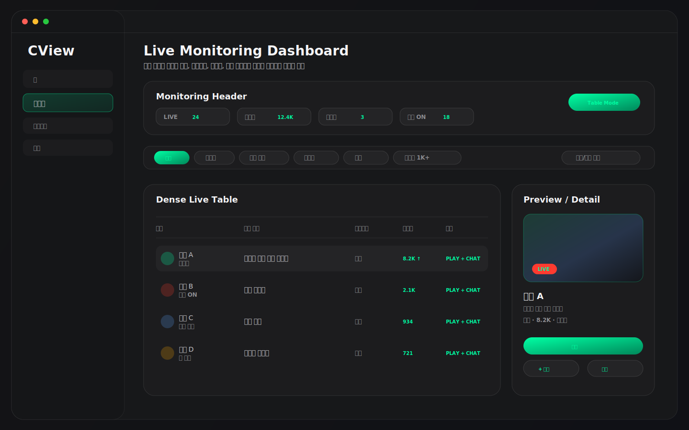

# CView 라이브 메뉴 화면 디자인 추천 3안

작성일: 2026-04-27  
범위: `FollowingView`, `FollowingView+Header`, `FollowingView+List`, `FollowingCardViews`, `FollowingView+MultiLive`, `FollowingView+MultiChat`, `FollowingViewState`, `ResponsiveFollowingLayout`, `AppRouter`  
목적: 현재 사이드바 "라이브" 메뉴의 실제 구현을 기준으로, 다음 개선 단계에서 선택할 수 있는 화면 디자인 방향 3가지를 제안한다.

---

## 0. 결론

현재 라이브 메뉴는 단순 팔로잉 목록이 아니라 **팔로잉 채널 탐색 + 멀티라이브 stage + 멀티채팅 panel**이 한 화면에 합쳐진 작업 공간이다. `AppRouter.SidebarItem.following`은 "라이브" 메뉴로 노출되며, `MainContentView`에서 `FollowingView(viewModel:)`를 렌더링한다.

추천 우선순위는 다음과 같다.

| 순위 | 추천안 | 목표 | 판단 |
|---|---|---|---|
| 1 | Live Command Board | 일반적인 팔로잉 탐색, 빠른 재생, 낮은 구현 리스크 | 기본 추천 |
| 2 | MultiLive Workbench | 멀티라이브/멀티채팅을 중심에 둔 고급 사용자 흐름 | CView 차별성 강화 |
| 3 | Live Monitoring Dashboard | 많은 팔로잉 채널을 상태 중심으로 감시하는 흐름 | 파워유저/운영형 UI |

현실적인 적용 순서는 1안으로 라이브 메뉴의 기본 정보 구조를 정리한 뒤, 2안의 멀티라이브 작업대 요소를 우측 panel에 강화하고, 3안의 모니터링 요소는 선택 모드로 제공하는 방식이 가장 안전하다.

### 예시 이미지 미리보기

아래 이미지는 실제 구현 캡처가 아니라, 현재 코드 구조와 `DesignTokens` 톤을 기준으로 만든 디자인 방향 mockup이다.







---

## 1. 현재 구현 분석

### 1.1 현재 라우팅과 화면 역할

근거:

- `AppRouter.SidebarItem.following = "라이브"`
- `MainContentView`의 `.following` detail은 `FollowingView(viewModel:)`
- `FollowingViewState`가 정렬, 필터, 페이지, 팔로잉 목록 표시, 멀티라이브, 멀티채팅 상태를 보존
- `FollowingViewState.showFollowingList` 기본값은 `false`
- `FollowingViewState.showMultiLive`, `showMultiChat` 기본값은 `true`
- `FollowingViewState.followingListRatio`는 0.25

의미:

- 현재 화면은 오른쪽의 멀티라이브/멀티채팅 panel을 기본으로 열고, 팔로잉 목록은 필요할 때 왼쪽에서 여는 구조다.
- "라이브 메뉴"라는 이름과 달리 실제 첫 인상은 멀티라이브 작업 공간에 더 가깝다.
- 따라서 디자인 추천은 목록 화면만 다루면 부족하고, 목록과 작업 panel의 관계를 함께 정해야 한다.

### 1.2 현재 화면 구성

현재 `FollowingView`의 주요 구성은 다음과 같다.

1. 로그인/쿠키/빈 상태 gate
2. `mainContent`
3. 왼쪽 `followingListContent`
4. 오른쪽 `sidePanelContent`
5. `headerSection`
6. `searchAndFilterCard`
7. `categoryFilterChips`
8. `liveAvatarStrip`
9. `livePagingView`
10. `offlinePagingView`
11. `multiLiveInlinePanel`
12. `multiChatInlinePanel`

좋은 점:

- `ResponsiveFollowingLayout`이 카드 폭 320pt 기준으로 컬럼, 페이지 크기, 뱃지, 아바타 크기를 결정한다.
- 검색은 채널명, 방송 제목, 카테고리까지 필터링한다.
- 카테고리 칩은 상위 8개 이후 `+N` 메뉴로 overflow를 처리한다.
- 라이브 카드와 아바타 strip 모두 멀티라이브 추가 액션을 제공한다.
- 멀티라이브 세션이 추가되면 멀티채팅 세션도 자동으로 추가된다.
- 멀티라이브 비디오 영역은 transition animation 전파를 차단해 플레이어 렌더링을 보호한다.

아쉬운 점:

- 사이드바 아이콘이 `heart.fill`이라 "라이브"보다 즐겨찾기/팔로잉으로 읽힌다.
- 기본 상태에서 팔로잉 목록이 닫혀 있어 첫 방문자는 어디서 채널을 고르는지 바로 알기 어렵다.
- 헤더, 검색/필터, 카테고리, 아바타 strip, grid가 모두 세로로 쌓여 리스트 상단 밀도가 높다.
- 카드 hover overlay의 중심 CTA가 "멀티라이브" 하나라 재생, 채널 상세, 채팅만 열기 동작의 우선순위가 덜 명확하다.
- 멀티라이브와 멀티채팅이 동시에 열리면 우측 panel의 목적은 강하지만, 라이브 목록과의 관계가 좁은 폭에서 답답할 수 있다.
- 세션 수 제한은 `MultiLiveManager.effectiveMaxSessions`, `MultiChatSessionManager.maxSessions`로 존재하지만, 화면에서 "남은 슬롯"이 강하게 보이지 않는다.

---

## 2. 디자인 추천안 1: Live Command Board


### 핵심 컨셉

라이브 메뉴를 "팔로잉 라이브를 빠르게 고르고, 재생 또는 멀티라이브에 추가하는 보드"로 정리한다. 현재 구현의 반응형 grid와 필터 자산을 유지하면서, 첫 화면에서 목록 탐색이 더 분명하게 보이도록 한다.

### 추천 레이아웃

```text
┌──────────────────────────────────────────────────────────────┐
│ Header: 라이브 / 통계 배지 / 새로고침 / 멀티라이브 / 멀티채팅 │
├──────────────────────────────────────────────────────────────┤
│ Search + Segment + Sort + Active Filter Badge                 │
├──────────────────────────────────────────────────────────────┤
│ Category Chips                                                │
├──────────────────────────────────────────────────────────────┤
│ Quick Live Strip: 라이브 중인 팔로잉 아바타                    │
├──────────────────────────────────────────────────────────────┤
│ Live Grid                                                     │
│ 카드 hover: 재생 / +멀티라이브 / 채팅 / 채널 상세             │
├──────────────────────────────────────────────────────────────┤
│ Offline Following, 접이식                                     │
└──────────────────────────────────────────────────────────────┘
```

### 구체 개선

1. `showFollowingList`의 기본 진입을 더 친절하게 만든다.
   - 완전 기본값을 바꾸는 대신, 세션이 없을 때는 팔로잉 목록을 자동 노출하는 조건부 진입이 안전하다.
   - 멀티라이브/멀티채팅 세션이 있으면 현재처럼 작업 panel을 유지한다.

2. 카드 hover action을 4개로 정리한다.
   - Primary: 재생
   - Secondary: `+ 멀티라이브`
   - Tertiary: 채팅만 열기
   - More: 채널 상세/알림

3. 헤더와 필터 영역을 한 덩어리로 묶는다.
   - 현재는 `headerSection`, `searchAndFilterCard`, `categoryFilterChips`가 이어진다.
   - 시각적으로는 하나의 sticky command surface처럼 보이게 하는 편이 좋다.

4. 오프라인 팔로잉은 접이식 보조 영역으로 둔다.
   - 현재는 live grid 아래에 offline paging view가 있다.
   - 기본은 접고, 검색 결과 또는 "전체" 모드에서만 자연스럽게 열리게 한다.

### 장점

- 현재 구조에서 가장 작은 변경으로 체감 개선이 크다.
- 라이브 메뉴의 기본 목적이 명확해진다.
- 성능 위험이 낮다. 기존 `ResponsiveFollowingLayout`, `livePagingView`, `liveAvatarStrip`을 그대로 살릴 수 있다.

### 리스크

- 멀티라이브 중심 사용자는 오른쪽 작업 panel이 덜 강조된다고 느낄 수 있다.
- 목록 밀도가 높아지는 만큼 sticky header 높이와 grid 시작 위치를 잘 조정해야 한다.

### 우선순위

| 우선순위 | 작업 |
|---|---|
| P0 | 카드 hover action을 재생 / +멀티라이브 / 채팅 / 상세로 분리 |
| P0 | 세션이 없을 때 팔로잉 목록 우선 노출 |
| P1 | header + search/filter + category를 하나의 command surface로 정리 |
| P1 | 오프라인 팔로잉 기본 접기 |
| P2 | 사이드바 아이콘을 `heart.fill`에서 live 의미 아이콘으로 교체 검토 |

---

## 3. 디자인 추천안 2: MultiLive Workbench


### 핵심 컨셉

라이브 메뉴를 "멀티라이브 작업대"로 정의한다. 왼쪽은 채널 후보, 중앙은 멀티라이브 stage, 오른쪽은 멀티채팅과 세션 도구다. CView의 차별 기능을 가장 강하게 보여주는 방향이다.

### 추천 레이아웃

```text
┌──────────────────────────────────────────────────────────────┐
│ Workbench Top Bar: 세션 수 / 레이아웃 / PiP / 채팅 / 설정     │
├───────────────┬──────────────────────────────┬───────────────┤
│ Channel Shelf │ MultiLive Stage               │ Chat / Tools   │
│ 검색/필터     │ Grid 또는 Single Stage         │ Merged Chat     │
│ 라이브 후보   │ Empty slot + add CTA           │ 세션 상태       │
└───────────────┴──────────────────────────────┴───────────────┘
```

### 구체 개선

1. `followingListContent`를 "Channel Shelf"로 재해석한다.
   - 현재 25% 고정 비율은 채널 선반으로는 적절하다.
   - 다만 전체 header가 너무 크면 stage 공간을 압박하므로 compact header가 필요하다.

2. 멀티라이브 stage에 슬롯 상태를 명확히 표시한다.
   - `effectiveMaxSessions` 기준으로 `3/4`, `1 slot left` 같은 상태를 보여준다.
   - 빈 슬롯은 "채널을 추가하세요" CTA로 유지한다.

3. 멀티채팅은 오른쪽 tool rail로 정리한다.
   - 단일 채널 chat, merged chat, reconnect, disconnect all을 상단 tab bar에 유지한다.
   - 세션이 많을 때는 채팅 탭보다 merged view를 우선 노출하는 옵션이 좋다.

4. 카드 drag/drop까지는 후순위다.
   - 우선은 hover `+`와 context menu로 충분하다.
   - drag/drop은 구현 비용 대비 초기 효과가 크지 않다.

### 장점

- CView의 멀티라이브/멀티채팅 정체성이 가장 강하다.
- 현재 기본 상태(`showMultiLive = true`, `showMultiChat = true`)와 잘 맞는다.
- 홈에서 멀티라이브를 시작한 뒤 라이브 메뉴로 들어오는 흐름이 자연스럽다.

### 리스크

- 첫 사용자에게는 복잡해 보일 수 있다.
- 좁은 창에서 3분할은 부담이 크므로 2분할 또는 panel collapse 규칙이 필수다.
- 플레이어 렌더링과 목록 애니메이션이 동시에 움직이면 frame drop 리스크가 있다.

### 우선순위

| 우선순위 | 작업 |
|---|---|
| P0 | 세션 슬롯 수와 남은 슬롯 표시 추가 |
| P0 | channel shelf compact mode 추가 |
| P1 | stage empty slot CTA를 더 눈에 보이게 정리 |
| P1 | chat/tool rail collapse 규칙 추가 |
| P2 | 추천 조합으로 세션 일괄 추가 |

---

## 4. 디자인 추천안 3: Live Monitoring Dashboard


### 핵심 컨셉

라이브 메뉴를 "팔로잉 상태 모니터"로 만든다. 많은 팔로잉 채널을 가진 사용자가 라이브 상태, 카테고리, 시청자 변화, 알림 설정을 빠르게 훑는 구조다.

### 추천 레이아웃

```text
┌──────────────────────────────────────────────────────────────┐
│ Monitoring Header: 라이브 수 / 총 시청자 / 급상승 / 알림       │
├──────────────────────────────────────────────────────────────┤
│ Filter Matrix: 전체, 라이브, 카테고리, 알림, 시청자 구간       │
├──────────────────────────────┬───────────────────────────────┤
│ Dense Live Table             │ Preview / Detail Panel         │
│ 채널, 제목, 카테고리, 시청자 │ 선택 채널 미리보기/액션         │
│ 상태, 알림, +멀티라이브      │ 채널 상세, 채팅, 멀티라이브      │
└──────────────────────────────┴───────────────────────────────┘
```

### 구체 개선

1. card grid 대신 dense table mode를 추가한다.
   - 썸네일 중심 grid는 시각적으로 좋지만, 팔로잉이 많은 경우 스캔 속도가 떨어질 수 있다.
   - table mode는 채널명, 방송 제목, 카테고리, 시청자 수, 경과 시간, 알림 상태를 한 줄로 보여준다.

2. 오른쪽 preview/detail panel을 둔다.
   - row 선택 시 썸네일, 제목, 채널 상세, 재생, 멀티라이브 추가, 채팅만 열기 표시
   - 실제 플레이어 embed 없이 preview만 사용하면 성능 리스크를 낮출 수 있다.

3. 알림 설정을 표면화한다.
   - 이미 context menu에 채널별 알림 설정 흐름이 있다.
   - 3안에서는 row 안에 작은 bell 상태를 보여주는 것이 적합하다.

4. 시청자/카테고리 변화 감지를 보조 지표로 둔다.
   - `HomeViewModel`이 이미 following live count, following total viewers, live rate를 계산한다.
   - 라이브 메뉴에서는 "급상승", "방금 시작", "긴 방송" 같은 운영형 필터로 확장할 수 있다.

### 장점

- 팔로잉 채널이 많을수록 효과가 크다.
- grid보다 스캔 속도와 비교성이 좋다.
- 채널 알림/모니터링 기능을 더 잘 드러낸다.

### 리스크

- 일반 사용자에게는 다소 업무 도구처럼 보일 수 있다.
- 기존 카드 UI와 별도 mode가 필요해 구현 범위가 늘어난다.
- 썸네일 중심의 미디어 앱 감성은 1안보다 약하다.

### 우선순위

| 우선순위 | 작업 |
|---|---|
| P0 | list/table view mode 토글 추가 |
| P1 | selected channel preview panel 추가 |
| P1 | row-level bell / +multilive / chat actions 노출 |
| P2 | 급상승/방금 시작/긴 방송 필터 추가 |
| P2 | viewer delta 표시 |

---

## 5. 세 안의 비교

| 항목 | 1안 Live Command Board | 2안 MultiLive Workbench | 3안 Monitoring Dashboard |
|---|---:|---:|---:|
| 기존 코드 재사용 | 높음 | 높음 | 중간 |
| 구현 난이도 | 낮음~중간 | 중간~높음 | 중간~높음 |
| 첫 사용자 이해도 | 높음 | 중간 | 중간 |
| 멀티라이브 차별성 | 중간 | 매우 높음 | 중간 |
| 팔로잉 다수 사용자 효율 | 중간 | 중간 | 매우 높음 |
| 성능 리스크 | 낮음 | 중간 | 낮음~중간 |
| 추천 적용 순서 | 1순위 | 2순위 | 3순위 |

---

## 6. 최종 권장 조합

가장 현실적인 적용안은 다음 조합이다.

```text
Live Command Board 기반
├─ 좌측/메인: 팔로잉 라이브 탐색 보드
├─ 상단: 통합 command surface
├─ 카드: 재생 / +멀티라이브 / 채팅 / 상세 액션 분리
├─ 우측: MultiLive Workbench panel 유지
└─ 옵션: Monitoring Dashboard를 view mode로 제공
```

이 조합이 좋은 이유:

- 현재 코드 구조를 크게 뒤집지 않는다.
- "라이브 메뉴"라는 이름과 실제 첫 화면의 목적이 맞아진다.
- 멀티라이브/멀티채팅은 우측 작업 panel로 계속 강하게 유지된다.
- 팔로잉이 많은 사용자는 table/monitoring mode로 확장할 수 있다.

---

## 7. 구현 체크리스트

### P0

- 세션이 없을 때는 팔로잉 목록을 기본 노출한다.
- 라이브 카드 hover action을 4개로 분리한다.
  - 재생
  - `+ 멀티라이브`
  - 채팅만 열기
  - 채널 상세
- 멀티라이브 세션 슬롯 수를 명확히 표시한다.
- `heart.fill` 사이드바 아이콘을 라이브 의미 아이콘으로 교체 검토한다.

### P1

- header/search/filter/category를 sticky command surface로 정리한다.
- channel shelf compact mode를 추가한다.
- 우측 panel collapse 규칙을 정한다.
  - 넓은 창: 리스트 + stage + chat
  - 중간 창: 리스트 + stage, chat은 overlay
  - 좁은 창: stage 또는 list 단일 선택
- 오프라인 섹션을 접이식으로 전환한다.

### P2

- grid/table view mode 토글을 추가한다.
- selected channel preview panel을 추가한다.
- 급상승/방금 시작/긴 방송 같은 운영형 필터를 추가한다.
- 추천 멀티라이브 조합 시작 기능을 추가한다.

---

## 8. 검증 시나리오

| 시나리오 | 확인할 것 |
|---|---|
| 로그인 전 | gate가 라이브 메뉴 목적을 명확히 설명하는지 |
| 쿠키 로그인 필요 | 네이버 로그인 CTA가 목록/작업 panel을 과하게 밀지 않는지 |
| 멀티라이브 세션 0개 | 팔로잉 목록에서 바로 채널을 고를 수 있는지 |
| 멀티라이브 세션 3개 이상 | 세션 수, 남은 슬롯, 채팅 상태가 명확한지 |
| 팔로잉 100개 이상 | 검색/필터/table mode로 빠르게 스캔 가능한지 |
| 카테고리 8개 초과 | `+N` overflow가 선택 상태를 명확히 보여주는지 |
| 900px 이하 좁은 창 | 3분할이 무리하게 유지되지 않고 collapse 되는지 |
| 카드 hover | 정보가 가려지지 않고 재생/멀티라이브/채팅/상세 액션이 구분되는지 |
| 메뉴 전환 직후 | 플레이어 panel animation 전파 차단이 유지되는지 |
| Reduce Motion 활성화 | panel slide, hover, page transition이 과하게 움직이지 않는지 |

---

## 9. 한 줄 권고

라이브 메뉴는 `Live Command Board`를 기본으로 정리하고, 우측 panel은 `MultiLive Workbench` 성격으로 강화하는 것이 가장 좋다. `Live Monitoring Dashboard`는 기본 화면이 아니라 view mode로 제공하면 일반 사용자와 파워유저 요구를 모두 만족시킬 수 있다.
