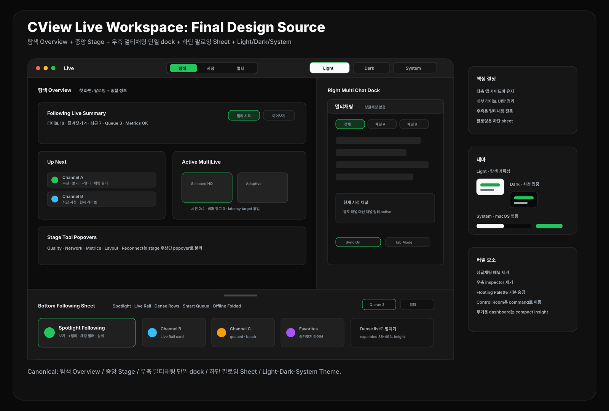

# CView 라이브 메뉴 최종 디자인 사료

작성일: 2026-04-28  
상태: 최종 기준 문서  
범위: 라이브 메뉴 내부 UI/UX, 팔로잉, 멀티라이브, 멀티채팅, 테마, 상태 모델, 구현 우선순위



## 0. 최종 결론

라이브 메뉴는 여러 디자인 실험을 유지하지 않고 하나의 기본 구조로 정리한다.

```text
CView Live Workspace
├─ Top Mode Bar: 탐색 / 시청 / 멀티
├─ Main Stage: Overview / Single Player / Multi Grid
├─ Right Multi Chat Dock: 멀티채팅 단일 dock
├─ Bottom Following Sheet: 아래에서 올라오는 팔로잉 live deck
└─ Theme Mode: Light / Dark / System
```

최종 화면의 성격은 `플랫한 macOS 라이브 워크스페이스`다. 기존 좌측 앱 사이드바와 라우팅은 유지하고, 라이브 메뉴 내부의 복합 패널만 정리한다.

## 1. 분석 대상

### UI/UX 디자인 문서

이 문서들은 archive로 정리한다.

| 문서 | 최종안에 남긴 핵심 |
|---|---|
| `live-menu-ux-analysis.md` | 카드 액션 분리, 검색 범위 확장, hover 정보 보존, 필터 상태 표시 |
| `resize-improvement-analysis.md` | 패널 최소 폭, 리사이즈 저장, divider 히트 영역 통일 |
| `live-menu-design-recommendations-2026-04-27.md` | Live Command Board의 빠른 탐색, `재생 / +멀티 / 채팅 / 상세` 액션 |
| `live-menu-multilive-studio-popular-designs-2026-04-27.md` | MultiView stage, 세션 slot, 통합 채팅 중심 구조 |
| `live-menu-macos-distinctive-designs-2026-04-27.md` | macOS toolbar, inspector 정리, command-first 보조 흐름 |
| `live-menu-macos-evolved-studio-design-2026-04-27.md` | 복잡한 기능을 하나의 작업 언어로 통합 |
| `live-menu-flat-modern-redesign-2026-04-27.md` | 1px divider, 얇은 toolbar, flat stage, dense list |
| `live-menu-flat-modern-functional-redesign-2026-04-27.md` | Smart Queue, saved filter, health/control 기능 분리 |
| `live-trimode-navigation-design-2026-04-27.md` | 상단 `탐색 / 시청 / 멀티` 3모드 전환 |
| `live-trimode-lightweight-design-2026-04-27.md` | 가벼운 mode bar와 media-first stage |
| `live-final-combined-light-hub-design-2026-04-27.md` | 최종 hub 방향의 단순화 |
| `live-menu-unified-bottom-sheet-redesign-2026-04-27.md` | 좌측 shelf 제거, 하단 sheet, 우측 chat dock |
| `live-menu-final-overview-following-redesign-2026-04-27.md` | 첫 화면 Overview, 예쁜 팔로잉 sheet, Light/Dark/System |

### 기술/성능 참고 문서

이 문서들은 삭제하거나 archive하지 않고, 구현 시 계속 참고한다.

| 문서 | 디자인에 반영한 제약 |
|---|---|
| `live-streaming-improvement-analysis-2026-04-24.md` | 최고화질 정책 분리, 멀티라이브 선택/비선택 품질 정책, target latency 단일화 |
| `multilive-vlc-buffering-network-analysis-2026-04-24.md` | 멀티라이브는 네트워크보다 앱 내부 정책/프록시/캐시 병목을 우선 의심 |
| `multi-live-chat-improvement-plan-2026-04-18.md` | 멀티채팅은 단일 dock 안에서 통합/채널별 탭을 제공 |
| `multilive-1080p-retention-analysis-2026-04-18.md` | 선택 세션만 HQ, 비선택 세션은 adaptive 원칙 |
| `multilive-vlc-avplayer-live-improvement-plan-2026-04-18.md` | VLC/AVPlayer 정책 차이를 UI에 과하게 노출하지 않음 |
| `multichat-improvement-analysis.md` | 채팅 탭/그리드/merged mode의 상태 저장 필요 |
| `chat-deep-analysis.md` | 채팅 렌더링과 메시지 처리의 과부하를 피하는 compact UI |
| `latency-sync-research.md` | web sync와 app target latency를 구분해서 표시 |
| `latency-buffering-analysis.md` | 버퍼링/가속 상태는 stage popover 또는 경고 strip으로 분리 |
| `chzzk-live-gap-analysis.md` | 치지직 웹 대비 CView 강점은 멀티라이브, 멀티채팅, 엔진 선택 |

## 2. 유지할 핵심 요소

### Top Mode Bar

상단 중앙에는 세 개의 모드만 둔다.

```text
[탐색] [시청] [멀티]
```

- `탐색`: 첫 화면. 팔로잉 및 종합 정보 Overview를 표시한다.
- `시청`: 단일 live player를 표시한다.
- `멀티`: multi grid와 session queue를 표시한다.
- `개요`, `스튜디오`, `모니터링` 같은 추가 모드 버튼은 만들지 않는다.
- `Light / Dark / System` 테마 선택은 toolbar 우측에 둔다.

### 첫 화면 Overview

첫 진입은 `탐색`이 선택된 Overview다.

Overview는 다음 정보를 한 화면에서 보여준다.

- 현재 라이브 중인 팔로잉 수
- 바로 볼 추천 채널
- 최근 시청 / 즐겨찾기
- 활성 멀티라이브 세션
- queue 상태
- 버퍼, latency, metrics, 채팅 연결 상태 요약
- 하단 팔로잉 sheet를 여는 빠른 액션

첫 화면은 대시보드처럼 무겁게 만들지 않는다. 사용자가 바로 `보기`, `+멀티`, `채팅 필터`, `팔로잉 펼치기`를 실행할 수 있어야 한다.

### Main Stage

중앙 stage는 라이브 메뉴의 중심이다.

| 모드 | Stage 역할 | 기본 상태 |
|---|---|---|
| 탐색 | 팔로잉 Overview와 추천 preview | empty player 대신 정보 stage |
| 시청 | 단일 live player | bottom sheet collapsed |
| 멀티 | 2-4개 multi grid | queue와 slot 상태 표시 |

Stage 안에는 플레이어와 직접 관련된 상태만 둔다.

- Quality
- Network
- Metrics
- Layout
- Reconnect

이 기능들은 우측 채팅 dock에 넣지 않고 stage 우상단 popover로 둔다.

### Right Multi Chat Dock

우측은 `멀티채팅` 전용이다. `싱글채팅` 패널은 제거한다.

```text
Right Multi Chat Dock
├─ 통합채팅
├─ 채널별 탭
├─ 현재 시청 채널 필터
├─ Sync 상태
└─ Chat Settings Popover
```

모드별 동작:

| 모드 | 우측 dock 상태 |
|---|---|
| 탐색 | compact preview, 최근 활성 채널만 표시 |
| 시청 | 현재 시청 채널 탭/필터 active |
| 멀티 | full height, 통합채팅 + 채널별 탭 |

단일 시청 중에도 별도 싱글채팅을 만들지 않는다. 같은 멀티채팅 dock 안에서 현재 채널 필터만 강조한다.

### Bottom Following Sheet

팔로잉은 좌측 고정 패널이 아니라 아래에서 올라오는 live deck이다.

| 상태 | 높이 | 용도 |
|---|---:|---|
| collapsed | 52-64pt | handle, live count, mini chips |
| peek | 180-240pt | Spotlight 1개 + live rail |
| expanded | 38-46% height | 검색, 필터, dense list, smart queue |

구성:

```text
Following Sheet
├─ Handle + Summary
├─ Filter Row
├─ Spotlight Following
├─ Live Rail
├─ Dense Rows
├─ Smart Queue
└─ Offline Folded
```

팔로잉 카드 액션은 통일한다.

```text
보기 / +멀티 / 채팅 / 상세
```

- `보기`: `시청`으로 전환
- `+멀티`: queue 또는 multi grid slot에 추가
- `채팅`: 우측 멀티채팅 dock을 열고 해당 채널 필터 active
- `상세`: 채널 정보 또는 컨텍스트 메뉴

### Smart Queue

Smart Queue는 bottom sheet의 핵심 기능으로 유지한다.

- 최근 시청, 즐겨찾기, 라이브 상태, 카테고리, 시청자 수를 기반으로 후보를 만든다.
- `Queue 3`, `1 slot left`, `Batch Add` 같은 상태를 항상 보이게 한다.
- 멀티라이브 최대 세션 수를 넘는 항목은 disabled 처리한다.
- 빈 multi slot에는 `하단 팔로잉에서 추가` CTA를 둔다.

### Theme Mode

테마는 3가지만 제공한다.

```text
Light / Dark / System
```

기본값은 `System`이다.

| 테마 | 목적 | 주요 표현 |
|---|---|---|
| Light | 탐색과 팔로잉 리스트 가독성 | 밝은 surface, 얇은 stroke, 낮은 shadow |
| Dark | 장시간 시청과 멀티라이브 집중 | graphite stage, 짙은 chat dock, 높은 media contrast |
| System | macOS appearance 연동 | OS 설정을 따르되 사용자 override 우선 |

Accent green은 모든 테마에서 유지한다. `LIVE`, 선택 상태, queue action의 의미가 테마에 따라 바뀌면 안 된다.

## 3. 버릴 요소

다음 요소들은 기본 UI에서 제거하거나 고급 명령으로 낮춘다.

| 기존 요소 | 최종 처리 |
|---|---|
| 좌측 channel shelf | bottom following sheet로 이동 |
| 싱글채팅 패널 | 제거. 멀티채팅 dock의 현재 채널 필터로 대체 |
| 우측 inspector | 제거. 우측은 멀티채팅 전용 |
| Quality/Tools 상시 패널 | stage popover로 이동 |
| Floating Palette | 기본 UI에서 제거, 실험/고급 명령으로 유지 |
| Control Room | command palette 또는 별도 보조 창으로 유지 |
| 다중 디자인 preset | 기본 화면에는 노출하지 않음 |
| 무거운 monitoring dashboard | Overview의 compact insight로 축소 |

## 4. 반응형 규칙

창 폭에 따라 모든 패널이 동시에 경쟁하지 않게 한다.

| 폭 | Stage | Chat Dock | Following Sheet |
|---:|---|---|---|
| 1320pt 이상 | stage + chat full | 320-420pt | peek/expanded 가능 |
| 1080-1320pt | stage 우선 | 300-340pt | peek 중심 |
| 860-1080pt | stage 최대화 | overlay 또는 compact | collapsed/peek |
| 860pt 미만 | stage 단일 | command로 열기 | collapsed |

리사이즈 UX:

- 패널 폭과 sheet 상태는 저장한다.
- 최소 폭 제약을 둔다.
- divider hit area는 8-12pt로 통일한다.
- 좁은 창에서는 우측 dock보다 stage가 우선권을 가진다.

## 5. 상태 모델

권장 상태 모델은 다음 정도로 축소한다.

```swift
enum LiveMenuMode {
    case explore
    case watch
    case multi
}

enum FollowingSheetState {
    case collapsed
    case peek
    case expanded
}

enum ChatDockState {
    case compact
    case currentChannel
    case expanded
}

enum LiveMenuThemePreference {
    case light
    case dark
    case system
}

enum StageToolPopover {
    case quality
    case network
    case metrics
    case layout
    case reconnect
}
```

초기값:

```swift
mode = .explore
followingSheetState = .peek
chatDockState = .compact
themePreference = .system
```

## 6. 디자인 토큰

| 토큰 | Light | Dark |
|---|---|---|
| appBackground | `#F6F7F8` | `#090909` |
| stageBackground | `#FFFFFF` | `#0C0C0C` |
| panelBackground | `#F1F3F5` | `#171717` |
| sheetBackground | `#FFFFFF` | `#181818` |
| stroke | `#D7DCE1` | `#303030` |
| primaryText | `#17202A` | `#F8FAFC` |
| secondaryText | `#66717D` | `#A4ADB7` |
| accent | `#16A34A` | `#22C55E` |
| liveDanger | `#EF4444` | `#F87171` |

형태 기준:

- card radius: 8-10pt
- panel radius: 12-16pt
- large container radius: 18-22pt
- border: 1px
- shadow: 기본 사용 금지, floating popover에만 약하게 사용
- letter spacing: 0

## 7. 구현 우선순위

### P0

| 작업 | 이유 |
|---|---|
| Top Mode Bar를 `탐색 / 시청 / 멀티`로 고정 | 화면 언어 통일 |
| `탐색` 첫 화면을 Overview로 정의 | 첫 화면에서 팔로잉과 종합 정보 제공 |
| 우측을 멀티채팅 단일 dock으로 재정의 | 싱글/멀티 채팅 중복 제거 |
| 팔로잉 bottom sheet 상태 모델 도입 | 좌측 shelf 제거와 stage 확대 |
| Light/Dark/System theme token 확정 | macOS 앱 기준 완성도 |

### P1

| 작업 | 이유 |
|---|---|
| Spotlight / Live Rail / Dense Row 카드 구현 | 팔로잉 디자인 개선 |
| Smart Queue와 batch add 구현 | 멀티라이브 진입 개선 |
| Stage Tool Popover로 Quality/Network/Metrics 이동 | 우측 chat dock 순도 유지 |
| 패널 최소 폭과 상태 저장 | 창 크기 변경 안정성 |
| 멀티라이브 선택/비선택 품질 정책 UI 정리 | 안정성과 화질의 균형 |

### P2

| 작업 | 이유 |
|---|---|
| Command Palette live 명령 재분류 | 고급 기능 정리 |
| Control Room/Floating Palette 숨김 또는 별도 창화 | 기본 UI 단순화 |
| Metrics compact insight 고도화 | 운영 정보는 가볍게 유지 |
| 추천 조합 scoring | Smart Queue 품질 개선 |

## 8. 검증 시나리오

1. 앱 실행 후 라이브 메뉴 진입 시 `탐색 Overview`가 먼저 보인다.
2. 팔로잉 sheet를 peek, expanded, collapsed로 전환해도 stage와 chat dock이 겹치지 않는다.
3. 팔로잉 카드에서 `보기`를 누르면 `시청`으로 전환되고, 우측 멀티채팅은 현재 채널 필터가 active 된다.
4. 팔로잉 카드에서 `+멀티`를 누르면 queue 또는 multi slot에 들어간다.
5. `멀티` 모드에서 우측 dock은 full height 멀티채팅으로 동작한다.
6. `싱글채팅`이라는 독립 패널이 화면에 나타나지 않는다.
7. 1320pt, 1080pt, 860pt, 760pt 창 폭에서 텍스트와 패널이 겹치지 않는다.
8. Light, Dark, System 테마 전환 시 stage, sheet, chat dock contrast가 유지된다.
9. 품질/네트워크/메트릭은 우측 chat dock이 아니라 stage popover에서 열린다.
10. 멀티라이브 4세션 상태에서 queue, chat, bottom sheet가 성능 부담을 과도하게 만들지 않는다.

## 9. 최종 한 줄

```text
CView 라이브 메뉴는 탐색 Overview, 중앙 Stage, 우측 멀티채팅 단일 dock, 하단 팔로잉 Sheet, Light/Dark/System 테마로 정리한다.
```

