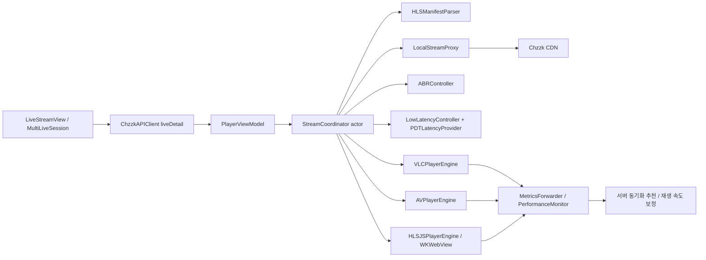

# 라이브 스트리밍 기능 분석 및 개선안

작성일: 2026-04-24  
대상: CView v2 라이브 재생, 멀티라이브, 로컬 스트림 프록시, ABR, 레이턴시 동기화, 메트릭 전송

## 1. 요약

현재 라이브 스트리밍 구조는 단순 플레이어 래퍼가 아니라 `API -> HLS 매니페스트 -> 로컬 프록시 -> 엔진별 재생 -> ABR/레이턴시/메트릭`까지 포함한 통합 파이프라인이다. VLC, AVPlayer, HLS.js를 모두 지원하고, 치지직 CDN의 잘못된 `Content-Type` 보정, PDT 기반 레이턴시 측정, 멀티라이브 대역폭 배분, 403 토큰 만료 감지까지 이미 구현되어 있다.

다만 기본 정책이 "항상 최고 화질 유지" 쪽으로 강하게 기울어져 있고, 이 정책이 ABR과 멀티라이브 대역폭 제어를 대부분 우회한다. 또한 로컬 프록시가 세그먼트를 통째로 메모리에 받은 뒤 플레이어에 전달하는 구조라서, 레이턴시와 메모리 압력 측면에서 가장 큰 개선 여지가 있다.

가장 먼저 고칠 부분은 다음 5개다.

1. `forceHighestQuality` 정책을 명시적인 재생 모드로 분리하고, 레이턴시 보정이 켜졌다는 이유만으로 최고화질 잠금을 자동 강제하지 않는다.
2. VLC 메트릭의 실제 수집 주기와 ABR 샘플 duration을 일치시켜 대역폭 추정 왜곡을 제거한다.
3. 로컬 프록시에서 M3U8만 버퍼링/재작성하고, 세그먼트는 스트리밍 방식으로 즉시 전달한다.
4. LowLatencyController, VLC liveCaching, MetricsForwarder의 target latency 기준을 하나로 맞춘다.
5. 멀티라이브는 선택 세션과 비선택 세션의 품질 정책을 분리한다. 선택 세션은 HQ, 비선택 세션은 화면 크기/버퍼/대역폭 기반 adaptive가 기본이어야 한다.

이 문서는 실제 네트워크 벤치마크가 아니라 코드 정적 분석 결과다. 수치는 현재 코드의 기본값과 제어 흐름을 기준으로 했고, 최종 목표값은 계측 후 조정해야 한다.

## 2. 현재 구조



핵심 컴포넌트는 다음과 같다.

| 영역 | 현재 역할 |
| --- | --- |
| `StreamCoordinator` | 스트림 생명주기, 매니페스트 파싱, 프록시 시작, 엔진 주입, 품질 전환, 재연결, 저지연 동기화 |
| `LocalStreamProxy` | 치지직 CDN HLS 응답을 localhost로 프록시하고, M3U8 URL 재작성 및 fMP4 MIME 보정 |
| `ABRController` | dual EWMA 기반 대역폭 추정, buffer-aware ABR, 멀티라이브 대역폭 cap 수신 |
| `LowLatencyController` | PDT/VLC 버퍼 기반 레이턴시 측정, PID/EWMA 기반 rate 보정 |
| `VLCPlayerEngine` | VLC 4.0 기반 저지연 재생, VLC 통계 수집, 품질 적응 요청 |
| `AVPlayerEngine` | macOS 네이티브 HLS, live edge seek, stall watchdog, quality ceiling |
| `HLSJSPlayerEngine` | WKWebView + hls.js 기반 LL-HLS 재생 및 JS 메트릭 |
| `MultiLiveManager` | 최대 4개 세션, 엔진 풀, 선택/비선택 세션 전환, 대역폭 코디네이션 |
| `MetricsForwarder` | VLC/AV/HLS.js 메트릭 수집, 서버 동기화 추천 수신, 재생 속도 콜백 |

## 3. 주요 발견 사항

### 3.1 최고화질 잠금이 ABR과 멀티라이브 제어를 우회함

`PlayerSettings` 기본값은 `forceHighestQuality=true`, `lowLatencyMode=true`, `catchupRate=1.05`, `latencyPreset=webSync`다. `PlayerViewModel.startStream()`에서는 사용자가 최고화질 잠금을 꺼도 `lowLatencyMode`가 켜져 있거나 `catchupRate > 1.0`이면 `forceMax`를 다시 켠다.

영향:

- `StreamCoordinator.setMaxAllowedBitrate()`는 `forceHighestQuality`일 때 바로 return한다.
- `StreamCoordinator+QualityABR`는 ABR `switchDown`과 VLC downgrade 요청을 무시한다.
- `VLCPlayerEngine`의 통계 기반 품질 적응도 `forceHighestQuality`면 동작하지 않는다.
- `MultiLiveManager.applyBandwidthAdvices()`도 VLC가 quality locked이면 모든 cap/강등을 건너뛴다.

이 구조는 단일 선택 스트림의 화질 유지에는 유리하지만, 네트워크 변동이나 3-4개 멀티라이브에서는 안정성보다 품질을 과도하게 우선한다. 특히 멀티라이브의 대역폭 코디네이터가 있어도 기본값에서는 실질적으로 cap이 적용되지 않는다.

권장:

- `forceHighestQuality`를 내부 플래그가 아니라 사용자에게 설명 가능한 재생 정책으로 승격한다.
- 예: `qualityLock`, `adaptiveHigh`, `balanced`, `multiLiveBalanced`.
- 레이턴시 보정 활성 여부와 최고화질 잠금은 분리한다.
- 멀티라이브 기본값은 "선택 세션 HQ, 비선택 세션 adaptive"로 둔다.

### 3.2 VLC 대역폭 샘플 duration이 실제 수집 주기와 맞지 않음

`VLCPlayerEngine.startStatsTimer()`는 단일/선택 세션 10초, 멀티라이브 비선택 세션 15초 기준으로 통계를 수집한다. 하지만 `PlayerViewModel.setVLCMetricsCallback()`과 `enableSelfMetrics()`는 `metrics.networkBytesPerSec * 2`를 bytes로 만들고 `duration: 2.0`으로 ABR에 전달한다.

`networkBytesPerSec`가 이미 초당 바이트 값이므로 결과적으로 "2초 샘플"처럼 보이지만, 실제 샘플은 10-15초 누적 통계에서 나온다. EWMA 반응 속도, buffer-aware fetch duration, 멀티라이브 대역폭 배분 판단이 왜곡될 수 있다.

권장:

- `VLCLiveMetrics`에 `sampleDuration` 또는 `effectiveBytesDelta`를 명시적으로 포함한다.
- ABR에는 `bytesLoaded = effectiveBytesDelta`, `duration = elapsed`를 그대로 전달한다.
- `lastSegmentDuration`도 2.0 고정값 대신 media playlist의 `#EXTINF` 평균 또는 최근 fragment duration을 사용한다.
- 멀티라이브 코디네이터의 `fetchDuration: 0.5`, `segmentDuration: 4.0` 고정값도 실제 샘플로 바꾼다.

### 3.3 로컬 프록시가 세그먼트를 통째로 버퍼링함

`LocalStreamProxy.proxyToUpstream()`는 `URLSession.dataTask`로 업스트림 응답 전체를 `Data`로 받은 뒤 `sendResponse()`로 플레이어에 전달한다. M3U8 재작성을 위해 매니페스트는 버퍼링이 필요하지만, `.m4s`, `.m4v`, `.ts` 세그먼트까지 전체 다운로드 후 전달하면 다음 문제가 생긴다.

- 세그먼트 첫 바이트가 플레이어에 늦게 도착한다.
- 멀티라이브에서 세그먼트 크기만큼 메모리 압력이 증가한다.
- upstream 취소와 downstream 연결 취소가 느슨하게 연결된다.
- HTTP Range, 일부 헤더, status reason이 보존되지 않는다.

현재 프록시는 `Content-Type` 보정과 M3U8 캐시로 VLC 재생 안정성에 중요한 역할을 한다. 따라서 프록시를 제거하기보다 세그먼트 경로만 스트리밍화하는 것이 맞다.

권장:

- M3U8 응답만 기존처럼 전체 버퍼링 후 URL 재작성한다.
- 세그먼트 응답은 URLSession delegate 또는 async bytes를 사용해 chunk 단위로 `NWConnection.send`한다.
- `Range`, `If-Range`, `User-Agent`, `Referer`, `Origin`, `Accept-Encoding` 정책을 요청 종류별로 명확히 한다.
- downstream connection cancel 시 upstream task도 즉시 cancel한다.
- `sendResponse()`의 `"HTTP/1.1 \(status) OK"`를 status별 reason 또는 빈 reason으로 교정한다.

### 3.4 레이턴시 목표값이 경로별로 다름

기본 `PlayerSettings`와 `LowLatencyController.Configuration.webSync`는 target 6초, max 12초, min 3초다. 반면 `PlayerViewModel.currentTargetLatencyMs()`는 VLC에서 `streamingProfile.liveCaching`을 반환한다. VLC lowLatency profile의 liveCaching은 500ms이고 multiLiveHQ는 800ms다.

즉 서버 메트릭/동기화에 전달되는 target latency가 실제 LowLatencyController target인 6초와 다를 수 있다. 사용자는 webSync 모드로 6초 동기화를 의도했는데, 외부 메트릭에는 500ms target처럼 보일 수 있다.

또한 LowLatencyController의 sync loop는 5초 간격이고 배터리 모드에서는 7.5초까지 늘어난다. 그런데 PID 계산은 `deltaTime: 1.0`으로 고정되어 있다. 실제 제어 주기와 PID dt가 다르면 보정 게인의 의미가 흐려진다.

권장:

- target latency의 source of truth를 `LiveLatencyPolicy` 같은 단일 모델로 둔다.
- VLC liveCaching은 "엔진 내부 캐시"로, 앱 target latency는 "재생 위치 목표"로 분리해서 표기한다.
- MetricsForwarder에는 앱 target latency를 전달하고, 별도 필드로 engine cache를 보낸다.
- PID 업데이트에는 실제 경과 시간 `dt`를 사용한다.
- 단일 선택 스트림은 1-2초 제어 루프, 멀티라이브/백그라운드는 5-8초 루프로 나누는 방식이 합리적이다.

### 3.5 AVPlayer 최고화질 경로가 네이티브 ABR을 우회함

AVPlayer는 기본적으로 master playlist를 받고 `preferredPeakBitRate`, `preferredMaximumResolution`으로 ceiling을 거는 방식이 자연스럽다. 그런데 `StreamCoordinator+Lifecycle`은 `forceHighestQuality=true`일 때 1080p variant URL을 직접 전달해 AVPlayer ABR을 우회한다.

이는 초기 1080p 고정에는 도움이 되지만, 네트워크 저하 시 AVPlayer가 자연스럽게 하위 variant로 회피할 여지를 줄인다. 또한 manifest refresh가 `_currentVariantURL`은 갱신하지만, 현재 AVPlayer item에 hot-swap되지는 않으므로 토큰 갱신과 실제 재생 URL의 관계가 애매해진다.

권장:

- AVPlayer는 기본적으로 master URL + ceiling + HQ recovery watchdog을 사용한다.
- direct variant URL은 VLC 전용 또는 진단 옵션으로 제한한다.
- 장시간 재생에서는 token refresh를 item 전체 재시작이 아니라 갱신된 master/variant URL을 다음 요청에 반영하는 방식으로 설계한다.

### 3.6 멀티라이브는 품질 유지와 자원 안정성 정책이 충돌함

멀티라이브에서 선택 세션은 `multiLiveHQ`, 비선택 세션은 낮은 렌더링 tier를 쓰는 흐름이 있다. 그러나 quality lock이 켜져 있으면 비선택 세션도 1080p 디코딩을 유지하고, GPU 합성 scale만 낮춘다.

결과:

- 화면상 비선택 패널은 작지만 네트워크/디코딩 비용은 계속 높을 수 있다.
- BandwidthCoordinator가 있어도 quality lock이면 cap 적용이 빠진다.
- `collectMetricsSnapshot()`은 VLC/AVPlayer만 포함하고 HLS.js 메트릭은 대역폭 코디네이터에 들어가지 않는다.
- pane size는 실제 SwiftUI grid geometry가 아니라 창/화면 크기와 세션 수로 추정한다.

권장:

- 선택 세션: 1080p60 유지 우선.
- 비선택 세션: 실제 패널 크기, thermal state, buffer health, 네트워크 추정치를 기준으로 720p/480p adaptive.
- HLS.js도 bandwidth coordinator snapshot에 포함한다.
- pane size는 View layer에서 실제 geometry를 manager로 전달한다.
- "모든 세션 최고화질"은 별도 고급 옵션으로 둔다.

### 3.7 재연결과 토큰 갱신 경로가 중복됨

현재 안정화 장치는 여러 개 있다.

- 로컬 프록시 403 연속 감지 후 reconnect.
- StreamCoordinator manifest refresh 실패 5회 후 reconnect.
- VLC watchdog currentTime/decoded frame 정체 감지.
- AVPlayer stall watchdog 및 HTTP status 기반 reconnect.
- MultiLiveSession 50분마다 proactive stop/start.

장치가 많은 것은 좋지만, 일부는 중복되고 일부는 과하게 큰 동작이다. 특히 멀티라이브의 50분 주기 `retry()`는 토큰 만료 예방 목적이지만, 실제로는 stop/start 전체 재시작이다. 시청 중인 세션에서 불필요한 순간 끊김이 생길 수 있다.

권장:

- token refresh는 "URL 갱신"과 "재생 재시작"을 분리한다.
- fresh manifest/variant URL을 프록시 또는 coordinator가 보유하고, 다음 segment/playlist 요청에 반영한다.
- full reconnect는 403, manifest refresh 연속 실패, 실제 재생 정체가 확인될 때만 수행한다.
- reconnect 원인을 enum으로 표준화하고 metrics에 남긴다.

### 3.8 HLSManifestParser의 static formatter가 thread-safe하지 않음

`HLSManifestParser`는 `Sendable`로 선언되어 여러 actor/task에서 쓰인다. 그런데 PDT 파싱용 `ISO8601DateFormatter`가 `nonisolated(unsafe) static let`이다. Foundation formatter류는 일반적으로 thread-safe를 보장하지 않는다.

권장:

- formatter 접근을 lock으로 보호한다.
- 또는 actor/TaskLocal/parser instance별 formatter를 사용한다.
- PDT 파싱은 레이턴시 계산의 핵심이므로, 성능보다 정확성과 데이터 레이스 제거를 우선한다.

### 3.9 HLS.js 복구가 coordinator 정책과 느슨하게 연결됨

HLS.js HTML은 fatal network error에서 `hls.startLoad()`, media error에서 `recoverMediaError()`를 자체 수행한다. 하지만 최종 fatal 상태가 Swift의 `StreamCoordinator` 재연결/엔진 fallback 정책과 같은 수준으로 통합되어 있는지는 약하다.

권장:

- HLS.js fatal error를 Swift 엔진 이벤트로 표준화한다.
- fatal network/media 재시도 횟수 초과 시 `StreamCoordinator.triggerReconnect()` 또는 엔진 fallback으로 연결한다.
- hls.js의 level/latency/buffer 메트릭을 ABR 및 멀티라이브 코디네이터와 연결한다.

## 4. 개선 로드맵

### P0: 레이턴시/안정성에 직접 영향

| 작업 | 기대 효과 | 영향 파일 |
| --- | --- | --- |
| 최고화질 정책 분리 | ABR, 멀티라이브 cap이 실제로 동작 | `PlayerViewModel.swift`, `StreamCoordinator.swift`, `MultiLiveManager.swift`, settings UI |
| VLC ABR 샘플 duration 교정 | 대역폭 추정 정확도 향상, 불필요한 강등/복귀 진동 감소 | `VLCPlayerEngine+Features.swift`, `PlayerViewModel.swift`, `ABRController.swift` |
| LocalStreamProxy 세그먼트 스트리밍 | 첫 바이트 지연 감소, 메모리 압력 감소, 멀티라이브 안정성 향상 | `LocalStreamProxy+Upstream.swift`, `LocalStreamProxy+Response.swift` |
| target latency 단일화 | 서버 sync, UI 표시, PID 보정 기준 일치 | `PlayerSettings`, `PlayerViewModel`, `LowLatencyController`, `MetricsForwarder` |
| LL-HLS-aware M3U8 cache TTL | ultra-low/profile별 stale manifest 위험 감소 | `LocalStreamProxy`, `HLSManifestParser` |

### P1: 화질 유지와 멀티라이브 체감 개선

| 작업 | 기대 효과 | 영향 파일 |
| --- | --- | --- |
| AVPlayer는 master URL + ceiling 기본화 | 네이티브 ABR 안정성 회복, direct variant 위험 축소 | `StreamCoordinator+Lifecycle.swift`, `AVPlayerEngine.swift` |
| 멀티라이브 선택/비선택 품질 정책 분리 | 선택 세션 화질 유지와 전체 안정성 균형 | `MultiLiveManager.swift`, `VLCPlayerEngine.swift`, `AVPlayerEngine.swift` |
| HLS.js 메트릭을 bandwidth coordinator에 포함 | 엔진별 동작 차이 감소 | `HLSJSPlayerEngine.swift`, `MultiLiveManager.swift` |
| 실제 pane geometry 기반 cap | 작은 패널에서 과한 1080p 사용 감소 | `MultiLivePlayerPane.swift`, `MultiLiveManager.swift` |
| 공통 recovery/fallback 정책 | 엔진별 오류 처리 편차 감소 | `StreamCoordinator+Reconnection.swift`, 각 엔진 delegate |

### P2: 유지보수성과 장시간 운영 품질

| 작업 | 기대 효과 | 영향 파일 |
| --- | --- | --- |
| `LiveStreamResolver` 도입 | LiveStreamView, MultiLiveSession, prefetch의 중복 제거 | `CViewNetworking`, `CViewApp` |
| 엔진 capability protocol 정리 | type cast 감소, 엔진 추가/교체 쉬움 | `PlayerEngineProtocol` 주변 |
| HLS manifest parser/rewriter 테스트 확대 | CDN URL, LL-HLS, byte range 회귀 방지 | `HLSManifestParser`, `LocalStreamProxy` tests |
| 장시간 soak test harness | 1-3시간 재생, 토큰 refresh, 메모리 증가 검증 | test target / script |
| 메트릭 대시보드 지표 표준화 | 개선 효과를 수치로 검증 | `MetricsForwarder`, monitoring UI |

## 5. 제안하는 품질/레이턴시 목표

아래 목표는 코드 분석 기준의 초안이다. 실제 CDN/네트워크 환경에서 측정 후 조정해야 한다.

| 지표 | 단일 라이브 목표 | 멀티라이브 목표 |
| --- | --- | --- |
| 첫 프레임 시간 p50 | 1.2초 이하 | 선택 세션 1.5초 이하 |
| 첫 프레임 시간 p95 | 2.5초 이하 | 3.5초 이하 |
| webSync 레이턴시 | 5.5-7.0초 유지 | 6-10초 유지 |
| lowLatency 레이턴시 | 2-4초 유지 | 선택 세션만 적용 |
| rebuffer ratio | 0.5% 이하 | 1.0% 이하 |
| 선택 세션 1080p 유지율 | 95% 이상 | 90% 이상 |
| 비선택 세션 정책 | 사용자 설정에 따름 | 기본 adaptive 480p-720p |
| reconnect MTTR | 5초 이하 | 8초 이하 |
| 프록시 메모리 | 세그먼트 크기와 비례 증가 없음 | 세션 수 증가에도 선형/완만 |

## 6. 테스트 보강 제안

우선순위가 높은 테스트는 다음과 같다.

1. `LocalStreamProxy` 테스트
   - M3U8 URL 재작성: 상대 URL, 절대 URL, cross-CDN, `#EXT-X-MAP`, `#EXT-X-PART`, `#EXT-X-PRELOAD-HINT`.
   - status line, `Content-Type`, `Range` 전달.
   - 세그먼트 streaming 중 client cancel 시 upstream cancel.
   - M3U8 cache TTL이 profile/part target에 맞게 동작.

2. `PlayerViewModel` 설정 정책 테스트
   - 사용자가 `forceHighestQuality=false`로 둔 경우 lowLatency/catchupRate 때문에 다시 강제되지 않는지.
   - 멀티라이브 선택/비선택 세션의 force/adaptive 정책이 의도대로 적용되는지.

3. ABR 테스트
   - VLC metrics의 `elapsed` 기반 sample이 EWMA에 반영되는지.
   - direct variant로 시작한 경우 ABR `currentLevelIndex`가 실제 variant와 동기화되는지.
   - maxAllowedBitrate 적용 시 실제 switch decision까지 이어지는지.

4. 레이턴시 테스트
   - PID loop가 실제 `dt`를 사용하는지.
   - `currentTargetLatencyMs()`가 LowLatencyController target과 일치하는지.
   - PDT 미지원 시 fallback latency가 안정적으로 동작하는지.

5. 장시간 soak 테스트
   - 단일/멀티라이브 60-180분 재생.
   - CDN 403, manifest refresh 실패, 네트워크 일시 단절 주입.
   - 메모리, active NWConnection, AVPlayer AccessLog 이벤트 수, reconnect 횟수 추적.

## 7. 단계별 구현 방향

### 7.1 품질 정책 모델 추가

현재 `forceHighestQuality: Bool` 하나로 너무 많은 의미를 표현한다.

권장 모델:

```swift
public enum LiveQualityPolicy: String, Codable, Sendable {
    case qualityLock        // 선택 스트림 1080p60 고정, ABR 하향 차단
    case adaptiveHigh       // 1080p 우선, 버퍼/대역폭 악화 시 임시 하향
    case balanced           // 네이티브 ABR/코디네이터 우선
    case multiLiveBalanced  // 선택 HQ, 비선택 adaptive
}
```

마이그레이션:

- 기존 `forceHighestQuality=true`는 단일 라이브에서 `qualityLock`으로 매핑.
- 멀티라이브 기본값은 `multiLiveBalanced`로 신규 기본값을 검토.
- UI에는 "항상 최고 화질"과 "멀티라이브 비선택 화면도 최고화질 유지"를 분리해서 제공.

### 7.2 프록시 streaming 경로 분리

권장 분기:

- `isM3U8 == true`: 기존처럼 전체 body를 받아 rewrite/cache.
- `isM3U8 == false`: headers를 먼저 보내고 body chunk를 즉시 전달.

추가로 보존할 항목:

- upstream status code/reason.
- `Content-Length`가 있으면 전달, 없으면 chunked 또는 close-delimited 응답.
- `Range`, `If-Range`.
- cancellation propagation.

이 작업은 레이턴시와 안정성 모두에 직접 영향을 주므로 P0로 둔다.

### 7.3 레이턴시 정책 단일화

현재는 다음 값들이 따로 움직인다.

- `PlayerSettings.latencyTarget`: 기본 6초.
- `LowLatencyController.Configuration.webSync.targetLatency`: 6초.
- `VLCStreamingProfile.liveCaching`: lowLatency 500ms, multiLiveHQ 800ms.
- `PlayerViewModel.currentTargetLatencyMs()`: VLC에서는 liveCaching 반환.
- `MetricsForwarder.setTargetLatency`: 서버 sync 기준값.

권장:

- `LiveLatencyPolicy.targetPlaybackLatency`를 앱 목표값으로 사용.
- `engineCacheMs`는 엔진별 부속 설정으로 분리.
- Metrics payload에는 `targetLatency`, `engineCacheMs`, `measuredLatency`를 따로 보낸다.

### 7.4 멀티라이브 자원 정책

기본 정책:

| 세션 상태 | 네트워크/디코딩 | 렌더링 | 레이턴시 |
| --- | --- | --- | --- |
| 선택 | 1080p60 우선, adaptive fallback 허용 | active | webSync 또는 user preset |
| 비선택 visible | pane 크기 기반 480p/720p cap | visible tier | 안정성 우선, 긴 buffer |
| hidden/occluded | 최소 cap 또는 일시 정지 검토 | hidden tier | sync만 유지 또는 낮은 빈도 |

이렇게 해야 선택 전환 시 체감 화질은 유지하면서 전체 CPU/GPU/network 사용량을 제어할 수 있다.

## 8. 근거 코드 위치

주요 근거 파일:

- `Sources/CViewCore/Models/SettingsModels.swift`: `PlayerSettings` 기본값 및 latency preset.
- `Sources/CViewApp/ViewModels/PlayerViewModel.swift`: 엔진 생성, forceMax 계산, VLC metrics -> ABR 샘플 전달, target latency 반환.
- `Sources/CViewPlayer/StreamCoordinator.swift`: stream config, ABR cap 무시 조건, current latency 계산.
- `Sources/CViewPlayer/StreamCoordinator+Lifecycle.swift`: 프록시 시작, VLC/AVPlayer variant URL 선택, manifest refresh 시작.
- `Sources/CViewPlayer/StreamCoordinator+QualityABR.swift`: quality lock 시 downgrade/switchDown 무시, buffer-aware ABR 샘플 처리.
- `Sources/CViewPlayer/LowLatencyController.swift`: webSync target, PID/EWMA, 5초 sync loop, `deltaTime: 1.0`.
- `Sources/CViewPlayer/ABRController.swift`: dual EWMA, initial level, maxAllowedBitrate.
- `Sources/CViewPlayer/LocalStreamProxy+Upstream.swift`: dataTask 기반 upstream 전체 body 수신, M3U8 rewrite/cache.
- `Sources/CViewPlayer/LocalStreamProxy+Response.swift`: HTTP response 생성 및 M3U8 URL rewrite.
- `Sources/CViewPlayer/VLCPlayerEngine+Features.swift`: VLC stats timer 10/15초, metrics 생성, quality adaptation guard.
- `Sources/CViewPlayer/AVPlayerEngine+LiveStream.swift`: AVPlayer catchup/stall watchdog/HQ recovery.
- `Sources/CViewPlayer/Resources/hlsjs-player.html`: hls.js LL-HLS 설정과 자체 stall/fatal recovery.
- `Sources/CViewApp/ViewModels/MultiLiveManager.swift`: bandwidth coordination, 선택/비선택 세션 정책, pane size 추정.
- `Sources/CViewApp/ViewModels/MultiLiveSession.swift`: 멀티라이브 start 경로 중복, 50분 proactive refresh.
- `Sources/CViewMonitoring/MetricsForwarder.swift`: target latency, sync speed validation, 엔진별 metrics payload.

## 9. 결론

현재 구현은 이미 많은 장애 케이스를 고려하고 있지만, 여러 안정화 장치가 "최고화질 고정" 정책과 섞이면서 ABR/멀티라이브/레이턴시 제어의 효과가 약해져 있다. 가장 큰 구조적 개선은 품질 정책을 명확히 분리하고, 로컬 프록시를 세그먼트 streaming 방식으로 바꾸는 것이다.

권장 실행 순서는 다음과 같다.

1. `forceHighestQuality` 자동 강제 제거 및 정책 enum 도입.
2. VLC metrics sample duration 교정.
3. LocalStreamProxy 세그먼트 streaming화.
4. target latency source of truth 단일화.
5. 멀티라이브 선택/비선택 adaptive 정책 적용.
6. 위 변경을 proxy/ABR/latency/multilive 테스트로 고정.

이 순서대로 진행하면 화질 유지 의도를 보존하면서도 레이턴시, 버퍼링, 장시간 안정성, 유지보수성을 동시에 개선할 수 있다.
