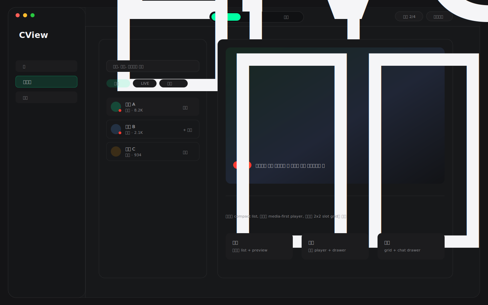
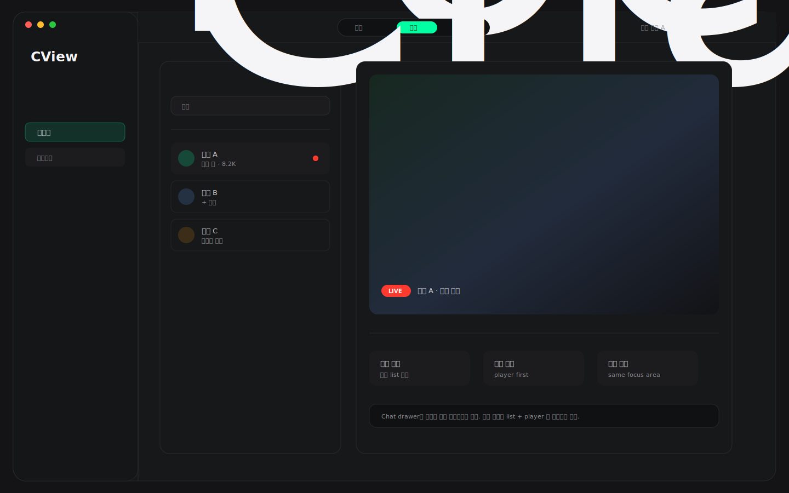
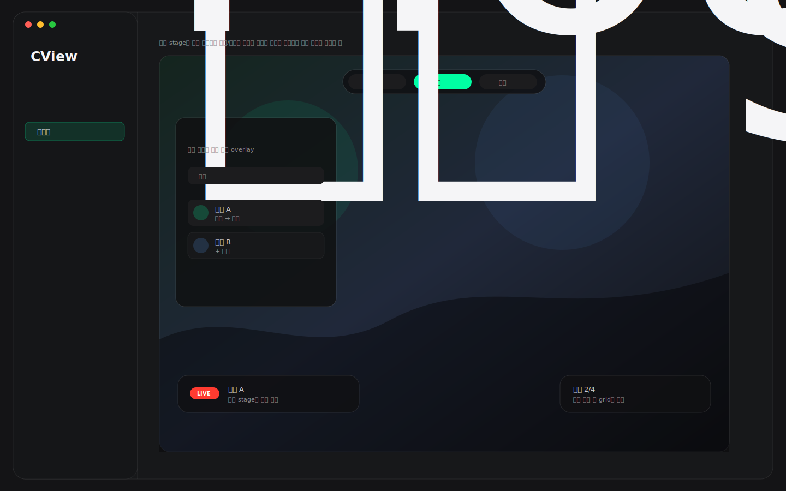

# CView 라이브 3모드 경량 디자인 추천 3안

작성일: 2026-04-27  
범위: `FollowingView`, `LiveStreamView`, `FollowingView+MultiLive`, `FollowingView+MultiChat`, `DesignTokens`  
목적: 기존 `탐색 / 시청 / 멀티` 3모드 전환 컨셉을 더 가볍고 현대적인 앱 UI로 다시 제안한다.

---

## 0. 방향 수정

이전 시안은 panel, card, stage가 많이 겹쳐 "작업대" 느낌이 강했다. CView는 라이브를 빠르게 고르고, 단일 또는 멀티로 바로 보는 앱이므로 기본 화면은 더 가볍게 보여야 한다.

이번 재추천의 기준은 다음이다.

- 큰 카드/두꺼운 panel을 줄인다.
- 상단은 44~56pt 수준의 얇은 toolbar로 둔다.
- shadow는 거의 쓰지 않고 1px divider와 surface 차이로 구분한다.
- `chzzk green`은 선택 상태와 primary action에만 쓴다.
- 탐색은 dense list + 작은 preview 중심으로, 시청은 media-first, 멀티는 슬롯만 간결하게 보여준다.
- 채팅과 상세 도구는 기본 노출보다 drawer/inspector로 필요할 때 연다.

추천 우선순위는 다음과 같다.

| 순위 | 추천안 | 핵심 | 판단 |
|---|---|---|---|
| 1 | Minimal Mode Bar | 얇은 상단 3버튼 + 모드별 단일 콘텐츠 | 기본 추천 |
| 2 | Focus Split | 왼쪽 탐색, 오른쪽 현재 화면을 유지하는 가벼운 split | 반복 사용 추천 |
| 3 | Floating Mode Switcher | 플레이어 위 작은 floating switcher 중심 | 가장 현대적이나 구현 검증 필요 |

### 예시 이미지 미리보기







---

## 1. 추천안 1: Minimal Mode Bar


### 핵심 컨셉

라이브 메뉴 상단에 얇은 mode bar를 두고 `탐색 / 시청 / 멀티`를 text+icon 버튼으로 전환한다. 화면 아래는 선택 모드 하나만 보여준다. 가장 가볍고 구현도 현실적이다.

### 구조

```text
Top Mode Bar
[탐색] [시청] [멀티]        현재 채널 / 세션 2/4 / 새로고침
──────────────────────────────────────────────────────────────
Selected Mode Content
```

### 모드별 화면

| 모드 | 화면 |
|---|---|
| 탐색 | 검색 한 줄 + live/offline filter + compact channel list + 작은 thumbnail preview |
| 시청 | `LiveStreamView`를 media-first로 표시, 채팅은 우측 drawer 또는 overlay |
| 멀티 | 2x2 슬롯 grid + 우측 채팅 drawer, 빈 슬롯은 얇은 dashed outline |

### 왜 가벼운가

- 상단 mode bar만 고정하고 나머지는 단일 콘텐츠로 처리한다.
- 세로로 긴 header, 통계 badge, 중복 category surface를 줄인다.
- 카드 grid보다 list+preview 조합을 기본으로 하여 정보 밀도는 유지하면서 시각 무게를 낮춘다.

### 적용 포인트

- `FollowingView`에 `LiveMode` 상태를 추가한다.
- `탐색` 모드는 기존 `followingListContent`를 compact variant로 사용한다.
- `시청` 모드는 마지막 선택 `channelId`가 있을 때만 렌더링하고, 없으면 탐색 CTA를 보여준다.
- `멀티` 모드는 현재 `multiLiveInlinePanel` + `multiChatInlinePanel`을 더 얇은 chrome으로 감싼다.

### 권장도

기본 추천이다. 사용자가 요구한 3버튼 모델을 가장 직접적으로 만족하면서도 화면이 가장 덜 무겁다.

---

## 2. 추천안 2: Focus Split


### 핵심 컨셉

왼쪽에는 항상 가벼운 탐색 list를 두고, 오른쪽 큰 영역만 `시청` 또는 `멀티`로 전환한다. 사용자는 탐색 맥락을 잃지 않고 단일 시청과 멀티 시청을 오갈 수 있다.

### 구조

```text
Top Slim Bar
[탐색] [시청] [멀티]
──────────────────────────────────────────────────────────────
Channel List     Focus Area
검색/필터         시청: 단일 player
라이브 목록       멀티: multi grid + chat drawer
```

### 모드별 화면

| 모드 | 화면 |
|---|---|
| 탐색 | 오른쪽도 추천/preview panel로 사용 |
| 시청 | 왼쪽 list 유지, 오른쪽 단일 player |
| 멀티 | 왼쪽 list 유지, 오른쪽 multi grid + compact chat |

### 왜 가벼운가

- 전체 화면을 매번 크게 바꾸지 않는다.
- 탐색 list는 280~340pt 정도의 얇은 column으로 고정된다.
- 오른쪽 focus area는 player 또는 multi stage만 보여주고 주변 장식을 줄인다.

### 적용 포인트

- 현재 `FollowingViewState.followingListRatio = 0.25` 방향과 잘 맞는다.
- 다만 기본 `showFollowingList = false`를 그대로 쓰면 이 디자인의 장점이 줄어든다.
- `시청`과 `멀티`에서도 channel list를 접을 수 있는 compact toggle을 둔다.

### 권장도

반복 사용자가 많다면 좋은 선택이다. 홈에서 바로 재생하는 사용자보다 라이브 메뉴에서 계속 채널을 바꾸는 사용자에게 특히 맞다.

---

## 3. 추천안 3: Floating Mode Switcher


### 핵심 컨셉

기본 화면은 거의 전체가 player/stage이고, `탐색 / 시청 / 멀티`는 상단 중앙의 작은 floating switcher로만 노출한다. 탐색 list와 멀티 도구는 overlay sheet/drawer로 열린다.

### 구조

```text
Main Stage
    floating [탐색] [시청] [멀티]
    floating status pills

탐색: 왼쪽 overlay shelf
시청: 단일 player full stage
멀티: stage가 2x2 grid로 전환, chat은 drawer
```

### 모드별 화면

| 모드 | 화면 |
|---|---|
| 탐색 | player 위에 320pt overlay shelf, 선택 후 자동으로 시청 전환 |
| 시청 | player 중심, chrome 최소화 |
| 멀티 | player area를 multi grid로 전환, 채팅은 drawer |

### 왜 가벼운가

- 배경 stage가 중심이고 panel이 거의 없다.
- 탐색/채팅은 항상 보이지 않고 필요할 때만 올라온다.
- 미디어 앱 느낌이 가장 강하다.

### 리스크

- 탐색 list를 자주 쓰는 사용자에게는 1안보다 덜 편할 수 있다.
- overlay가 많아지면 hit-test와 accessibility를 더 꼼꼼히 검증해야 한다.
- player 위 floating control은 contrast와 safe area 처리가 중요하다.

### 권장도

장기적으로 가장 현대적인 방향이지만, 기본 적용보다는 실험 모드로 검증하는 편이 좋다.

---

## 4. 최종 추천

지금 요구에는 **1안 Minimal Mode Bar**가 가장 적합하다.

```text
LiveModeBar
├─ 탐색: compact following list
├─ 시청: single live player
└─ 멀티: multi grid + chat drawer
```

이유:

- 기존 시안보다 훨씬 가볍다.
- 사용자가 요청한 버튼 모델이 명확하게 보인다.
- 현재 코드 재사용성이 높다.
- CView의 핵심인 단일 시청과 멀티 시청을 모두 과하지 않게 보여준다.

`Focus Split`은 두 번째 후보로 좋고, `Floating Mode Switcher`는 실험 기능으로 두는 것을 권장한다.

---

## 5. 구현 체크리스트

### P0

- `LiveMode` enum 추가: `explore`, `watch`, `multi`
- 44~56pt 높이의 `LiveModeBar` 컴포넌트 추가
- 기존 header/stat badge를 mode bar 우측 status pill로 축소
- 탐색 모드는 compact list + preview 우선으로 경량화
- 시청 모드는 마지막 선택 채널이 없을 때 탐색 CTA 표시

### P1

- 멀티 모드의 chat은 기본 drawer로 축소
- `+ 멀티` 액션 후 바로 멀티 모드로 이동할지 설정화
- 좁은 창에서는 `Focus Split`의 왼쪽 list를 자동 collapse
- 모드 전환 animation은 opacity/slide 1단계만 사용

### P2

- `Floating Mode Switcher`를 실험 설정으로 제공
- mode별 마지막 상태 복원
- 단일 시청 stream과 멀티 stream lifecycle 정책 문서화

---

## 6. 디자인 원칙

- 기본 배경은 `DesignTokens.Colors.background` 유지
- 상시 표시 panel에는 glass material을 쓰지 않는다.
- 버튼은 capsule 또는 8px 이하 rounded rect로 작게 둔다.
- shadow보다 divider와 surface layer로 구분한다.
- 선택 상태에만 chzzk green을 쓴다.
- 시청 화면에서는 UI chrome보다 영상이 먼저 보여야 한다.
