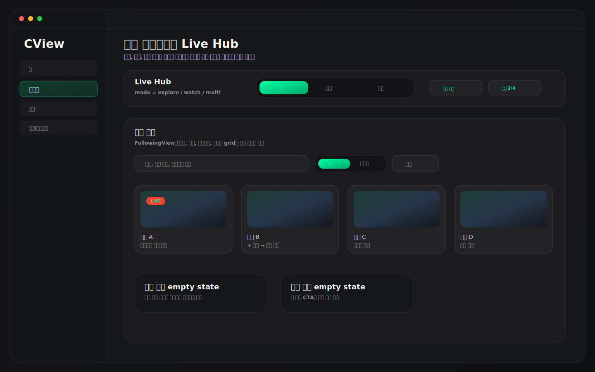
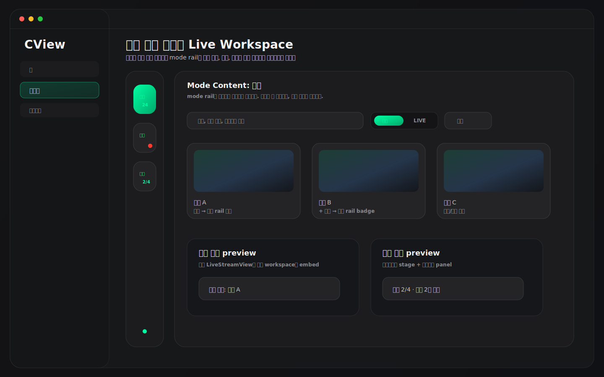
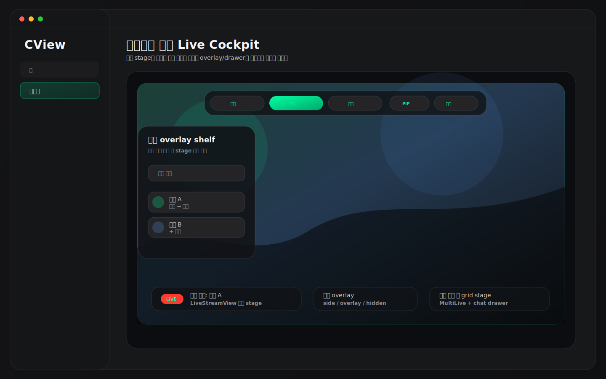

# CView 라이브 3모드 전환형 디자인 추천

작성일: 2026-04-27  
범위: `FollowingView`, `LiveStreamView`, `FollowingView+MultiLive`, `FollowingView+MultiChat`, `AppRouter`, `FollowingViewState`, `MultiLiveManager`, `MultiChatSessionManager`  
목적: 라이브 메뉴를 `탐색`, `시청`, `멀티` 3개 버튼으로 나누고, 각 버튼을 누르면 대응 화면이 전환되는 디자인 컨셉 3가지를 제안한다.

---

## 0. 전제

요청한 버튼 의미는 다음처럼 해석하는 것이 가장 자연스럽다.

| 버튼 | 의미 | 현재 코드 매핑 |
|---|---|---|
| 탐색 | 팔로잉 라이브 목록, 검색, 필터, 카테고리, 오프라인 팔로잉 | `FollowingView`의 `followingListContent`, `headerSection`, `livePagingView` |
| 시청 | 단일 라이브 재생, 플레이어 + 단일 채팅 + 설정 panel | `LiveStreamView(channelId:)` |
| 멀티 | 멀티라이브 + 멀티채팅 작업 공간 | `FollowingView+MultiLive.multiLiveInlinePanel`, `FollowingView+MultiChat.multiChatInlinePanel` |

현재 구현은 `AppRoute.live(channelId:)`로 단일 라이브 재생에 들어가고, 멀티라이브는 `FollowingView` 내부 panel에 통합되어 있다. 따라서 새 디자인은 "새 화면 3개를 완전히 만드는 방식"보다, **라이브 메뉴 안에 `LiveMode` 상태를 두고 기존 화면들을 모드별로 재배치하는 방식**이 가장 적절하다.

추천 우선순위는 다음과 같다.

| 순위 | 추천안 | 핵심 | 판단 |
|---|---|---|---|
| 1 | 상단 세그먼트형 Live Hub | 가장 직관적인 3버튼 전환 | 기본 추천 |
| 2 | 좌측 모드 레일형 Live Workspace | 데스크톱 앱답고 멀티 작업에 강함 | 중급/고급 사용자 추천 |
| 3 | 플레이어 중심 Live Cockpit | 시청 몰입감과 빠른 모드 이동 강조 | 구현 리스크 높음 |

### 예시 이미지 미리보기

아래 이미지는 실제 구현 캡처가 아니라, 현재 코드 구조와 `DesignTokens` 톤을 기준으로 만든 디자인 방향 mockup이다.







---

## 1. 추천안 1: 상단 세그먼트형 Live Hub


### 핵심 컨셉

라이브 메뉴 상단에 `탐색 / 시청 / 멀티` 세그먼트 버튼을 고정하고, 아래 콘텐츠 영역 전체를 해당 모드로 교체한다. 가장 이해하기 쉽고 현재 코드와 충돌이 적다.

### 화면 구조

```text
┌──────────────────────────────────────────────────────────────┐
│ Live Hub Header                                               │
│ [탐색] [시청] [멀티]     현재 채널 / 세션 수 / 새로고침        │
├──────────────────────────────────────────────────────────────┤
│ 탐색 모드: Following list + search/filter + live grid         │
│ 시청 모드: LiveStreamView(channelId)                          │
│ 멀티 모드: MultiLive stage + MultiChat panel                  │
└──────────────────────────────────────────────────────────────┘
```

### 동작 규칙

- `탐색` 버튼
  - 팔로잉 목록을 전체 폭으로 보여준다.
  - 검색, 필터, 카테고리, 라이브 아바타 strip, live grid를 가장 위에 둔다.
  - 카드 primary click은 `시청` 모드로 전환하면서 해당 채널을 재생한다.
  - 카드의 `+ 멀티`는 멀티라이브 세션에 추가하고 `멀티` 모드로 이동할지 선택할 수 있게 한다.

- `시청` 버튼
  - 최근 선택한 `channelId`가 있으면 `LiveStreamView(channelId:)`를 보여준다.
  - 선택 채널이 없으면 탐색 모드로 유도한다.
  - 단일 채팅은 `LiveStreamView`의 기존 chat display mode를 유지한다.

- `멀티` 버튼
  - `multiLiveInlinePanel`과 `multiChatInlinePanel`을 같은 화면에 표시한다.
  - 세션이 없으면 빈 슬롯과 "탐색에서 채널 추가" CTA를 보여준다.

### 장점

- 세 버튼의 의미가 가장 명확하다.
- 현재 `FollowingView` 내부 상태에 `selectedLiveMode`만 추가하면 설계가 가능하다.
- 기존 `LiveStreamView`, `multiLiveInlinePanel`, `multiChatInlinePanel`을 큰 변경 없이 재사용할 수 있다.

### 리스크

- `LiveStreamView`는 현재 `NavigationStack` destination 성격이 강하므로, 라이브 메뉴 내부에 embed할 때 lifecycle을 신중히 다뤄야 한다.
- 단일 재생 화면과 멀티라이브 화면을 오갈 때 스트림을 유지할지, 정지할지 정책이 필요하다.

### 권장도

기본 추천안이다. 사용자가 원하는 "버튼을 누르면 각각 화면이 나온다"는 요구에 가장 정확히 맞는다.

---

## 2. 추천안 2: 좌측 모드 레일형 Live Workspace


### 핵심 컨셉

라이브 메뉴 내부에 얇은 좌측 mode rail을 두고, 큰 아이콘 버튼 3개로 `탐색`, `시청`, `멀티`를 전환한다. macOS 데스크톱 앱에서 반복 작업하기 좋은 구조다.

### 화면 구조

```text
┌────────┬─────────────────────────────────────────────────────┐
│ 탐색   │ Mode Content                                        │
│ 시청   │ - 탐색: 팔로잉 보드                                 │
│ 멀티   │ - 시청: 단일 플레이어                               │
│        │ - 멀티: 멀티라이브 + 멀티채팅                        │
└────────┴─────────────────────────────────────────────────────┘
```

### 동작 규칙

- mode rail은 항상 보인다.
- 현재 모드는 chzzk green accent와 하단/좌측 indicator로 표시한다.
- rail 하단에는 현재 상태를 작은 숫자로 표시한다.
  - 탐색: 라이브 중 팔로잉 수
  - 시청: 현재 재생 채널
  - 멀티: 멀티라이브 세션 수 / 최대 세션 수
- `탐색`에서 채널을 고르면 mode rail의 `시청`에 최근 채널 배지가 생긴다.

### 장점

- 세 모드가 같은 라이브 작업공간에 속한다는 느낌이 강하다.
- 상단이 복잡해지지 않는다.
- 멀티라이브/멀티채팅을 자주 오가는 사용자에게 좋다.

### 리스크

- 좌측 앱 사이드바와 라이브 메뉴 내부 mode rail이 중첩되어 보일 수 있다.
- 좁은 창에서는 rail + 콘텐츠가 답답할 수 있다.
- 초보 사용자에게는 2단 내비게이션처럼 보일 수 있다.

### 권장도

고급 사용자 중심의 데스크톱 워크스페이스로 좋다. 기본안보다는 한 단계 더 도구형 UI에 가깝다.

---

## 3. 추천안 3: 플레이어 중심 Live Cockpit


### 핵심 컨셉

화면 중심을 항상 "시청 stage"로 두고, `탐색`, `시청`, `멀티` 버튼은 상단 floating cockpit bar로 제공한다. 미디어 앱 느낌이 가장 강하고, 시청 몰입감이 좋다.

### 화면 구조

```text
┌──────────────────────────────────────────────────────────────┐
│ Floating Cockpit Bar: [탐색] [시청] [멀티]                    │
├──────────────────────────────────────────────────────────────┤
│ Main Stage                                                    │
│ - 탐색: 채널 후보 overlay shelf + preview                    │
│ - 시청: 단일 player full stage + chat                         │
│ - 멀티: multi grid full stage + chat drawer                   │
└──────────────────────────────────────────────────────────────┘
```

### 동작 규칙

- `시청` 모드가 기본 중심이다.
- `탐색`은 전체 화면을 목록으로 바꾸기보다 좌측 또는 하단 shelf overlay를 열어 채널을 고르게 한다.
- `멀티`는 stage를 grid로 바꾸고, 채팅은 오른쪽 drawer로 연다.
- Escape 또는 버튼 재클릭으로 overlay를 닫고 시청 stage로 복귀한다.

### 장점

- 가장 현대적인 미디어 앱 느낌이다.
- 단일 시청과 멀티 시청이 같은 stage 안에서 자연스럽게 전환된다.
- 전체 화면, PiP, 오버레이 채팅 같은 기능과 잘 어울린다.

### 리스크

- 구현 난이도가 가장 높다.
- 탐색이 overlay가 되면 대량 팔로잉 검색/필터의 편의성이 1안보다 떨어질 수 있다.
- 플레이어 위 overlay가 많아지면 hit-test와 렌더링 성능을 신중히 검증해야 한다.

### 권장도

장기적으로 매력적인 방향이지만, 지금 바로 기본 화면으로 적용하기보다는 1안 구현 후 실험 모드로 검증하는 것이 좋다.

---

## 4. 세 안의 비교

| 항목 | 1안 상단 세그먼트형 | 2안 좌측 모드 레일형 | 3안 Live Cockpit |
|---|---:|---:|---:|
| 요구사항 직관성 | 매우 높음 | 높음 | 중간 |
| 현재 코드 재사용 | 높음 | 높음 | 중간 |
| 구현 난이도 | 중간 | 중간 | 높음 |
| 단일 시청 몰입감 | 높음 | 높음 | 매우 높음 |
| 멀티라이브 접근성 | 높음 | 매우 높음 | 높음 |
| 탐색 편의성 | 매우 높음 | 높음 | 중간 |
| 좁은 창 대응 | 높음 | 중간 | 중간 |
| 추천 적용 순서 | 1순위 | 2순위 | 3순위 |

---

## 5. 최종 권장안

가장 좋은 적용안은 **1안 상단 세그먼트형 Live Hub**다.

```text
LiveMode
├─ explore: Following 탐색
├─ watch: LiveStreamView 기반 단일 시청
└─ multi: MultiLive + MultiChat
```

이유:

- 사용자가 요청한 버튼 모델과 가장 직접적으로 맞는다.
- 현재 `FollowingView`가 이미 라이브 메뉴의 중심이므로, 모드 상태를 추가하는 방식이 자연스럽다.
- 단일 재생은 기존 `LiveStreamView`를 재사용하고, 멀티는 현재 inline panel을 재사용할 수 있다.
- 2안과 3안은 이후 설정에서 "레이아웃 스타일"로 제공할 수 있다.

---

## 6. 구현 체크리스트

### P0

- `FollowingView` 또는 새 `LiveHubView`에 `LiveMode` enum 추가
  - `explore`
  - `watch`
  - `multi`
- 상단에 `탐색 / 시청 / 멀티` segmented control 추가
- 탐색 카드 click 정책 정리
  - 카드 본문 click: `watch` 모드 + 해당 `channelId`
  - `+ 멀티`: 세션 추가
  - 채팅 버튼: chat-only 또는 multi chat 추가
- `watch` 모드에 마지막 선택 채널이 없을 때 empty state 추가
- `multi` 모드에 세션이 없을 때 empty slot CTA 추가

### P1

- 단일 재생과 멀티 재생 사이의 lifecycle 정책 정의
  - 모드 전환 시 단일 stream 유지 여부
  - 멀티 세션 유지 여부
  - 채팅 연결 유지 여부
- `LiveStreamView`를 destination 전용과 embedded 가능 형태로 분리 검토
- mode별 keyboard shortcut 추가
  - `⌘1`: 탐색
  - `⌘2`: 시청
  - `⌘3`: 멀티

### P2

- 2안 mode rail layout을 고급 설정으로 제공
- 3안 cockpit layout을 실험 기능으로 제공
- 모드별 마지막 상태 복원
  - 마지막 검색어
  - 마지막 재생 채널
  - 멀티 세션 구성

---

## 7. 검증 시나리오

| 시나리오 | 확인할 것 |
|---|---|
| 앱 시작 후 라이브 메뉴 진입 | 기본 모드가 명확히 보이는지 |
| 탐색에서 카드 클릭 | 시청 모드로 전환되고 해당 채널이 재생되는지 |
| 탐색에서 `+ 멀티` 클릭 | 멀티 세션에 추가되고 세션 수가 갱신되는지 |
| 시청에서 멀티로 전환 | 단일 재생 stream 처리 정책이 의도대로 동작하는지 |
| 멀티에서 시청으로 전환 | 멀티 세션이 유지되는지, 단일 재생과 충돌하지 않는지 |
| 채팅 hidden/side/overlay 상태 | 모드 전환 후 display mode가 꼬이지 않는지 |
| 좁은 창 | 세그먼트 버튼과 콘텐츠가 겹치지 않는지 |
| Reduce Motion | 모드 전환 animation이 과하지 않은지 |
| 메뉴 전환 직후 | player/multilive panel animation 전파 차단이 유지되는지 |

---

## 8. 한 줄 권고

먼저 `탐색 / 시청 / 멀티` 상단 세그먼트형 Live Hub를 적용하는 것이 가장 좋다. 이후 반복 사용자가 많아지면 좌측 mode rail을 선택 레이아웃으로 제공하고, 플레이어 중심 cockpit은 실험 기능으로 검증하는 순서가 안전하다.
