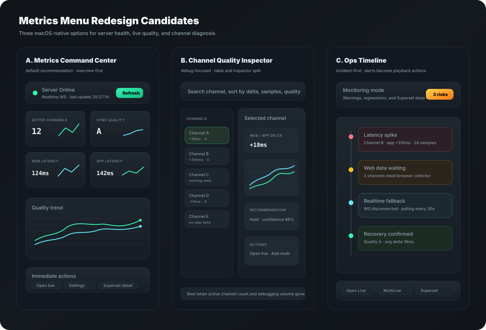

# CView 메트릭 메뉴 디자인 분석 및 리디자인 후보 3안

작성일: 2026-04-28  
범위: `MainContentView`의 메트릭 route, `MetricsDashboardView`, `HomeViewModel`의 Metrics API/WebSocket 상태, 메트릭 설정/전송 상태 UI  
목적: 현재 메트릭 메뉴의 정보 구조를 분석하고, 현재 CView macOS 앱 컨셉에 맞는 추천 리디자인 3개를 제안한다.

---

## 0. 결론

추천 순위는 다음이다.

| 순위 | 후보 | 핵심 성격 | 판단 |
|---|---|---|---|
| 1 | **Metrics Command Center** | 서버 상태, 라이브 품질, 주요 액션을 한 화면에 압축 | 기본 추천 |
| 2 | **Channel Quality Inspector** | 채널별 웹/앱 레이턴시와 동기화 추천을 빠르게 비교 | 디버깅/파워유저 모드 |
| 3 | **Ops Timeline** | 문제 이벤트와 복구 흐름을 시간순으로 보여주는 운영 모드 | 고급 모니터링 모드 |



기본 적용은 **1안 Metrics Command Center**가 가장 안전하다. 현재 메트릭 메뉴는 이미 서버 상태, 수집 메트릭, 차트, 채널 상세를 갖고 있지만 모두 세로 스크롤에 같은 비중으로 쌓여 있다. 기본 메뉴는 한 화면에서 상태 판단과 다음 액션이 가능해야 하고, 자세한 채널 디버깅은 2안처럼 별도 모드로 분리하는 편이 좋다.

---

## 1. 현재 구현 기준

현재 `MainContentView`는 사이드바의 `.metrics` route에서 `MetricsDashboardView(viewModel:)`를 표시한다. 이 화면은 `HomeViewModel`을 그대로 공유하므로 홈의 Metrics API/WebSocket 상태와 같은 데이터를 사용한다.

주요 화면 구조는 다음 순서다.

1. `heroHeader`: 서버명, 온라인 상태, 실시간/폴링 배지, 마지막 업데이트, 새로고침
2. `serverOverviewBar`: 상태, 버전, 업타임, 총 수신, 활성 채널
3. `systemHealthSection`: InfluxDB, PostgreSQL, Redis, 레코드 수
4. `metricsGrid`: 실시간 수신, 웹 레이턴시, CView 레이턴시, 플랫폼, CView 클라이언트, 동기화 품질
5. `analyticsSection`: 웹/앱 레이턴시 비교, 채널별 레이턴시 분포
6. `channelDetailSection`: 채널별 레이턴시, 방송 정보, CView 동기화 추천

데이터 로딩은 `HomeViewModel.loadServerStats()`가 `/api/stats/overview`를 우선 호출하고, 보조로 `/health`와 legacy `/api/stats`를 호출한다. 시스템 상태는 `/api/stats/system`에서 따로 가져온다. WebSocket은 실시간 수신 카운트와 채널별 레이턴시를 반영하고, 연결이 없으면 30초 폴링 기반으로 동작한다.

관련 구현 지점:

| 역할 | 현재 코드 |
|---|---|
| 메트릭 route | `Sources/CViewApp/Views/MainContentView.swift` |
| 메인 대시보드 UI | `Sources/CViewApp/Views/Dashboard/MetricsDashboardView.swift` |
| 차트 컴포넌트 | `Sources/CViewApp/Views/Dashboard/DashboardCharts.swift` |
| 서버/WS 상태 | `Sources/CViewApp/ViewModels/HomeViewModel.swift` |
| API endpoint | `Sources/CViewNetworking/MetricsEndpoint.swift` |
| 메트릭 설정 | `Sources/CViewApp/Views/MetricsSettingsTab.swift` |
| 전송 상태 패널 | `Sources/CViewApp/Views/MetricsForwardingStatusView.swift` |

---

## 2. 현재 디자인 문제

### 2.1 판단 우선순위가 약하다

현재 화면은 서버 상태, DB 상태, 실시간 수신, 레이턴시, 채널 상세가 모두 같은 세로 흐름에 놓인다. 사용자가 메트릭 메뉴에 들어왔을 때 가장 먼저 알고 싶은 것은 보통 다음 세 가지다.

1. 서버와 수집 파이프라인이 살아 있는가
2. 현재 시청/멀티라이브 품질에 문제가 있는가
3. 문제가 있다면 어떤 채널에서 무엇을 해야 하는가

현재 구조는 이 세 질문을 한 번에 답하기보다, 사용자가 여러 섹션을 스크롤하며 조합해야 한다.

### 2.2 채널 상세가 많아질수록 대시보드가 길어진다

`channelDetailSection`은 `LazyVGrid(.adaptive(minimum: 340))`로 채널 상세 카드를 늘린다. 활성 채널이 적을 때는 보기 좋지만, 멀티라이브나 웹 collector가 많아지면 메트릭 메뉴 전체가 긴 카드 목록처럼 변한다. 채널 비교가 목적이면 테이블/리스트가 더 빠르고, 한 채널의 원인 분석이 목적이면 선택형 inspector가 더 낫다.

### 2.3 설정, 전송 상태, 분석 메뉴가 분산되어 있다

메트릭 설정은 `MetricsSettingsTab`, 전송 상태는 `MetricsForwardingStatusView`, 서버 분석은 `MetricsDashboardView`에 있다. 기능 분리는 맞지만, 사용자는 “왜 데이터가 안 들어오지?”라는 상황에서 세 곳을 오가야 한다. 대시보드 상단에 최소한의 설정/전송 상태 진입점이 필요하다.

### 2.4 차트가 항상 같은 비중으로 보인다

`analyticsSection`은 레이턴시 비교 차트와 채널별 분포 차트를 항상 나란히 둔다. 하지만 메트릭 메뉴 첫 화면에서는 차트보다 `상태`, `품질 등급`, `문제 채널`, `마지막 수신`, `추천 액션`이 더 우선이다. 차트는 기본 요약 이후의 두 번째 밀도 영역이 적합하다.

### 2.5 Superset과 네이티브 메트릭의 역할 구분이 필요하다

이전에 홈/Superset 연동 설계에서 정리한 것처럼, Superset은 상세 분석용으로 강하고 앱 네이티브 UI는 즉시 판단과 액션에 강하다. 메트릭 메뉴도 같은 원칙이 맞다. 첫 화면은 네이티브 요약과 액션 중심으로 두고, Superset은 깊은 분석 버튼 또는 보조 패널로 연결한다.

---

## 3. 공통 설계 원칙

세 후보 모두 아래 제약을 지킨다.

- `MainContentView`의 `.metrics` route는 유지한다.
- 기본 진입 화면에서 WebView나 무거운 외부 대시보드는 로드하지 않는다.
- 서버 상태와 데이터 freshness를 최상단에서 항상 볼 수 있게 한다.
- `실시간 WebSocket / 폴링 fallback / 마지막 수신 시각`을 같은 status strip에 묶는다.
- 채널이 많아질수록 카드 그리드보다 리스트, 테이블, 선택형 inspector를 우선한다.
- `MetricsSettingsTab`과 `MetricsForwardingStatusView`로 가는 빠른 액션을 노출한다.
- Superset은 기본 화면의 주인공이 아니라 `상세 분석` 진입점으로 둔다.
- 차트는 현재 상태 판단을 방해하지 않는 위치에 둔다.

---

## 4. 후보 A: Metrics Command Center

### 컨셉

현재 `MetricsDashboardView`의 기능을 유지하되, 첫 화면을 “상태 판단 + 액션” 중심의 커맨드 센터로 재구성한다. 서버/수집 상태는 상단 strip, 핵심 KPI는 2x2 카드, 차트는 중앙 요약, 문제 채널과 액션은 하단 compact list로 둔다.

### 레이아웃

```text
┌──────────────────────────────────────────────────────────────┐
│ Status Strip: 서버 온라인 · WS/폴링 · 마지막 수신 · 새로고침     │
├──────────────────────────────────────────────────────────────┤
│ KPI 2x2: 활성 채널 · 동기화 품질 · 웹 레이턴시 · 앱 레이턴시      │
├──────────────────────────────────────────────────────────────┤
│ Quality Trend: 웹/앱 레이턴시 미니 차트 + 품질 변화              │
├──────────────────────────────────────────────────────────────┤
│ 문제 채널 요약: delta 큰 채널, 웹 데이터 대기, 오류 채널          │
├──────────────────────────────────────────────────────────────┤
│ 액션: 라이브 열기 · 멀티라이브 추가 · 설정 · Superset 상세        │
└──────────────────────────────────────────────────────────────┘
```

### 세부 디자인

- `heroHeader`와 `serverOverviewBar`를 하나의 얇은 status strip으로 합친다.
- `systemHealthSection`은 첫 화면에서는 작은 DB health badge로 축약하고, 클릭 시 세부 상태를 펼친다.
- `metricsGrid`는 6개 tile 대신 `활성 채널`, `동기화 품질`, `웹 레이턴시`, `CView 레이턴시` 4개 핵심만 기본 노출한다.
- `LatencyComparisonChart`는 유지하되 높이를 줄이고 KPI 아래에 둔다.
- 하단에는 `문제 채널` compact list를 둔다. 정상 채널 전체 카드는 기본 화면에서 숨기고 `전체 채널 보기`에서 2안으로 이동한다.
- 오른쪽 상단 또는 하단 액션에 `메트릭 설정`, `전송 상태`, `Superset 상세` 버튼을 둔다.

### 현재 코드 매핑

| 디자인 요소 | 현재 코드 활용 |
|---|---|
| 서버 온라인/오프라인 | `viewModel.isMetricsServerOnline` |
| WS/폴링 배지 | `viewModel.isWebSocketConnected` |
| 마지막 수신 | `viewModel.serverLastUpdate` |
| 활성 채널 | `viewModel.serverChannelStats.count`, `activeAppChannelCount` |
| 동기화 품질 | `viewModel.serverStats?.cviewSummary?.aggregate` |
| 웹/앱 평균 레이턴시 | `avgWebLatency`, `avgAppLatency` |
| 품질 차트 | `LatencyComparisonChart(history:)` |
| Superset 진입 | 기존 `/superset` 또는 `https://<host>:9443/` 딥링크 |

### 장점

- 현재 구현을 가장 적게 흔든다.
- 메트릭 메뉴 첫 진입 목적이 명확해진다.
- 기존 홈/라이브의 경량 방향과 잘 맞는다.
- Superset을 연결하되 앱 기본 화면은 계속 빠르다.

### 단점

- 채널별 상세 디버깅은 별도 화면 또는 펼침 영역이 필요하다.
- 현재 `systemHealthSection`의 세부 DB 정보는 1단계에서 덜 강조된다.

### 추천 적용

기본 메트릭 메뉴는 이 안으로 가는 것이 좋다.

---

## 5. 후보 B: Channel Quality Inspector

### 컨셉

메트릭 메뉴를 채널 품질 분석 도구로 강화한다. 왼쪽에는 활성 채널 리스트/테이블을 두고, 오른쪽에는 선택한 채널의 웹/앱 레이턴시, delta, 샘플 수, 방송 정보, 동기화 추천, 액션을 보여준다.

### 레이아웃

```text
┌──────────────────────────────────────────────────────────────┐
│ Toolbar: 검색 · 정렬(delta/samples/quality) · 필터(web/app/wait) │
├──────────────────────┬───────────────────────────────────────┤
│ Channel Table         │ Selected Channel Inspector             │
│ 채널 · 품질 · delta    │ latency chart · recommendation · action │
│ 샘플 · 상태 · last seen │ stream info · app/web data freshness    │
└──────────────────────┴───────────────────────────────────────┘
```

### 세부 디자인

- 좌측 channel table은 260~320pt 정도의 rail 또는 `Table` 스타일로 만든다.
- 행에는 `채널명`, `품질 등급`, `delta`, `web/app 샘플 유무`, `마지막 수신`만 표시한다.
- 우측 inspector는 선택 채널만 큰 차트와 상세 정보를 표시한다.
- `waiting`, `speed_up`, `slow_down`, `hold` 같은 recommendation action을 명확히 badge화한다.
- 바로 액션: `단일 라이브 열기`, `멀티라이브 추가`, `Superset 채널 상세`, `collector 상태 확인`.
- 좁은 창에서는 table을 상단 segmented list로 바꾸고 inspector를 아래로 내린다.

### 현재 코드 매핑

| 디자인 요소 | 현재 코드 활용 |
|---|---|
| 채널 목록 | `viewModel.serverChannelStats` |
| 웹/앱 통계 | `ChannelStatsItem.web`, `ChannelStatsItem.app` |
| delta | `ChannelStatsItem.delta` |
| 방송 정보 | `ChannelStatsItem.broadcast` |
| 동기화 추천 | `serverStats?.cviewSummary?.syncChannels` |
| 최소 실시간 업데이트 | `applyRealtimeMetric(_:)` |

### 장점

- 활성 채널이 많을 때 현재 카드 그리드보다 훨씬 빠르게 비교할 수 있다.
- 문제 채널 원인 분석에 강하다.
- 멀티라이브 안정성, 웹/앱 싱크, PDT 비교 작업과 직접 연결된다.

### 단점

- 현재 `MetricsDashboardView`보다 구조 변경이 크다.
- 선택 상태와 responsive split 규칙이 필요하다.
- 일반 사용자의 기본 대시보드로는 분석 도구 느낌이 강하다.

### 추천 적용

기본 화면보다 `채널 분석` 탭 또는 `전체 채널 보기` 진입 후 사용하는 2차 모드가 적합하다.

---

## 6. 후보 C: Ops Timeline

### 컨셉

메트릭 메뉴를 “문제 이벤트 중심”으로 재구성한다. 레이턴시 급등, 웹 데이터 대기, WebSocket fallback, DB 연결 저하, 회복 확인 같은 상태 변화를 시간순 timeline으로 보여주고, 각 이벤트에서 바로 라이브/멀티라이브/Superset 액션으로 이어지게 한다.

### 레이아웃

```text
┌──────────────────────────────────────────────────────────────┐
│ Monitoring Header: 위험 수 · 서버 상태 · 마지막 체크 · 상세 열기 │
├──────────────────────────────────────────────────────────────┤
│ Timeline                                                     │
│ 20:31 Latency spike: Channel B +310ms                         │
│ 20:28 Web data waiting: 2 channels                            │
│ 20:25 Realtime fallback: WS disconnected                      │
│ 20:22 Recovery confirmed: quality A                           │
├──────────────────────────────────────────────────────────────┤
│ Event Actions: Open Live · MultiLive · Settings · Superset     │
└──────────────────────────────────────────────────────────────┘
```

### 세부 디자인

- 이벤트 severity는 `critical`, `warning`, `info`, `recovered`로 나눈다.
- 이벤트는 실제 데이터가 있을 때만 만든다. 임의 alert를 만들지 않는다.
- 문제 채널 이벤트는 delta, sample count, web/app 데이터 유무를 함께 표시한다.
- WebSocket이 끊겨 폴링으로 fallback되는 상태를 별도 이벤트로 보여준다.
- DB 상태 저하는 `systemStats`의 InfluxDB/PostgreSQL/Redis 상태에서 생성한다.
- Superset은 이벤트별 deep link 또는 전체 dashboard 버튼으로만 연결한다.

### 현재 코드 매핑

| 디자인 요소 | 현재 코드/추가 필요 |
|---|---|
| WS fallback 이벤트 | `isWebSocketConnected`, `serverLastUpdate` |
| 레이턴시 급등 | `serverChannelStats.delta`, `web/app avg` |
| 웹 데이터 대기 | `cviewSummary.aggregate.waitingChannels` |
| DB 상태 이벤트 | `systemStats.influxdb`, `systemStats.postgres`, `systemStats.redis` |
| 이벤트 이력 | 추가 필요: 최근 상태 스냅샷/threshold 기반 event buffer |

### 장점

- 문제가 생겼을 때 가장 빠르게 원인을 좁힐 수 있다.
- 운영자/디버깅 사용자에게 강하다.
- Superset alert/report와 연결하기 쉽다.

### 단점

- 기본 시청자용 메뉴로는 무겁게 느껴질 수 있다.
- 이벤트 threshold와 이력 저장 정책이 필요하다.
- 아직 현재 ViewModel에는 event buffer가 없어서 구현 추가가 필요하다.

### 추천 적용

기본 메뉴가 아니라 `운영 모드` 또는 `모니터링` 탭으로 두는 것이 좋다.

---

## 7. 비교

| 항목 | A. Command Center | B. Channel Inspector | C. Ops Timeline |
|---|---|---|---|
| 기본 메뉴 적합성 | 높음 | 중간 | 낮음~중간 |
| 현재 코드 재사용 | 높음 | 중간 | 중간 |
| 채널이 많을 때 | 보통 | 높음 | 높음 |
| 문제 원인 추적 | 중간 | 높음 | 높음 |
| 구현 리스크 | 낮음~중간 | 중간 | 중간~높음 |
| Superset 연동 | 딥링크 중심 | 채널 상세 딥링크 | 이벤트/리포트 딥링크 |
| 추천 사용자 | 일반 사용자 + 파워유저 | 품질 디버깅 사용자 | 운영/모니터링 사용자 |

---

## 8. 최종 추천 구조

메트릭 메뉴는 하나의 긴 대시보드보다 아래 3단계 구조가 적합하다.

```text
Metrics
├─ Overview          -> 1안 Metrics Command Center
├─ Channels          -> 2안 Channel Quality Inspector
└─ Monitoring        -> 3안 Ops Timeline
```

1차 구현은 **Overview만 먼저 교체**한다. 현재 `MetricsDashboardView`의 body 순서를 바꾸고, helper view를 재배치하는 정도로 시작할 수 있다.

2차 구현은 `Channels` 탭을 추가해 현재 `channelDetailSection`을 table + inspector 구조로 이동한다.

3차 구현은 `Monitoring` 탭을 추가하되, event buffer와 threshold 정책을 먼저 설계한 뒤 넣는다.

---

## 9. 구현 우선순위

| 우선순위 | 작업 | 이유 |
|---|---|---|
| P0 | `MetricsDashboardView`에 Overview/Channels/Monitoring segmented mode 추가 | 대시보드 길이를 줄이고 역할을 분리 |
| P0 | `heroHeader + serverOverviewBar`를 status strip으로 통합 | 첫 화면 판단 속도 개선 |
| P1 | 핵심 KPI를 4개로 압축하고 나머지는 펼침 처리 | 정보 과밀 완화 |
| P1 | `channelDetailSection`을 channel list + inspector로 분리 | 활성 채널 증가 대응 |
| P1 | `MetricsSettingsTab`, `MetricsForwardingStatusView`, Superset 진입 액션 추가 | 설정/상태/분석 이동 비용 감소 |
| P2 | DB/system health를 compact badge + detail drawer로 변경 | 기본 화면 가벼움 유지 |
| P2 | Ops timeline event buffer 추가 | 운영 모드 구현 기반 |

---

## 10. 검증 시나리오

1. 서버 정상 + WebSocket 연결: Overview 상단에서 온라인, 실시간, 마지막 수신, 핵심 KPI가 한 화면에 표시된다.
2. WebSocket 끊김 + 폴링 fallback: status strip이 `폴링` 상태로 바뀌고, 데이터가 30초 주기로 갱신되는 것을 알 수 있다.
3. 활성 채널 0개: Overview는 빈 상태를 짧게 보여주고, Channels 탭은 과도한 빈 카드 목록을 만들지 않는다.
4. 활성 채널 10개 이상: Channels 탭에서 리스트 선택과 inspector 전환이 스크롤 카드 그리드보다 빠르게 동작한다.
5. 웹 데이터 없음: 동기화 품질 영역이 `웹 데이터 대기`를 명확히 표시하고 collector 확인 액션을 제공한다.
6. Superset 비정상: 네이티브 Overview와 Channels는 정상 동작하고, Superset 상세 버튼만 비활성/오류 상태를 표시한다.
7. 좁은 창: Overview KPI가 2열 또는 1열로 내려가고, Channels split은 list-over-detail 구조로 fallback한다.
