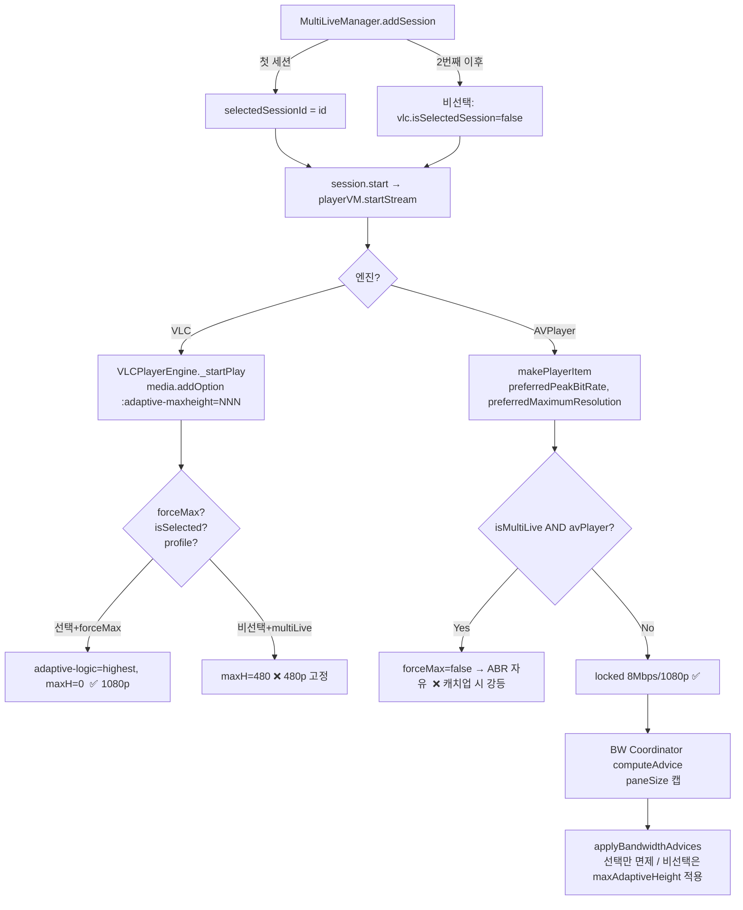

# 멀티라이브 1080p 유지 실패 원인 분석 — 2026-04-18

## 문서 개요
- **대상 증상**: 멀티라이브에서 VLC / AVPlayer 두 엔진 모두 라이브 재생 시 1080p가 유지되지 않음 (720p 이하로 강등 후 복귀하지 못하거나, 시작 자체가 720p로 잡힘)
- **분석 범위**: `Sources/CViewPlayer/*`, `Sources/CViewApp/ViewModels/{MultiLiveManager,PlayerViewModel,MultiLiveSession}.swift`, `MultiLiveBandwidthCoordinator`, `ABRController`, `StreamCoordinator+QualityABR`
- **버전 기준**: Release 2.0.0 (38) — 직전 BW smoothing / HQ recovery watchdog 작업 반영 후

---

## 1. 핵심 결론 (TL;DR)

멀티라이브에서 1080p가 유지되지 못하는 원인은 **단일 버그가 아니라 5개 레이어의 상호작용 결과**다. 우선순위순으로:

| # | 원인 | 영향 엔진 | 강등 메커니즘 |
| - | --- | --- | --- |
| C1 | `MultiLiveBandwidthCoordinator` 의 **paneSize 기반 레벨 캡** (`updateEstimatedPaneSizes` + `capLevelByPaneSize`) | VLC / AVPlayer | 4세션 그리드를 960×540 으로 추정 → 모든 비선택 세션을 **720p 캡**, 사용자가 풀스크린/포커스 전환을 해도 캡이 유지됨 |
| C2 | VLC `multiLive` 프로파일이 **비선택 시 854×480 강제** (`adaptiveMaxWidth/Height(isSelected:)`) | VLC | 첫 세션 추가 → 선택은 자동이지만, **추가 세션은 비선택 → 480p 진입**. 이후 해당 세션을 선택하면 `updateSessionTier(.active)` 가 프로파일을 `multiLiveHQ` 로 바꿔도 **이미 적용된 미디어 옵션 `:adaptive-maxheight=480` 은 재생 중 변경 불가** → 매니페스트 새로 로드(switchMedia)될 때까지 480p |
| C3 | AVPlayer 멀티라이브에서 `forceHighestQuality` 가 **무조건 비활성화** (`PlayerViewModel.startStream`) | AVPlayer | `let forceMax = requestedForceMax && !(isMultiLive && preferredEngineType == .avPlayer)` → AVPlayer 멀티라이브는 1080p variant URL 직접 고정도 안 되고, ABR 자유로 진입 → 캐치업 부하 시 즉시 강등 |
| C4 | `MultiLiveBandwidthCoordinator.computeAdvice` 가 **선택 세션에도** `cappedHeight` 를 산출 (직전 패치로 `applyBandwidthAdvices` 만 면제) | VLC / AVPlayer | 선택 세션은 `applyBandwidthAdvices` 에서 `maxAdaptiveHeight=0` 으로 면제되지만, **VLC 의 첫 `play()` 시점에 이미 `:adaptive-maxheight` 가 480/720으로 박혀 있어 면제 효과가 다음 매니페스트 갱신까지 지연** |
| C5 | VLC `forceHighestQuality=true` 인데 `streamingProfile=.multiLiveHQ` 가 자동 적용되지 않는 경로 (`injectEngine`/`resetForReuse`) | VLC | `injectEngine` → `multiLive`, `resetForReuse` → `multiLive`, 그리고 `applySettings(lowLatency:true)` 의 가드가 `multiLive` 만 보호 → `multiLiveHQ` 가 **`lowLatency` 로 덮어써짐** (1080p 유지에는 OK 하지만 의도된 HQ 튜닝이 깨짐) |

---

## 2. 데이터 흐름 — 세션 시작 ~ 1080p 결정



---

## 3. 원인별 코드 인용 및 영향 분석

### C1. paneSize 기반 720p 레벨 캡 — **가장 광범위한 원인**

**위치**: [Sources/CViewApp/ViewModels/MultiLiveManager.swift](Sources/CViewApp/ViewModels/MultiLiveManager.swift#L740-L775)

```swift
private func updateEstimatedPaneSizes() {
    let count = sessions.count
    let screenW = 1920
    let screenH = 1080
    let (paneW, paneH): (Int, Int)
    switch count {
    case 1: (paneW, paneH) = (screenW, screenH)
    case 2: (paneW, paneH) = (screenW / 2, screenH)
    case 3, 4: (paneW, paneH) = (screenW / 2, screenH / 2)   // ← 960×540
    default: (paneW, paneH) = (screenW / 3, screenH / 2)
    }
    ...
}
```

**위치**: [Sources/CViewPlayer/MultiLiveBandwidthCoordinator.swift](Sources/CViewPlayer/MultiLiveBandwidthCoordinator.swift#L308-L325)

```swift
private func capLevelByPaneSize(paneWidth: Int, paneHeight: Int, isSelected: Bool) -> Int {
    let resolutionTiers: [(width: Int, height: Int)] = [
        (640, 360), (854, 480), (1280, 720), (1920, 1080)
    ]
    for tier in resolutionTiers {
        if tier.width >= paneWidth || tier.height >= paneHeight {
            return tier.height   // 960×540 → 1280≥960 → return 720 ❌
        }
    }
    return 1080
}
```

**영향**:
- 4세션 그리드 → `paneW=960, paneH=540` → tier 순회에서 첫 매치가 `(1280, 720)` → **720p 캡**.
- 직전 패치(`applyBandwidthAdvices`) 가 선택 세션의 `maxAdaptiveHeight`만 0으로 면제하지만, **`computeAdvice` 자체는 선택 세션도 720 cappedHeight 를 계산**. AVPlayer 의 경우 이 cappedHeight 를 직접 적용하는 경로는 없으나, **VLC 비선택 세션은 720p 로 캡**되어 추후 그 세션이 선택되어도 `:adaptive-maxheight=720` 이 미디어 옵션에 박혀 1080p 변종을 못 고름.
- `isSelected` 인자가 `capLevelByPaneSize` 시그니처에는 있으나 **로직에서 사용되지 않음** → 선택/비선택 구분 없이 동일 캡.

---

### C2. VLC `multiLive` 프로파일의 비선택 480p 고정 + 런타임 변경 불가

**위치**: [Sources/CViewPlayer/VLCPlayerEngine.swift](Sources/CViewPlayer/VLCPlayerEngine.swift#L177-L190)

```swift
func adaptiveMaxHeight(isSelected: Bool) -> Int {
    switch self {
    case .ultraLow, .lowLatency: return 0
    case .multiLive: return isSelected ? 1080 : 480
    case .multiLiveHQ: return 0
    }
}
```

**위치**: [Sources/CViewPlayer/VLCPlayerEngine+Playback.swift](Sources/CViewPlayer/VLCPlayerEngine+Playback.swift#L240-L255)

```swift
let maxW = profile.adaptiveMaxWidth(isSelected: isSelectedSession)
var h = profile.adaptiveMaxHeight(isSelected: isSelectedSession)
if maxAdaptiveHeight > 0 { h = min(h, maxAdaptiveHeight) }
let maxH = h
...
if maxH > 0 { media.addOption(":adaptive-maxheight=\(maxH)") }
```

**영향**:
- VLC 미디어 옵션은 `media` 객체에 **재생 시작 전 한 번** 주입되며, 재생 중 변경하려면 새 미디어를 만들어 `switchMedia()` 또는 `play(url:)` 재호출이 필요.
- `MultiLiveManager.selectSession` 의 `vlc.updateSessionTier(.active)` 는 `streamingProfile = .multiLiveHQ` 를 바꾸지만 **현재 재생 중인 미디어 옵션은 그대로**. → 선택해도 480p (또는 720p) 가 유지됨.
- 사용자 체감: "선택해서 큰 화면으로 봐도 화질이 그대로 거칠다."

---

### C3. AVPlayer 멀티라이브에서 `forceHighestQuality` 강제 비활성화

**위치**: [Sources/CViewApp/ViewModels/PlayerViewModel.swift](Sources/CViewApp/ViewModels/PlayerViewModel.swift#L453-L460)

```swift
let userForceMax = playerSettings?.forceHighestQuality ?? true
let syncActive = (playerSettings?.lowLatencyMode ?? true) || ((playerSettings?.catchupRate ?? 1.0) > 1.0)
let requestedForceMax = userForceMax || syncActive
// 멀티라이브 + AVPlayer 조합에서는 1080p variant URL 고정이 ABR을 우회하여
// 첫 프레임 정지/장시간 멈춤처럼 보이는 현상을 만들 수 있다.
let forceMax = requestedForceMax && !(isMultiLive && preferredEngineType == .avPlayer)
```

**영향**:
- `forceMax=false` 가 `StreamCoordinator.Configuration.forceHighestQuality` 로 전달 → `pinnedManifestURL` 사용 안 함 → 마스터 매니페스트 기반 ABR 자유.
- AVPlayer 의 `isQualityLocked` 는 기본 true 로 ceiling(8Mbps/1080p) 은 걸지만, **AVFoundation 내부 ABR 은 캐치업(`rate > 1.0`) 부하 시 720p 이하로 자유롭게 강등**. 직전에 추가한 HQ recovery watchdog 가 복구를 시도하지만:
  - watchdog 가드 중 `guard isSelMulti` 가 있어 **비선택 세션은 절대 복구 시도하지 않음** ([AVPlayerEngine+LiveStream.swift](Sources/CViewPlayer/AVPlayerEngine+LiveStream.swift#L240-L260))
  - 결과: 한 번 비선택이 되면 720p 영구 고정. 다시 선택해도 ceiling 변경 없이 nudge 만으로는 충분치 않을 수 있음 (60s 쿨다운 + 3샘플 = 최소 ~30s 지연).

---

### C4. BW 코디네이터의 cappedHeight가 선택 면제와 시점이 어긋남

**위치**: [Sources/CViewPlayer/MultiLiveBandwidthCoordinator.swift](Sources/CViewPlayer/MultiLiveBandwidthCoordinator.swift#L235-L260) — `computeAdvice`

`computeAdvice` 는 **모든 세션에 대해** `capLevelByPaneSize` 결과를 `cappedMaxHeight` 로 채워 반환한다. 직전 패치([Sources/CViewApp/ViewModels/MultiLiveManager.swift](Sources/CViewApp/ViewModels/MultiLiveManager.swift#L611-L640)) 는 적용 단계에서만 선택 세션을 면제:

```swift
if isSelected {
    if let vlc { vlc.maxAdaptiveHeight = 0 }
    ...
    continue
}
// 비선택만 maxAdaptiveHeight = advice.cappedMaxHeight
```

**영향**:
- **첫 시작 시 시점 차이**: `addSession` → `await session.start()` 가 비동기로 즉시 실행되며, BW 코디네이션 루프 첫 사이클은 ~8s 후. 그 사이 선택 세션은 정상이지만 **비선택 세션은 `multiLive` 프로파일 + `:adaptive-maxheight=480`** 으로 이미 박혀있음.
- 비선택 세션을 사용자가 선택하면 `applyBandwidthAdvices` 가 `maxAdaptiveHeight=0` 으로 풀어주지만, **VLC 미디어 옵션은 변경되지 않음 → 720p/480p 유지** (C2 와 동일 메커니즘).
- 정확한 복구는 매니페스트 재로드 또는 `play(url:)` 재호출이 있어야 가능.

---

### C5. VLC 프로파일 자동 승격 누락 + `lowLatency` 덮어쓰기

**위치 1**: [Sources/CViewPlayer/VLCPlayerEngine+Features.swift](Sources/CViewPlayer/VLCPlayerEngine+Features.swift#L120-L130) — `resetForReuse`

```swift
streamingProfile = .multiLive   // .multiLiveHQ 가 아닌 .multiLive 로 리셋
isSelectedSession = true
sessionTier = .active
```

**위치 2**: [Sources/CViewPlayer/MultiLiveEnginePool.swift](Sources/CViewPlayer/MultiLiveEnginePool.swift#L120-L130) — `acquire`

```swift
await MainActor.run { engine.streamingProfile = .multiLive }
```

**위치 3**: [Sources/CViewApp/ViewModels/PlayerViewModel.swift](Sources/CViewApp/ViewModels/PlayerViewModel.swift#L130-L142) — `injectEngine`

```swift
if let vlc = engine as? VLCPlayerEngine {
    vlc.streamingProfile = .multiLive   // 항상 .multiLive
}
```

**위치 4**: [Sources/CViewApp/ViewModels/PlayerViewModel.swift](Sources/CViewApp/ViewModels/PlayerViewModel.swift#L292-L304) — `applySettings`

```swift
if lowLatency {
    if let vlc = playerEngine as? VLCPlayerEngine,
       vlc.streamingProfile != .multiLive {     // ⚠ .multiLiveHQ 도 아닌 경우에만 보호
        vlc.streamingProfile = .lowLatency
    }
}
```

**영향**:
- 첫 세션은 자동 선택됨에도 `.multiLive` 프로파일로 시작 → VLC 미디어 옵션이 `:adaptive-maxheight=1080` 이긴 하지만 (선택 세션이므로) **manifest-refresh 20s, decoder-threads 1, skip-frames=true, hurry-up=true, skip-loop-filter=4** 가 적용되어 1080p 디코딩 품질이 떨어짐 (블록 아티팩트, 프레임 스킵 빈발).
- 선택 → `updateSessionTier(.active)` 로 `.multiLiveHQ` 승격되지만 **재생 중 미디어 옵션은 그대로** → 다음 매니페스트 갱신 또는 재시작까지 `multiLive` 옵션 유지.
- `applySettings(lowLatency: true)` 가 호출되면 `multiLiveHQ != multiLive` 이므로 가드 통과 → **`.lowLatency` 로 덮어씀**. 이는 1080p 자체는 유지하지만 코디네이터가 의도한 HQ 튜닝(manifestRefreshInterval=5s, networkCaching=800ms 등) 을 잃음.

---

## 4. 시점별 강등 시나리오

### 시나리오 A — 초기 4세션 동시 시작
1. `addSession ×4` → 첫 세션 `selectedSessionId`, 나머지 3개 `isSelectedSession=false`.
2. 비선택 3개: VLC `multiLive` + `:adaptive-maxheight=480` 고정 → **480p 진입**.
3. 선택 1개: `multiLive` + `:adaptive-maxheight=1080` → 1080p 가능 but 위 C5 의 multiLive 옵션(skip-frames, hurry-up) 으로 디코딩 품질 저하.
4. 8s 후 BW 코디네이터 첫 advice → 4세션 = 960×540 → 모든 비선택에 `maxAdaptiveHeight=720` 푸시 (480보다 높지만 어차피 무시됨, 미디어 옵션이 480으로 박혔으므로).
5. 사용자가 비선택 세션을 선택 → `updateSessionTier(.active)` → 프로파일은 `multiLiveHQ` 로, `maxAdaptiveHeight=0` 으로 변경 but **VLC 미디어 옵션은 그대로 480p**.

### 시나리오 B — AVPlayer 4세션
1. `forceMax=false` → AVPlayer ABR 자유 활성화.
2. 모든 세션 `isQualityLocked=true` → ceiling 8Mbps/1080p 적용.
3. 라이브 캐치업 (`startLiveCatchupLoop`) 이 `rate > 1.0` 으로 변하면 AVFoundation 내부 ABR 이 안전마진을 위해 720p 로 강등.
4. HQ recovery watchdog 가드: `guard isSelMulti` → **비선택 세션은 복구 시도조차 안 함**.
5. 사용자가 강등된 세션을 선택 → `isSelectedMultiLiveSession=true` 로 전환되며 watchdog 가 활동, 그러나 60s 쿨다운 + 3샘플(18s) → 약 30~60s 후 nudge → 그래도 ABR 이 1080p 변종을 다시 고른다는 보장 없음.

---

## 5. 우선순위별 수정 권고안

### P0 (즉시 수정 — 1080p 시작 자체를 보장)
1. **paneSize 추정을 보수적으로 변경**: 기본값을 1920×1080 으로 두고 실제 윈도우/뷰 사이즈를 받아오도록 PlayerContainerView 에서 `updatePaneSize` 호출. 또는 `enableLevelCapping = false` 를 `forceHighestQuality` 환경에서 강제.
2. **VLC: `multiLive` 비선택 캡 480 → 720** 으로 완화 또는 `forceHighestQuality` 활성 시 **무제한**. `adaptiveMaxHeight(isSelected:forceMax:)` 시그니처 확장.
3. **VLC: 첫 세션은 무조건 `multiLiveHQ`** 로 시작. `MultiLiveManager.addSession` 에서 첫 세션 선택 직후 `vlc.streamingProfile = .multiLiveHQ` (또는 `injectEngine` 직후 selectedFlag 기반 분기).
4. **AVPlayer 멀티라이브 `forceMax` 차단 해제**: 1080p variant URL 직접 고정도 ABR 우회의 안정성 회귀를 줬다는 주석이 있으므로, 별도 옵션으로 제어. 최소한 **선택 세션만큼은 `forceMax=true`** 적용.

### P1 (런타임 회복성 확보)
5. **VLC 프로파일 변경 시 자동 매니페스트 재로드**: `updateSessionTier(.active)` 또는 `setMaxAdaptiveHeight(0)` 호출 시 옵션 차이가 있으면 `switchMedia(currentURL)` 으로 새 미디어를 만들어 적용.
6. **AVPlayer HQ recovery watchdog 가드 완화**: `guard isSelMulti` 를 제거하여 비선택 세션도 백그라운드 ceiling 회복 시도. 또는 사용자가 세션을 선택한 직후 강제 nudge 1회.
7. **`applySettings` 의 `streamingProfile != .multiLive` 가드 확장**: `!profile.isMultiLiveFamily` 로 변경하여 `.multiLiveHQ` 도 보호.

### P2 (구조 정리)
8. **BW 코디네이터 `computeAdvice` 단계에서 선택 세션 cappedHeight 를 0 으로**: 적용 단계 면제 + 산출 단계 면제 이중 안전망. `capLevelByPaneSize(isSelected:)` 가 받은 인자를 실제로 사용하도록 수정.
9. **`resetForReuse`/`MultiLiveEnginePool.acquire` 의 기본 프로파일 분리**: 풀에서 가져올 때는 `lowLatency` 로 두고, MultiLiveManager 가 첫 세션이면 `multiLiveHQ`, 추가 세션이면 `multiLive` 로 명시 설정.
10. **`updateEstimatedPaneSizes` 호출 시점 추가**: 그리드 레이아웃 모드 변경, 윈도우 리사이즈 시에도 갱신되도록 SwiftUI `onGeometryChange` 연결.

---

## 6. 검증 체크리스트 (수정 후)

- [ ] VLC 4세션 동시 시작 → 모든 세션에서 ffprobe/통계로 1080p variant 선택 확인
- [ ] VLC 비선택 세션 → 선택 전환 후 5초 이내 1080p 변종 fetch 확인 (manifest 갱신 또는 switchMedia)
- [ ] AVPlayer 4세션 동시 시작 → AccessLog `indicatedBitrate` ≥ 6Mbps 유지 (캐치업 중에도)
- [ ] AVPlayer 비선택 세션 강등 → 선택 후 30s 이내 8Mbps 복귀
- [ ] BW 코디네이터 로그에 `cappedHeight=720/480` 이 선택 세션에는 출력되지 않음
- [ ] `applySettings(lowLatency: true)` 호출 후에도 `multiLiveHQ` 프로파일 유지

---

## 7. 관련 파일 빠른 참조

- 프로파일 정의: [VLCPlayerEngine.swift](Sources/CViewPlayer/VLCPlayerEngine.swift#L100-L235)
- VLC 미디어 옵션 적용: [VLCPlayerEngine+Playback.swift](Sources/CViewPlayer/VLCPlayerEngine+Playback.swift#L210-L260)
- 세션 계층 / 프로파일 승격: [VLCPlayerEngine+Features.swift](Sources/CViewPlayer/VLCPlayerEngine+Features.swift#L155-L225)
- AVPlayer 화질 잠금: [AVPlayerEngine.swift](Sources/CViewPlayer/AVPlayerEngine.swift#L520-L605)
- AVPlayer HQ 복구 워치독: [AVPlayerEngine+LiveStream.swift](Sources/CViewPlayer/AVPlayerEngine+LiveStream.swift#L210-L320)
- BW 코디네이터: [MultiLiveBandwidthCoordinator.swift](Sources/CViewPlayer/MultiLiveBandwidthCoordinator.swift#L195-L325)
- BW 어드바이스 적용 (직전 패치): [MultiLiveManager.swift](Sources/CViewApp/ViewModels/MultiLiveManager.swift#L595-L700)
- 멀티라이브 + AVPlayer forceMax 차단: [PlayerViewModel.swift](Sources/CViewApp/ViewModels/PlayerViewModel.swift#L450-L465)
- VLC 프로파일 초기화 경로: [PlayerViewModel.swift](Sources/CViewApp/ViewModels/PlayerViewModel.swift#L130-L170), [MultiLiveEnginePool.swift](Sources/CViewPlayer/MultiLiveEnginePool.swift#L120-L135)
