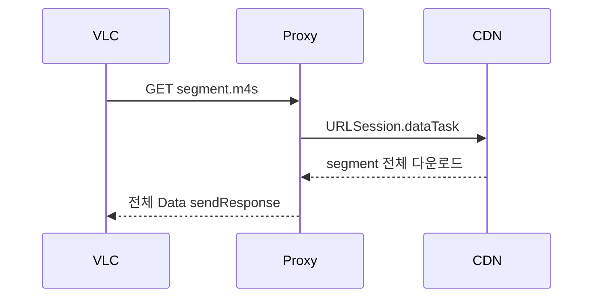
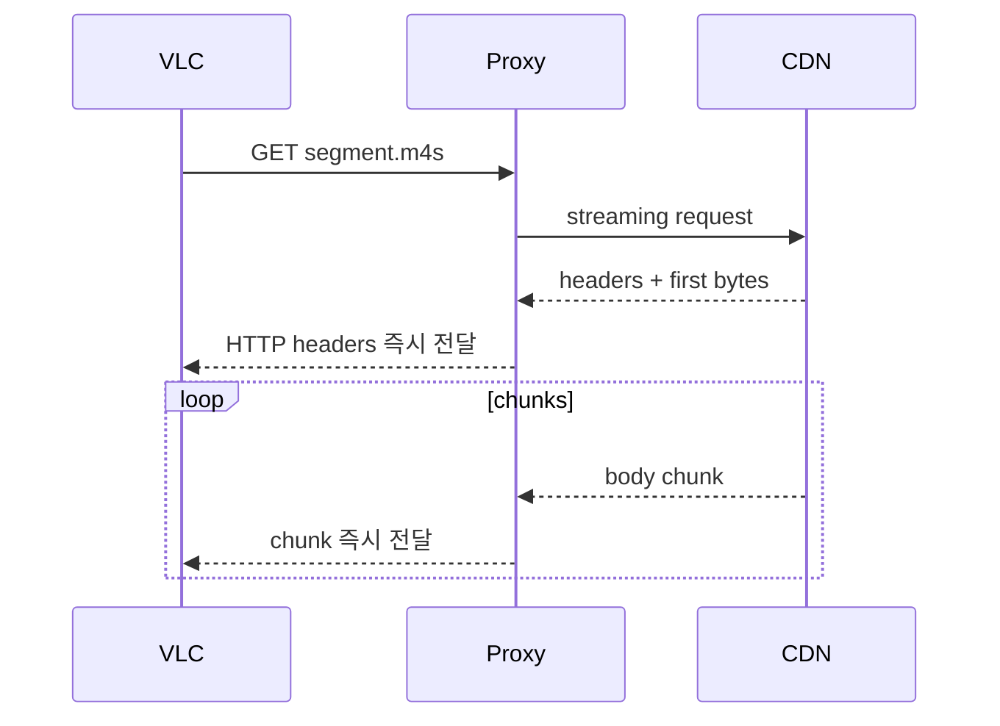

# 멀티라이브 VLC 버퍼링 문제 분석 및 해결 방안

작성일: 2026-04-24  
대상: CView v2 멀티라이브, VLC 플레이어 엔진, 로컬 스트림 프록시, 대역폭 코디네이터  
참고 측정값: Speedtest 다운로드 869Mbps, 업로드 834Mbps, ping 10ms, jitter 1ms, packet loss 0%

## 1. 결론

첨부된 네트워크 측정값 기준으로는 회선 자체가 멀티라이브 VLC 버퍼링의 1차 병목일 가능성이 낮다.

| 항목 | 측정값 | 판단 |
| --- | ---: | --- |
| 다운로드 | 869Mbps | 4개 1080p60 스트림을 동시에 받아도 충분한 수준 |
| 업로드 | 834Mbps | 시청 버퍼링과 직접 관련 낮음 |
| ping | 10ms | 라이브 HLS 요청 왕복 지연으로 양호 |
| jitter | 1ms | 순간 지연 변동이 매우 낮음 |
| packet loss | 0% | 패킷 손실 기반 재전송/끊김 가능성 낮음 |

치지직 1080p60 스트림을 대략 8Mbps로 보면, 4채널 동시 재생은 순수 영상만 약 32Mbps다. 오디오, HLS playlist, TCP/TLS/HTTP overhead, CDN 순간 변동을 넉넉하게 1.5배로 잡아도 약 48Mbps 수준이다. 이는 측정 다운로드 869Mbps의 약 5.5%에 불과하다.

따라서 잦은 버퍼링은 다음 중 하나 또는 복합 원인일 가능성이 크다.

1. 멀티라이브에서 모든 VLC 세션이 최고화질 잠금으로 고정되어 대역폭 코디네이터가 실질적으로 동작하지 않는다.
2. 로컬 프록시가 세그먼트를 통째로 받은 뒤 VLC에 넘겨 첫 바이트 지연과 메모리 압력을 만든다.
3. VLC 버퍼 값이 선택 세션 800ms, 비선택 1500ms로 짧고, 모든 세션 HQ일 때 jitter 흡수 여유가 부족하다.
4. VLC 메트릭 샘플 duration과 대역폭 코디네이터 입력값이 실제 다운로드/세그먼트 시간과 맞지 않아 버퍼 상태 판단이 왜곡된다.
5. 네트워크 회선은 빠르지만 Chzzk CDN 경로, per-host connection, local proxy, 디코딩/GPU/thermal 병목이 스트림별로 발생한다.

핵심 해결 방향은 “회선 속도 증가”가 아니라 **멀티라이브 전용 재생 정책 분리, 프록시 세그먼트 스트리밍화, VLC 버퍼/품질 잠금 재설계, 실제 메트릭 기반 제어**다.

## 2. 현재 코드 기준 병목 지점

### 2.1 최고화질 잠금이 멀티라이브 안정성 정책을 무력화한다

현재 기본 `PlayerSettings.forceHighestQuality`는 `true`다. 또한 `PlayerViewModel.startStream()`은 사용자가 최고화질 잠금을 꺼도 `lowLatencyMode=true`이거나 `catchupRate > 1.0`이면 다시 `forceMax=true`로 만든다.

영향:

- `StreamCoordinator.setMaxAllowedBitrate()`는 `forceHighestQuality`일 때 바로 return한다.
- `MultiLiveManager.applyBandwidthAdvices()`는 VLC의 `forceHighestQuality`가 true이면 세션별 cap/강등을 건너뛴다.
- `VLCPlayerEngine.applyMediaOptions()`는 forceMax일 때 `adaptive-maxheight`, `adaptive-maxwidth`, skip frame, hurry-up, loop filter skip을 대부분 비활성화한다.
- `MultiLiveSession.start()`는 forceHighestQuality일 때 비선택 세션도 `updateSessionTier(.active)`로 올려 1080p 변종 선택을 유도한다.

즉 대역폭 코디네이터와 비선택 품질 저하 옵션이 있어도, 실제로는 “모든 세션 1080p 유지” 경로가 우선할 수 있다. 네트워크가 869Mbps라 해도 이 정책은 CPU/GPU/프록시/디코더 측 병목을 키운다.

### 2.2 선택 세션과 비선택 세션의 목적이 충돌한다

VLC 프로파일은 이미 `multiLive`와 `multiLiveHQ`로 나뉜다.

| 프로파일 | 의도 | network/live caching | manifest refresh | 디코더 |
| --- | --- | ---: | ---: | --- |
| `multiLive` | 비선택 멀티라이브 절약 | 1500ms | 20초 | 1 thread, skip/hurry-up 가능 |
| `multiLiveHQ` | 선택 세션 1080p 유지 | 800ms | 5초 | 최대 3 thread, skip 금지 |

이 구분 자체는 맞다. 문제는 forceHighestQuality가 켜져 있으면 비선택 세션도 HQ 성향으로 고정되어, `multiLive`의 안정성 이점이 사라진다는 점이다.

권장 원칙:

- 선택 세션 1개만 `multiLiveHQ`.
- 비선택 visible 세션은 `multiLive` + 720p cap + 더 긴 buffer.
- 화면 밖 또는 자식 창 최소화 세션은 video track disable 또는 480p cap.
- “모든 세션 1080p60 고정”은 별도 고급 옵션으로 두고 기본값에서 제외한다.

### 2.3 로컬 프록시가 세그먼트 전체를 버퍼링한다

`LocalStreamProxy.proxyToUpstream()`는 `URLSession.dataTask`로 업스트림 응답 전체를 `Data`로 받은 뒤 `sendResponse()`로 VLC에 전달한다.

M3U8은 URL 재작성이 필요하므로 전체 버퍼링이 타당하다. 하지만 `.m4s`, `.m4v`, `.ts` 세그먼트까지 전체 다운로드 후 전달하면 멀티라이브에서 다음 문제가 생긴다.

- VLC가 세그먼트 첫 바이트를 늦게 받아 buffer underrun이 발생하기 쉽다.
- 4채널 동시 세그먼트 다운로드 시 메모리에 세그먼트 `N개 × 채널수`가 동시에 쌓인다.
- 세그먼트 다운로드 완료 시점이 여러 세션에서 겹치면 CPU wake-up과 VLC demux 입력이 burst 형태가 된다.
- upstream cancel과 downstream cancel이 촘촘히 연결되지 않아 오래된 요청이 남을 수 있다.

869Mbps 회선에서도 “전체 세그먼트 완료 후 전달” 구조는 체감 버퍼링을 만들 수 있다. 필요한 것은 다운로드 속도보다 **세그먼트 첫 바이트를 VLC에 빨리 흘려주는 구조**다.

### 2.4 대역폭 코디네이터가 실제 회선 여유를 알지 못한다

`MultiLiveBandwidthCoordinator`는 세션들이 실제로 소비한 bitrate를 기반으로 aggregate bandwidth를 추정한다. 현재 fallback 기본값도 `스트림 수 × 2.5Mbps`다. 이는 실제 Speedtest 869Mbps 같은 외부 회선 여유와 무관하다.

또한 `MultiLiveManager.startBandwidthCoordination()`는 코디네이터에 다음 값을 고정으로 전달한다.

- `fetchDuration: 0.5`
- `segmentDuration: 4.0`

반면 VLC stats timer는 선택/일반 10초, 비선택 `multiLive` 15초 성향이다. 즉 코디네이터는 실제 세그먼트 다운로드 시간, 실제 segment duration, 실제 샘플 duration이 아닌 간접값으로 판단한다.

이 상태에서 forceHighestQuality까지 켜져 있으면 코디네이터는 계산은 하지만 실제 캡 적용은 대부분 차단된다.

### 2.5 버퍼 길이 추정이 VLC live stream에서 불안정할 수 있다

`collectMetricsSnapshot()`는 VLC에서 `duration - currentTime`이 0~60초 사이면 이를 bufferLength로 사용하고, 아니면 `metrics.bufferHealth * 10.0`으로 fallback한다.

라이브 HLS에서 VLC의 `duration` 의미는 VOD처럼 안정적이지 않을 수 있다. duration/currentTime 기반 버퍼가 실제 demux/input buffer와 다르면, 코디네이터는 버퍼가 충분하다고 오판하거나 반대로 불필요한 buffering phase에 들어갈 수 있다.

권장:

- VLC `media.statistics`의 demux/read/decoded delta를 함께 보고 stall을 판단한다.
- bufferLength는 가능하면 HLS playlist edge, PDT latency, VLC input bitrate, decoded frame 증가량을 조합해 산출한다.
- 코디네이터에는 `estimatedBufferSecs`와 별도로 `stallRisk` 또는 `bufferConfidence`를 전달한다.

## 3. 네트워크 측정값을 반영한 운영 판단

### 3.1 현재 회선에서 가능한 이론 스트림 수

보수적으로 1080p60 1개를 8Mbps, overhead 포함 12Mbps로 잡으면:

| 동시 채널 | 예상 사용량 | 다운로드 869Mbps 대비 |
| ---: | ---: | ---: |
| 2개 | 24Mbps | 2.8% |
| 4개 | 48Mbps | 5.5% |
| 6개 | 72Mbps | 8.3% |

따라서 사용자의 현재 측정값만 보면 멀티라이브 4~6개도 WAN 다운로드 대역폭은 충분하다.

### 3.2 단, Speedtest와 Chzzk CDN 경로는 다르다

Speedtest 결과가 양호해도 다음은 별도로 확인해야 한다.

- Speedtest 서버는 Yongin-si이고, 실제 Chzzk CDN edge는 다른 경로일 수 있다.
- 특정 시간대에 CDN edge별 throughput이 떨어질 수 있다.
- macOS 앱 내부 local proxy가 per-host 연결을 제한하거나 세그먼트를 직렬화할 수 있다.
- VLC/VideoToolbox 디코딩, GPU 합성, thermal throttling은 Speedtest로 드러나지 않는다.

따라서 진단은 Speedtest보다 CView 내부 지표를 우선해야 한다.

필수 관측값:

- 세션별 CDN segment fetch time
- 세션별 first-byte time
- 세션별 segment size와 bitrate
- VLC decodedVideo 증가량
- VLC lostPictures/lostAudioBuffers
- proxy cache hit ratio, upstream response time p50/p95
- CPU/GPU/thermal state
- buffering event count와 지속 시간

## 4. 즉시 적용 가능한 설정 대응

코드 수정 전 사용자가 바로 시도할 수 있는 순서다.

### 4.1 멀티라이브에서 “항상 최고 화질 유지”를 끈다

설정 위치: 플레이어 → 항상 최고 화질 유지 (1080p60)

목표:

- 비선택 세션이 720p cap과 `multiLive` 절약 프로파일을 실제로 사용하게 한다.
- 대역폭 코디네이터의 cap/긴급 강등이 막히지 않게 한다.

주의:

- 현재 `PlayerViewModel.startStream()`은 `lowLatencyMode` 또는 `catchupRate > 1.0`이면 forceMax를 다시 켠다.
- 따라서 테스트 시에는 레이턴시 동기화/캐치업도 함께 완화해야 한다.

### 4.2 레이턴시 보정은 일단 완화한다

권장 테스트 설정:

| 설정 | 테스트값 |
| --- | --- |
| 저지연/레이턴시 동기화 | OFF 또는 보수 프리셋 |
| catchupRate | 1.0 |
| bufferDuration | 4~6초 |
| 멀티라이브 대역폭 자동 분배 | ON |
| 화면 크기 화질 캡핑 | ON |
| 선택 세션 대역폭 가중치 | 2.0~2.5 |

이 설정은 레이턴시보다 끊김 방지를 우선한다. 사용자의 회선은 충분히 빠르므로, 버퍼를 1~2초 더 확보하는 편이 체감 안정성에 유리하다.

### 4.3 VLC 직접 adaptive demux를 비교 테스트한다

설정 위치: 플레이어 → 스트림 보정 모드

비교:

- 기본: 로컬 프록시
- 실험: VLC 직접 (adaptive demux)

`directVLCAdaptive`는 VLC에 `:demux=adaptive,hls`를 강제해 잘못된 Content-Type을 무시하도록 시도한다. 로컬 프록시의 세그먼트 전체 버퍼링이 병목이라면 직접 모드에서 버퍼링이 줄 수 있다.

주의:

- 이 모드는 실험 옵션이고, CDN 응답 형식에 따라 실패할 수 있다.
- 실패하면 즉시 로컬 프록시로 되돌린다.
- 장기 해결책은 직접 모드 강제가 아니라 로컬 프록시의 세그먼트 스트리밍화다.

### 4.4 세션 수와 프로세스 격리를 나눠 비교한다

설정 위치: 멀티라이브 → 프로세스 모드

권장 테스트:

1. 단일 인스턴스 4채널 VLC
2. 분리 인스턴스 4채널 VLC
3. 단일 인스턴스 2채널 VLC
4. 선택 세션 VLC + 비선택 AVPlayer 또는 반대 조합

분리 인스턴스에서 버퍼링이 줄면 한 프로세스 안의 VLC/VideoToolbox/GPU/메모리 경합이 원인일 가능성이 높다.

## 5. 코드 개선 로드맵

### P0. 버퍼링 직접 완화

| ID | 작업 | 내용 | 기대 효과 |
| --- | --- | --- | --- |
| P0-1 | 멀티라이브 품질 정책 분리 | `forceHighestQuality`를 선택 세션에만 기본 적용하고 비선택은 adaptive 허용 | 비선택 세션이 디코딩/프록시/GPU 병목을 줄임 |
| P0-2 | lowLatency와 forceMax 분리 | `lowLatencyMode`/`catchupRate`가 자동으로 1080p lock을 켜지 않게 변경 | 사용자가 품질/레이턴시를 독립 조정 가능 |
| P0-3 | VLC 선택 세션 buffer 상향 | `multiLiveHQ` network/live caching을 800ms → 1200~1500ms로 테스트 | 선택 세션의 순간 CDN 지터 흡수 |
| P0-4 | 비선택 HQ 강제 제거 | `MultiLiveSession.start()`의 forceHighestQuality 시 `updateSessionTier(.active)` 일괄 승격 제거 | 모든 세션 HQ로 인한 병목 방지 |
| P0-5 | proxy segment streaming | M3U8만 buffer/rewrite, media segment는 chunk 단위로 즉시 전달 | 첫 바이트 지연 및 메모리 압력 감소 |

### P1. 대역폭/버퍼 제어 정확도 개선

| ID | 작업 | 내용 | 기대 효과 |
| --- | --- | --- | --- |
| P1-1 | 실제 segment fetch metric 도입 | proxy가 `ttfb`, `downloadDuration`, `bytes`, `urlType` 기록 | 코디네이터가 실제 CDN 상태 기반으로 판단 |
| P1-2 | VLC metric sample duration 교정 | `VLCLiveMetrics`에 `sampleDuration`, `bytesDelta` 추가 | ABR EWMA와 코디네이터 입력 정확도 향상 |
| P1-3 | bufferLength confidence 추가 | duration-currentTime fallback 대신 신뢰도와 stallRisk 전달 | 오판 기반 강등/복귀 감소 |
| P1-4 | 외부 network capacity 입력 | Speedtest/사용자 측정값 또는 자동 측정값을 `availableBandwidthHint`로 저장 | 869Mbps 환경에서 불필요한 낮은 기본 추정 방지 |
| P1-5 | session별 stagger 강화 | manifest refresh, ABR cap, media switch 타이밍을 채널별 분산 | 동시 burst와 순간 버퍼링 완화 |

### P2. 장시간 안정성 및 운영 진단

| ID | 작업 | 내용 | 기대 효과 |
| --- | --- | --- | --- |
| P2-1 | 버퍼링 이벤트 계측 | buffering start/end, duration, reason, engine, profile 저장 | 원인별 통계 분석 가능 |
| P2-2 | VLC/CDN 진단 패널 확장 | 세션별 ttfb, p95 fetch time, lost frames, cache hit 표시 | 사용자 환경에서 즉시 병목 확인 |
| P2-3 | thermal-aware profile | thermal warm/hot에서 비선택 세션을 480p/hidden으로 자동 강등 | 장시간 재생 안정성 확보 |
| P2-4 | per-CDN host health | CDN host별 실패율/응답시간 기록 | 특정 CDN edge 불량 감지 |
| P2-5 | 자동 추천 프리셋 | 네트워크 충분/CPU 부족/프록시 병목을 구분해 설정 추천 | 수동 튜닝 부담 감소 |

## 6. 권장 구현 상세

### 6.1 멀티라이브 재생 모드 추가

현재 `forceHighestQuality: Bool` 하나가 너무 많은 의미를 가진다. 다음처럼 모드를 분리하는 편이 안전하다.

```swift
public enum MultiLiveQualityPolicy: String, Codable, Sendable {
    case focusHQAdaptiveRest
    case allHQ
    case balanced
    case stabilityFirst
}
```

권장 동작:

| 정책 | 선택 세션 | 비선택 세션 | 사용 조건 |
| --- | --- | --- | --- |
| `focusHQAdaptiveRest` | 1080p60 유지 | 720p adaptive | 기본값 |
| `allHQ` | 1080p60 유지 | 1080p60 유지 | 고급 옵션, 고성능 Mac/검증용 |
| `balanced` | 1080p 또는 720p | 480~720p | 일반 노트북 |
| `stabilityFirst` | 720p 안정 | 360~480p | Wi-Fi 불안정/thermal hot |

현재 사용자의 회선은 매우 빠르므로 기본 추천은 `focusHQAdaptiveRest`다. 모든 세션 HQ가 가능해 보일 수 있지만, 버퍼링 문제를 겪고 있다면 우선 디코딩/프록시 병목을 줄여야 한다.

### 6.2 `multiLiveHQ` 버퍼 프로파일 재조정

현재:

- `multiLiveHQ.networkCaching = 800ms`
- `multiLiveHQ.liveCaching = 800ms`
- `multiLive.manifestRefreshInterval = 20s`
- `multiLiveHQ.manifestRefreshInterval = 5s`

권장 테스트 matrix:

| 후보 | 선택 세션 cache | 비선택 cache | 목적 |
| --- | ---: | ---: | --- |
| A | 800ms | 1500ms | 현재 기준 |
| B | 1200ms | 2000ms | 안정성 우선 1차 |
| C | 1500ms | 2500ms | 버퍼링 제거 검증 |
| D | 1000ms | 2000ms | 안정성/지연 균형 |

사용자 측정값처럼 ping/jitter/loss가 양호한 환경에서도 CDN edge나 proxy burst가 있으면 800ms는 짧을 수 있다. 멀티라이브 VLC에서는 선택 세션도 1200~1500ms를 기본값으로 재검토하는 것이 합리적이다.

### 6.3 로컬 프록시 세그먼트 스트리밍화

현재 구조:



권장 구조:



구현 원칙:

- M3U8: 기존처럼 전체 수신 후 URL rewrite/cache.
- segment: `URLSessionDataDelegate` 또는 async bytes로 chunk 전달.
- `Content-Length`가 있으면 유지하고, 없으면 chunked 또는 connection close 방식으로 명확히 종료.
- downstream `NWConnection` cancel 시 upstream task 즉시 cancel.
- proxy metrics에 `ttfb`, `totalDuration`, `bytes`, `status`, `isSegment`, `cdnHost` 기록.

이 변경이 가장 직접적으로 “다운로드는 빠른데 VLC가 자주 기다리는” 현상을 줄인다.

### 6.4 대역폭 코디네이터 입력 교정

현재 코디네이터 입력은 세션별 소비 bitrate와 bufferLength 중심이다. 다음 필드를 추가하는 것이 좋다.

```swift
struct MultiLiveNetworkSample: Sendable {
    let sessionId: UUID
    let bytesLoaded: Int
    let fetchDuration: TimeInterval
    let timeToFirstByte: TimeInterval
    let segmentDuration: TimeInterval
    let indicatedBitrate: Double
    let bufferLength: TimeInterval
    let stallRisk: Double
}
```

권장 판단:

- `timeToFirstByte`가 높으면 CDN/proxy/request scheduling 문제.
- `fetchDuration > segmentDuration * 0.8`이면 다운로드가 재생 소비 속도를 따라가지 못하는 위험.
- `bytesLoaded / fetchDuration`이 충분한데 buffering이면 디코딩/GPU/VLC demux 문제.
- `decodedVideo` 증가가 멈추고 fetch는 정상이라면 네트워크가 아니라 디코더/렌더 pipeline 문제.

### 6.5 사용자 네트워크 측정값 활용

Speedtest 같은 외부 측정값을 앱 설정에 넣는다면, 코디네이터의 초기 추정치와 cap 정책에 사용할 수 있다.

권장:

```swift
public struct NetworkCapacityHint: Codable, Sendable {
    public var measuredAt: Date
    public var downloadMbps: Double
    public var pingMs: Double
    public var jitterMs: Double
    public var packetLossPercent: Double
}
```

사용 방식:

- `downloadMbps >= 200`, `jitter <= 5`, `loss == 0`이면 WAN 대역폭 부족 판정 금지.
- 이 조건에서 buffering이 발생하면 CDN/proxy/decode/thermal 진단을 우선 표시.
- 초기 aggregate bandwidth fallback을 `streamCount × 2.5Mbps`가 아니라 `min(downloadMbps × 0.25, streamCount × 12Mbps)` 같은 보수적 상한으로 시작한다.

## 7. 진단 절차

### 7.1 재현 테스트

1. Speedtest 결과를 기록한다.
2. 멀티라이브 4채널 VLC로 10분 재생한다.
3. 세션별 buffering 횟수와 지속 시간을 기록한다.
4. 같은 채널로 `forceHighestQuality=false`, lowLatency off, catchupRate 1.0을 적용해 10분 재생한다.
5. 같은 채널로 `directVLCAdaptive`를 적용해 10분 재생한다.
6. 분리 인스턴스 모드와 단일 인스턴스 모드를 비교한다.

### 7.2 원인 판정표

| 관측 | 가능한 원인 | 우선 조치 |
| --- | --- | --- |
| fetch p95 높음, ttfb 높음 | CDN 경로 또는 proxy scheduling | CDN host 진단, request stagger, proxy streaming |
| fetch는 빠른데 decodedVideo 정체 | VLC/VideoToolbox/thermal/GPU | 비선택 품질 하향, 프로세스 격리, decoder thread 조정 |
| 선택 전환 직후 버퍼링 | HQ 승격 시 media switch/manifest 갱신 비용 | warm-up, 선택 전환 2단계 승격 |
| 모든 세션이 동시에 버퍼링 | 공통 proxy burst 또는 network request 정렬 | manifest/segment request stagger |
| 비선택 세션만 버퍼링 | 비선택 cache/skip 정책 과격 | 비선택 cache 2000ms, 720p cap |
| 50분 전후 재시작성 끊김 | token refresh/full reconnect | URL 갱신과 재생 재시작 분리 |

## 8. 권장 우선순위

가장 실효성이 높은 순서는 다음이다.

1. **설정/정책부터 조정**: `forceHighestQuality`와 lowLatency/catchup 자동 forceMax 연결을 끊는다.
2. **비선택 세션을 진짜 adaptive로 만든다**: 모든 세션 HQ 승격을 제거하고 선택 세션만 보호한다.
3. **VLC cache를 안정성 중심으로 재튜닝한다**: 선택 1200~1500ms, 비선택 2000ms 후보를 검증한다.
4. **LocalStreamProxy segment streaming을 구현한다**: 가장 큰 구조적 병목 제거.
5. **proxy/VLC 실측 메트릭을 코디네이터에 넣는다**: 추정 기반 제어를 실제 기반 제어로 바꾼다.

## 9. 기대 효과

| 개선 | 기대 효과 |
| --- | --- |
| 선택/비선택 품질 분리 | 전체 디코딩/프록시 부하 감소, 선택 세션 체감 안정성 증가 |
| forceMax 자동 연결 해제 | 사용자가 안정성 모드를 실제로 선택 가능 |
| VLC cache 상향 | 순간 CDN/proxy 지터 흡수 |
| proxy segment streaming | 첫 바이트 지연 감소, 세그먼트 burst 완화 |
| 실측 메트릭 기반 코디네이터 | 버퍼링 원인을 네트워크/프록시/디코더로 분리 가능 |

## 10. 최종 권고

현재 측정된 네트워크 상태는 매우 양호하다. 따라서 멀티라이브 VLC 버퍼링 해결의 최우선 목표는 대역폭 확보가 아니라, **앱 내부에서 동시에 발생하는 HLS 세그먼트 처리와 VLC 디코딩 부하를 평탄화하는 것**이다.

단기적으로는 `항상 최고 화질 유지`와 저지연 캐치업을 완화해 비선택 세션이 adaptive로 내려갈 수 있게 하고, 중기적으로는 로컬 프록시의 세그먼트 스트리밍화와 VLC buffer profile 재조정이 필요하다. 장기적으로는 Speedtest 같은 외부 네트워크 힌트와 proxy/VLC 내부 실측값을 함께 사용해, “회선 부족”과 “앱 내부 병목”을 자동으로 구분하는 진단 시스템을 넣는 것이 가장 안정적인 방향이다.
