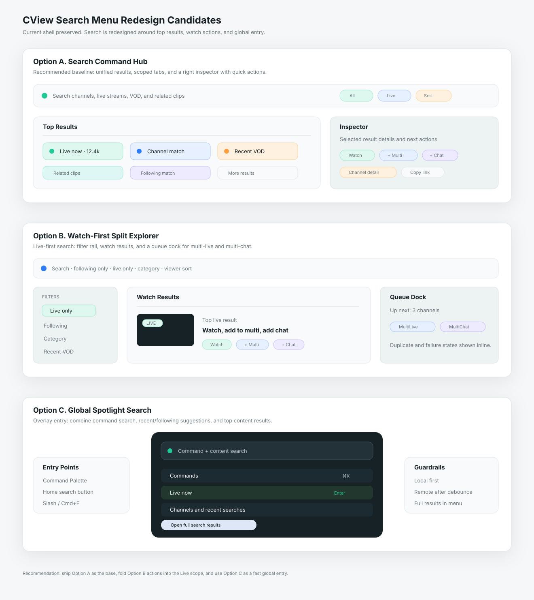

# CView 검색 메뉴 리디자인 후보 3안 및 기능 개발 계획서

작성일: 2026-04-29  
범위: `MainContentView`의 검색 route, `SearchView`, `SearchViewModel`, 검색 결과 행, Command Palette, 홈/멀티라이브 검색 진입점  
목적: 검색 메뉴를 새롭게 다시 만들 때 선택할 수 있는 디자인 3개를 선별하고, 기능 구현 계획을 개발 단위로 정리한다.

---

## 0. 결론

추천 순위는 다음이다.

| 순위 | 후보 | 핵심 성격 | 판단 |
|---|---|---|---|
| 1 | **Search Command Hub** | 통합 검색, 결과 요약, 빠른 액션, 우측 inspector를 한 화면에 구성 | 기본 추천 |
| 2 | **Watch-First Split Explorer** | 검색 결과를 바로 시청/멀티라이브 추가로 이어주는 탐색형 split layout | 라이브 사용량이 많은 사용자에게 적합 |
| 3 | **Global Spotlight Search** | `⌘K`와 검색 메뉴를 결합한 전역 overlay 검색 | 보조 진입점/고속 키보드 플로우로 적합 |



기본 적용은 **1안 Search Command Hub**가 가장 안전하다. 현재 검색 화면은 이미 `채널/라이브/비디오/클립` 4개 검색, 최근 검색어, 팔로잉 자동완성, 채널 상세 패널을 갖고 있다. 따라서 전면 삭제보다 `통합 결과`, `빠른 액션`, `필터/정렬`, `라우팅 query`, `stale result 방지`를 추가해 화면 위계를 새로 잡는 편이 구현 리스크와 체감 개선의 균형이 가장 좋다.

---

## 1. 현재 구현 기준

현재 검색 메뉴는 사이드바의 `.search` route에서 `SearchView()`를 표시한다. `SearchView`는 `AppState.apiClient`로 `SearchViewModel`을 만들고, 홈의 팔로잉 채널명을 자동완성 데이터로 주입한다.

관련 구현 지점:

| 역할 | 현재 코드 |
|---|---|
| 검색 route | `Sources/CViewApp/Views/MainContentView.swift` |
| 검색 화면 | `Sources/CViewApp/Views/SearchViews.swift` |
| 검색 상태/로딩/최근 검색어 | `Sources/CViewApp/ViewModels/SearchViewModel.swift` |
| 결과 행 | `Sources/CViewApp/Views/SearchResultRows.swift` |
| 검색 모델 | `Sources/CViewCore/Models/SearchModels.swift` |
| API client | `Sources/CViewNetworking/ChzzkAPIClient+Content.swift` |
| 전역 명령 팔레트 | `Sources/CViewApp/Views/CommandPaletteView.swift` |
| 라우터 | `Sources/CViewApp/Navigation/AppRouter.swift` |

현재 동작:

- `SearchType`은 `channel`, `live`, `video`, `clip` 4종이다.
- `SearchViewModel.performSearch()`는 채널/라이브/비디오/클립 검색을 동시에 실행한다.
- 채널/라이브/비디오는 Chzzk 검색 API를 직접 사용한다.
- 클립은 전용 글로벌 검색 API가 없어서 채널 검색 결과 상위 채널의 클립 목록을 가져온 뒤 제목으로 로컬 필터링한다.
- 채널 결과를 클릭하면 오른쪽에 `ChannelInfoView` 패널이 열린다.
- 라이브는 `LiveStreamView`, VOD는 `VODPlayerView`, 클립은 `ClipPlayerView` sheet로 이어진다.
- `CommandPaletteView`에는 검색 메뉴로 이동하는 명령이 있지만, 실제 콘텐츠 검색과는 분리되어 있다.

---

## 2. 현재 검색 메뉴의 주요 개선 지점

### 2.1 검색 route의 query가 화면에 전달되지 않는다

`AppRoute.search(query: String?)`는 타입으로 존재하지만, `AppRouter.navigate(to:)`에서 `.search`는 단순히 `selectSidebar(.search)`만 호출한다. 따라서 홈이나 다른 화면에서 특정 검색어를 들고 검색 메뉴로 이동하는 흐름을 만들기 어렵다.

### 2.2 “통합 검색 결과”가 없다

현재 UI는 4개 탭 중 하나를 선택해야 결과를 볼 수 있다. 검색어를 입력한 직후 사용자는 “라이브가 있나, 채널이 있나, 클립이 있나”를 한눈에 판단하고 싶다. 기본 탭은 `전체` 또는 `Top Results`가 되어야 한다.

### 2.3 검색 중 자동완성이 쉽게 사라진다

자동완성은 최근 검색어와 팔로잉 채널 기반으로 잘 만들어져 있지만, 결과가 남아 있으면 숨겨진다. 사용자가 기존 결과가 있는 상태에서 query를 수정할 때도 제안이 계속 보여야 한다.

### 2.4 오래된 검색 결과가 뒤늦게 반영될 수 있다

입력 debounce는 있지만 실제 API 호출 단위에는 `searchSessionId` 또는 query token 검증이 없다. 느린 네트워크에서 이전 검색이 나중에 끝나면 새 검색 결과를 덮어쓸 가능성이 있다.

### 2.5 오류 상태가 사용자에게 충분히 올라오지 않는다

각 fetch helper는 실패 시 로그만 남기고 `errorMessage`를 세팅하지 않는다. 특정 탭만 실패했는지, 전체가 실패했는지, 클립 검색만 제한적인지 구분하는 상태 모델이 필요하다.

### 2.6 빠른 액션이 부족하다

검색 결과에서 현재 가능한 행동은 대체로 “열기”다. 검색 메뉴가 시청 앱의 핵심 진입점이 되려면 아래 액션이 결과 행에 바로 있어야 한다.

- 라이브 열기
- 채널 상세 보기
- 멀티라이브에 추가
- 멀티채팅에 추가
- 최근/즐겨찾기 또는 memo 관련 액션
- VOD/클립 재생
- 링크 복사

---

## 3. 공통 리디자인 원칙

세 후보 모두 아래 원칙을 지킨다.

- `MainContentView`의 사이드바 구조는 유지한다.
- 검색 메뉴 내부만 재구성하고 홈/라이브 shell은 바꾸지 않는다.
- `DesignTokens`와 기존 row/card 톤을 유지한다.
- 검색 메뉴 기본 화면에는 무거운 자동 재생 preview를 넣지 않는다.
- 검색 결과는 “판단 → 액션” 순서로 읽히게 한다.
- 채널/라이브/VOD/클립 API 한계를 UI 문구와 상태로 명확히 표현한다.
- 클립 검색은 “전역 클립 검색”처럼 과장하지 않고, 1차에서는 “관련 채널 클립”으로 표시한다.
- 넓은 macOS 창에서는 inspector를 활용하고, 좁은 창에서는 단일 column으로 접는다.
- 검색은 키보드 중심으로도 완성되어야 한다. `Enter`, `Esc`, 방향키, `⌘1~⌘5`, `/`, `⌘F`를 기본 범위로 둔다.

---

## 4. 후보 A: Search Command Hub

### 컨셉

검색 메뉴를 “검색 결과 목록”이 아니라 “시청 시작 커맨드 허브”로 만든다. 상단에는 큰 검색 command bar를 두고, 결과는 `전체`, `라이브`, `채널`, `VOD`, `클립`으로 재구성한다. 기본 탭은 `전체`이며 각 결과 묶음은 상위 3~5개만 보여주고, 오른쪽 inspector에서 선택 항목의 상세와 액션을 제공한다.

### 레이아웃

```text
┌──────────────────────────────────────────────────────────────┐
│ Search Command Bar: query · scope · filter · sort · refresh   │
├────────────────────────────────┬─────────────────────────────┤
│ Top Results                    │ Inspector                   │
│ Live now                       │ selected channel/live       │
│ Channels                       │ quick actions               │
│ VOD                            │ recent context              │
│ Related clips                  │                             │
└────────────────────────────────┴─────────────────────────────┘
```

### 세부 디자인

- 검색 bar 아래에 `전체 / 라이브 / 채널 / VOD / 클립` segmented control을 둔다.
- `전체` 탭은 각 bucket의 top result를 섞지 않고 section별로 보여준다.
- 각 section header에는 count, 실패 상태, 더보기 버튼을 둔다.
- 오른쪽 inspector는 선택된 결과 유형에 따라 다르게 구성한다.
- 채널 inspector: 라이브 여부, 팔로워, 최근 VOD/클립, 전체 화면 보기, 라이브 열기.
- 라이브 inspector: thumbnail, 시청자 수, 카테고리, 바로 보기, 멀티라이브 추가, 채널 상세.
- VOD/클립 inspector: 재생, 채널 보기, 링크 복사.
- 최근 검색어는 빈 화면 중앙이 아니라 command bar 아래 `Recent / Following / Recommended` row로 둔다.

### 현재 코드 매핑

| 디자인 요소 | 현재 코드 활용 |
|---|---|
| 검색 입력 | `SearchViews.searchBar` |
| 4개 결과 bucket | `SearchViewModel.channelResults`, `liveResults`, `videoResults`, `clipResults` |
| 자동완성 | `SearchViewModel.autocompleteSuggestions` |
| 최근 검색어 | `SearchViewModel.recentSearches` |
| 채널 inspector | `ChannelInfoView(channelId:)` |
| 결과 row | `SearchResultRows.swift` |
| 라우팅 | `AppRouter.navigate(to:)` |

### 장점

- 현재 구현과 가장 잘 맞는다.
- 기존 `SearchViewModel`과 결과 row를 재사용할 수 있다.
- 검색 메뉴 첫 화면에서 “어떤 콘텐츠를 열지” 바로 판단할 수 있다.
- 홈/카테고리/라이브의 최근 경량 디자인 방향과 충돌하지 않는다.

### 단점

- `SearchType`에 `all` 또는 별도 overview 상태가 추가되어야 한다.
- inspector 액션을 결과 유형별로 분리해야 한다.
- query route, stale result guard, 탭별 오류 상태를 같이 정리해야 완성도가 나온다.

### 추천 적용

기본 검색 메뉴는 이 안으로 가는 것이 좋다. 현재 기능을 버리지 않고 사용 흐름만 더 선명하게 바꿀 수 있다.

---

## 5. 후보 B: Watch-First Split Explorer

### 컨셉

검색 결과를 “콘텐츠 찾기”보다 “바로 시청하기” 중심으로 재정렬한다. 왼쪽은 검색과 필터, 중앙은 라이브 우선 결과, 오른쪽은 시청/멀티라이브 queue다. 라이브 앱에서는 검색 결과에서 가장 중요한 액션이 `바로 보기`와 `멀티라이브 추가`이므로 이 둘을 화면 구조의 주인공으로 둔다.

### 레이아웃

```text
┌──────────────────────────────────────────────────────────────┐
│ Search · following only · live only · category · sort         │
├──────────────┬───────────────────────────────┬───────────────┤
│ Filter Rail  │ Watch Results                 │ Queue Dock     │
│ Scope        │ live cards                    │ Up Next        │
│ Recent       │ channel rows                  │ MultiLive      │
│ Following    │ VOD/clip compact rows          │ MultiChat      │
└──────────────┴───────────────────────────────┴───────────────┘
```

### 세부 디자인

- 기본 결과 정렬은 `라이브 중인 콘텐츠 > 팔로잉 채널 > VOD > 클립`이다.
- 필터 rail에는 `전체`, `라이브만`, `팔로잉`, `카테고리`, `최근 7일`, `성인 제외` 등을 둔다.
- 중앙 결과는 탭보다 mixed list를 우선한다.
- 라이브 card에는 `보기`, `+ 멀티`, `+ 채팅` 아이콘 액션을 둔다.
- 오른쪽 queue dock은 실제 멀티라이브/멀티채팅 상태를 보여준다.
- 좁은 창에서는 queue dock을 bottom sheet 또는 toolbar popover로 접는다.

### 현재 코드 매핑

| 디자인 요소 | 현재 코드 활용/추가 |
|---|---|
| 라이브 검색 | `apiClient.searchLives` |
| 팔로잉 기반 추천 | `HomeViewModel.followingChannels` |
| 멀티라이브 추가 | `MultiLiveManager` 연동 필요 |
| 멀티채팅 추가 | `FollowingViewState` 또는 멀티채팅 상태 연동 필요 |
| 필터 상태 | `SearchFilterState` 신규 |
| queue dock | 기존 팔로잉/멀티라이브 state 일부 재사용 |

### 장점

- CView의 핵심 사용 흐름인 “검색해서 바로 보기”에 가장 강하다.
- 멀티라이브 사용자가 많은 경우 체감 개선이 크다.
- 검색 메뉴가 홈/라이브 메뉴와 기능적으로 연결된다.

### 단점

- 현재 검색 화면보다 상태 연동이 많다.
- 멀티라이브/멀티채팅 액션의 실패/중복 처리 정책이 필요하다.
- 검색 메뉴가 너무 작업형으로 보일 수 있어 일반 사용자는 1안보다 부담스럽다.

### 추천 적용

2안은 기본 검색 화면보다 “라이브 탐색 모드”로 두는 것이 좋다. 1안의 `라이브` 탭 또는 `Watch` scope에서 2안 구조를 점진 도입한다.

---

## 6. 후보 C: Global Spotlight Search

### 컨셉

전역 `⌘K` Command Palette와 콘텐츠 검색을 결합한다. 사용자는 메뉴 이동 없이 어디서든 `⌘K` 또는 `/`로 검색을 열고, 명령/채널/라이브/VOD/클립을 같은 overlay에서 찾는다. 단, 전체 검색 메뉴를 대체하기보다 “고속 진입점”으로 둔다.

### 레이아웃

```text
┌──────────────────────────────────────────────┐
│ Command + Content Search                      │
├──────────────────────────────────────────────┤
│ Commands                                      │
│ Live now                                      │
│ Channels                                      │
│ Recent searches                               │
│ Open full search results                      │
└──────────────────────────────────────────────┘
```

### 세부 디자인

- overlay는 560~680pt 폭으로 유지해 현재 `CommandPaletteView`의 장점을 살린다.
- 입력이 짧을 때는 명령과 최근/팔로잉 로컬 결과만 보여준다.
- 입력이 2글자 이상이면 원격 검색을 debounce로 호출한다.
- overlay 결과는 top 3~5개만 보여주고, 깊은 결과는 검색 메뉴로 넘긴다.
- `Enter`는 선택 항목 실행, `⌘Enter`는 검색 메뉴에서 전체 결과 열기.
- 검색 메뉴로 넘길 때 `AppRoute.search(query:)` 또는 router pending query를 사용한다.

### 현재 코드 매핑

| 디자인 요소 | 현재 코드 활용/추가 |
|---|---|
| overlay shell | `CommandPaletteView` |
| fuzzy command search | `fuzzyMatch(query:target:)` |
| navigation commands | `CommandItem` |
| 콘텐츠 검색 VM | `SearchViewModel` 또는 경량 `GlobalSearchViewModel` |
| 전체 결과 이동 | `AppRoute.search(query:)` query 전달 개선 필요 |

### 장점

- macOS 앱에 잘 맞는 고속 키보드 경험이다.
- 홈/라이브/검색 메뉴 사이의 이동 비용이 줄어든다.
- 기존 command palette 자산을 재사용할 수 있다.

### 단점

- overlay에서 원격 검색을 과하게 하면 지연과 API 호출이 늘어난다.
- 명령 검색과 콘텐츠 검색의 우선순위를 세심하게 조정해야 한다.
- 전체 검색 메뉴의 대체재로 만들면 화면이 좁아진다.

### 추천 적용

3안은 별도 최종 화면이 아니라 1안의 보조 진입점으로 적용한다. 1차 구현에서는 `검색 메뉴로 query 전달`과 `최근/팔로잉 로컬 결과`까지만 넣고, 원격 콘텐츠 검색은 2차로 미룬다.

---

## 7. 최종 권장 구조

최종 검색 메뉴는 **1안 Search Command Hub를 기본 화면**으로 두고, **2안의 라이브/멀티라이브 액션**을 `라이브` scope에 흡수하며, **3안은 전역 빠른 진입점**으로 연결하는 구성이 가장 현실적이다.

권장 정보 구조:

| 영역 | 역할 | 기본 표시 |
|---|---|---|
| Search Command Bar | query, scope, filter, sort, route query 반영 | 항상 |
| Recent / Following Suggestions | 최근 검색어, 팔로잉 채널, 추천 진입 | query 비어 있음 또는 입력 중 |
| Top Results | 라이브/채널/VOD/클립 요약 | 기본 탭 |
| Type Results | 각 유형별 상세 목록과 pagination | 선택 탭 |
| Inspector | 선택 항목 상세와 빠른 액션 | 넓은 창 |
| Queue/Action Dock | 멀티라이브/멀티채팅 추가 상태 | 라이브 scope에서 선택적으로 |
| Global Overlay | 어디서든 검색 시작 | `⌘K`, `/`, 홈 command bar |

---

## 8. 기능 개발 계획서

### Phase 0. 설계 고정

목표: 구현 전에 상태 모델과 화면 contract를 고정한다.

작업:

1. 검색 메뉴 최종안은 `Search Command Hub`로 확정한다.
2. 검색 결과 유형을 `channel/live/video/clip`에서 `all + channel/live/video/clip` 화면 구조로 확장한다.
3. 클립 검색의 한계를 문구로 정한다. 예: `관련 채널 클립`.
4. 멀티라이브/멀티채팅 액션의 중복 정책을 정한다.
5. query 전달 방식은 router에 `pendingSearchQuery`를 두거나 `SearchView(initialQuery:)`로 명시한다.

산출물:

- `SearchWorkspace` 화면 설계
- `SearchResultBucket` 상태 설계
- action matrix

### Phase 1. SearchViewModel 안정화

목표: 새 UI를 얹기 전에 검색 상태를 안전하게 만든다.

작업:

1. `SearchSession` 또는 `activeSearchId`를 추가해 stale result 반영을 막는다.
2. 탭별 loading/error/hasMore를 배열형 또는 dictionary형 bucket으로 정리한다.
3. `SearchType.all` 또는 `SearchScope.overview`를 추가한다.
4. `SearchFilterState`를 추가한다.
5. 자동완성은 기존 결과 유무와 분리해 query 편집 중 계속 표시되도록 한다.
6. API 실패 시 전체 오류와 bucket 오류를 분리한다.
7. 최근 검색어 저장은 검색 실행 시점과 result success 시점을 구분한다.

주요 파일:

- `Sources/CViewApp/ViewModels/SearchViewModel.swift`
- `Sources/CViewCore/Models/SearchModels.swift`
- `Tests/CViewCoreTests/SearchModelsTests.swift`

테스트:

- debounce 후 한 번만 검색되는지
- 이전 query 결과가 최신 query를 덮어쓰지 않는지
- bucket별 실패가 다른 bucket 결과를 지우지 않는지
- 최근 검색어 중복/최대 개수 유지

### Phase 2. Search Command Hub UI 구현

목표: 현재 `SearchViews.swift`를 유지 가능한 검색 workspace로 재구성한다.

작업:

1. `SearchWorkspace` 컨테이너를 만든다.
2. `SearchCommandBar`를 분리한다.
3. `SearchScopePicker`를 `전체/라이브/채널/VOD/클립`으로 만든다.
4. `SearchTopResultsView`를 만든다.
5. 기존 row를 재사용하되 action slot을 추가한다.
6. `SearchInspectorPanel`을 만든다.
7. `ViewThatFits` 또는 width breakpoint로 inspector collapse를 구현한다.
8. focus binding을 실제 `@FocusState`로 연결한다.

주요 파일:

- `Sources/CViewApp/Views/SearchViews.swift`
- `Sources/CViewApp/Views/SearchResultRows.swift`
- 신규 후보: `Sources/CViewApp/Views/Search/SearchWorkspace.swift`
- 신규 후보: `Sources/CViewApp/Views/Search/SearchInspectorPanel.swift`

테스트/검증:

- 900px 이하에서 단일 column으로 접히는지
- 1200px 이상에서 inspector가 과도하게 넓어지지 않는지
- 검색어 입력, clear, tab 전환, 더보기, sheet 표시가 layout jump 없이 동작하는지

### Phase 3. 빠른 액션 레이어

목표: 검색 결과에서 바로 다음 행동으로 이어지게 한다.

작업:

1. `SearchResultAction` enum을 만든다.
2. 라이브 결과에 `보기`, `+ 멀티`, `+ 채팅`, `채널` 액션을 둔다.
3. 채널 결과에 `상세`, `라이브 열기`, `즐겨찾기/메모` 진입을 둔다.
4. VOD/클립 결과에 `재생`, `채널`, `링크 복사` 액션을 둔다.
5. 중복 멀티라이브 추가는 disabled + 상태 label로 표시한다.
6. 액션 실패는 row-local toast 또는 inspector message로 표시한다.

주요 파일:

- `Sources/CViewApp/Views/SearchResultRows.swift`
- `Sources/CViewApp/Views/FollowingView+MultiLive.swift`
- `Sources/CViewApp/Views/FollowingView+MultiChat.swift`
- `Sources/CViewApp/Navigation/AppRouter.swift`

검증:

- 라이브 열기 후 navigation path가 꼬이지 않는지
- 멀티라이브 추가 중복 처리
- 클립 sheet와 VOD navigation이 동시에 열리지 않는지

### Phase 4. Query 라우팅 및 전역 진입점

목표: 홈, Command Palette, 다른 메뉴에서 검색어를 들고 검색 메뉴로 진입하게 한다.

작업:

1. `AppRouter.navigate(to: .search(query: q))`가 query를 보존하도록 수정한다.
2. `SearchView`가 initial/pending query를 받아 `SearchViewModel.query`에 반영한다.
3. 홈 command bar는 `CommandPalette`만 여는 대신 검색 메뉴 직접 진입과 overlay 진입을 구분한다.
4. `CommandPaletteView`에는 `전체 검색 결과 보기` 액션을 추가한다.
5. `⌘F` 또는 `/` shortcut 정책을 정한다.

주요 파일:

- `Sources/CViewApp/Navigation/AppRouter.swift`
- `Sources/CViewApp/Views/MainContentView.swift`
- `Sources/CViewApp/Views/HomeV2/HomeV2Components.swift`
- `Sources/CViewApp/Views/CommandPaletteView.swift`
- `Sources/CViewApp/Views/SearchViews.swift`

검증:

- `router.navigate(to: .search(query: "abc"))` 후 검색창에 `abc`가 들어가는지
- 같은 query로 재진입 시 불필요한 API 호출이 중복되지 않는지
- 검색 메뉴에서 뒤로가기와 사이드바 선택이 기존처럼 동작하는지

### Phase 5. 성능 및 품질 마감

목표: 검색 메뉴가 빠르게 열리고 검색 중에도 프레임 드랍이 적게 한다.

작업:

1. 결과 row 높이를 안정화한다.
2. thumbnail은 화면에 보이는 row만 로드한다.
3. inspector의 `ChannelInfoView` 로딩은 선택 후 debounce 또는 explicit open으로 제어한다.
4. skeleton은 탭별로 최소 높이를 유지해 layout jump를 줄인다.
5. `MenuTransitionGate`와 충돌하는 explicit animation을 줄인다.
6. `SearchViewModel`에서 실행 중 task cancel을 명시한다.

검증:

- 검색 메뉴 첫 진입 60fps 근접 확인
- query 변경 10회 연속 입력 시 stale result 없음
- 느린 네트워크에서 partial result 표시
- 클립 검색 실패 시 라이브/채널 결과 유지
- Light/Dark/System theme 확인

---

## 9. 구현 우선순위

| 우선순위 | 항목 | 이유 |
|---|---|---|
| P0 | query routing, stale result guard, bucket error state | 새 디자인 전에 검색 안정성을 먼저 확보해야 함 |
| P0 | `전체` 결과 화면 | 검색 메뉴 첫 인상과 판단 속도를 가장 크게 개선 |
| P1 | inspector + 빠른 액션 | 검색 결과를 시청/멀티라이브로 이어주는 핵심 |
| P1 | 필터/정렬 state | 라이브/채널/VOD/클립이 늘어날수록 필요 |
| P2 | Command Palette 콘텐츠 검색 | 전역 검색 경험 강화 |
| P2 | queue dock | 멀티라이브 중심 사용자에게 유용하지만 상태 연동이 큼 |

---

## 10. 권장 파일 구조

```text
Sources/CViewApp/Views/Search/
├── SearchWorkspace.swift
├── SearchCommandBar.swift
├── SearchTopResultsView.swift
├── SearchResultListView.swift
├── SearchInspectorPanel.swift
├── SearchSuggestionStrip.swift
└── SearchActionMenu.swift

Sources/CViewApp/ViewModels/
└── SearchViewModel.swift

Sources/CViewCore/Models/
└── SearchModels.swift
```

기존 `SearchViews.swift`는 한 번에 삭제하지 말고, 1차에서는 새 컴포넌트를 내부로 분리한 뒤 안정화되면 파일을 나누는 방식이 좋다.

---

## 11. 수용 기준

1. 검색 메뉴에 들어가면 기본 화면에서 `전체` 결과가 보인다.
2. query가 비어 있으면 최근 검색어와 팔로잉 추천이 보인다.
3. 홈/Command Palette에서 검색어를 넘기면 검색 메뉴에 즉시 반영된다.
4. 이전 검색 요청이 늦게 끝나도 최신 검색 결과를 덮어쓰지 않는다.
5. 라이브 결과에서 `보기`, `+ 멀티`, `+ 채팅`, `채널` 액션을 실행할 수 있다.
6. 클립 검색은 제한 사항을 UI에 명확히 표시한다.
7. 일부 bucket이 실패해도 성공한 bucket 결과는 유지된다.
8. 900px, 1200px, 1500px 이상 폭에서 layout이 깨지지 않는다.
9. 라이트/다크/시스템 테마에서 contrast가 유지된다.
10. 검색 메뉴 진입과 query 입력 중 프레임 드랍이 체감되지 않는다.

---

## 12. 최종 추천

이번 리디자인은 **Search Command Hub**를 기준으로 진행하는 것이 맞다. 현재 검색 메뉴는 기능 자산이 이미 충분하므로, 새로 만들 때의 핵심은 API를 더 많이 붙이는 것이 아니라 `통합 결과`, `query routing`, `stale result guard`, `빠른 액션`, `inspector`, `전역 진입`을 한 흐름으로 정리하는 것이다.

1차 릴리스는 `Search Command Hub + 전체 탭 + query routing + 안정화`까지만 잡고, 2차에서 `Watch-First 액션/queue dock`, 3차에서 `Global Spotlight 콘텐츠 검색`을 붙이는 순서가 가장 안전하다.
