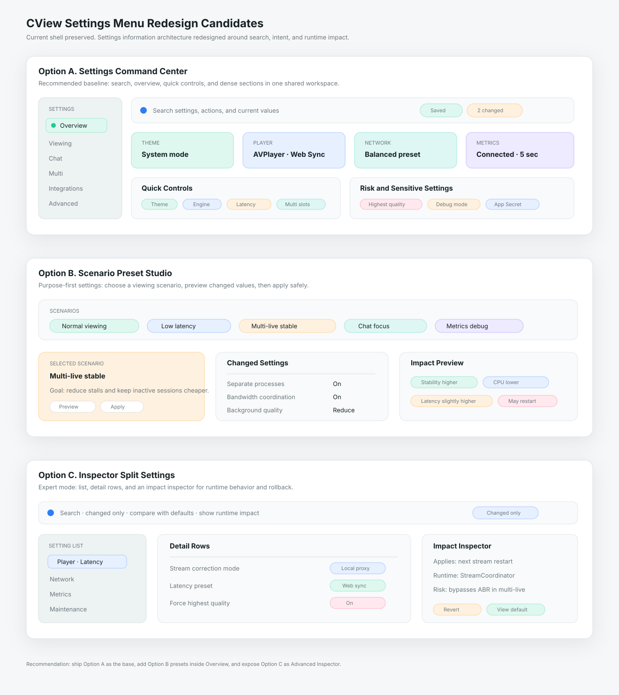

# CView 설정 메뉴 분석 및 전면 리디자인 후보 3안

작성일: 2026-04-28  
범위: `MainContentView`의 설정 route, `SettingsView`, `SettingsContentView`, 설정 탭 7종, `SettingsStore` 설정 도메인  
목적: 현재 설정 메뉴의 정보 구조와 사용 흐름을 분석하고, CView macOS 앱에 맞는 전면 리디자인 후보 3개를 제안한다.

---

## 0. 결론

추천 순위는 다음이다.

| 순위 | 후보 | 핵심 성격 | 판단 |
|---|---|---|---|
| 1 | **Settings Command Center** | 검색, 상태 요약, 빠른 설정, 세부 설정을 한 화면 체계로 재정렬 | 기본 추천 |
| 2 | **Scenario Preset Studio** | 시청 상황별 프리셋을 중심으로 설정을 묶는 작업형 UI | 멀티라이브/저지연 사용자가 많을 때 적합 |
| 3 | **Inspector Split Settings** | 좌측 설정 목록, 중앙 상세, 우측 변경 영향/위험도를 보여주는 전문가형 UI | 고급 설정과 진단 기능 강화용 |



기본 적용은 **1안 Settings Command Center**가 가장 안전하다. 현재 설정 메뉴는 이미 탭과 설정 저장 구조가 잘 분리되어 있지만, 사용자는 원하는 설정을 찾기 위해 7개 탭을 훑고 긴 스크롤을 내려야 한다. 기본 화면에는 검색, 자주 쓰는 설정, 현재 상태, 최근 변경, 위험 설정 경고를 노출하고, 세부 설정은 기존 탭 구조를 재배치하는 편이 구현 리스크와 사용성 개선 효과의 균형이 가장 좋다.

---

## 1. 현재 구현 기준

현재 설정 메뉴는 두 가지 진입 경로를 가진다.

| 진입 경로 | 현재 구현 | 특징 |
|---|---|---|
| 메인 앱 사이드바 | `MainContentView`의 `.settings` route가 `SettingsContentView()` 표시 | 기존 사이드바가 설정 탭 목록으로 슬라이드 전환됨 |
| 독립 설정 창 | `SettingsView()` | Cmd+, 또는 route destination에서 독립 사이드바와 콘텐츠 영역 표시 |

설정 탭은 `AppRouter.SettingsTab`에 정의된 7개다.

| 탭 | 주요 파일 | 현재 역할 |
|---|---|---|
| 일반 | `GeneralSettingsTab.swift` | 앱 동작, 테마, 알림, 키보드 단축키 |
| 플레이어 | `PlayerSettingsTab.swift`, `LatencySettingsContent.swift` | 화질, 엔진, 보정 모드, 버퍼, 레이턴시, 볼륨, 스크린샷 |
| 채팅 | `ChatSettingsTab.swift` | 패널 크기, 표시, 오버레이, 콘텐츠, TTS, 필터, 사용자 관리 |
| 네트워크 | `NetworkSettingsTab.swift` | 프리셋, 타임아웃, API, WebSocket, 프록시 |
| 성능 | `PerformanceSettingsTab.swift` | 디코딩, 메모리, 외관 밀도, 디버그, 캐시, 초기화 |
| 메트릭 | `MetricsSettingsTab.swift` | 서버 URL, 전송 활성화, App Secret, 연결 테스트, 전송 주기 |
| 멀티라이브 | `MultiLiveSettingsTab.swift` | 세션, 오디오, 프로세스 모드, 안정성, 대역폭, 채팅 오버레이 |

데이터 저장 구조는 `SettingsStore`가 담당한다. 현재 저장 도메인은 `player`, `chat`, `general`, `appearance`, `network`, `metrics`, `keyboard`, `channelNotifications`, `multiLive`, `multiChat`이다. 이 구조는 리디자인에서도 유지하는 편이 좋다. UI 정보 구조만 바꾸고 저장 모델은 그대로 두면 마이그레이션 리스크가 작다.

---

## 2. 현재 디자인 문제

### 2.1 탭 이름은 단순하지만 실제 설정 도메인은 더 많다

현재 탭은 7개지만 `SettingsStore`는 10개 도메인을 가진다. 예를 들어 `키보드`는 일반 탭 안에 있고, `appearance`는 일반과 성능 탭에 나뉘어 있으며, `multiChat` 일부는 채팅 탭에 섞인다. 개발 구조는 분리되어 있지만 사용자가 보는 정보구조는 완전히 일치하지 않는다.

### 2.2 자주 쓰는 설정과 위험한 설정의 위계가 같다

`Toggle`, `Picker`, `Slider`, destructive action이 모두 `SettingsSection` 안의 행으로 나열된다. `forceHighestQuality`, `streamProxyMode`, `useSeparateProcesses`, `metrics app secret`, `resetAll()`처럼 영향이 큰 설정은 일반 토글보다 강한 설명과 영향 범위가 필요하다.

### 2.3 설정 검색과 빠른 이동이 없다

현재 구조에서는 사용자가 “최고 화질 고정”, “App Secret”, “오버레이”, “프록시” 같은 기능명을 기억해도 직접 검색할 수 없다. 설정 항목이 이미 많기 때문에 다음 단계에서는 검색과 즐겨찾기가 핵심 기능이다.

### 2.4 설정 변경의 결과가 즉시 보이지 않는다

일부 설정은 바로 런타임에 반영된다. 예를 들어 채팅 설정은 `ChatViewModel.applySettings(_:)`로 반영되고, 메트릭 설정은 `applyMetricsSettings()`를 호출하며, 스트림 보정 모드는 notification을 보낸다. 하지만 UI는 “이 변경이 지금 적용되는지, 재시작이 필요한지, 멀티라이브에 영향이 있는지”를 알려주지 않는다.

### 2.5 메인 사이드바 설정 모드와 독립 설정 창의 구조가 중복된다

`SettingsContentView`와 `SettingsView`는 같은 탭 콘텐츠를 각각 렌더링하지만 선택 상태와 사이드바 구조가 분리되어 있다. 전면 리디자인에서는 `SettingsWorkspace` 같은 공통 컨테이너를 두고, 메인 route와 독립 창이 같은 설정 경험을 공유하는 편이 좋다.

### 2.6 카드가 많아질수록 macOS 설정 화면보다 대시보드처럼 보인다

현재 `SettingsSection`은 glass card, 그림자, tinted icon을 사용한다. 섹션이 짧을 때는 좋지만, 플레이어/채팅/멀티라이브처럼 긴 탭에서는 카드가 계속 쌓이며 핵심 조작보다 장식 밀도가 커진다. 설정 화면은 정보가 많아도 조용하고 스캔 가능해야 한다.

---

## 3. 공통 리디자인 원칙

세 후보 모두 아래 원칙을 공유한다.

- `MainContentView`의 `.settings` route와 `AppRouter.SettingsTab` 기반 라우팅은 유지한다.
- 저장 모델인 `SettingsStore`는 재설계하지 않고, UI layer에서 grouping과 navigation만 재구성한다.
- 메인 route와 독립 Settings window가 같은 설정 컨테이너를 공유하게 한다.
- 설정 검색, 최근 변경, 즐겨찾기, 위험 설정 표시를 기본 기능으로 둔다.
- `일반/플레이어/채팅/네트워크/성능/메트릭/멀티라이브` 탭을 그대로 노출하기보다 작업 목적 기준으로 재묶는다.
- 설정 행은 dense row를 기본으로 하고, 중요한 프리셋/상태만 panel로 승격한다.
- destructive action은 일반 설정 흐름 끝에 두지 말고 별도 `Maintenance` 영역에 격리한다.
- 라이트/다크/시스템 테마는 별도 작은 미리보기보다 앱 전체 모드 전환 정책으로 최상단에 둔다.
- 긴 설명문은 항상 보이는 본문 대신 info popover 또는 inspector로 보낸다.

---

## 4. 후보 A: Settings Command Center

### 컨셉

설정 메뉴 첫 화면을 “설정 대시보드”가 아니라 “설정 커맨드 센터”로 만든다. 상단에는 검색과 현재 상태를 두고, 중앙에는 자주 쓰는 설정과 핵심 프리셋을 배치한다. 좌측 rail은 기존 7개 탭을 조금 더 작업 중심으로 정리한다.

### 레이아웃

```text
┌──────────────────────────────────────────────────────────────┐
│ Search: 설정 검색 · 빠른 이동 · 최근 변경                       │
├───────────────┬──────────────────────────────────────────────┤
│ Settings Rail │ Status Strip: 테마 · 엔진 · 네트워크 · 메트릭     │
│ 개요           │ Quick Controls: 테마, 엔진, 채팅 위치, 멀티 수     │
│ 시청           │ Recommended Presets: 일반 시청 / 저지연 / 멀티     │
│ 채팅           │ Current Section: dense rows                       │
│ 멀티           │ Maintenance: 캐시, 초기화, secret 관리             │
│ 연동           │                                                  │
│ 고급           │                                                  │
└───────────────┴──────────────────────────────────────────────┘
```

### 정보 구조

| 새 그룹 | 기존 설정 출처 | 설명 |
|---|---|---|
| 개요 | general, appearance, metrics status | 테마, 자동 실행, 메뉴바, 현재 앱 상태 |
| 시청 | player, latency, screenshot | 재생 엔진, 화질, 보정 모드, 레이턴시, 볼륨 |
| 채팅 | chat, multiChat | 채팅 표시, 오버레이, TTS, 필터, 패널 크기 |
| 멀티 | multiLive | 세션 수, 프로세스 모드, 대역폭, 보조 오디오 |
| 연동 | network, metrics | API, WebSocket, 프록시, 서버 URL, App Secret |
| 고급 | performance, cache, reset | 하드웨어, 메모리, 디버그, 캐시, 초기화 |

### 세부 디자인

- 좌측 rail은 6개 그룹으로 축약한다. 아이콘과 라벨만 두고, 선택된 그룹 아래에 2차 항목을 펼친다.
- 상단 검색은 `SettingsSearchIndex`를 만들어 각 row의 label, description, current value, tag를 색인한다.
- 첫 화면에는 “자주 변경하는 8개 설정”만 quick controls로 둔다.
- `forceHighestQuality`, `debugMode`, `resetAll`, `App Secret reveal`은 위험/민감 badge를 붙인다.
- 설정 변경 후 `최근 변경` pill을 보여주고, 저장 지연 중이면 작은 saving indicator를 표시한다.
- 메인 사이드바 route와 독립 설정 창은 같은 `SettingsWorkspace(selectedGroup:)`를 사용한다.

### 현재 코드 매핑

| 디자인 요소 | 현재 코드 활용 |
|---|---|
| 좌측 그룹 rail | `AppRouter.SettingsTab`을 대체하거나 alias로 유지 |
| 설정 콘텐츠 | 기존 `GeneralSettingsTab`, `PlayerSettingsTab` 등 섹션 단위 재사용 |
| 저장 상태 | `SettingsStore.scheduleDebouncedSave()` |
| 실시간 반영 | `onChange` hooks, `applyMetricsSettings()`, `cviewStreamProxyModeChanged` |
| 테마 | `AppearanceSettings.theme`, `AppTheme+ColorScheme.swift` |
| 위험 설정 | `PlayerSettings.forceHighestQuality`, `AppearanceSettings.debugMode`, `resetAll()` |

### 장점

- 현재 코드와 가장 잘 맞는다.
- 기존 7개 탭을 완전히 버리지 않고 더 좋은 정보구조로 감싼다.
- 검색과 빠른 설정만 추가해도 체감 개선이 크다.
- 일반 사용자와 고급 사용자 모두에게 무난하다.

### 단점

- 설정의 성격별 재분류가 필요해 파일 재배치 또는 view composition 작업이 생긴다.
- 검색 index와 quick controls를 새로 설계해야 한다.

### 추천 적용

기본 설정 메뉴는 이 안으로 가는 것이 좋다. 1차 구현은 `SettingsWorkspace`, `SettingsRail`, `SettingsSearchIndex`, `SettingsOverviewPanel`부터 만들고, 기존 탭 콘텐츠를 섹션 단위로 점진 이식한다.

---

## 5. 후보 B: Scenario Preset Studio

### 컨셉

설정을 항목 중심이 아니라 “상황” 중심으로 재구성한다. CView는 단순 앱 설정보다 시청 품질, 멀티라이브 안정성, 채팅 표시, 메트릭 연동의 상호작용이 중요하다. 따라서 첫 화면에서 `일반 시청`, `저지연 동기화`, `멀티라이브 안정`, `디버깅/메트릭` 같은 시나리오를 고르게 하고, 각 시나리오에 필요한 설정만 묶어 보여준다.

### 레이아웃

```text
┌──────────────────────────────────────────────────────────────┐
│ Scenario Presets: 일반 시청 · 저지연 · 멀티 안정 · 디버깅         │
├──────────────────────────────────────────────────────────────┤
│ Selected Scenario                                             │
│ 목표 · 변경될 설정 · 예상 영향 · 되돌리기                       │
├──────────────────────┬───────────────────────────────────────┤
│ Required Controls     │ Impact Preview                         │
│ 엔진, 화질, 버퍼,       │ 지연 + 안정성 + CPU + 네트워크 영향       │
│ 채팅, 대역폭, 프로세스   │                                      │
└──────────────────────┴───────────────────────────────────────┘
```

### 시나리오 예시

| 시나리오 | 우선 노출 설정 | 목표 |
|---|---|---|
| 일반 시청 | 자동 재생, 기본 화질, 테마, 채팅 위치, 알림 | 기본 경험을 빠르게 정리 |
| 저지연 동기화 | latency preset, stream proxy mode, buffer, catchup | 웹 브라우저와 비슷한 위치 유지 |
| 멀티라이브 안정 | max sessions, separate processes, bandwidth coordination, background quality | 여러 채널을 안정적으로 유지 |
| 채팅 집중 | chat display mode, font, opacity, TTS, filter | 채팅 시청/읽기 경험 최적화 |
| 메트릭/디버깅 | metrics enabled, server URL, App Secret, debug mode, cache | 수집/분석/문제 확인 |

### 세부 디자인

- 시나리오 카드는 4~5개만 둔다. 너무 많으면 다시 탭 메뉴가 된다.
- 각 시나리오는 `적용 전 diff`, `예상 영향`, `되돌리기`를 반드시 제공한다.
- 프리셋 적용은 즉시 저장하지 않고 preview 단계에서 확인하게 한다.
- 프리셋은 사용자의 수동 변경을 덮어쓰지 않도록 “이번에 바뀌는 항목”만 명확히 보여준다.
- 세부 설정은 각 시나리오 하단의 advanced disclosure에서 열 수 있게 한다.

### 현재 코드 매핑

| 디자인 요소 | 현재 코드 활용 |
|---|---|
| 저지연 프리셋 | `PlayerSettings.LatencyPreset` |
| 네트워크 프리셋 | `NetworkPreset` |
| 멀티라이브 안정 | `MultiLiveSettings` |
| 채팅 집중 | `ChatSettings`, `MultiChatSettings` |
| 적용 diff | `SettingsStore`의 현재 값과 preset snapshot 비교 |
| 되돌리기 | 적용 전 snapshot 임시 저장 |

### 장점

- 사용자가 설정명을 몰라도 목적만 고르면 된다.
- CView의 실제 사용 흐름인 라이브, 멀티라이브, 채팅, 메트릭과 잘 맞는다.
- `forceHighestQuality`, `bandwidthCoordination`, `latencyPreset`처럼 서로 영향을 주는 항목을 함께 설명할 수 있다.

### 단점

- 프리셋 설계가 제품 정책이 된다. 잘못 잡으면 사용자 신뢰가 떨어진다.
- 개별 항목을 자주 바꾸는 사용자는 1안보다 느리게 느낄 수 있다.
- preset diff, preview, rollback 상태 관리가 필요하다.

### 추천 적용

기본 설정 화면 전체를 이 구조로 바꾸기보다는 1안의 `개요` 탭 안에 `시청 프리셋` 영역으로 넣는 방식이 현실적이다. 사용자가 멀티라이브/저지연 문제를 자주 겪는다면 독립 모드로 승격할 수 있다.

---

## 6. 후보 C: Inspector Split Settings

### 컨셉

설정 메뉴를 전문가형 split view로 만든다. 좌측에는 모든 설정 항목을 dense list로 두고, 중앙에는 선택 그룹의 상세 컨트롤을 보여주며, 우측 inspector에는 변경 영향, 현재 적용 상태, 관련 런타임 컴포넌트, 위험도, 복구 액션을 보여준다.

### 레이아웃

```text
┌──────────────────────────────────────────────────────────────┐
│ Toolbar: 검색 · 필터 · 변경됨만 보기 · 기본값과 비교              │
├───────────────┬───────────────────────────┬──────────────────┤
│ Setting List   │ Detail Rows                │ Inspector         │
│ Player         │ 화질, 엔진, 보정 모드        │ 영향 범위          │
│ Latency        │ 버퍼, PID, 프리셋            │ 저장/적용 상태      │
│ Network        │ timeout, retry, proxy       │ 관련 코드/서비스     │
│ Metrics        │ URL, secret, interval       │ 되돌리기/초기화      │
└───────────────┴───────────────────────────┴──────────────────┘
```

### 세부 디자인

- 좌측 list는 220~260pt, 중앙은 520pt 이상, 우측 inspector는 260~320pt로 둔다.
- 항목별로 `즉시 적용`, `다음 재생부터`, `앱 재시작 필요`, `민감 정보` badge를 제공한다.
- 검색 결과는 좌측 list에서 그룹별로 표시하고, 중앙은 해당 row로 scroll anchor 이동한다.
- `변경됨만 보기` 필터로 기본값과 다른 설정을 빠르게 찾게 한다.
- `관련 런타임`에는 예를 들어 `MetricsForwarder`, `StreamCoordinator`, `ChatViewModel`처럼 영향을 받는 컴포넌트를 표시한다.
- 좁은 창에서는 inspector를 우측 drawer로 접는다.

### 현재 코드 매핑

| 디자인 요소 | 현재 코드 활용 |
|---|---|
| 전체 항목 list | `SettingsStore` 도메인별 metadata 추가 |
| 기본값 비교 | 각 settings struct의 `.default` |
| 적용 상태 | 기존 `onChange`와 notification 경로 |
| 관련 컴포넌트 | 정적 metadata 또는 row별 help 정의 |
| rollback | 변경 전 snapshot |

### 장점

- 고급 설정이 많은 CView에 가장 강력한 구조다.
- 설정 변경의 영향과 위험을 설명하기 좋다.
- 디버깅, 메트릭, 라이브 안정성 문제를 다루는 파워유저에게 유용하다.

### 단점

- 일반 사용자에게는 복잡해 보일 수 있다.
- metadata, 기본값 비교, inspector 상태 관리가 필요해 구현 범위가 크다.
- 디자인 톤을 잘못 잡으면 개발자 도구처럼 느껴질 수 있다.

### 추천 적용

기본 설정 메뉴가 아니라 `고급` 그룹이나 `문제 해결` 모드로 두는 편이 좋다. 1안의 command center를 기본으로 깔고, “변경됨만 보기 / 영향 보기”를 켰을 때 3안의 inspector를 여는 구성이 가장 균형이 좋다.

---

## 7. 최종 추천 구조

가장 현실적인 최종 구조는 **1안 기반 + 2안 일부 + 3안 고급 모드**다.

| 단계 | 적용 내용 | 이유 |
|---|---|---|
| 1차 | Settings Command Center | 현재 코드 재사용성이 높고 사용성 개선이 즉시 크다 |
| 2차 | Scenario Presets를 개요 탭에 포함 | 저지연/멀티라이브 설정 충돌을 사용자가 이해하기 쉬워진다 |
| 3차 | Inspector를 고급 모드로 추가 | 위험 설정, 기본값 비교, 문제 해결 흐름을 강화한다 |

권장 정보구조는 다음이다.

```text
설정
├── 개요
│   ├── 검색
│   ├── 자주 쓰는 설정
│   ├── 시청 프리셋
│   └── 최근 변경
├── 시청
│   ├── 재생
│   ├── 레이턴시
│   ├── 오디오/볼륨
│   └── 스크린샷
├── 채팅
│   ├── 패널
│   ├── 표시
│   ├── TTS
│   └── 필터/사용자
├── 멀티
│   ├── 세션
│   ├── 프로세스
│   ├── 대역폭
│   └── 오버레이
├── 연동
│   ├── 네트워크
│   ├── WebSocket
│   ├── 메트릭
│   └── App Secret
└── 고급
    ├── 성능
    ├── 디버그
    ├── 캐시
    └── 초기화
```

---

## 8. 구현 우선순위

| 우선순위 | 작업 | 대상 |
|---|---|---|
| P0 | `SettingsWorkspace` 공통 컨테이너 도입 | `SettingsView`, `SettingsContentView` 중복 축소 |
| P0 | 설정 그룹 rail 재정의 | `AppRouter.SettingsTab` alias 유지 또는 새 enum 추가 |
| P1 | 설정 검색 index 추가 | label, description, tag, current value metadata |
| P1 | 개요 화면 추가 | quick controls, status strip, recent changes |
| P1 | 위험 설정 badge 추가 | force highest, debug, secret, reset |
| P2 | 시나리오 preset preview/diff | latency/network/multilive/chat preset |
| P2 | 변경됨만 보기와 기본값 비교 | `.default` 기반 diff |
| P3 | 우측 inspector/drawer | 고급 모드 |

---

## 9. 코드 적용 시 주의점

- `SettingsStore.save()`는 현재 여러 도메인을 순차 저장한다. 빠른 설정 화면에서 여러 값을 동시에 바꾸면 snapshot 기반 batch apply가 더 명확하다.
- `scheduleDebouncedSave()`는 `channelNotifications`와 일부 탭에서만 쓰인다. 리디자인 후 row별 저장 정책을 통일해야 한다.
- `AppRouter.SettingsTab`을 바로 삭제하지 말고 기존 딥링크와 `router.selectSettingsTab(.metrics)` 호출을 유지할 compatibility layer가 필요하다.
- `SettingsSection`은 새 디자인에서도 재사용할 수 있지만, 카드형 섹션을 모든 곳에 쓰기보다 dense section과 hero control을 분리하는 것이 좋다.
- 민감 정보인 `App Secret`은 설정 목록 검색 결과에서 값이 노출되지 않도록 metadata에 `isSensitive`를 둔다.
- destructive action은 `PerformanceSettingsTab`에서 분리해 confirmation과 recovery 안내를 강화한다.
