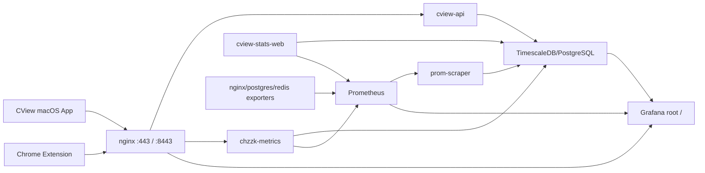

# cv.dododo.app Superset 대체 개발 계획서

작성일: 2026-04-29  
작성 방식: `cv.dododo.app` SSH 접속 후 운영 서버의 compose, nginx, Prometheus, Grafana, Superset, PostgreSQL 상태를 직접 확인  
대상 서버 경로: `/home/dodolab/docker`

> 이 문서는 `docs/superset-replacement-recommendation-development-plan-2026-04-29.md`의 서버 실측 보강본이다. 이전 문서는 로컬 checkout과 공식 자료 기준의 1차 추천서이고, 이 문서가 실제 운영 서버 기준 개발 계획의 기준이다.

## 0. 진행 상태 요약 (2026-04-29 작업 완료 기록)

| Sprint | 항목 | 상태 |
|---|---|---|
| 0 (P0) | `chzzk-ingest` 좀비 컨테이너 제거 (chzzk-metrics DNS alias 충돌) | ✅ |
| 1 | Grafana datasource: InfluxDB 제거, PostgreSQL+TimescaleDB 추가 | ✅ |
| 1 | PostgreSQL `grafana_reader` 계정 생성 (read-only, `.env`에 `GRAFANA_DB_PASSWORD`) | ✅ |
| 1 | Prometheus exporter 3종 기동 (nginx/postgres/redis) → targets 6/6 up | ✅ |
| 1 | Superset worker healthcheck override (`celery inspect ping`) | ✅ |
| 1 | Grafana 12.0 업그레이드 + ko-KR 한국어 기본값 + `Asia/Seoul` | ✅ |
| 2 | VLC view 3종 (`v_vlc_bitrate`, `v_vlc_frame_drop_rate`, `v_vlc_video_frames`) `vlc_metrics` 스키마 보정 | ✅ |
| 2 | Grafana dashboard 4종 (`cview-overview/system/app-player/vlc-quality`) | ✅ |
| 3 | nginx 443 root upstream `chzzk-superset:8088` → `grafana:3000` | ✅ |
| 3 | `GF_SERVER_ROOT_URL=https://cv.dododo.app/`, `/superset` → `/` 301 유지 | ✅ |
| 3 | `/api/*` 라우팅 회귀 테스트 (외부 클라이언트 path 모두 명시 등록 확인) | ✅ |
| 4 | macOS 앱: `supersetURL` → `analyticsDashboardURL`, `:9443` 제거 | ✅ |
| 4 | Chrome extension: `SUPERSET_URL` → `ANALYTICS_URL`, storage migration | ✅ |
| 4 | xcodebuild Debug BUILD SUCCEEDED 검증 | ✅ |
| 5 | `server.sh superset-sync` deprecated 경고 추가 | ✅ |
| 5 | Superset stack 제거 (1~2주 안정화 후) | ⏳ |

서버 변경분 backup: `*.bak.20260429` (`docker-compose.yml`, `nginx.conf`, `datasources.yml`).  
로컬 mirror 동기화: `server-dev/mirror/{docker-compose.yml,docker/nginx-ssl,grafana,prometheus}` 갱신 완료.  
VLC view 보정 SQL: [scripts/sql/views_vlc_metrics_2026_04_29.sql](../scripts/sql/views_vlc_metrics_2026_04_29.sql).

## 1. 최종 추천

Superset 대체 1순위는 여전히 **Grafana OSS**다. 다만 운영 서버를 직접 확인한 결과, 전환 방식은 “`:9443`에 Grafana를 새로 붙인다”가 아니라 **현재 Superset이 차지하고 있는 `https://cv.dododo.app/` 루트 자리를 Grafana로 교체**하는 방향이 더 정확하다.

이유:

- 현재 운영 서버는 Superset을 `443 /` 루트에서 직접 서빙한다.
- `/superset`과 `/superset/`은 `/`로 301 redirect된다.
- `9443`은 현재 nginx 외부 publish 목록에 없다.
- macOS 앱 코드에는 `:9443` 기반 Superset URL 계산이 남아 있으므로, 앱 코드 쪽 URL 계산을 실제 운영 구조에 맞게 고쳐야 한다.
- Grafana service와 provisioning 파일은 서버에 있으나 Grafana 컨테이너는 아직 생성/실행되지 않았다.
- Prometheus와 prom-scraper는 동작 중이지만 scrape target 일부가 down 상태다. Grafana 전환 전에 monitoring stack 정리가 필요하다.

## 2. 운영 서버 실측 요약

### 2.1 실행 중 컨테이너

확인 시점 기준 주요 상태:

| 컨테이너 | 상태 | 해석 |
|---|---|---|
| `chzzk-superset` | healthy | 현재 웹 루트 대시보드 |
| `chzzk-superset-worker` | unhealthy | worker 자체는 Celery ready이나 inherited healthcheck가 `localhost:8088`을 curl해서 실패 |
| `chzzk-prometheus` | up | Prometheus 서버 자체는 healthy |
| `chzzk-prom-scraper` | up | Prometheus sample을 TimescaleDB로 계속 적재 |
| `chzzk-grafana` | 컨테이너 없음 | compose service는 있으나 아직 실행/생성되지 않음 |
| `cview-api` | healthy | 앱 API 정상 |
| `cview-stats-web` | healthy | Stats web 정상 |
| `chzzk-metrics` | healthy | ingest 서버 정상이나 Prometheus `/metrics` scrape는 404 |
| `nginx/postgres/redis exporter` | 컨테이너 없음 | Prometheus target에는 있으나 실제 exporter 컨테이너가 없어 down |

### 2.2 URL/라우팅

nginx 운영 설정 기준:

| URL | 동작 |
|---|---|
| `https://cv.dododo.app/` | Superset upstream으로 proxy, 확인 시 `302 /superset/welcome/` |
| `https://cv.dododo.app/superset` | `301 /` |
| `https://cv.dododo.app:8443/health` | Metrics server health 200 |
| `https://cv.dododo.app:9443/` | 현재 compose/nginx publish 대상 아님 |
| `http://127.0.0.1:3000/api/health` on server | 연결 실패, Grafana 미실행 |
| `http://127.0.0.1:8088/health` on server | Superset `OK` |
| `http://127.0.0.1:9090/-/healthy` on server | Prometheus healthy |

핵심 판단:

- 운영 canonical dashboard URL은 현재 `https://cv.dododo.app/`다.
- `/superset`은 compatibility path다.
- `:9443`은 이전 설계/앱 코드에 남아 있지만 운영 서버에서는 맞지 않는다.

### 2.3 nginx 구조

`docker/nginx-ssl/nginx.conf`의 443 server block은 다음 역할을 동시에 수행한다.

- `location /` -> Superset
- `location = /health`, `/ws`, `/api/metrics/web`, `/api/web-position`, `/api/auth/token`, `/api/app-channels` -> `chzzk-metrics`
- `/api/cview/`, `/api/sync/`, `/api/stats`, `/api/web-latency/`, `/api/app-latency`, `/api/pdt-sync`, `/api/metrics`, `/api/metrics/app`, `/api/auth/cookies` -> `cview-api`
- `/superset`, `/superset/` -> `/` redirect
- 8443 server block은 Metrics API 전용 fallback
- 8888 server block은 nginx exporter용 `stub_status`

Grafana를 루트에 붙일 때는 `location /`만 Grafana upstream으로 바꾸고, 기존 CView API location들은 유지해야 한다. Grafana도 `/api/*`를 사용하므로 nginx location 우선순위 검토가 필수다. 현재처럼 CView API 경로를 명시적으로 좁혀두면 충돌을 줄일 수 있다.

### 2.4 Prometheus 상태

Prometheus 자체는 healthy지만 target 상태는 혼재되어 있다.

| target | 상태 | 원인 |
|---|---|---|
| `prometheus` | up | 정상 |
| `cview-stats-web:5000/metrics` | up | 정상 |
| `chzzk-metrics:8080/metrics` | down | HTTP 404 |
| `nginx-exporter:9113` | down | exporter 컨테이너 미생성/미실행 |
| `postgres-exporter:9187` | down | exporter 컨테이너 미생성/미실행 |
| `redis-exporter:9121` | down | exporter 컨테이너 미생성/미실행 |

따라서 Grafana를 켜기 전에 Prometheus target을 먼저 정리해야 한다. 지금 상태로는 Grafana를 올려도 인프라 패널 상당수가 비어 있거나 red 상태가 된다.

### 2.5 Grafana 준비 상태

서버에는 다음 파일이 있다.

- `grafana/dashboards/cview-overview.json`
- `grafana/provisioning/dashboards/dashboards.yml`
- `grafana/provisioning/datasources/datasources.yml`

현재 datasource 설정:

- `Prometheus`: `http://prometheus:9090`
- `InfluxDB`: `http://chzzk-influxdb:8086`, Flux, bucket `metrics`

문제:

- 현재 compose는 TimescaleDB/PostgreSQL 중심이고 `chzzk-influxdb` service가 없다.
- Grafana는 실행 중이 아니다.
- dashboard `cview-overview.json`은 Prometheus datasource만 사용한다.
- PostgreSQL/TimescaleDB datasource가 아직 없다.

### 2.6 Superset 실제 자산

Superset 내부 DB 조회 결과 등록 dashboard는 4개다.

| slug | title |
|---|---|
| `cview-overview` | CView Overview |
| `cview-vlc-stats` | CView VLC Stats |
| `cview-app-player` | CView App Player |
| `cview-system` | CView System |

등록 dataset/view는 17개다.

| view | 현재 row 수 |
|---|---:|
| `v_cview_overview_kpi` | 5 |
| `v_cview_http_requests` | 83 |
| `v_cview_http_latency_buckets` | 121 |
| `v_cview_security_counters` | 2 |
| `v_cview_viewer_trend` | 22 |
| `v_app_viewer_count` | 39 |
| `v_app_health` | 141 |
| `v_app_player_perf` | 94 |
| `v_app_latency_all` | 86 |
| `v_app_bitrate` | 47 |
| `v_cview_system_trend` | 44 |
| `v_vlc_frame_drop_rate` | 0 |
| `v_vlc_audio_drop_rate` | 0 |
| `v_vlc_demux_errors` | 0 |
| `v_vlc_bitrate` | 0 |
| `v_vlc_network_throughput` | 0 |
| `v_vlc_video_frames` | 0 |

VLC view가 모두 0행인 이유:

- view 정의는 `measurement = 'vlc_media_stats'`를 조회한다.
- 최근 24시간 실제 적재는 `measurement = 'vlc_metrics'`다.
- 실제 field는 `vlc_decoded_video`, `vlc_demux_bitrate`, `vlc_displayed`, `vlc_input_bitrate`, `vlc_late`, `vlc_lost`다.

따라서 Superset을 Grafana로 바꾸기 전에도 `cview-vlc-stats`는 이미 데이터 모델 보정이 필요한 상태다.

### 2.7 주요 DB 상태

운영 DB 주요 테이블 규모:

| table | count | latest |
|---|---:|---|
| `metric_influx_samples` | 12,860 | 2026-04-28 18:24:48 UTC |
| `metric_prometheus_samples` | 92,647 | 2026-04-28 18:24:40 UTC |
| `vlc_metrics` | 0 | null |

최근 24시간 `metric_influx_samples` measurement:

| measurement | rows |
|---|---:|
| `app_metrics` | 4,912 |
| `vlc_metrics` | 3,216 |
| `app_latency` | 2,296 |
| `hybrid_sync` | 1,545 |
| `cview_session` | 536 |
| `app_meta` | 156 |

최근 24시간 주요 Prometheus sample:

| name | rows |
|---|---:|
| `cview_stats_http_request_duration_seconds_bucket` | 60,335 |
| `cview_http_request_duration_seconds_bucket` | 11,176 |
| `cview_stats_http_requests_total` | 5,982 |
| `cview_stats_http_request_duration_seconds_count` | 5,485 |
| `cview_stats_http_request_duration_seconds_sum` | 5,485 |
| `cview_http_requests_total` | 1,088 |

## 3. 정교화된 목표 아키텍처



목표:

- Superset이 차지하던 `https://cv.dododo.app/`를 Grafana가 대체한다.
- CView API path routing은 유지한다.
- `/superset`은 최소 1 릴리스 동안 `/` redirect로 유지한다.
- 앱/확장은 Superset이 아니라 `Analytics Dashboard`를 열도록 바꾼다.
- PostgreSQL view 기반의 Superset 자산은 Grafana SQL panel 또는 Grafana PostgreSQL datasource로 이전한다.

## 4. 개발 우선순위

### P0. 운영 monitoring stack 정상화

Grafana 전환 전 선행 작업이다.

1. Grafana 컨테이너 실행 전 provisioning 검증
   - `grafana/provisioning/datasources/datasources.yml`에서 InfluxDB datasource 제거
   - PostgreSQL datasource 추가
   - Prometheus datasource URL은 `http://prometheus:9090` 유지 가능
2. PostgreSQL read-only 계정 생성
   - Grafana datasource에 운영 write 계정 사용 금지
   - `metric_influx_samples`, `metric_prometheus_samples`, Superset용 `v_*` view에 `SELECT`만 부여
3. Prometheus target 정리
   - `chzzk-metrics`의 `/metrics` 404 원인 확인
   - 실제 metrics endpoint가 없다면 Prometheus target 제거 또는 서버에 `/metrics` 추가
   - `nginx-exporter`, `postgres-exporter`, `redis-exporter`를 실제로 `docker compose up -d` 하거나 scrape config에서 제거
4. Superset worker unhealthy 정리
   - worker는 웹 서버가 아니므로 `localhost:8088` healthcheck는 부적절
   - 유지 기간 동안은 worker healthcheck override/disable
   - 제거 일정이 가까우면 문서상 known issue로 관리

### P1. Grafana를 내부에서 먼저 기동

목표: public route를 바꾸기 전에 서버 내부/localhost에서 Grafana dashboard를 검증한다.

작업:

1. `docker compose up -d grafana` 실행 전 datasource 수정
2. `http://127.0.0.1:3000/api/health` 확인
3. `grafana/dashboards/cview-overview.json` 로딩 확인
4. Prometheus datasource query 확인
5. PostgreSQL datasource query 확인
6. dashboard UID 고정

검증 명령:

```bash
cd /home/dodolab/docker
docker compose config
docker compose up -d grafana
curl -fsS http://127.0.0.1:3000/api/health
docker compose logs --tail=100 grafana
```

### P1. Grafana datasource 수정안

현재 InfluxDB datasource는 운영 compose와 맞지 않으므로 PostgreSQL datasource로 교체한다.

권장 `grafana/provisioning/datasources/datasources.yml` 방향:

```yaml
apiVersion: 1

datasources:
  - name: Prometheus
    uid: prometheus
    type: prometheus
    access: proxy
    url: http://prometheus:9090
    isDefault: true
    editable: false

  - name: CView TimescaleDB
    uid: cview-timescaledb
    type: postgres
    access: proxy
    url: chzzk-postgres:5432
    user: grafana_reader
    secureJsonData:
      password: ${GRAFANA_POSTGRES_PASSWORD}
    jsonData:
      database: chzzk_db
      sslmode: disable
      postgresVersion: 1700
      timescaledb: true
    editable: false
```

read-only 계정 예시:

```sql
CREATE USER grafana_reader WITH PASSWORD '<strong-password>';
GRANT CONNECT ON DATABASE chzzk_db TO grafana_reader;
GRANT USAGE ON SCHEMA public TO grafana_reader;
GRANT SELECT ON ALL TABLES IN SCHEMA public TO grafana_reader;
ALTER DEFAULT PRIVILEGES IN SCHEMA public GRANT SELECT ON TABLES TO grafana_reader;
```

주의: 비밀번호는 compose에 직접 쓰지 말고 `.env` 또는 Docker secret로 관리한다.

### P1. Grafana dashboard 이전 범위

Superset dashboard 4개를 다음 Grafana dashboard로 이전한다.

| Superset | Grafana 대체 | 데이터소스 | 우선순위 |
|---|---|---|---|
| `cview-overview` | `CView Overview` | Prometheus + PostgreSQL view | P1 |
| `cview-system` | `CView System` | `metric_prometheus_samples` + Prometheus | P1 |
| `cview-app-player` | `CView App Player` | `metric_influx_samples`, `v_app_*` | P1 |
| `cview-vlc-stats` | `CView VLC Quality` | `metric_influx_samples` corrected views | P2, 데이터 보정 필요 |

필수 Grafana UID:

- `cview-overview`
- `cview-system`
- `cview-app-player`
- `cview-vlc-quality`

### P1. nginx public route 전환

전환 전:

```nginx
set $superset_host "chzzk-superset";

location / {
    proxy_pass http://$superset_host:8088;
}
```

전환 후:

```nginx
set $grafana_host "grafana";

location = /superset  { return 301 /; }
location = /superset/ { return 301 /; }

location / {
    proxy_pass http://$grafana_host:3000;
    proxy_http_version 1.1;
    proxy_set_header Connection "";
    proxy_set_header Host $host;
    proxy_set_header X-Real-IP $remote_addr;
    proxy_set_header X-Forwarded-For $proxy_add_x_forwarded_for;
    proxy_set_header X-Forwarded-Proto $scheme;
    proxy_set_header X-Forwarded-Host $host;
    proxy_set_header X-Forwarded-Port 443;
}
```

Grafana env도 같이 바꾼다.

```yaml
environment:
  - GF_SERVER_ROOT_URL=https://cv.dododo.app/
  - GF_USERS_ALLOW_SIGN_UP=false
```

검증:

```bash
curl -k -sS -o /dev/null -w '%{http_code} %{redirect_url}\n' https://127.0.0.1/
curl -k -fsS https://127.0.0.1/api/health
curl -k -sS -o /dev/null -w '%{http_code} %{redirect_url}\n' https://127.0.0.1/superset
```

### P1. 앱 URL 일반화

현재 앱은 `https://<host>:9443/`를 만들 수 있다. 운영 서버 실측상 이 값은 맞지 않는다.

대상:

- `Sources/CViewApp/Views/HomeV2/HomeView_v2.swift`
- `Sources/CViewApp/Views/HomeV2/HomeV2Components.swift`
- `Sources/CViewApp/Views/Dashboard/MetricsDashboardView.swift`

변경:

1. `supersetURL` -> `analyticsDashboardURL`
2. 기본값: `https://cv.dododo.app/`
3. metrics server URL이 `https://cv.dododo.app:8443`이면 analytics URL은 `https://cv.dododo.app/`
4. local/dev 환경은 별도 설정값 허용
5. visible text:
   - `Superset Insight Dock` -> `Analytics Insight Dock`
   - `Superset 상세 열기` -> `분석 대시보드 열기`
6. health check:
   - Superset: `/health`
   - Grafana: `/api/health`
   - 전환기에는 둘 다 허용하거나 서버 응답으로 판별

호환성:

- `home.v2.show.supersetDock` key는 바로 제거하지 않는다.
- 새 key `home.v2.show.analyticsDock`를 만들 경우 기존 key migration을 둔다.

### P1. Chrome Extension URL 일반화

현재 extension 기본값은 `https://cv.dododo.app/superset`이다. 운영 서버에서는 redirect로 동작하지만, Grafana 전환 후에는 `https://cv.dododo.app/`를 직접 쓰는 편이 명확하다.

대상:

- `chrome-extension/src/shared/config.js`
- `chrome-extension/src/shared/storage.js`
- `chrome-extension/src/background/service-worker.js`
- `chrome-extension/src/popup/*`
- `chrome-extension/src/options/*`
- `chrome-extension/README.md`

변경:

1. `SUPERSET_URL` -> `ANALYTICS_URL`
2. `supersetUrl` storage key는 migration 후 `analyticsUrl`
3. 기본 URL: `https://cv.dododo.app/`
4. health path: `/api/health`
5. dashboard path: `/dashboards`
6. explore path: `/explore`
7. 기존 `popup-open-superset` message는 한 릴리스 동안 alias 처리

## 5. 데이터 보정 계획

### 5.1 VLC view 보정

현재 Superset VLC view 6개는 모두 0행이다. Grafana 이전과 별개로 view를 보정해야 한다.

현재 view가 기대하는 값:

- measurement: `vlc_media_stats`
- fields: `frame_drop_rate`, `played_audio_buffers`, `lost_audio_buffers`, `demux_corrupted`, `demux_discontinuity`, `input_bitrate`, `demux_bitrate`, `read_bytes`, `decoded_video`, `displayed_pictures`, `lost_pictures`

실제 최근 적재 값:

- measurement: `vlc_metrics`
- fields: `vlc_decoded_video`, `vlc_demux_bitrate`, `vlc_displayed`, `vlc_input_bitrate`, `vlc_late`, `vlc_lost`

개발 선택지:

| 선택지 | 설명 | 추천 |
|---|---|---|
| A. view를 현재 적재 스키마에 맞춤 | `v_vlc_*`를 `vlc_metrics` 기반으로 재작성 | 1순위 |
| B. collector 적재명을 기존 view에 맞춤 | 향후 데이터를 `vlc_media_stats`로 적재 | 위험, 기존 데이터와 혼재 |
| C. Grafana에서 직접 SQL 작성 | view 없이 `metric_influx_samples` 직접 query | 빠른 POC에 적합 |

권장:

- POC는 C로 빠르게 만든다.
- 이후 A로 view를 정리한다.

예시 SQL:

```sql
SELECT
  time_bucket('1 minute', time) AS time,
  channel_id,
  avg(value_num) FILTER (WHERE field = 'vlc_input_bitrate') AS input_bitrate,
  avg(value_num) FILTER (WHERE field = 'vlc_demux_bitrate') AS demux_bitrate,
  avg(value_num) FILTER (WHERE field = 'vlc_lost') AS lost_frames,
  avg(value_num) FILTER (WHERE field = 'vlc_late') AS late_frames
FROM metric_influx_samples
WHERE measurement = 'vlc_metrics'
  AND $__timeFilter(time)
GROUP BY 1, 2
ORDER BY 1;
```

### 5.2 Prometheus sample 경로 정리

`metric_prometheus_samples`에는 충분히 데이터가 쌓이고 있다. `prom-scraper`는 정상 작동 중이다. 다만 Prometheus live target 일부가 down이므로 두 계층을 분리해 본다.

- Dashboard의 long-range history: `metric_prometheus_samples` 사용
- Live health panel: Prometheus datasource 직접 사용
- Exporter 미실행 target: 대시보드 패널에서 제외하거나 exporter를 실제 기동

## 6. 구체 개발 일정

### Sprint 1. 서버 관측 스택 정리

산출물:

- Prometheus target all green 또는 의도적 제외
- Grafana datasource provisioning 수정
- Grafana localhost 기동 성공

작업:

1. `grafana/provisioning/datasources/datasources.yml` 수정
2. `chzzk-metrics` `/metrics` route 확인
3. exporters 컨테이너 기동 또는 scrape config 제거
4. Grafana 기동
5. `cview-overview.json` 패널 query 이름 검증

완료 기준:

- `curl http://127.0.0.1:3000/api/health` 성공
- Grafana에서 Prometheus datasource test 성공
- Grafana에서 PostgreSQL datasource test 성공
- Prometheus target down이 0개이거나 known ignored로 문서화

### Sprint 2. Superset dashboard 4개 이전

산출물:

- `grafana/dashboards/cview-overview.json`
- `grafana/dashboards/cview-system.json`
- `grafana/dashboards/cview-app-player.json`
- `grafana/dashboards/cview-vlc-quality.json`

작업:

1. Superset `cview-overview` 패널을 Grafana로 이전
2. Superset `cview-system` 패널을 Grafana로 이전
3. Superset `cview-app-player` 패널을 Grafana로 이전
4. `cview-vlc-stats`는 view 보정 후 이전
5. dashboard UID 고정

완료 기준:

- 4개 dashboard가 provisioning으로 자동 로드
- 17개 Superset view 중 non-empty view는 모두 Grafana panel에서 사용 또는 폐기 판단 완료
- VLC dashboard는 `vlc_metrics` 실제 schema 기준으로 값이 보임

### Sprint 3. Public route 전환

산출물:

- nginx root upstream Grafana 전환
- `/superset` redirect 유지
- Superset rollback path 문서화

작업:

1. nginx `location /` upstream을 Grafana로 변경
2. `GF_SERVER_ROOT_URL=https://cv.dododo.app/` 적용
3. `docker compose up -d grafana nginx-ssl`
4. 루트, `/api/health`, `/superset` 응답 확인
5. Superset은 internal fallback으로 유지

완료 기준:

- `https://cv.dododo.app/`가 Grafana 로그인/대시보드를 표시
- CView 앱 API 경로가 계속 정상
- Chrome extension 수집 API가 계속 정상
- `/superset` 접근 시 사용자 혼란 없이 루트로 이동

### Sprint 4. 앱/확장 전환

산출물:

- macOS 앱에서 Superset 명칭 제거
- Chrome extension에서 Superset 명칭 제거
- 기존 저장 key migration

작업:

1. 앱의 `supersetURL` 계산 제거
2. `analyticsDashboardURL` 도입
3. default analytics URL을 `https://cv.dododo.app/`로 설정
4. extension `SUPERSET_URL` -> `ANALYTICS_URL`
5. health path `/api/health`
6. dashboard/explore path를 Grafana 기준으로 교체
7. README 업데이트

완료 기준:

- 앱 홈/메트릭 메뉴 버튼이 Grafana를 연다.
- extension popup/options 버튼이 Grafana를 연다.
- 기존 `supersetUrl` 저장값이 있어도 migration 후 정상 동작한다.

### Sprint 5. Superset 축소/제거

산출물:

- Superset deprecation note
- rollback archive
- compose cleanup PR 또는 patch

작업:

1. Superset export 보관
2. `server-dev/server.sh superset-sync`에 deprecated 경고 추가
3. 1~2주 안정화 후 Superset worker 중지
4. 이후 Superset 본체/DB/Redis 제거
5. scripts archive

완료 기준:

- Grafana로 7일 이상 운영 확인
- Superset 접속 트래픽이 없거나 redirect로 충분
- rollback 필요성이 사라짐

## 7. 파일별 개발 체크리스트

### 서버

| 파일 | 변경 |
|---|---|
| `server-dev/mirror/docker-compose.yml` | Grafana env, depends_on, exporter 기동 범위, Superset 유지/제거 단계 반영 |
| `server-dev/mirror/docker/nginx-ssl/nginx.conf` | 443 root upstream Superset -> Grafana, `/superset` redirect 유지 |
| `server-dev/mirror/prometheus/prometheus.yml` | down target 정리, exporter target 실제 기동과 일치 |
| `server-dev/mirror/grafana/provisioning/datasources/datasources.yml` | InfluxDB 제거, PostgreSQL datasource 추가 |
| `server-dev/mirror/grafana/provisioning/dashboards/dashboards.yml` | provider 유지, folder/uid 정책 확인 |
| `server-dev/mirror/grafana/dashboards/*.json` | Superset 4개 dashboard 대응 JSON 작성 |
| `server-dev/server.sh` | `grafana-sync`/`analytics-sync` 추가 검토, `superset-sync` deprecated |
| `scripts/superset_views_poc.sql` | VLC view 보정 또는 Grafana용 SQL로 분리 |
| `scripts/sql/views_app_metrics.sql` | app/player view는 유지 가능 |

### 앱

| 파일 | 변경 |
|---|---|
| `Sources/CViewApp/Views/HomeV2/HomeView_v2.swift` | `supersetURL` -> `analyticsDashboardURL`, `:9443` 제거 |
| `Sources/CViewApp/Views/HomeV2/HomeV2Components.swift` | Superset UI 문구 일반화 |
| `Sources/CViewApp/Views/Dashboard/MetricsDashboardView.swift` | 외부 분석 URL/문구 일반화 |
| `Sources/CViewPersistence/SettingsStore.swift` | 필요 시 analytics URL 설정 항목 추가 |

### Chrome Extension

| 파일 | 변경 |
|---|---|
| `chrome-extension/src/shared/config.js` | `SUPERSET_*` -> `ANALYTICS_*`, default `https://cv.dododo.app/` |
| `chrome-extension/src/shared/storage.js` | `supersetUrl` -> `analyticsUrl` migration |
| `chrome-extension/src/background/service-worker.js` | health/open message 일반화 |
| `chrome-extension/src/popup/*` | UI 문구 및 버튼 경로 변경 |
| `chrome-extension/src/options/*` | 설정 항목명/placeholder 변경 |
| `chrome-extension/README.md` | Superset 연동 문서 제거, Grafana/Analytics 문서 추가 |

## 8. 검증 시나리오

### 서버

```bash
cd /home/dodolab/docker
docker compose config
docker compose up -d grafana
curl -fsS http://127.0.0.1:3000/api/health
curl -fsS http://127.0.0.1:9090/-/healthy
curl -k -fsS https://127.0.0.1:8443/health
```

### Prometheus target

```bash
curl -fsS http://127.0.0.1:9090/api/v1/targets
```

완료 기준:

- `prometheus` up
- `cview-stats-web` up
- `chzzk-metrics`는 `/metrics` 수정 후 up 또는 target 제거
- exporter target은 컨테이너 기동 후 up 또는 target 제거

### Grafana dashboard

확인:

- `CView Overview`가 Prometheus datasource로 렌더링
- `CView System`이 `metric_prometheus_samples` 기반 장기 추이를 표시
- `CView App Player`가 `v_app_*` 또는 직접 SQL로 표시
- `CView VLC Quality`가 `vlc_metrics` 실제 field 기반으로 표시

### nginx 전환

```bash
curl -k -sS -o /dev/null -w '%{http_code} %{redirect_url}\n' https://127.0.0.1/
curl -k -fsS https://127.0.0.1/api/health
curl -k -sS -o /dev/null -w '%{http_code} %{redirect_url}\n' https://127.0.0.1/superset
```

전환 후 기대:

- `/`는 Grafana
- `/api/health`는 Grafana health 또는 명시된 health route 정책에 맞게 정상
- `/health`는 기존 Metrics health 유지 여부를 결정해야 함
- `/superset`은 `/`로 redirect
- `/api/stats`, `/api/metrics/web`, `/api/cview/*`는 기존처럼 동작

### 앱/확장

확인:

- 앱 홈 Insight Dock이 `Analytics`로 표시
- 앱 대시보드 버튼이 `https://cv.dododo.app/`를 연다.
- extension popup/options가 `Analytics Dashboard`를 표시
- 기존 `supersetUrl` 저장값이 migration된다.
- Chrome extension 수집 API는 계속 `https://cv.dododo.app:8443` 또는 기존 server URL을 사용한다.

## 9. 리스크

| 리스크 | 현재 증거 | 대응 |
|---|---|---|
| 앱이 `:9443`를 열어 실패 | 운영 nginx에 9443 publish 없음 | 앱 URL 계산 즉시 수정 |
| Grafana가 아직 미실행 | `docker compose ps -a grafana` 컨테이너 없음 | public 전환 전 localhost 기동 검증 |
| Grafana datasource가 stale | InfluxDB datasource가 `chzzk-influxdb`를 가리킴 | PostgreSQL datasource로 교체 |
| Prometheus target 일부 down | `/metrics` 404, exporters 미실행 | target 정리 후 dashboard 작성 |
| Superset worker unhealthy | worker가 8088 healthcheck 실패 | 제거 전까지 healthcheck override |
| VLC dashboard 빈 화면 | `v_vlc_*` 0행 | `vlc_metrics` 실제 field 기반으로 재작성 |
| Grafana root와 CView API `/api/*` 충돌 | Grafana도 `/api` 사용 | nginx location 우선순위와 allowlist 회귀 테스트 |
| Superset rollback 필요 | 현재 루트 운영 중 | Superset 컨테이너/DB/Redis를 1~2주 유지 |

## 10. 실행 순서 요약

1. Grafana datasource에서 InfluxDB 제거, PostgreSQL read-only datasource 추가
2. Prometheus target down 정리
3. Grafana를 내부 `127.0.0.1:3000`에서 기동
4. Superset 4개 dashboard를 Grafana JSON으로 이전
5. VLC view를 `vlc_metrics` 실제 schema 기준으로 보정
6. nginx 443 root upstream을 Superset에서 Grafana로 전환
7. 앱/확장 Superset 명칭과 `:9443` URL 계산 제거
8. `/superset` redirect 유지
9. 1~2주 안정화 후 Superset stack 제거

## 11. 참고 자료

- Grafana licensing: https://grafana.com/licensing/
- Grafana PostgreSQL datasource: https://grafana.com/docs/grafana/latest/datasources/postgres/
- Grafana Prometheus datasource: https://grafana.com/docs/grafana/latest/datasources/prometheus/
- Metabase license: https://www.metabase.com/license/
- Redash GitHub/license: https://github.com/getredash/redash
