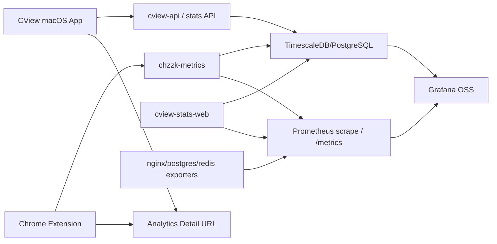

# Superset 대체 추천 및 개발서

작성일: 2026-04-29  
대상: `cv.dododo.app` 운영 서버, CView Metrics/Stats/Grafana/Superset 연동

> 참고: 이 문서는 로컬 checkout과 공식 자료 기준의 1차 추천서다. 이후 `cv.dododo.app` 운영 서버에 직접 SSH 접속해 확인한 실측 기반 개발 계획은 `docs/superset-replacement-live-server-development-plan-2026-04-29.md`를 기준으로 한다.

## 1. 결론

`cv.dododo.app`에서 현재 Superset이 맡는 상세 분석 화면은 **Grafana OSS**로 대체하는 것을 1순위로 추천한다.

이유는 CView의 분석 데이터가 일반 BI보다 운영/시계열 메트릭에 가깝기 때문이다. 현재 서버는 이미 Prometheus, Grafana, exporter 선언을 포함하고 있고, 앱도 홈/메트릭 메뉴에서 “요약은 앱, 상세는 외부 분석 화면”이라는 구조를 갖고 있다. 따라서 Superset을 새 BI 도구로 통째로 갈아타기보다, Grafana를 정식 대시보드 엔드포인트로 승격시키는 쪽이 구현 리스크와 운영 비용이 가장 낮다.

최종 방향:

1. 기본 대체: **Grafana OSS**
2. 보조 BI가 필요할 때: **Metabase OSS**
3. SQL-first 경량 분석이 필요할 때: **Redash**
4. 이번 교체 범위에서는 Lightdash, Evidence, Rill은 보류

## 2. 현재 구조 요약

### 2.1 서버

현재 `server-dev/mirror/docker-compose.yml`에는 다음 구조가 있다.

| 구성 | 현재 상태 | 근거 |
|---|---|---|
| Metrics ingest | `chzzk-metrics`, `cview-api` | `server-dev/mirror/docker-compose.yml` |
| 저장소 | TimescaleDB/PostgreSQL `chzzk_db` | `postgres` 서비스 |
| Stats web | `cview-stats-web` | `stats.chzzk.local` alias |
| Superset 공개 포트 | `9443:9443` | nginx-ssl port comment는 Superset 대시보드로 표기 |
| Prometheus | `prom/prometheus:v2.51.0` | 이미 compose에 선언 |
| Grafana | `grafana/grafana:11.0.0` | 이미 compose에 선언 |
| Exporter | nginx/postgres/redis exporter | 이미 compose에 선언 |

주의할 점은 `server-dev/mirror` 로컬 미러에는 현재 `prometheus/`, `grafana/`, `docker/nginx-ssl/` 디렉터리가 없다. `server-dev/server.sh`는 서버에서 이 디렉터리를 pull/push하도록 되어 있으므로, 운영 서버에는 존재할 수 있지만 현재 checkout만으로는 provisioning 내용을 확인할 수 없다.

### 2.2 앱

네이티브 앱은 Superset URL을 직접 계산한다.

| 위치 | 현재 역할 |
---|---|
| `Sources/CViewApp/Views/HomeV2/HomeView_v2.swift` | Metrics server URL의 host를 가져와 `https://<host>:9443/` 생성 |
| `Sources/CViewApp/Views/HomeV2/HomeV2Components.swift` | `HomeSupersetInsightDock` UI, “Superset 상세 열기” 버튼 |
| `Sources/CViewApp/Views/Dashboard/MetricsDashboardView.swift` | Metrics Dashboard 액션에서 Superset 열기 |

즉, 앱 쪽은 `/superset` 경로보다 `:9443` 포트 루트에 강하게 묶여 있다.

### 2.3 Chrome Extension

Chrome 확장은 Superset을 별도 base URL로 다룬다.

| 위치 | 현재 역할 |
---|---|
| `chrome-extension/src/shared/config.js` | `SUPERSET_URL: https://cv.dododo.app/superset` |
| `deriveSupersetUrl()` | `cv.dododo.app:8443` 서버 URL에서 `https://cv.dododo.app/superset` 도출 |
| `service-worker.js` | `/health`, `/dashboard/list/`, `/sqllab/` 열기 |
| `popup/options` | Superset 상태/대시보드/SQL Lab 버튼 |

즉, 확장은 앱과 달리 `/superset` reverse proxy 경로에 묶여 있다.

### 2.4 기존 설계 원칙

기존 문서 `docs/home-superset-integration-designs-2026-04-27.md`는 Superset 전체를 홈에 임베드하지 않고, 홈에서는 요약 KPI를 표시하고 상세 분석은 `https://<host>:9443/`로 여는 방향을 추천했다. 이 원칙은 Grafana 전환에도 그대로 유지한다.

## 3. 후보 비교

| 후보 | 무료/오픈소스 | 라이선스 | CView 적합도 | 판단 |
|---|---:|---|---:|---|
| Grafana OSS | 예 | AGPLv3 | 매우 높음 | 1순위 |
| Metabase OSS | 예 | AGPL | 중간~높음 | BI 보조 후보 |
| Redash | 예 | BSD-2-Clause | 중간 | SQL-first 보조 후보 |
| Lightdash | 예 | MIT | 낮음~중간 | dbt 도입 시 검토 |
| Evidence | 예 | MIT | 낮음 | 문서형 리포트용 |
| Rill | 예 | Apache-2.0 | 중간 | 별도 POC 필요 |

### 3.1 Grafana OSS

장점:

- CView가 다루는 `latency`, `buffer`, `VLC metrics`, `HTTP request`, `PostgreSQL`, `Redis`, `Nginx` 지표에 맞다.
- Prometheus, PostgreSQL, InfluxDB/Flux 계열 데이터소스와 궁합이 좋다.
- 현재 compose에 이미 `prometheus`, `grafana`, exporters가 선언되어 있어 신규 도입보다 승격에 가깝다.
- 알림, 변수, 템플릿, 시간 범위 탐색이 운영 지표에 적합하다.

단점:

- AGPLv3 의무를 확인해야 한다. 단순 self-host 사용은 현실적으로 큰 문제가 적지만, Grafana 코드를 수정해 네트워크 서비스로 제공한다면 소스 공개 의무를 검토해야 한다.
- 일반 BI 사용자가 SQL로 ad-hoc 분석하는 경험은 Superset/Metabase보다 약하다.

추천 사용 범위:

- Superset 상세 대시보드 대체
- 운영/품질 메트릭 대시보드
- 장애/성능 알림
- 홈/메트릭 메뉴의 외부 상세 분석 링크

### 3.2 Metabase OSS

장점:

- Superset보다 쉬운 BI UX를 제공한다.
- PostgreSQL view 기반 대시보드 이전이 쉽다.
- 비개발자도 필터와 dashboard를 다루기 쉽다.

단점:

- 시계열 운영 모니터링은 Grafana보다 약하다.
- AGPL 기반이며, embedding/white-label 조건은 별도로 검토해야 한다.
- CView의 초단위 라이브 품질 지표에는 Grafana가 더 자연스럽다.

추천 사용 범위:

- Superset의 SQL Lab/데이터 탐색 역할을 유지하고 싶을 때
- 운영 지표보다 리포트/BI 화면이 중요할 때
- Grafana 전환 후 “분석가용 SQL 대시보드”가 추가로 필요할 때

### 3.3 Redash

장점:

- BSD-2-Clause라 라이선스 부담이 작다.
- SQL-first workflow와 query sharing이 단순하다.
- PostgreSQL, InfluxDB, Prometheus 등 다양한 데이터소스를 지원한다.

단점:

- UX와 시각화 완성도는 Grafana/Metabase 대비 약할 수 있다.
- Superset의 대체재라기보다 SQL 쿼리 공유 도구에 가깝다.

추천 사용 범위:

- 오픈소스 라이선스를 permissive 계열로 제한해야 할 때
- 개발/운영자가 직접 SQL 쿼리를 저장하고 공유하는 용도

### 3.4 Lightdash / Evidence / Rill

이번 전환의 1차 후보로는 보류한다.

- Lightdash는 MIT라 매력적이지만 dbt project가 사실상 전제다. 현재 CView에는 별도 dbt semantic layer가 없다.
- Evidence는 MIT이고 SQL+Markdown 리포트에 강하지만, Superset처럼 운영자가 브라우저에서 탐색하는 대시보드 대체재는 아니다.
- Rill은 Apache-2.0이고 metrics-first BI 방향이 좋지만, 현재 CView compose에 얹기 전에 데이터 연결/배포 모델 POC가 필요하다.

## 4. 최종 추천 아키텍처

### 4.1 목표 구조



### 4.2 URL 정책

개발 난이도와 호환성을 고려하면 두 가지 안이 있다.

| 안 | URL | 장점 | 단점 | 추천 |
|---|---|---|---|---|
| A. 9443 유지 | `https://cv.dododo.app:9443/` | macOS 앱 변경이 가장 작음 | Chrome 확장의 `/superset` 경로와 다름 | 1차 추천 |
| B. 443 서브패스 | `https://cv.dododo.app/analytics/` | URL이 깔끔하고 확장과 잘 맞음 | Grafana `root_url`, `serve_from_sub_path`, nginx 설정 필요 | 2차 정리 |

1차 마이그레이션은 **A. 9443 유지**로 진행한다. 기존 macOS 앱이 이미 `:9443`를 계산하므로 Grafana를 `9443` 루트로 제공하면 앱 수정 범위가 줄어든다. Chrome 확장은 `SUPERSET_URL`을 `ANALYTICS_URL`로 일반화하면서 기본값을 `https://cv.dododo.app:9443`로 바꾼다.

장기적으로는 `/superset` 경로를 다음 중 하나로 처리한다.

- `https://cv.dododo.app/superset` -> `https://cv.dododo.app:9443/` redirect
- 또는 `https://cv.dododo.app/analytics/`로 신규 경로를 만들고 `/superset`은 deprecated redirect

### 4.3 데이터소스 정책

Grafana에는 최소 2개 데이터소스를 둔다.

| 데이터소스 | 목적 | 권한 |
|---|---|---|
| Prometheus | 서비스 health, HTTP duration, exporter 지표, alert rule | scrape/read |
| PostgreSQL/TimescaleDB | `metric_influx_samples`, app/web latency, VLC metrics, channel ranking | read-only user |

PostgreSQL 데이터소스는 반드시 읽기 전용 계정으로 분리한다. Grafana SQL editor는 안전한 쿼리만 실행한다고 보장하지 않으므로, 운영 DB의 쓰기 권한을 부여하면 안 된다.

## 5. 개발 범위

### Phase 0. 운영 자산 백업

목표: Superset 제거 전 rollback 가능한 상태를 확보한다.

작업:

1. 현재 Superset dashboard, dataset, database 연결 정보를 export한다.
2. `server-dev/server.sh superset-sync`가 생성하는 view 목록을 정리한다.
3. `scripts/superset_views_poc.sql`, `scripts/sql/views_app_metrics.sql`, `superset_register_datasets.py`, `superset_create_dashboards.py`를 archive 대상으로 표시한다.
4. 현재 `https://cv.dododo.app:9443/`, `https://cv.dododo.app/superset` 접근 결과를 기록한다.

산출물:

- `docs/archive/superset-migration-YYYY-MM-DD/`
- dashboard export JSON 또는 스크린샷
- 기존 URL/권한/계정 목록

### Phase 1. Grafana/Prometheus 정식 프로비저닝

목표: 현재 compose에 선언만 되어 있는 Grafana를 운영 가능한 분석 화면으로 만든다.

작업 대상:

- `server-dev/mirror/docker-compose.yml`
- `server-dev/mirror/prometheus/prometheus.yml`
- `server-dev/mirror/grafana/provisioning/datasources/*.yml`
- `server-dev/mirror/grafana/provisioning/dashboards/*.yml`
- `server-dev/mirror/grafana/dashboards/*.json`
- nginx SSL proxy 설정

작업:

1. 로컬 미러에 `prometheus/`, `grafana/` 디렉터리를 추가하거나 서버에서 pull한다.
2. Prometheus scrape target을 명시한다.
   - `chzzk-metrics:8080/metrics`
   - `cview-stats-web:5000/metrics`
   - `nginx-exporter`
   - `postgres-exporter`
   - `redis-exporter`
3. Grafana datasource를 파일로 provision한다.
   - `Prometheus`
   - `CView TimescaleDB`
4. Grafana dashboard provider를 파일로 provision한다.
5. Grafana `GF_SERVER_ROOT_URL`을 운영 URL에 맞춘다.
   - 1차: `https://cv.dododo.app:9443/`
   - 서브패스 전환 시: `https://cv.dododo.app/analytics/`
6. nginx `9443` upstream을 Grafana로 전환한다.
7. `/superset` 경로는 redirect 또는 안내 페이지로 둔다.

검증:

```bash
docker compose config
docker compose up -d prometheus grafana nginx-exporter postgres-exporter redis-exporter
curl -k https://cv.dododo.app:9443/api/health
```

### Phase 2. Grafana 대시보드 구성

목표: Superset의 기능을 CView 운영 대시보드로 재구성한다.

필수 대시보드:

| 대시보드 | 패널 |
|---|---|
| Live Quality Overview | active channels, total metrics 24h, avg latency, p95 latency, sync rate |
| Web vs App Latency | channel별 web/app latency, delta, drift trend |
| VLC Quality | bitrate, fps, dropped frames, buffer warning, session health |
| Ingest/API Health | request count, duration histogram, error rate, latest sample age |
| Infrastructure | postgres, redis, nginx, container health |

권장 변수:

- `channel_id`
- `platform`
- `engine`
- `period`
- `measurement`

데이터 우선순위:

1. 빠른 운영 상태: Prometheus
2. 채널/레이턴시/품질 상세: PostgreSQL/TimescaleDB
3. 앱 홈 요약: 기존 `cview-api` `/api/stats` 계열 유지

### Phase 3. macOS 앱 링크/명칭 일반화

목표: 앱에서 Superset이라는 구현명을 제거하고 “Analytics” 개념으로 일반화한다.

작업 대상:

- `Sources/CViewApp/Views/HomeV2/HomeView_v2.swift`
- `Sources/CViewApp/Views/HomeV2/HomeV2Components.swift`
- `Sources/CViewApp/Views/Dashboard/MetricsDashboardView.swift`
- 필요 시 `SettingsStore` / `MetricsSettings`

작업:

1. `supersetURL`을 `analyticsDashboardURL` 또는 `externalAnalyticsURL`로 일반화한다.
2. `HomeSupersetInsightDock` 표시 문자열을 변경한다.
   - 기존: `Superset Insight Dock`
   - 변경: `Analytics Insight Dock` 또는 `Metrics Insight Dock`
3. 버튼 문구를 변경한다.
   - 기존: `Superset 상세 열기`
   - 변경: `분석 대시보드 열기`
4. health check는 Grafana 기준으로 바꾼다.
   - Grafana: `/api/health`
   - 이전 Superset health path와 분리
5. `home.v2.show.supersetDock` AppStorage key는 즉시 삭제하지 않는다.
   - 1차에서는 기존 key 유지 또는 migration key를 둔다.
   - 사용자의 홈 설정이 초기화되지 않도록 한다.

호환성 원칙:

- 코드 내부 이름은 점진적으로 바꾸되, 사용자 저장 key는 한 번에 지우지 않는다.
- 기본 URL은 `https://cv.dododo.app:9443/`로 유지해 앱 동작을 보존한다.

### Phase 4. Chrome Extension 링크/명칭 일반화

목표: 확장의 Superset 버튼을 Grafana/Analytics 버튼으로 전환한다.

작업 대상:

- `chrome-extension/src/shared/config.js`
- `chrome-extension/src/shared/storage.js`
- `chrome-extension/src/background/service-worker.js`
- `chrome-extension/src/popup/*`
- `chrome-extension/src/options/*`
- `chrome-extension/README.md`

작업:

1. `SUPERSET_URL`을 `ANALYTICS_URL`로 변경한다.
2. `supersetUrl` storage key는 migration을 둔다.
   - 새 key: `analyticsUrl`
   - 기존 key가 있으면 읽어서 새 key로 복사
3. 기본 URL을 `https://cv.dododo.app:9443`로 바꾼다.
4. health path를 Grafana 기준 `/api/health`로 변경한다.
5. Dashboard/SQ Lab 버튼을 Grafana에 맞게 변경한다.
   - `대시보드`
   - `Explore`
   - `Health`
6. README의 Superset 설명을 Analytics/Grafana 설명으로 업데이트한다.

주의:

- Superset의 `/dashboard/list/`, `/sqllab/`는 Grafana와 맞지 않는다.
- `popup-open-superset` 메시지는 바로 삭제하지 말고 `popup-open-analytics`와 일정 기간 병행해도 된다.

### Phase 5. Superset 제거 또는 격리

목표: Grafana 전환이 끝난 뒤 Superset 의존성을 줄인다.

작업:

1. `server-dev/server.sh superset-sync`는 바로 삭제하지 말고 `deprecated` 표시한다.
2. 운영 검증 1~2주 후 Superset 관련 sync 스크립트를 archive한다.
3. nginx `/superset`은 최소 1 릴리스 동안 redirect로 유지한다.
4. Superset 컨테이너/볼륨이 compose에 남아 있다면 중지/백업 후 제거한다.
5. 문서와 UI에서 Superset 단어를 제거한다.

## 6. 구현 우선순위

| 우선순위 | 작업 | 이유 |
|---|---|---|
| P0 | Grafana public URL 결정과 nginx routing | 앱/확장의 기준 URL이 달라지므로 먼저 확정 필요 |
| P0 | Prometheus/Grafana provisioning 디렉터리 확보 | 현재 로컬 미러에 없어 실제 dashboard 재현 불가 |
| P0 | Grafana datasource: Prometheus + PostgreSQL | Superset 대체의 핵심 |
| P1 | 핵심 Grafana dashboard 3종 작성 | Live Quality, Web/App Latency, Ingest/API Health |
| P1 | macOS 앱 Superset 명칭 일반화 | 사용자에게 교체가 보이게 되는 부분 |
| P1 | Chrome Extension Superset 명칭/URL 일반화 | `/superset` 고정 의존 제거 |
| P2 | Metabase POC | BI/ad-hoc 분석 요구가 남을 때만 |
| P2 | Superset script archive | rollback 기간 이후 수행 |

## 7. 파일별 변경안

### 7.1 서버

`server-dev/mirror/docker-compose.yml`

- `grafana`의 `GF_SERVER_ROOT_URL`을 운영 URL로 변경
- 필요 시 `GF_SERVER_SERVE_FROM_SUB_PATH=true` 추가
- `grafana`가 `postgres`에도 depends_on 하도록 조정 가능
- `9443` upstream이 Grafana를 바라보는지 nginx 설정 확인

`server-dev/mirror/prometheus/prometheus.yml`

- 없으면 새로 추가
- scrape target을 명시
- retention은 현재 `7d`, `1GB`가 작을 수 있으므로 운영 데이터량에 맞춰 조정

`server-dev/mirror/grafana/provisioning/datasources/cview.yml`

- Prometheus datasource
- PostgreSQL datasource
- PostgreSQL datasource는 read-only 계정 사용

`server-dev/mirror/grafana/dashboards/*.json`

- 핵심 대시보드 JSON 추가
- dashboard uid를 안정적으로 부여해 앱/확장에서 deep link 가능하게 유지

`server-dev/server.sh`

- `monitoring` 배포는 유지
- `superset-sync`는 `deprecated` 경고 추가
- 신규 `grafana-sync` 또는 `analytics-sync` 명령 추가 검토

### 7.2 macOS 앱

`HomeView_v2.swift`

- `supersetURL` -> `analyticsDashboardURL`
- health check path를 Grafana `/api/health`로 전환
- fallback URL은 `https://cv.dododo.app:9443/`

`HomeV2Components.swift`

- `HomeSupersetInsightDock` 이름과 문구 일반화
- `Superset` status pill을 `Analytics` 또는 `Grafana`로 변경
- 버튼 문구를 `분석 대시보드 열기`로 변경

`MetricsDashboardView.swift`

- `supersetDashboardURL` -> `analyticsDashboardURL`
- 외부 열기 액션 문구 변경

### 7.3 Chrome Extension

`config.js`

- `SUPERSET_URL`, `SUPERSET_HEALTH_PATH`, `SUPERSET_DASHBOARD_PATH`, `SUPERSET_SQLLAB_PATH`를 analytics/grafana 계열로 일반화

`storage.js`

- `supersetUrl` -> `analyticsUrl`
- 기존 key migration 유지

`service-worker.js`

- `popup-superset-health`, `popup-open-superset` 메시지 호환 처리
- 신규 메시지 `popup-analytics-health`, `popup-open-analytics` 추가

`popup.html`, `popup.js`, `options.html`, `options.js`

- Superset UI 문구 제거
- Grafana dashboard/explore/health 버튼으로 변경

## 8. 검증 시나리오

### 8.1 서버 검증

```bash
cd server-dev/mirror
docker compose config
docker compose up -d prometheus grafana nginx-exporter postgres-exporter redis-exporter
docker compose ps
```

확인:

- Prometheus target이 모두 `UP`
- Grafana `/api/health`가 200
- Grafana datasource provisioning 성공
- Grafana dashboard JSON 로딩 성공
- PostgreSQL datasource가 read-only 계정으로 연결됨

### 8.2 데이터 검증

확인할 지표:

- 최근 5분 active channel 수
- 최근 1시간 app latency 평균/p95
- web/app latency delta
- VLC bitrate/fps/dropped frame
- HTTP request duration
- DB record count / latest sample age

검증 기준:

- 기존 `cview-api` `/api/stats` 수치와 Grafana 패널 수치가 허용 오차 내 일치
- time range 변경 시 query가 과도하게 느려지지 않음
- channel variable 선택 시 패널 전체가 정상 갱신됨

### 8.3 앱 검증

확인:

1. 홈에서 Insight Dock이 기존처럼 표시된다.
2. 외부 분석 버튼이 `https://cv.dododo.app:9443/`를 연다.
3. Grafana 미접속 상태에서도 홈이 깨지지 않고 상태만 실패로 표시된다.
4. `home.v2.show.supersetDock` 기존 설정이 초기화되지 않는다.
5. Metrics 메뉴의 외부 대시보드 버튼도 같은 URL을 연다.

### 8.4 Chrome Extension 검증

확인:

1. 기존 `supersetUrl` 저장값이 있으면 새 `analyticsUrl`로 이전된다.
2. 기본값은 `https://cv.dododo.app:9443`로 계산된다.
3. Health 버튼은 `/api/health`를 호출한다.
4. Dashboard/Explore 버튼이 Grafana URL을 새 탭으로 연다.
5. README의 운영 서버 설명과 실제 동작이 일치한다.

## 9. 운영 전환 계획

### 1단계: 병행 운영

- Superset 유지
- Grafana를 `https://cv.dododo.app:9443-grafana-test` 같은 내부 테스트 경로 또는 localhost tunnel로 검증
- dashboard 수치 비교

### 2단계: 공개 URL 전환

- `https://cv.dododo.app:9443/`를 Grafana로 전환
- `/superset`은 redirect 또는 안내 페이지 유지
- macOS 앱과 Chrome 확장 업데이트 배포

### 3단계: Superset 축소

- Superset sync 중단
- Superset 컨테이너 scale down
- rollback 기간 동안 데이터/설정 보관

### 4단계: 제거

- Superset 관련 스크립트 archive
- 문서에서 Superset을 legacy 항목으로 이동
- 신규 분석 명칭을 `Analytics Dashboard`로 통일

## 10. 리스크와 대응

| 리스크 | 영향 | 대응 |
|---|---|---|
| Grafana 권한 설정 미흡 | 운영 DB 손상 가능 | PostgreSQL read-only 계정 강제 |
| 앱/확장 URL 기준 불일치 | 버튼 실패 | 1차는 `:9443` 유지, `/superset` redirect |
| 기존 Superset dashboard 손실 | 분석 공백 | Phase 0 export와 rollback 기간 확보 |
| Grafana dashboard JSON 수동 관리 | drift 발생 | provisioning 파일 기반으로 Git 관리 |
| AGPL 의무 오해 | 라이선스 리스크 | Grafana/Metabase 코드를 수정하지 않는 self-host 운영 원칙 유지, 수정 시 별도 검토 |
| 로컬 mirror에 monitoring 디렉터리 없음 | 재현성 부족 | 운영 서버에서 `server-dev/server.sh pull monitoring` 또는 `pull prometheus/grafana` 수행 후 문서화 |

## 11. 최종 판단

현재 CView는 “일반 BI 앱”보다 “라이브 품질/동기화/시스템 상태를 보는 운영 대시보드”에 가깝다. 따라서 Superset의 가장 현실적인 대체는 **Grafana OSS**다.

Metabase는 보조 후보로 남긴다. Superset SQL Lab처럼 사람이 직접 데이터를 탐색하고 리포트화하는 요구가 계속 남는다면, Grafana 옆에 Metabase OSS를 붙이는 방식이 좋다. 하지만 1차 전환에서 Metabase까지 동시에 넣으면 URL, 계정, 대시보드 권한, 운영 문서가 늘어나므로 우선순위는 낮다.

추천 실행 순서:

1. Grafana를 `:9443` 상세 분석 화면으로 승격
2. Prometheus/PostgreSQL datasource와 핵심 dashboard 3종 provision
3. 앱/확장의 Superset 명칭을 Analytics로 일반화
4. `/superset`은 redirect로 유지
5. 안정화 후 Superset sync와 컨테이너 제거

## 12. 참고 자료

- Grafana licensing: https://grafana.com/licensing/
- Grafana PostgreSQL datasource: https://grafana.com/docs/grafana/latest/datasources/postgres/
- Grafana InfluxDB datasource: https://grafana.com/docs/grafana/latest/datasources/influxdb/
- Metabase license: https://www.metabase.com/license/
- Metabase Docker: https://www.metabase.com/docs/latest/installation-and-operation/running-metabase-on-docker
- Redash GitHub/license: https://github.com/getredash/redash
- Lightdash self-host: https://docs.lightdash.com/self-host/self-host-lightdash
- Evidence docs: https://docs.evidence.dev/
- Rill GitHub/license: https://github.com/rilldata/rill
